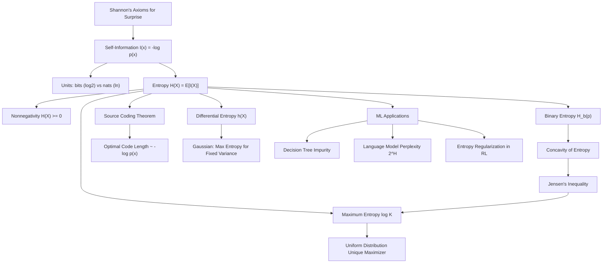

# Topic 01: Self-Information and Entropy

## 1. Master Overview

Information theory begins with a deceptively simple question: how much are we *surprised* by an event? Claude Shannon's 1948 answer — that the surprise of an outcome with probability $p$ must be $-\log p$ — is not an arbitrary modeling choice but the unique consequence of a small set of natural axioms: rare events carry more information, certain events carry none, and independent surprises add. From this single building block, the **self-information** $I(x) = -\log p(x)$, the entire edifice of modern information theory is constructed.

**Shannon entropy** $H(X)$ is the expected self-information of a random variable — the average number of bits (or nats) needed to describe its outcome. Entropy is simultaneously a measure of uncertainty before observation, of information gained upon observation, and of the fundamental limit of lossless compression (the Source Coding Theorem). Its key analytic properties — nonnegativity, concavity in the distribution, and maximization by the uniform distribution — all flow from Jensen's inequality applied to the concave logarithm.

In machine learning, entropy is everywhere: it is the impurity measure that drives decision-tree splits, the target of maximum-entropy regularization in reinforcement learning, the quantity whose exponential defines the perplexity of a language model, and the irreducible floor of the cross-entropy loss. Mastering this module means being able to derive, not merely recite, every one of these connections.

> [!NOTE]
> Entropy is a functional of the *distribution*, not of the outcomes. Relabeling or permuting the outcome values leaves $H(X)$ unchanged; only the probability vector $(p_1, \dots, p_K)$ matters. This is why entropy is the correct notion of "uncertainty" for symbols, tokens, and class labels alike.

## 2. First-Principles Framework

- **Phenomenon**: Some observations are unsurprising (the sun rose today) while others are highly informative (a fair coin landed heads ten times in a row). We need a quantitative, additive measure of surprise.
- **Goal**: Find the unique function $I(p)$ of an event's probability satisfying Shannon's axioms — continuity, monotonic decrease in $p$, $I(1) = 0$, and additivity over independent events $I(pq) = I(p) + I(q)$.
- **Governing Equation**: $I(x) = -\log_b p(x)$, and its expectation, the Shannon entropy $H(X) = -\sum_x p(x) \log_b p(x)$.
- **Formulation**: The base $b$ fixes the unit — $b = 2$ gives bits, $b = e$ gives nats — with conversion $H_{\mathrm{nats}} = H_{\mathrm{bits}} \cdot \ln 2$.
- **Consequences**: $0 \le H(X) \le \log K$ on a support of size $K$, with the lower bound attained by deterministic variables and the upper bound uniquely by the uniform distribution.

## 3. Mermaid Concept Map

## 4. Common Misconceptions

| Misconception | Mathematical Reality | Correct Mental Model |
|---|---|---|
| *"Entropy measures disorder of a specific outcome."* | Entropy is an expectation over the whole distribution; a single outcome has *self-information* $-\log p(x)$, not entropy. | $H(X)$ is the average surprise you expect *before* observing; $I(x)$ is the surprise you actually receive. |
| *"Entropy in bits and nats are different quantities."* | They differ only by the constant factor $\ln 2 \approx 0.693$, since $\log_2 x = \ln x / \ln 2$. | Same measurement, different units — like meters versus feet. |
| *"A term with $p(x) = 0$ makes entropy undefined."* | The convention $0 \log 0 = 0$ is justified by the limit $\lim_{p \to 0^+} p \log p = 0$. | Impossible outcomes contribute exactly zero to average surprise. |
| *"More possible outcomes always means more entropy."* | Support size only bounds entropy: $H(X) \le \log K$. A 1000-outcome distribution with $p_1 = 0.999$ has tiny entropy. | Entropy depends on how *spread out* the mass is, not on how many outcomes exist. |
| *"Differential entropy is just entropy for continuous variables."* | Differential entropy $h(X) = -\int f \ln f \, dx$ can be negative and is not invariant under change of variables. | $h(X)$ is a *relative* quantity; only differences and divergences of it carry absolute meaning. |
| *"Entropy of a deterministic function of $X$ can exceed $H(X)$."* | Data processing cannot create information: $H(g(X)) \le H(X)$ for any deterministic $g$, with equality iff $g$ is injective on the support. | Deterministic maps can only merge outcomes, never split surprise into more surprise. |

## 5. Directory Inventory

| File | Type | Description |
|---|---|---|
| [`README.md`](README.md) | Index | Master overview, first-principles framework, concept map, misconceptions, references. |
| [`first_principles.ipynb`](first_principles.ipynb) | Theory | Shannon's axioms, uniqueness of $-\log p$, entropy definitions, full proofs (Jensen, maximum entropy, concavity, Gaussian maximum entropy), numerical stability, AI/ML applications. |
| [`exercises.ipynb`](exercises.ipynb) | Exercises | 20 fully solved problems in 4 levels: Concept Check (4), Foundation (6), Applications in AI/ML (6), Challenge (4). |

## 6. References

1. **Shannon, C. E.** (1948). *A Mathematical Theory of Communication*. Bell System Technical Journal, 27, 379–423 & 623–656. — The founding paper; entropy axioms and the source coding theorem.
2. **Cover, T. M., & Thomas, J. A.** (2006). *Elements of Information Theory* (2nd ed.). Wiley. — Chapter 2: Entropy, Relative Entropy, and Mutual Information.
3. **MacKay, D. J. C.** (2003). *Information Theory, Inference, and Learning Algorithms*. Cambridge University Press. — Chapters 1–4: probability, entropy, and inference.
4. **Jaynes, E. T.** (1957). *Information Theory and Statistical Mechanics*. Physical Review, 106(4), 620–630. — The maximum-entropy principle.
5. **Csiszár, I., & Körner, J.** (2011). *Information Theory: Coding Theorems for Discrete Memoryless Systems* (2nd ed.). Cambridge University Press.
6. **Goodfellow, I., Bengio, Y., & Courville, A.** (2016). *Deep Learning*. MIT Press. — Section 3.13: Information Theory.
7. **Polyanskiy, Y., & Wu, Y.** (2024). *Information Theory: From Coding to Learning*. Cambridge University Press. — Modern treatment bridging coding and statistical learning.
