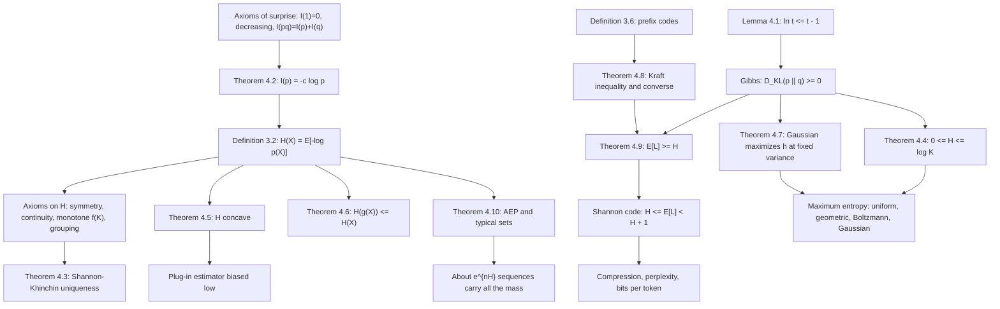

# Module 01 — Self-Information and Entropy

Two messages arrive. "The sun rose this morning" changes nothing you will do today; "your ticket
won the lottery" changes everything. What separates them is not length but probability.

This module turns that observation into a number, twice. First it shows that a measure of
surprise which vanishes at certainty, decreases in probability, and adds over independent events
must be $-\log p$ — with nothing free but the unit. Then it shows that the *average* of that
quantity is equally forced: symmetry, continuity, "a larger fair die is harder", and two-stage
consistency leave exactly one functional, $H(p) = -c\sum_k p_k \log p_k$.

The second half supplies the operational meaning. Kraft's inequality says which codeword-length
profiles exist, the source-coding bounds say no prefix code beats $H$ bits per symbol and the
Shannon code comes within one, and the asymptotic equipartition property says entropy is the
exponential growth rate of the set of sequences that actually occur.

Everything is proved from a single analytic fact, $\ln t \le t - 1$, so the module depends on no
later module in the area.

> [!NOTE]
> **Shannon-Khinchin uniqueness.** A family $H_K$ on the probability simplices that is symmetric,
> continuous, non-decreasing in $K$ on uniform inputs, and consistent under grouping must be
> $H_K(p) = -c\sum_{k} p_k \log p_k$ for one constant $c \gt 0$. Entropy is not one uncertainty
> measure among many; it is the only one, and the free constant is only the unit.

## Prerequisites and downstream modules

**Prerequisites.**

- [calculus/04 — Derivative Applications and Optimization](../../calculus/04_derivative_applications_optimization/) — second-derivative tests, used for the convexity of $t - 1 - \ln t$ and the concavity of $-t\log t$.
- [probability_statistics/06 — Expectation, Variance and Moments](../../probability_statistics/06_expectation_variance_and_moments/) — expectation as the definition of $H$, and Chebyshev's inequality for the AEP.

**Downstream modules unlocked by this one.**

- [Module 02 — Joint and Conditional Entropy](../02_joint_and_conditional_entropy/)

The rest of the area follows from Module 02 in sequence:
[03 — Cross-Entropy and Loss Functions](../03_cross_entropy_and_loss_functions/),
[04 — KL Divergence and f-Divergences](../04_kl_divergence_and_f_divergences/),
[05 — Mutual Information](../05_mutual_information/),
[06 — Information Theory in Deep Learning](../06_information_theory_in_deep_learning/).

The full dependency graph is in [docs/prerequisites.md](../../docs/prerequisites.md), and the
symbol conventions used below are fixed in [docs/notation.md](../../docs/notation.md).

## Learning outcomes

After working through this module you will be able to:

- derive $I(p) = -c\log p$ from the surprise axioms, and explain why monotonicity alone can replace continuity in that derivation;
- prove the Shannon-Khinchin uniqueness theorem in full, including the integer sandwich argument and the rational-probability extension;
- prove $\ln t \le t-1$ and get Gibbs' inequality $D_{\mathrm{KL}} \ge 0$ from it, then reuse that single lemma three times;
- compute $H$ in bits or nats for a concrete distribution and bound it by $\log K$, with the equality conditions;
- explain why support size bounds entropy but does not determine it, and produce a distribution on $1000$ outcomes with $0.0214$ bits;
- state and use Kraft's inequality and its converse, and decide whether a length profile is realizable;
- derive the source-coding bounds $H_D \le \mathbb{E}[L] \lt H_D + 1$ and explain why block coding removes the gap at order $1/n$;
- prove the AEP by Chebyshev and bracket the size of the typical set;
- apply the maximum-entropy principle to recover the uniform, geometric, Boltzmann and Gaussian laws;
- recognize the traps: differential entropy is not a bit count, and the plug-in entropy estimator is biased low by about $(K-1)/(2n)$ nats.

## Concept map

## Notation

Drawn from [docs/notation.md](../../docs/notation.md).

| Symbol | Meaning | Convention |
|---|---|---|
| $I_b(x) = -\log_b p(x)$ | self-information of an outcome | bits for $b=2$, nats for $b=e$ |
| $H(X)$, $H(p)$ | Shannon entropy of a variable or a probability vector | $0\log 0 = 0$ |
| $H_b(p)$ | binary entropy function | $H_b(\tfrac12) = 1$ bit |
| $h(X)$ | differential entropy | lowercase $h$, distinct from $H$, in nats |
| $D_{\mathrm{KL}}(p \parallel q)$ | relative entropy | `\parallel`, never a raw pipe |
| $H_{\times}(p, q)$ | cross-entropy between distributions | distinct from joint entropy $H(X,Y)$ |
| $\mathcal{X}$, $K$ | alphabet and support size | $K = \lvert \operatorname{supp}(p) \rvert$ |
| $\ell(x)$, $\mathbb{E}[L]$ | codeword length and expected length | $D$-ary codes, $D = 2$ unless stated |
| $A_{\epsilon}^{(n)}$ | typical set of Definition 3.7 | $\epsilon$ measured in nats |
| $N(X) = e^{2h(X)}/(2\pi e)$ | entropy power | exercise L3.5 |

Every numerical answer in this module carries its unit: **bits** for $\log_2$, **nats** for
$\ln$. A bare $\log$ appears only where the base cancels.

## Core results

| Result | Statement | Hypotheses | Where |
|---|---|---|---|
| Tangent-line bound and Gibbs | $\ln t \le t-1$; hence $D_{\mathrm{KL}}(p \parallel q) \ge 0$ | $p$ absolutely continuous w.r.t. $q$ | Lemma 4.1, Proof 5.1 |
| Uniqueness of surprisal | $I(p) = -c\ln p$ | $I(1)=0$, non-increasing, additive | Theorem 4.2, Proof 5.2 |
| Shannon-Khinchin uniqueness | $H_K(p) = -c\sum_k p_k \log p_k$ | symmetry, continuity, monotone $f(K)$, grouping | Theorem 4.3, Proof 5.3 |
| Entropy bounds | $0 \le H(X) \le \log K$ | discrete, finite support | Theorem 4.4, Proof 5.4 |
| Concavity | $H(\lambda p + (1-\lambda)q) \ge \lambda H(p) + (1-\lambda)H(q)$ | common alphabet | Theorem 4.5, Proof 5.5 |
| Deterministic processing | $H(g(X)) \le H(X)$, equality iff $g$ injective on the support | $g$ deterministic | Theorem 4.6, Proof 5.6 |
| Gaussian maximum entropy | $h(X) \le \tfrac12\ln(2\pi e\sigma^2)$ | density with variance $\sigma^2$ | Theorem 4.7, Proof 5.7 |
| Kraft inequality and converse | $\sum_k D^{-\ell_k} \le 1$, and any such profile is realizable | prefix code; integer lengths | Theorem 4.8, Proof 5.8 |
| Source coding bounds | $H_D(X) \le \mathbb{E}[L] \lt H_D(X)+1$ | prefix code; Shannon lengths for the upper bound | Theorem 4.9, Proof 5.9 |
| Asymptotic equipartition | $\lvert A_{\epsilon}^{(n)} \rvert$ is $e^{nH}$ up to $e^{\pm n\epsilon}$ | i.i.d., finite alphabet | Theorem 4.10, Proof 5.10 |

## Common misconceptions

1. **"Entropy measures the disorder of a specific outcome."** A single outcome carries
   *self-information* $-\log p(x)$. Entropy is its expectation over the whole distribution, so
   it is a property of the distribution and is known before any observation.

2. **"More possible outcomes means more entropy."** Support size only bounds entropy. Example 6.3
   of the theory notebook puts $0.0214$ bits on $1000$ outcomes, a factor of $466$ below the
   ceiling $\log_2 1000 = 9.966$ bits.

3. **"Differential entropy is just entropy for continuous variables."** It can be negative — the
   uniform density on $(0, 0.5)$ has $h = -0.6931$ nats — and it shifts by $\ln \lvert a \rvert$
   under $X \mapsto aX$. Only differences of differential entropies are unit-free.

4. **"A term with $p(x) = 0$ makes entropy undefined."** The convention $0\log 0 = 0$ is forced by
   $\lim_{t\to 0^{+}} t\log t = 0$. In code it must be applied by hand: `0 * np.log(0)` is `nan`.

5. **"Bits and nats are different quantities."** They are one measurement in two units, related
   by the factor $\ln 2 = 0.6931$. What is not acceptable is a number reported without its unit.

6. **"Any impurity measure that is symmetric and peaks at the uniform distribution will do."**
   The Gini index is symmetric, continuous and uniform-maximized, yet exercise L3.1 shows it
   violates the grouping axiom by $0.12$ on a three-outcome example. Grouping is what makes
   entropy unique.

7. **"Huffman coding is optimal, so it achieves the entropy."** It is optimal *among symbol
   codes*, which by Theorem 4.9 still leaves up to one bit per symbol. On
   $p = (0.4, 0.2, 0.2, 0.1, 0.1)$ it spends $2.2$ bits against $H = 2.1219$ bits. Only block or
   arithmetic coding closes the gap.

8. **"An entropy estimated from data is an entropy."** The plug-in estimator is biased low by
   about $(K-1)/(2n)$ nats, a consequence of concavity plus Jensen. Section 7.6 of the theory
   notebook measures $-0.524$ bits of bias at $n = 10$ with $K = 8$.

## Exercise index

[`exercises.ipynb`](exercises.ipynb) contains 40 fully solved problems in four tiers. Every
problem carries a statement, a short intuition, a stepwise solution, a boxed answer, a key
takeaway, and — where the answer is numeric or algorithmic — a code cell that recomputes it.

| Tier | Count | Coverage |
|---|---:|---|
| L0 — Concept Checks | 8 | surprisal of a coin and a die, additivity, deterministic variables, bits against nats, the uniform die, label invariance, the $0\log 0$ convention, reading a Kraft sum |
| L1 — Foundations | 12 | dyadic entropy, the maximum of $H_b$, geometric entropy, grouping, uniform and Gaussian differential entropy, support size against entropy, deterministic maps, Shannon lengths, concavity, scaling of $h$, Renyi entropy |
| L2 — Applications (AI/ML and Physics) | 12 | decision-tree information gain, perplexity, softmax temperature, Shannon's guessing game, entropy-regularized RL, estimator bias, Landauer's limit, the Boltzmann distribution, Gibbs entropy in J/(K mol), Huffman coding, corpus size in bits, predictive entropy |
| L3 — Challenge Proofs | 8 | Shannon-Khinchin uniqueness, Fano's inequality, maximum entropy at fixed mean, the AEP and typical sets, entropy power and the EPI, type counting, McMillan's inequality, exponential families from linear constraints |

Tier L2 contains three genuine physics problems: Landauer's erasure bound (Problem L2.7), the
Boltzmann distribution as the entropy maximizer at fixed mean energy (Problem L2.8), and the
Gibbs entropy of a mole of two-state systems in J/(K mol) (Problem L2.9).

## References

**Textbooks.**

- Cover, T. M. and Thomas, J. A. *Elements of Information Theory*, 2nd ed. — entropy and its properties (section 2.1; Theorem 2.6.4 for concavity), Jensen and the maximum-entropy bound (section 2.6), Kraft's inequality and its converse (Theorem 5.2.1, Theorem 5.2.2), McMillan (Theorem 5.5.1), source-coding bounds (Theorem 5.3.1, Theorem 5.4.1), AEP and typical sets (Theorem 3.1.1, Theorem 3.1.2), Gaussian maximum entropy (Theorem 8.6.5), type counting (Lemma 17.5.1).
- MacKay, D. J. C. *Information Theory, Inference, and Learning Algorithms* — chapters 2 and 4 (probability, entropy, the source coding theorem), chapter 5 (symbol codes, Kraft, Huffman).
- Khinchin, A. I. *Mathematical Foundations of Information Theory*, chapter 1 — the axiomatic uniqueness theorem proved as Proof 5.3.
- Csiszar, I. and Korner, J. *Information Theory: Coding Theorems for Discrete Memoryless Systems*, 2nd ed., chapter 1 — entropy, typical sequences, source coding.
- Polyanskiy, Y. and Wu, Y. *Information Theory: From Coding to Learning*, part I — a modern treatment linking entropy, coding and statistical learning.
- Hardy, G. H., Littlewood, J. E. and Polya, G. *Inequalities*, 2nd ed., section 3.4 — monotone and continuous solutions of Cauchy's functional equation, used in Proof 5.2.

**Papers.**

- Shannon, C. E. "A mathematical theory of communication", *Bell System Technical Journal* **27** (1948), 379-423 and 623-656 — the axioms (section 6) and the source coding theorem (section 9).
- Faddeev, D. K. "On the concept of entropy of a finite probabilistic scheme", *Uspekhi Matematicheskikh Nauk* **11**(1) (1956), 227-231 — the weakened axiom set used in Theorem 4.3.
- Miller, G. A. "Note on the bias of information estimates", in *Information Theory in Psychology* (1955), 95-100 — the $(K-1)/(2n)$ correction.
- Landauer, R. "Irreversibility and heat generation in the computing process", *IBM Journal of Research and Development* **5**(3) (1961), 183-191 — the $k_B T\ln 2$ bound of Problem L2.7.
- Jaynes, E. T. "Information theory and statistical mechanics", *Physical Review* **106**(4) (1957), 620-630 — the maximum-entropy principle.
- Shannon, C. E. "Prediction and entropy of printed English", *Bell System Technical Journal* **30**(1) (1951), 50-64 — the guessing game of Problem L2.4.

**In this directory.**

- [`first_principles.ipynb`](first_principles.ipynb) — theory, ten numbered results with complete proofs, eight worked examples, eleven executable code cells and three figures.
- [`exercises.ipynb`](exercises.ipynb) — the 40 solved problems indexed above.
