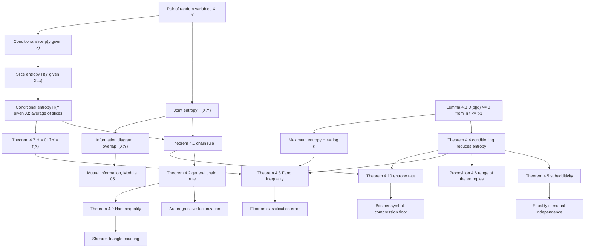

# Module 02 — Joint and Conditional Entropy

Entropy measures the uncertainty of one random variable. Almost nothing interesting is one random
variable. A language model sees a token and its context; a classifier sees features and a label;
a sensor reads a signal and its noise.

This module builds the accounting system for pairs and tuples. **Joint entropy** $H(X, Y)$ is the
total uncertainty of a pair, **conditional entropy** $H(Y \mid X)$ is the part that survives
observing $X$, and the **chain rule** says the ledger balances exactly, with no remainder.

The central inequality — conditioning reduces entropy — is proved here from scratch. It rests on
$D(p \parallel q) \ge 0$, which the module derives in three lines from $\ln t \le t - 1$ rather
than importing it from a later module. Everything else in the module is that one inequality
applied to a well-chosen pair of distributions.

The consequences reach outside information theory: Fano's inequality turns residual conditional
entropy into a hard floor under the error rate of every classifier, Han's inequality bounds a
joint distribution by its subsets and thereby counts triangles in a graph, and the entropy rate
of a stationary process is the bits-per-symbol constant that every compressor and every language
model chases.

> [!NOTE]
> **Chain rule.** $H(X, Y) = H(X) + H(Y \mid X) = H(Y) + H(X \mid Y)$ for every joint
> distribution on finite alphabets — an exact identity, not a bound. Combined with
> $H(Y \mid X) \le H(Y)$ it gives subadditivity, the independence bound, and the entire
> information diagram. Conditioning reduces entropy **on average only**: a particular
> observation $X = x$ can leave you strictly more uncertain than you were.

## Prerequisites and downstream modules

**Prerequisites.**

- [information_theory/01 — Self-Information and Entropy](../01_self_information_and_entropy/) — entropy of a single variable, the binary entropy function, and the units convention.
- [probability_statistics/07 — Joint Distributions and the Multivariate Normal](../../probability_statistics/07_joint_distributions_and_multivariate_normal/) — joint pmfs, marginals and conditionals, and independence.

**Downstream modules unlocked by this one.**

- [information_theory/03 — Cross-Entropy and Loss Functions](../03_cross_entropy_and_loss_functions/)
- [information_theory/04 — KL Divergence and f-Divergences](../04_kl_divergence_and_f_divergences/)
- [information_theory/05 — Mutual Information](../05_mutual_information/)
- [information_theory/06 — Information Theory in Deep Learning](../06_information_theory_in_deep_learning/)

The full dependency graph is in [docs/prerequisites.md](../../docs/prerequisites.md), and the
symbol conventions used below are fixed in [docs/notation.md](../../docs/notation.md).

## Learning outcomes

After working through this module you will be able to:

- compute joint, marginal, slice and conditional entropies from a small joint table by hand, and cross-check them with the chain rule;
- prove the chain rule and its $n$-variable form, and expand a joint entropy in any ordering;
- prove $D(p \parallel q) \ge 0$ from $\ln t \le t - 1$, and deduce both conditioning-reduces-entropy and the maximum-entropy bound $H \le \log \lvert \mathcal{A} \rvert$ from it;
- distinguish the average statement $H(Y \mid X) \le H(Y)$ from the false pointwise one, and construct a slice that violates the pointwise version;
- state and prove Fano's inequality with its hypotheses, and identify the channels that attain it;
- prove Han's inequality and use it, via Shearer's lemma, to bound the triangle count of a graph;
- show that a stationary process has an entropy rate, and compute it for a Markov chain from its stationary distribution;
- explain why the plug-in entropy estimator is biased downwards, why the bias is worse for joint tables, and what that does to empirical information gain.

## Concept map

## Notation

Drawn from [docs/notation.md](../../docs/notation.md).

| Symbol | Meaning | Convention |
|---|---|---|
| $H(X)$ | entropy of a random variable | bits; $\log$ means $\log_2$ throughout |
| $H(X, Y)$ | **joint** entropy of a pair | two random-variable arguments, never cross-entropy |
| $H(Y \mid X{=}x)$ | slice entropy given an event | one number per row of the joint table |
| $H(Y \mid X)$ | conditional entropy | the $p(x)$-weighted average of the slices |
| $H_b(t)$ | binary entropy function | $H_b(\tfrac12) = 1$ bit |
| $D(p \parallel q)$ | relative entropy | `\parallel`, never a raw pipe |
| $I(X; Y)$ | overlap $H(X) + H(Y) - H(X,Y)$ | mutual information, developed in Module 05 |
| $\mathcal{Y}$, $K$ | alphabet of $Y$ and its size | $K = \lvert \mathcal{Y} \rvert \ge 2$ in Fano |
| $P_e$ | error probability of an estimator | $P_e = \mathbb{P}(\hat{Y} \neq Y)$ |
| $X_{\lt i}$ | the tuple $(X_1, \dots, X_{i-1})$ | empty for $i = 1$ |
| $a_n$, $H_\infty$ | $H(X_n \mid X_{\lt n})$ and the entropy rate | non-increasing, and its limit |
| $P(j \mid i)$, $\pi$ | Markov transition law and stationary law | **row**-stochastic here; declared exception |

One declared exception applies. The repository default fixes Markov matrices as
column-stochastic with $P\pi = \pi$; inside this module the transition matrix is written
**row-stochastic**, $P(j \mid i) = \mathbb{P}(X_{t+1} = j \mid X_t = i)$, so that every row is
literally a conditional pmf and $H(P(\cdot \mid i))$ is an entropy without translation.
Theorem 4.10 carries the callout.

## Core results

| Result | Statement | Hypotheses | Where |
|---|---|---|---|
| Chain rule | $H(X,Y) = H(X) + H(Y \mid X)$ | finite alphabets | Theorem 4.1, Proof 5.1 |
| General chain rule | $H(X_{1:n}) = \sum_i H(X_i \mid X_{\lt i})$ | finite alphabets; any ordering | Theorem 4.2, Proof 5.2 |
| Gibbs' inequality | $D(p \parallel q) \ge 0$, equality iff $p = q$ | $p \ll q$ | Lemma 4.3, Proof 5.3 |
| Conditioning reduces entropy | $H(Y \mid X) \le H(Y)$; $H(Y \mid X, Z) \le H(Y \mid Z)$ | none; averages, not slices | Theorem 4.4, Proof 5.4 |
| Subadditivity | $H(X_{1:n}) \le \sum_i H(X_i)$ | equality iff **mutual** independence | Theorem 4.5, Proof 5.5 |
| Range of the entropies | $\max\{H(X),H(Y)\} \le H(X,Y) \le H(X)+H(Y)$ | none | Proposition 4.6, Proof 5.6 |
| Zero conditional entropy | $H(Y \mid X) = 0$ iff $Y = f(X)$ a.s. | none | Theorem 4.7, Proof 5.7 |
| Fano's inequality | $H(Y \mid X) \le H_b(P_e) + P_e \log(K-1)$ | $K \ge 2$; $\hat{Y} = g(X)$ in $\mathcal{Y}$ | Theorem 4.8, Proof 5.8 |
| Han's inequality | $H(X_{[n]}) \le \frac{1}{n-1}\sum_i H(X_{[n]\setminus i})$ | $n \ge 2$ | Theorem 4.9, Proof 5.9 |
| Entropy rate | $a_n \downarrow H_\infty$ and $\frac1n H(X_{1:n}) \to H_\infty$ | stationarity | Theorem 4.10, Proof 5.10 |
| Slepian-Wolf region | $R_X \ge H(X \mid Y)$, $R_Y \ge H(Y \mid X)$, $R_X + R_Y \ge H(X,Y)$ | cited, not proved | Section 8.4 |

## Common misconceptions

1. **"Conditional entropy is the entropy of a conditional distribution."** It is the *average*
   over $x \sim p(x)$ of the slice entropies $H(Y \mid X{=}x)$ — one number per row, then a
   weighted average of those numbers.

2. **"Observing data always reduces uncertainty."** Only on average. Example 6.3 of the theory
   notebook has $H(Y) = 0.286397$ bits and $H(Y \mid X{=}1) = 1$ bit: that observation made things
   strictly worse, and the theorem survives because the slice carries probability $0.1$.

3. **"Joint entropy adds."** $H(X,Y) = H(X) + H(Y)$ holds exactly at independence; in general the
   sum overcounts by the overlap $I(X;Y)$.

4. **"Pairwise independence gives equality in subadditivity."** It does not. The XOR triple
   $X_3 = X_1 \oplus X_2$ is pairwise independent, has all three pairs at the independent value
   $2$ bits, and still has $H(X_1,X_2,X_3) = 2 \lt 3 = \sum_i H(X_i)$.

5. **"$H(Y \mid X)$ and $H(X \mid Y)$ are equal by symmetry."** They are not; only the difference
   $H(X) - H(X \mid Y) = H(Y) - H(Y \mid X)$ is symmetric. Parity is computable from a number and
   a number is not recoverable from its parity.

6. **"$H(Y \mid X) = 0$ means $X$ and $Y$ are the same variable."** It means $Y = f(X)$ almost
   surely for some deterministic $f$, which may be many-to-one.

7. **"Entropy Venn diagrams behave like set diagrams."** For two variables the picture is exact.
   For three the triple overlap can be negative: the XOR triple has
   $I(X_1;X_2) - I(X_1;X_2 \mid X_3) = -1$ bit, so no assignment of non-negative areas reproduces
   it.

8. **"An estimated mutual information near zero means independence."** Plug-in estimates are
   biased upwards for $I$ and downwards for every entropy, by roughly $(S-1)/(2N\ln 2)$ bits with
   $S$ the number of occupied cells. Section 7.2 of the theory notebook measures the bias and its
   $1/N$ rate; dependence tests need a permutation null, not a threshold.

## Exercise index

[`exercises.ipynb`](exercises.ipynb) contains 23 fully solved problems in four tiers. Every
problem carries a statement, a short intuition, a stepwise solution, a boxed answer, a key
takeaway, and — where the answer is numeric or algorithmic — a code cell that recomputes it.

| Tier | Count | Coverage |
|---|---:|---|
| L0 — Concept Checks | 5 | independent pair, perfect copy, ordering the three quantities, directionality of conditioning, chain rule for three fair bits |
| L1 — Foundations | 6 | full joint-table computation, Markov weather chain, a slice where conditioning hurts, two-way determinism as a bijection, entropy of a sum, stationarity as a necessary hypothesis |
| L2 — Applications (AI/ML and Physics) | 8 | per-token loss as conditional entropy, information gain and gain ratio, the Fano floor for a ten-class problem, label noise, context length, correlated sensors and Slepian-Wolf, Landauer's bill for a gibibyte, Maxwell's demon with a noisy thermometer |
| L3 — Challenge Proofs | 4 | Han's inequality for three variables and its equality case, existence of the entropy rate, conditional subadditivity and the negative triple overlap, Shearer's lemma and triangle counting |

Tier L2 contains two genuine physics problems: the Landauer energy budget for erasing a gibibyte
at $300$ K (Problem L2.7) and the work balance of Maxwell's demon with a noisy measurement
(Problem L2.8).

## References

**Textbooks.**

- Cover, T. M. and Thomas, J. A. *Elements of Information Theory*, 2nd ed. — joint and conditional entropy and the chain rules (section 2.2, section 2.5, Theorem 2.5.1); conditioning reduces entropy and the independence bound (section 2.6, Theorem 2.6.5); Fano's inequality (section 2.10, Theorem 2.10.1); entropy rate of a stationary process and of a Markov chain (section 4.2, Theorems 4.2.1 and 4.2.4); Han's inequality (section 17.6); Slepian-Wolf (section 15.4, Theorem 15.4.1).
- MacKay, D. J. C. *Information Theory, Inference, and Learning Algorithms* — chapter 8 (dependent random variables and the two-variable information diagram) and chapter 9 (the binary symmetric channel).
- Yeung, R. W. *Information Theory and Network Coding*, chapter 3 — the I-Measure, and the precise sense in which two-variable entropy diagrams are signed measures while three-variable ones are not.
- Polyanskiy, Y. and Wu, Y. *Information Theory: From Coding to Learning*, chapters 1 to 3 — entropy, divergence and the modern treatment of Fano.
- Shannon, C. E. "A Mathematical Theory of Communication", *Bell System Technical Journal* **27** (1948), sections 11 and 12 — the original joint and conditional entropies and the entropy rate of a source.

**Papers.**

- Fano, R. M. *Transmission of Information*, MIT Press (1961) — the original inequality.
- Slepian, D. and Wolf, J. K. "Noiseless coding of correlated information sources", *IEEE Transactions on Information Theory* **19**(4) (1973), 471-480.
- Landauer, R. "Irreversibility and heat generation in the computing process", *IBM Journal of Research and Development* **5**(3) (1961), 183-191.
- Sagawa, T. and Ueda, M. "Second law of thermodynamics with discrete quantum feedback control", *Physical Review Letters* **100** (2008), 080403.
- Bérut, A. et al. "Experimental verification of Landauer's principle linking information and thermodynamics", *Nature* **483** (2012), 187-189.
- Miller, G. A. "Note on the bias of information estimates", in *Information Theory in Psychology* (1955), 95-100 — the $(S-1)/2N$ bias measured in Section 7.2 of the theory notebook.

**In this directory.**

- [`first_principles.ipynb`](first_principles.ipynb) — theory, ten numbered results with proofs, six worked examples, eleven executable code cells and three figures.
- [`exercises.ipynb`](exercises.ipynb) — the 23 solved problems indexed above.
