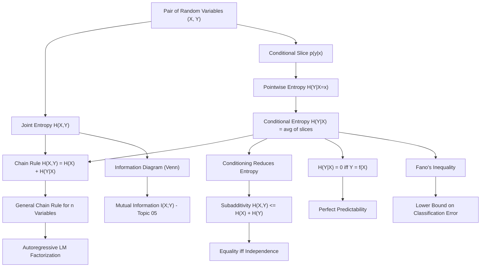

# Topic 02: Joint and Conditional Entropy

## 1. Master Overview

Real systems rarely involve a single random quantity in isolation: a language model sees a token *and* its context, a sensor reads a signal *and* its noise, a classifier sees features *and* labels. **Joint entropy** $H(X, Y)$ measures the total uncertainty of a pair of random variables, while **conditional entropy** $H(Y \mid X)$ measures the uncertainty that *remains* about $Y$ once $X$ has been observed. These two quantities, tied together by the chain rule $H(X, Y) = H(X) + H(Y \mid X)$, turn entropy from a static number into an accounting system for information flow.

The central theorems of this module are inequalities with sharp operational meaning. *Conditioning reduces entropy* ($H(Y \mid X) \le H(Y)$) says that side information never hurts on average. *Subadditivity* ($H(X, Y) \le H(X) + H(Y)$) says that dependent variables are jointly more predictable than independent copies would be, with equality precisely at independence. Together they bound every information diagram and underlie the definition of mutual information in Topic 05.

For machine learning, conditional entropy is the quantity that supervised learning drives down: a perfect predictor of $Y$ from $X$ exists precisely when $H(Y \mid X) = 0$, and Fano's inequality converts any residual conditional entropy into an unavoidable floor on classification error. Autoregressive language models are, mathematically, chain-rule factorizations $H(X_1, \dots, X_n) = \sum_t H(X_t \mid X_{\lt t})$ trained term by term.

> [!NOTE]
> Conditioning reduces entropy *on average* only: $H(Y \mid X) \le H(Y)$ always holds, yet for a *particular* observation $x$ the pointwise uncertainty $H(Y \mid X{=}x)$ can exceed $H(Y)$. A surprising observation can legitimately make you less certain than you were before.

## 2. First-Principles Framework

- **Phenomenon**: Observing one variable changes how uncertain we are about another; uncertainty of a system of variables is not simply the sum of individual uncertainties.
- **Goal**: Extend entropy to collections of random variables so that uncertainty can be decomposed, budgeted, and bounded as variables are revealed one at a time.
- **Governing Equation**: the chain rule $H(X, Y) = H(X) + H(Y \mid X)$, with $H(Y \mid X) = \sum_x p(x)\, H(Y \mid X{=}x)$.
- **Formulation**: $H(X, Y) = -\sum_{x, y} p(x, y) \log p(x, y)$ treats the pair $(X, Y)$ as a single variable on the product alphabet; conditional entropy averages the entropies of the conditional slices $p(y \mid x)$.
- **Consequences**: $\max(H(X), H(Y)) \le H(X, Y) \le H(X) + H(Y)$; conditioning reduces entropy; $H(Y \mid X) = 0$ iff $Y$ is a deterministic function of $X$; equality in subadditivity iff $X \perp Y$.

## 3. Mermaid Concept Map

## 4. Common Misconceptions

| Misconception | Mathematical Reality | Correct Mental Model |
|---|---|---|
| *"Conditional entropy $H(Y \mid X)$ is the entropy of one conditional distribution."* | It is the *average* over $x \sim p(x)$ of the slice entropies $H(Y \mid X{=}x)$. | One number per slice, then a probability-weighted average of those numbers. |
| *"Observing data always reduces uncertainty."* | Only on average: individual slices can satisfy $H(Y \mid X{=}x) \gt H(Y)$. | A lab test can leave a doctor *more* uncertain; across all patients, tests still help on average. |
| *"Joint entropy adds: $H(X, Y) = H(X) + H(Y)$."* | Additivity holds iff $X$ and $Y$ are independent; in general $H(X, Y) = H(X) + H(Y) - I(X; Y)$. | Shared information is counted once in the joint but twice in the sum. |
| *"$H(Y \mid X)$ and $H(X \mid Y)$ are equal by symmetry."* | Generally $H(Y \mid X) \neq H(X \mid Y)$; only the difference identity $H(Y) - H(Y \mid X) = H(X) - H(X \mid Y)$ holds. | Knowing a person's country predicts their language far better than language predicts country. |
| *"$H(Y \mid X) = 0$ means $X$ and $Y$ are identical."* | It means $Y = f(X)$ almost surely for some deterministic $f$ — $Y$ may be a many-to-one function of $X$. | Zero residual uncertainty means computability from $X$, not equality with $X$. |
| *"Entropy Venn diagrams behave exactly like set Venn diagrams."* | For three or more variables the "triple overlap" (interaction information) can be *negative*, unlike set measure. | Venn intuition is a mnemonic for two variables; beyond two it can mislead. |

## 5. Directory Inventory

| File | Type | Description |
|---|---|---|
| [`README.md`](README.md) | Index | Master overview, first-principles framework, concept map, misconceptions, references. |
| [`first_principles.ipynb`](first_principles.ipynb) | Theory | Joint/conditional entropy definitions, chain rule proofs, conditioning-reduces-entropy, subadditivity, Fano's inequality, autoregressive factorization, applications. |
| [`exercises.ipynb`](exercises.ipynb) | Exercises | 20 fully solved problems in 4 levels: Concept Check (4), Foundation (6), Applications in AI/ML (6), Challenge (4). |

## 6. References

1. **Shannon, C. E.** (1948). *A Mathematical Theory of Communication*. Bell System Technical Journal. — Sections 11–12: joint and conditional entropies of sources.
2. **Cover, T. M., & Thomas, J. A.** (2006). *Elements of Information Theory* (2nd ed.). Wiley. — Chapter 2: chain rules, conditioning, and Fano's inequality.
3. **MacKay, D. J. C.** (2003). *Information Theory, Inference, and Learning Algorithms*. Cambridge University Press. — Chapter 8: dependent random variables.
4. **Yeung, R. W.** (2008). *Information Theory and Network Coding*. Springer. — Chapter 3: the I-Measure and information diagrams.
5. **Fano, R. M.** (1961). *Transmission of Information*. MIT Press. — Original statement of Fano's inequality.
6. **Polyanskiy, Y., & Wu, Y.** (2024). *Information Theory: From Coding to Learning*. Cambridge University Press. — Chapters 1–3.
7. **Goodfellow, I., Bengio, Y., & Courville, A.** (2016). *Deep Learning*. MIT Press. — Autoregressive factorization in sequence models (Chapter 10).
