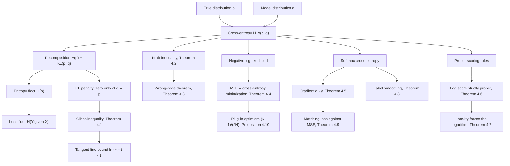

# Module 03 — Cross-Entropy and Loss Functions

Entropy prices a source you already understand. No model does. A model carries an approximation
$q$ of an unknown truth $p$, and the question that matters is what it costs to act on $q$ when
reality follows $p$.

The answer is one identity: the bill splits into the source's own unpredictability, which nobody
can remove, plus a penalty that is zero only when the model is exactly right. That is why
minimizing cross-entropy is a well-posed way to recover a distribution rather than a heuristic.

This module proves the identity from the tangent-line bound, then makes the coding story a
theorem instead of a slogan: Kraft's inequality and its converse, and the wrong-code bound that
traps the expected code length within one bit of $H(p) + D_{\mathrm{KL}}(p \parallel q)$.

The second half is the machine-learning half. Maximum likelihood is cross-entropy minimization,
the softmax gradient is $q - y$, the logarithm is the *only* local proper scoring rule once there
are three outcomes, label smoothing moves the optimum inside the simplex, and squared error on a
sigmoid unit collapses exactly where cross-entropy does not.

> [!NOTE]
> **Cross-entropy decomposition (Gibbs' inequality).** For pmfs $p, q$ with $q \gt 0$ on the
> support of $p$,
> $H_{\times}(p, q) = H(p) + D_{\mathrm{KL}}(p \parallel q) \ge H(p)$,
> with equality if and only if $q = p$. The floor $H(p)$ is fixed by the source; everything a
> model can improve is the second term.

## Prerequisites and downstream modules

**Prerequisites.**

- [information_theory/02 — Joint and Conditional Entropy](../02_joint_and_conditional_entropy/) — conditional entropy supplies the loss floor $H(Y \mid X)$ used in Section 8.1 and Problem L1.7.
- [probability_statistics/09 — Maximum Likelihood and MAP Estimation](../../probability_statistics/09_maximum_likelihood_and_map_estimation/) — the likelihood function that Theorem 4.4 rewrites as a cross-entropy.
- [information_theory/01 — Self-Information and Entropy](../01_self_information_and_entropy/) — the definition of $H(p)$ and the bits-versus-nats convention.

**Downstream modules unlocked by this one.**

- [information_theory/04 — KL Divergence and $f$-Divergences](../04_kl_divergence_and_f_divergences/) — takes Definition 3.2 and embeds it in the $f$-divergence family.
- [information_theory/05 — Mutual Information](../05_mutual_information/) — reached through Module 04.
- [information_theory/06 — Information Theory in Deep Learning](../06_information_theory_in_deep_learning/) — the ELBO is the free-energy identity of Section 8.4.

The full dependency graph is in [docs/prerequisites.md](../../docs/prerequisites.md), and the
symbol conventions used below are fixed in [docs/notation.md](../../docs/notation.md).

## Learning outcomes

After working through this module you will be able to:

- decompose any cross-entropy into an entropy floor plus a KL penalty, and prove the penalty non-negative from the tangent-line bound $\ln t \le t - 1$;
- state Kraft's inequality with its converse, and bound the expected length of the Shannon code for a wrong model within one bit;
- rewrite a log-likelihood as an empirical cross-entropy and read maximum likelihood as a forward-KL projection;
- differentiate a softmax cross-entropy to $q - y$ and identify its Hessian as a covariance matrix;
- decide whether a loss is a proper scoring rule, and explain why locality forces the logarithm once $K \ge 3$;
- compute label-smoothing targets, optimal confidences and optimal logit gaps;
- predict where squared error on a sigmoid output will stall, and quantify the gradient ratio;
- audit a reported loss against its entropy floor and against the $(K-1)/(2N)$ optimism of a fitted model.

## Concept map

## Notation

Drawn from [docs/notation.md](../../docs/notation.md).

| Symbol | Meaning | Convention |
|---|---|---|
| $H(p)$ | entropy of a distribution | bits unless nats are stated |
| $H(X, Y)$ | **joint** entropy of a pair | two random-variable arguments |
| $H_{\times}(p, q)$ | **cross-entropy** of $q$ relative to $p$ | two distribution arguments |
| $D_{\mathrm{KL}}(p \parallel q)$ | Kullback-Leibler divergence | `\parallel`, never a bare pipe |
| $H_b(t)$ | binary entropy function | $H_b(t) = -t\log t - (1-t)\log(1-t)$ |
| $H(Y \mid X)$ | conditional entropy, the loss floor | `\mid` |
| $\mathcal{X}$, $K$ | alphabet and its size | $K = \lvert \mathcal{X} \rvert$ |
| $q = \operatorname{softmax}(z)$ | model probabilities from logits | $q_k \propto e^{z_k}$ |
| $y$, $\tilde{y}$ | target vector, smoothed target | $\tilde{y} = (1-\epsilon)y + \epsilon u$ |
| $\ell(x)$, $\mathcal{K}(\ell)$ | codeword length, Kraft sum | $\mathcal{K}(\ell) = \sum_x 2^{-\ell(x)}$ |
| $S(q, x)$, $\bar{S}(p, q)$ | scoring rule and its expectation | proper when minimized at $q = p$ |
| $\hat{p}_N$ | empirical distribution of $N$ draws | |

The two-argument $H$ means two different things across the area, so this module writes
cross-entropy as $H_{\times}$ throughout and reserves $H(X, Y)$ for joint entropy. The
machine-learning name $\mathrm{CE}$ refers to the same quantity as $H_{\times}$.

## Core results

| Result | Statement | Hypotheses | Where |
|---|---|---|---|
| Decomposition and Gibbs | $H_{\times}(p,q) = H(p) + D_{\mathrm{KL}}(p \parallel q) \ge H(p)$ | finite alphabet, $q \gt 0$ on $\operatorname{supp}(p)$ | Theorem 4.1, Proof 5.1 |
| Kraft inequality | prefix code iff $\sum_x 2^{-\ell(x)} \le 1$ | prefix property, integer lengths | Theorem 4.2, Proof 5.2 |
| Wrong-code theorem | $H + D \le \mathbb{E}_p[\ell_q] \lt H + D + 1$ | $q \gt 0$ everywhere | Theorem 4.3, Proof 5.3 |
| MLE equals cross-entropy | $\operatorname{arg\,max} \ell(\theta) = \operatorname{arg\,min} H_{\times}(\hat{p}_N, q_\theta)$ | $q_\theta \gt 0$ on the observed support | Theorem 4.4, Proof 5.4 |
| Softmax gradient | $\nabla_z \mathcal{L} = q - y$, $\nabla^2_z \mathcal{L} = \operatorname{diag}(q) - qq^{\top}$ | targets sum to one | Theorem 4.5, Proof 5.5 |
| Log score is strictly proper | $\bar{S}(p,q) - \bar{S}(p,p) = D_{\mathrm{KL}}(p \parallel q)$ | those of Theorem 4.1 | Theorem 4.6, Proof 5.6 |
| Locality forces the logarithm | local, proper, differentiable $\Rightarrow s(t) = a - b\log t$ | $K \ge 3$ | Theorem 4.7, Proof 5.7 |
| Label smoothing optimum | $q^{\star} = \tilde{y}$, confidence $1 - \epsilon + \epsilon/K$ | $0 \lt \epsilon \lt 1$ | Theorem 4.8, Proof 5.8 |
| Matching loss | $\partial_z \mathrm{BCE} = \sigma(z) - y$; MSE gradient vanishes | logistic link | Theorem 4.9, Proof 5.9 |
| Plug-in optimism | $\mathbb{E}\left[D_{\mathrm{KL}}(\hat{p}_N \parallel p)\right] = (K-1)/(2N) + O(N^{-2})$ | $p \gt 0$, i.i.d. sampling | Proposition 4.10, Proof 5.10 |

## Common misconceptions

1. **"Cross-entropy is a distance between distributions."** It is not symmetric, fails the
   triangle inequality, and does not vanish at $p = q$ — it equals $H(p)$ there. It is an
   expected cost whose excess over the floor is the divergence.

2. **"Zero loss means a perfect model."** The floor of the expected loss is $H(Y \mid X)$, which
   is positive whenever labels are intrinsically uncertain. Problem L2.5 audits a reported
   $0.30$ nats against a floor of $1.41943$ nats and concludes leakage.

3. **"The coding interpretation is an analogy."** Theorem 4.3 makes it an inequality with a
   constant: the Shannon code for $q$ costs at least $H(p) + D_{\mathrm{KL}}(p \parallel q)$ bits
   and strictly less than one bit more.

4. **"The softmax gradient needs the softmax Jacobian."** Composed with cross-entropy the
   Jacobian telescopes and the gradient is exactly $q - y$ — but only because the targets sum to
   one. Section 7.3 of the theory notebook runs the case where they do not, and the formula is
   wrong by $0.42$ in the first coordinate.

5. **"Any strictly proper loss is as good as log loss."** Brier is strictly proper and not local:
   it scores you on how you spread probability over outcomes that did not happen. Once $K \ge 3$,
   Theorem 4.7 says locality leaves only the logarithm.

6. **"Locality forces the logarithm for every alphabet."** At $K = 2$ it does not. The binary
   Brier score $s(t) = 2(1-t)^2$ is local, strictly proper and not logarithmic; the theory
   notebook runs it as a counterexample.

7. **"MSE on probabilities works as well as cross-entropy."** With a sigmoid output the squared
   error carries a factor $\sigma(z)(1-\sigma(z))$ that collapses exactly when the model is most
   wrong: at $z = -6$ with label $1$ the gradient is $405$ times smaller than the cross-entropy
   gradient.

8. **"Training loss estimates test loss."** A model fitted on $N$ samples with $K-1$ free
   parameters reports a loss biased low by $(K-1)/(2N)$ nats, measured in Section 7.2 with a
   fitted exponent of $-1.0046$ against the predicted $-1$.

## Exercise index

[`exercises.ipynb`](exercises.ipynb) contains 28 fully solved problems in four tiers. Every
problem carries a statement, a short intuition, a stepwise solution, a boxed answer, a key
takeaway, and a code cell that recomputes the answer and prints the check.

| Tier | Count | Coverage |
|---|---:|---|
| L0 — Concept Checks | 6 | cross-entropy at a perfect match, one-hot loss, the infinite penalty, asymmetry, the $\log K$ initialization check, zero-sum gradients |
| L1 — Foundations | 8 | the decomposition, the optimal constant predictor, a softmax gradient by hand, affine-in-$p$ and convex-in-$q$, Gaussian NLL as MSE, stable BCE-with-logits, the conditional-entropy floor, the softmax Hessian |
| L2 — Applications (AI/ML and Physics) | 8 | perplexity and compression, label smoothing, focal loss, distillation and $T^2$, loss-floor auditing, class weighting, Landauer erasure with a mismatched code, free energy of a two-level system |
| L3 — Challenge Proofs | 6 | Brier propriety and non-locality, Kraft-constrained optimal code lengths, Kelly betting and the doubling rate, the calibration-refinement decomposition, the Savage-Bregman representation, the Fisher-information expansion |

Tier L2 contains two genuine physics problems: the Landauer erasure cost of a mismatched code
(Problem L2.7) and the free-energy penalty of a two-level system held at the wrong temperature
(Problem L2.8).

## References

**Textbooks.**

- Cover, T. M. and Thomas, J. A. *Elements of Information Theory*, 2nd ed. — Kraft's inequality and converse (Theorem 5.2.1), optimal code lengths (section 5.3), the wrong-code theorem (Theorem 5.4.3), Shannon codes and competitive optimality (section 5.11), doubling rate and Kelly gambling (Chapter 6, Theorem 6.1.2).
- MacKay, D. J. C. *Information Theory, Inference, and Learning Algorithms* — Chapter 4 (source coding), Chapter 5 (symbol codes and the $H \le \mathbb{E}[\ell] \lt H+1$ bound), Chapter 6 (arithmetic coding).
- Goodfellow, I., Bengio, Y. and Courville, A. *Deep Learning* — section 5.5 (maximum likelihood as KL minimization), section 6.2.2 (softmax units, log-likelihood loss and output saturation).
- Bishop, C. M. *Pattern Recognition and Machine Learning* — section 4.3.2 (logistic regression and the $\hat{p} - y$ gradient), section 4.3.4 (the multiclass case).
- Boyd, S. and Vandenberghe, L. *Convex Optimization* — section 3.5 (log-sum-exp, its convexity and its conjugate), which is the Hessian statement of Theorem 4.5.

**Papers.**

- Bernardo, J. M. "Expected information as expected utility", *Annals of Statistics* **7**(3) (1979), 686-690, Theorem 1 — the locality characterization, proved here in its differentiable form as Theorem 4.7.
- Gneiting, T. and Raftery, A. E. "Strictly proper scoring rules, prediction, and estimation", *JASA* **102**(477) (2007), 359-378, sections 2-3 — the Savage representation of Problem L3.5.
- Good, I. J. "Rational decisions", *JRSS B* **14**(1) (1952), 107-114 — the logarithmic score.
- Kelly, J. L. "A new interpretation of information rate", *Bell System Technical Journal* **35**(4) (1956), 917-926 — the doubling rate.
- Szegedy, C., Vanhoucke, V., Ioffe, S., Shlens, J. and Wojna, Z. "Rethinking the Inception architecture for computer vision", CVPR (2016), section 7 — label smoothing.
- Müller, R., Kornblith, S. and Hinton, G. "When does label smoothing help?", NeurIPS (2019) — its calibration effect.
- Lin, T.-Y., Goyal, P., Girshick, R., He, K. and Dollár, P. "Focal loss for dense object detection", ICCV (2017), section 3 — the $(1-q_t)^{\gamma}$ modulation.
- Hinton, G., Vinyals, O. and Dean, J. "Distilling the knowledge in a neural network", arXiv:1503.02531 (2015), section 2 — temperature and the $T^2$ rescaling.
- Guo, C., Pleiss, G., Sun, Y. and Weinberger, K. Q. "On calibration of modern neural networks", ICML (2017), section 4.2 — temperature scaling.

**In this directory.**

- [`first_principles.ipynb`](first_principles.ipynb) — theory, ten numbered proofs, eight worked examples, eleven executable code cells and three figures.
- [`exercises.ipynb`](exercises.ipynb) — the 28 solved problems indexed above.
