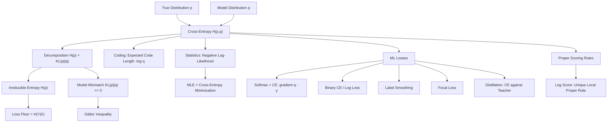

# Topic 03: Cross-Entropy and Loss Functions

## 1. Master Overview

Cross-entropy $H(p, q) = -\sum_x p(x)\log q(x)$ answers an operational question: if reality follows $p$ but we compress, predict, or bet according to a model $q$, how many bits do we pay per observation? The answer decomposes exactly into $H(p, q) = H(p) + D_{\mathrm{KL}}(p \parallel q)$ — an irreducible part (the entropy of reality) plus a model-mismatch penalty (the KL divergence). Gibbs' inequality guarantees the penalty is nonnegative and vanishes only when $q = p$, which is why minimizing cross-entropy is a *proper* way to fit distributions.

This single identity explains the most-used loss function in machine learning. Training a classifier or language model by maximum likelihood *is* minimizing empirical cross-entropy between the data distribution and the model; the softmax + cross-entropy pairing produces the famously clean gradient $q - y$ (predicted probabilities minus one-hot target), and the loss value itself is interpretable in nats or bits per example. Binary cross-entropy (log loss), label smoothing, focal loss, and knowledge-distillation objectives are all variations on the same theme.

The module also develops the scoring-rule perspective: the logarithmic score is (essentially uniquely) the *local proper* scoring rule, meaning that honest probability reporting is the optimal strategy under log loss. This closes the loop between information theory, statistics, and deep learning practice: the loss we descend by SGD is the same quantity Shannon would charge us for miscoded bits.

> [!NOTE]
> Cross-entropy is asymmetric in an essential way: the expectation is taken under the *true* distribution $p$, while the logarithm scores the *model* $q$. Swapping the roles changes the value and the optimization geometry — $H(p, q) \neq H(q, p)$ in general, mirroring the asymmetry of the KL divergence it contains.

## 2. First-Principles Framework

- **Phenomenon**: Predictions are made with a model $q$ while outcomes are generated by an unknown $p$; every mismatch costs us — in code length, in likelihood, in gambling losses.
- **Goal**: Quantify the expected cost of using $q$ when reality is $p$, and show that minimizing that cost recovers $p$.
- **Governing Equation**: $H(p, q) = -\sum_x p(x)\log q(x) = H(p) + D_{\mathrm{KL}}(p \parallel q)$.
- **Formulation**: Empirically, with one-hot targets, cross-entropy is the negative log-likelihood $-\frac{1}{N}\sum_i \log q(y_i \mid x_i)$; with softmax logits $z$, the gradient is $\partial \mathcal{L}/\partial z = q - y$.
- **Consequences**: $H(p, q) \ge H(p)$ with equality iff $q = p$ (Gibbs); log loss is a strictly proper scoring rule; the loss floor of any predictive task is the conditional entropy $H(Y \mid X)$.

## 3. Mermaid Concept Map

## 4. Common Misconceptions

| Misconception | Mathematical Reality | Correct Mental Model |
|---|---|---|
| *"Cross-entropy is a distance between distributions."* | $H(p, q)$ is not symmetric, violates the triangle inequality, and does not vanish at $p = q$ (it equals $H(p)$ there). | It is an expected *cost*, whose excess over the floor $H(p)$ is the divergence. |
| *"Zero training loss means a perfect model."* | The floor of the expected loss is $H(Y \mid X) \gt 0$ whenever labels are intrinsically uncertain; loss below the floor on training data means memorization. | Compare loss to the entropy floor, not to zero. |
| *"Cross-entropy and log-likelihood are different objectives."* | $-\frac{1}{N}\sum_i \log q(y_i \mid x_i)$ is simultaneously the empirical cross-entropy and the negative mean log-likelihood. | One quantity, two vocabularies — information theory and statistics. |
| *"The softmax gradient needs the Jacobian of softmax."* | Composed with cross-entropy, the Jacobian telescopes: $\partial \mathcal{L}/\partial z_k = q_k - y_k$ exactly. | The pairing is designed so errors, not derivatives of exponentials, drive learning. |
| *"Label smoothing just adds noise to targets."* | Smoothing to $\tilde{y} = (1-\epsilon)y + \epsilon u$ shifts the optimal prediction from the vertex to the interior and adds a constant-plus-KL penalty toward uniform, bounding confidence. | It is a principled regularizer with a closed-form optimal predictive distribution. |
| *"Any accuracy-improving loss is fine for probabilities."* | Only *proper* scoring rules (log, Brier) are minimized by the true probabilities; improper rules incentivize distorted reports. | If you need calibrated probabilities, the loss must make honesty optimal. |
| *"MSE on probabilities works as well as CE for classification."* | With sigmoid/softmax outputs, MSE yields vanishing gradients at confident wrong predictions ($\sigma'$ factor), while CE keeps gradient magnitude $\propto$ error. | CE matches the exponential-family geometry of softmax; MSE fights it. |

## 5. Directory Inventory

| File | Type | Description |
|---|---|---|
| [`README.md`](README.md) | Index | Master overview, first-principles framework, concept map, misconceptions, references. |
| [`first_principles.ipynb`](first_principles.ipynb) | Theory | Coding interpretation, Gibbs' inequality, CE = NLL, softmax gradient derivation, label smoothing, proper scoring rules, focal loss, numerical stability. |
| [`exercises.ipynb`](exercises.ipynb) | Exercises | 20 fully solved problems in 4 levels: Concept Check (4), Foundation (6), Applications in AI/ML (6), Challenge (4). |

## 6. References

1. **Shannon, C. E.** (1948). *A Mathematical Theory of Communication*. Bell System Technical Journal. — Coding interpretation of $-\log q$.
2. **Cover, T. M., & Thomas, J. A.** (2006). *Elements of Information Theory* (2nd ed.). Wiley. — Chapter 5: source coding and the wrong-code penalty.
3. **MacKay, D. J. C.** (2003). *Information Theory, Inference, and Learning Algorithms*. Cambridge University Press. — Chapters 4–6: coding and inference.
4. **Good, I. J.** (1952). *Rational Decisions*. Journal of the Royal Statistical Society B. — The logarithmic scoring rule.
5. **Gneiting, T., & Raftery, A. E.** (2007). *Strictly Proper Scoring Rules, Prediction, and Estimation*. JASA. — The modern theory of proper scoring rules.
6. **Goodfellow, I., Bengio, Y., & Courville, A.** (2016). *Deep Learning*. MIT Press. — Chapters 5–6: MLE, cross-entropy, and softmax.
7. **Szegedy, C., et al.** (2016). *Rethinking the Inception Architecture for Computer Vision*. CVPR. — Label smoothing.
8. **Lin, T.-Y., et al.** (2017). *Focal Loss for Dense Object Detection*. ICCV. — Focal loss.
9. **Hinton, G., Vinyals, O., & Dean, J.** (2015). *Distilling the Knowledge in a Neural Network*. arXiv:1503.02531. — Distillation via soft-target cross-entropy.
