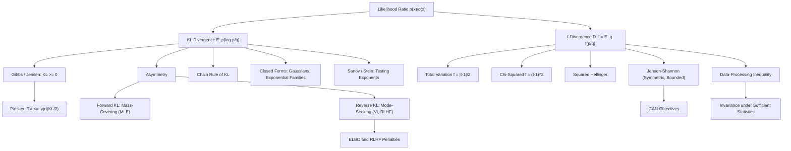

# Topic 04: KL Divergence and f-Divergences

## 1. Master Overview

The Kullback–Leibler divergence $D_{\mathrm{KL}}(P \parallel Q) = \sum_x p(x)\log\frac{p(x)}{q(x)}$ is the central measure of dissimilarity between probability distributions. It is the expected log-likelihood ratio, the excess code length of using the wrong code, the exponential rate at which hypothesis tests distinguish $P$ from $Q$ (Sanov/Stein), and the penalty term inside the ELBO, RLHF objectives, and trust-region policy updates. Its defining properties — nonnegativity with equality iff $P = Q$ (via Jensen's inequality), asymmetry, additivity over independent factors, and invariance under sufficient transformations — are all proved from first principles in this module.

KL is one member of a grand family: for any convex $f$ with $f(1) = 0$, the **f-divergence** $D_f(P \parallel Q) = \sum_x q(x) f\!\left(\frac{p(x)}{q(x)}\right)$ inherits nonnegativity, joint convexity, and — crucially — the **data-processing inequality**: no channel, function, or randomized post-processing can increase any f-divergence. Total variation, $\chi^2$, squared Hellinger, and Jensen–Shannon divergences are all specializations, and inequalities like Pinsker's ($\mathrm{TV} \le \sqrt{\mathrm{KL}/2}$) knit the family together.

The asymmetry of KL is not a defect but a modeling dial. Forward KL ($D_{\mathrm{KL}}(p \parallel q)$, the MLE direction) is *mass-covering*: $q$ must put mass wherever $p$ does. Reverse KL ($D_{\mathrm{KL}}(q \parallel p)$, the variational-inference direction) is *mode-seeking*: $q$ may collapse onto one mode but must avoid regions where $p$ is small. Recognizing which direction an algorithm optimizes explains the qualitative behavior of VAEs, GAN variants, distillation, and RLHF regularization.

> [!NOTE]
> $D_{\mathrm{KL}}(P \parallel Q)$ is finite only if $P$ is absolutely continuous with respect to $Q$ (no outcome has $p(x) \gt 0$ but $q(x) = 0$). This support condition, not the formula, is what breaks naive KL estimates between empirical distributions and motivates smoothed or symmetrized alternatives like Jensen–Shannon.

## 2. First-Principles Framework

- **Phenomenon**: Two probabilistic descriptions of the same world disagree; we need a canonical, operationally meaningful measure of how much the disagreement costs.
- **Goal**: Construct a divergence that (i) vanishes iff the distributions coincide, (ii) can only shrink under further processing of the data, and (iii) has coding, testing, and estimation interpretations.
- **Governing Equation**: $D_{\mathrm{KL}}(P \parallel Q) = \mathbb{E}_{P}\left[\log\frac{p(X)}{q(X)}\right]$, generalized to $D_f(P \parallel Q) = \mathbb{E}_{Q}\left[f\!\left(\frac{p(X)}{q(X)}\right)\right]$.
- **Formulation**: Nonnegativity follows from Jensen applied to the convex $f$ (for KL, $f(t) = t\log t$); the data-processing inequality follows from joint convexity of $(p, q) \mapsto q f(p/q)$.
- **Consequences**: chain rule $D_{\mathrm{KL}}(P_{XY} \parallel Q_{XY}) = D_{\mathrm{KL}}(P_X \parallel Q_X) + \mathbb{E}_{P_X} D_{\mathrm{KL}}(P_{Y \mid X} \parallel Q_{Y \mid X})$; closed forms for exponential families (e.g., Gaussians); Pinsker's inequality bounding total variation.

## 3. Mermaid Concept Map

## 4. Common Misconceptions

| Misconception | Mathematical Reality | Correct Mental Model |
|---|---|---|
| *"KL divergence is a distance metric."* | It is asymmetric and violates the triangle inequality; only its local quadratic approximation (Fisher metric) is a metric structure. | KL is a *divergence*: a directed, coordinate-invariant measure of surprise cost. |
| *"$D_{\mathrm{KL}}(P \parallel Q)$ and $D_{\mathrm{KL}}(Q \parallel P)$ are roughly the same."* | They can differ by orders of magnitude and one can be infinite while the other is finite. | Forward KL punishes missed mass of $P$; reverse KL punishes hallucinated mass where $P$ is absent. |
| *"KL between empirical histograms is a safe estimator."* | Any empty bin of $Q$ with data in $P$ makes the estimate infinite; plug-in KL is badly biased in high dimensions. | Smooth first, or use JS/Hellinger, or variational (Donsker–Varadhan) estimators. |
| *"Minimizing KL in either direction gives the same fit."* | $\arg\min_q D_{\mathrm{KL}}(p \parallel q)$ matches moments/support; $\arg\min_q D_{\mathrm{KL}}(q \parallel p)$ picks modes. | Direction choice is a modeling decision with visibly different optima for multimodal $p$. |
| *"The data-processing inequality only applies to deterministic functions."* | It holds for every stochastic channel (Markov kernel), including adding noise, sampling, and quantization. | Any processing — random or not — can only blur the distinction between two hypotheses. |
| *"JS divergence is just an average of KLs, so it inherits their unboundedness."* | $\mathrm{JS}(P, Q) \le \log 2$ always, because each KL is measured against the mixture $M = \tfrac{1}{2}(P + Q)$, which dominates both. | JS is a bounded, symmetric smoothing of KL — the reason it (and not raw KL) underlies the original GAN loss. |

## 5. Directory Inventory

| File | Type | Description |
|---|---|---|
| [`README.md`](README.md) | Index | Master overview, first-principles framework, concept map, misconceptions, references. |
| [`first_principles.ipynb`](first_principles.ipynb) | Theory | KL definition and interpretations, Jensen nonnegativity, chain rule, Gaussian closed form, f-divergence family, data-processing inequality, Pinsker, forward vs reverse KL, estimators. |
| [`exercises.ipynb`](exercises.ipynb) | Exercises | 20 fully solved problems in 4 levels: Concept Check (4), Foundation (6), Applications in AI/ML (6), Challenge (4). |

## 6. References

1. **Kullback, S., & Leibler, R. A.** (1951). *On Information and Sufficiency*. Annals of Mathematical Statistics, 22(1), 79–86.
2. **Cover, T. M., & Thomas, J. A.** (2006). *Elements of Information Theory* (2nd ed.). Wiley. — Chapters 2, 11, 12: relative entropy, Sanov, Stein.
3. **Csiszár, I.** (1967). *Information-type measures of difference of probability distributions*. Studia Sci. Math. Hungar. — The f-divergence framework.
4. **MacKay, D. J. C.** (2003). *Information Theory, Inference, and Learning Algorithms*. Cambridge University Press.
5. **Amari, S.** (2016). *Information Geometry and Its Applications*. Springer. — KL, Fisher metric, and dual geometry.
6. **Kingma, D. P., & Welling, M.** (2014). *Auto-Encoding Variational Bayes*. ICLR. — Reverse-KL variational inference and the Gaussian KL closed form.
7. **Goodfellow, I., et al.** (2014). *Generative Adversarial Nets*. NeurIPS. — JS divergence as the GAN objective.
8. **Nowozin, S., Cseke, B., & Tomioka, R.** (2016). *f-GAN: Training Generative Neural Samplers using Variational Divergence Minimization*. NeurIPS.
9. **Schulman, J., et al.** (2015). *Trust Region Policy Optimization*. ICML. — KL-constrained policy updates.
10. **Polyanskiy, Y., & Wu, Y.** (2024). *Information Theory: From Coding to Learning*. Cambridge University Press. — Modern f-divergence toolbox.
