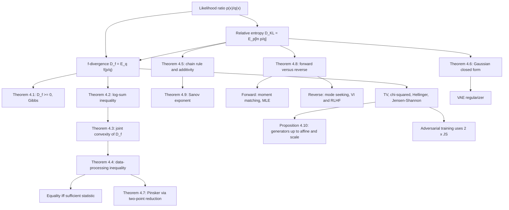

# Module 04 — KL Divergence and f-Divergences

Two probabilistic descriptions of the same world disagree. Relative entropy is the canonical
measure of what that disagreement costs, and it is canonical because three separate accounting
systems — coding, testing, and estimation — all return the same number.

This module derives $D_{\mathrm{KL}}$ from the likelihood ratio, proves its structural properties
from convexity alone, and then shows that it is one member of a family. For any convex $f$ with
$f(1) = 0$ the $f$-divergence $D_f(P \parallel Q) = \mathbb{E}_Q\left[f(p/q)\right]$ inherits
nonnegativity, joint convexity, and the data-processing inequality. Total variation, $\chi^2$,
squared Hellinger and Jensen-Shannon are all specializations.

The theorem the family exists for is the **data-processing inequality**: no channel, function or
randomized post-processing can increase any $f$-divergence. It is proved here in full, including
the equality case — which holds exactly when the channel output is a sufficient statistic, and
which needs the generator to be *strictly* convex. Total variation shows why that hypothesis
cannot be dropped.

The second half is about asymmetry. Forward KL is a moment match and reverse KL is a mode
selection; the two rank the same two candidate fits in opposite orders, and by factors of twenty
and three respectively. Recognizing which direction an algorithm optimizes explains the
qualitative behaviour of variational autoencoders, adversarial training, distillation and
KL-regularized policy optimization.

> [!NOTE]
> **Data-processing inequality.** For every generator $f$ and every channel $K$,
> $D_f(KP \parallel KQ) \le D_f(P \parallel Q)$. If $f$ is strictly convex, equality holds exactly
> when the output preserves the likelihood ratio, that is when it is a sufficient statistic for
> the pair. Every "no estimator can do better than" bound in statistics is an application of this
> one line.

## Prerequisites and downstream modules

**Prerequisites.**

- [Module 03 — Cross-Entropy and Loss Functions](../03_cross_entropy_and_loss_functions/) — the identity $H_{\times}(p, q) = H(p) + D_{\mathrm{KL}}(p \parallel q)$, which is where relative entropy first appears as a cost.
- [optimization/01 — Problem Formulation and Convexity](../../optimization/01_problem_formulation_and_convexity/) — convexity, Jensen's inequality and the perspective function, which carry every proof in Section 5.

**Downstream modules unlocked by this one.**

- [Module 05 — Mutual Information](../05_mutual_information/) — mutual information is $D_{\mathrm{KL}}(P_{XY} \parallel P_X \otimes P_Y)$, so its data-processing inequality is Theorem 4.4.

Earlier modules in this area supply the entropy vocabulary used throughout:
[Module 01 — Self-Information and Entropy](../01_self_information_and_entropy/) and
[Module 02 — Joint and Conditional Entropy](../02_joint_and_conditional_entropy/).

The full dependency graph is in [docs/prerequisites.md](../../docs/prerequisites.md), and the
symbol conventions used below are fixed in [docs/notation.md](../../docs/notation.md).

## Learning outcomes

After working through this module you will be able to:

- compute $D_{\mathrm{KL}}$, total variation, $\chi^2$, squared Hellinger and Jensen-Shannon for small discrete distributions, and decide when each is infinite;
- prove that every $f$-divergence is nonnegative, and say exactly which generators certify $P = Q$ from a zero value;
- prove the log-sum inequality, joint convexity of $D_f$, and the data-processing inequality, and derive the equality case of the last one;
- exhibit the channel that preserves total variation while destroying relative entropy, and explain what hypothesis it breaks;
- evaluate the Gaussian closed form and use it as the regularizer of a variational autoencoder;
- prove Pinsker's inequality by two-point reduction, and show that no converse can exist;
- predict which fit forward and reverse KL will each choose for a multi-modal target, and bound both;
- prove Sanov's upper bound by the method of types and read a large-deviation exponent off a relative entropy;
- apply the results to adversarial training, KL-regularized policy optimization, model selection, Landauer's bound and the Gibbs state.

## Concept map

## Notation

Drawn from [docs/notation.md](../../docs/notation.md).

| Symbol | Meaning | Convention |
|---|---|---|
| $D_{\mathrm{KL}}(P \parallel Q)$ | relative entropy, in nats | `\parallel`, never a raw pipe |
| $D_f(P \parallel Q)$ | $f$-divergence with generator $f$ | $\mathbb{E}_Q\left[f(p/q)\right]$ |
| $f$ | generator: convex on $(0,\infty)$, $f(1) = 0$ | fixed only up to $c(t-1)$ and positive scale |
| $P \ll Q$ | absolute continuity | $q(x) = 0 \Rightarrow p(x) = 0$ |
| $H(X)$, $H(X, Y)$ | entropy, joint entropy | two random-variable arguments |
| $H_{\times}(p, q)$ | cross-entropy between distributions | distinct symbol from joint entropy |
| $\mathrm{TV}(P, Q)$ | total variation distance | $\tfrac12 \sum_x \lvert p(x) - q(x) \rvert$ |
| $\chi^2(P \parallel Q)$ | Pearson divergence | $\sum_x (p-q)^2/q$ |
| $H^2(P, Q)$ | squared Hellinger divergence | $\sum_x (\sqrt{p} - \sqrt{q})^2$, in $[0, 2]$ |
| $\mathrm{JS}(P, Q)$ | Jensen-Shannon divergence | mixture $M = \tfrac12(P+Q)$, ceiling $\ln 2$ |
| $K(y \mid x)$ | channel, Markov kernel | `\mid` for the conditioning bar |
| $\hat{P}_n$, $T(P)$ | empirical distribution, type class | Definition 3.8 |
| $\mathcal{I}(\theta)$ | Fisher information | local quadratic form of $D_{\mathrm{KL}}$ |

## Core results

| Result | Statement | Hypotheses | Where |
|---|---|---|---|
| Nonnegativity (Gibbs) | $D_f(P \parallel Q) \ge 0$; zero iff $P = Q$ | $f$ convex, $f(1) = 0$; strictly convex at $1$ for equality | Theorem 4.1, Proof 5.1 |
| Log-sum inequality | $\sum_i a_i \ln \frac{a_i}{b_i} \ge \left(\sum_i a_i\right)\ln\frac{\sum_i a_i}{\sum_i b_i}$ | $a_i \ge 0$, $b_i \gt 0$ | Theorem 4.2, Proof 5.2 |
| Joint convexity | $(P, Q) \mapsto D_f(P \parallel Q)$ is jointly convex | $f$ convex | Theorem 4.3, Proof 5.3 |
| Data processing | $D_f(KP \parallel KQ) \le D_f(P \parallel Q)$; equality iff sufficient | $K$ a channel; strict convexity for the equality case | Theorem 4.4, Proof 5.4 |
| Chain rule, additivity | joint equals marginal plus expected conditional; $n$ i.i.d. carry $n D_{\mathrm{KL}}$ | $P_{XY} \ll Q_{XY}$ | Theorem 4.5, Proof 5.5 |
| Gaussian closed form | $\ln\frac{\sigma_2}{\sigma_1} + \frac{\sigma_1^2 + (\mu_1-\mu_2)^2}{2\sigma_2^2} - \frac12$ | both variances positive | Theorem 4.6, Proof 5.6 |
| Pinsker | $\mathrm{TV} \le \sqrt{D_{\mathrm{KL}}/2}$, no converse | none | Theorem 4.7, Proof 5.7 |
| Forward versus reverse | forward is moment matching; reverse caps at $\ln 2$ on one mode | Gaussian family, two-mode target | Theorem 4.8, Proof 5.8 |
| Sanov, upper bound | $\mathbb{P}(\hat{P}_n \in E) \le (n+1)^{\lvert \mathcal{X} \rvert} e^{-nD^{\star}}$ | $\mathcal{X}$ finite, $Q$ of full support | Theorem 4.9, Proof 5.9 |
| Matching lower bound | the limit equals $-D^{\star}$ | $E$ the closure of its interior | cited, not proved here |
| Generator equivalence | $D_{\kappa f + a(t-1)} = \kappa D_f$ for $\kappa \gt 0$ | none | Proposition 4.10, Proof 5.10 |

## Common misconceptions

1. **"Relative entropy is a distance."** It is asymmetric and violates the triangle inequality.
   Problem L0.5 runs a triple with
   $D_{\mathrm{KL}}(P \parallel S) = 1.757780 \gt 0.878890 = D_{\mathrm{KL}}(P \parallel R) + D_{\mathrm{KL}}(R \parallel S)$.
   Only its local quadratic form, the Fisher metric, is a metric structure.

2. **"The two directions are roughly the same."** They can differ by orders of magnitude and one
   can be infinite while the other is finite. Example 6.5 has $0.818147$ one way and $2.806853$ the
   other on two Gaussians, and Section 7.4 drives one to $+\infty$ while the other stays at
   $0.0001$.

3. **"Small total variation means small relative entropy."** No converse to Pinsker exists. One
   outcome that $Q$ forbids and $P$ allows with probability $10^{-4}$ gives $\mathrm{TV} = 10^{-4}$
   and $D_{\mathrm{KL}} = +\infty$.

4. **"The data-processing inequality is strict unless the channel is invertible."** It is an
   equality exactly when the channel output preserves the likelihood ratio, which is far weaker
   than invertibility — and for a generator that is not strictly convex, equality can hold with no
   sufficiency at all. Example 6.3 merges two symbols with likelihood ratios $5$ and $1.5$, keeps
   $\mathrm{TV}$ at $0.5$ exactly, and drops $D_{\mathrm{KL}}$ by $0.141695$.

5. **"The Jensen-Shannon generator is $t \ln t - (t+1)\ln\frac{t+1}{2}$, bounded by $\ln 2$."**
   That generator produces $2\,\mathrm{JS}$, whose ceiling is $2\ln 2$. Example 6.9 measures the
   factor exactly. Generators are defined only up to $c(t-1)$ **and** positive scale, so a table
   without a stated normalization is ambiguous.

6. **"$k_3 = r - 1 - \ln r$ always has lower variance than $k_1 = -\ln r$."** It has lower variance
   only when $\operatorname{Var}(r) + 2\operatorname{Cov}(-\ln r, r) \lt 0$. Problem L2.2 gives a
   two-atom counterexample where $\operatorname{Var}(k_1) = 0.424475$ and
   $\operatorname{Var}(k_3) = 77.141060$ — a factor of $182$ the wrong way.

7. **"Relative entropy is unbounded, so a KL curve always blows up."** It is unbounded in its
   *second* argument. Against a fixed uniform reference, $D_{\mathrm{KL}}(P \parallel \mathrm{unif}) = \ln K - H(P)$
   is capped at $\ln K$; Section 7.6 plots exactly that, with only the reverse direction escaping.

8. **"Plug-in KL between empirical histograms is a safe estimator."** One empty $Q$-bin with
   $P$-mass makes the estimate infinite, and the plug-in is badly biased in high dimension. Smooth
   first, or use Jensen-Shannon or Hellinger, or the variational estimator of Problem L3.1.

## Exercise index

[`exercises.ipynb`](exercises.ipynb) contains 31 fully solved problems in four tiers. Every problem
carries a statement, a short intuition, a stepwise solution, a boxed answer, a key takeaway, and —
where the answer is numeric or algorithmic — a code cell that recomputes it and prints the check.

| Tier | Count | Coverage |
|---|---:|---|
| L0 — Concept Checks | 7 | both Bernoulli directions, infinite divergence, generators up to an affine term, a Pinsker check, failure of the metric axioms, total variation as an $f$-divergence, equal-variance Gaussians |
| L1 — Foundations | 9 | nonnegativity of the family, chain rule on a table, the variational-autoencoder closed form, additivity, $\chi^2$ dominance, the $\ln 2$ ceiling of Jensen-Shannon, the log-sum inequality, the Hellinger sandwich for total variation, $H^2 \le D_{\mathrm{KL}}$ |
| L2 — Applications (AI/ML and Physics) | 9 | latent KL budgets, the $k_1$ and $k_2$ and $k_3$ estimators, one Gaussian on two modes, the adversarial objective as $2\,\mathrm{JS}$, distribution-shift monitoring, Akaike's criterion, Landauer's bound, the Gibbs state as free-energy minimizer, two Maxwell-Boltzmann gases |
| L3 — Challenge Proofs | 6 | Donsker-Varadhan, the Fenchel dual for any $f$-divergence, Chernoff-Stein, the Bregman and Fisher expansion, Bretagnolle-Huber, monotonicity of Renyi divergence |

Tier L2 contains three genuine physics problems: Landauer's bound for erasing a terabyte
(Problem L2.7), the Gibbs state as the minimizer of free energy (Problem L2.8), and the divergence
between two Maxwell-Boltzmann velocity distributions (Problem L2.9).

## References

**Textbooks.**

- Cover, T. M. and Thomas, J. A. *Elements of Information Theory*, 2nd ed., Wiley, 2006 — relative entropy and the information inequality (section 2.6, Theorem 2.6.3), the log-sum inequality and convexity (section 2.7, Theorem 2.7.1), the data-processing inequality (section 2.8), the method of types (section 11.1, Theorems 11.1.1 to 11.1.4), Sanov's theorem (section 11.4, Theorem 11.4.1, p. 362), Chernoff-Stein (section 11.8, Theorem 11.8.3), Pinsker's inequality (Lemma 11.6.1).
- MacKay, D. J. C. *Information Theory, Inference, and Learning Algorithms*, Cambridge University Press, 2003 — chapter 2 (relative entropy and Gibbs' inequality), chapter 33 (variational free energy, the reverse-KL objective).
- Polyanskiy, Y. and Wu, Y. *Information Theory: From Coding to Learning*, Cambridge University Press, 2024 — chapter 7 (the $f$-divergence toolbox, the joint range, and the inequality chains between total variation, Hellinger, $\chi^2$ and relative entropy).
- Csiszar, I. and Korner, J. *Information Theory: Coding Theorems for Discrete Memoryless Systems*, 2nd ed., Cambridge University Press, 2011 — chapter 1, Lemma 1.2 (log-sum) and the type-counting lemmas.
- Amari, S. *Information Geometry and Its Applications*, Springer, 2016 — chapters 1 and 3, the Fisher metric as the local quadratic form of relative entropy.
- Boyd, S. and Vandenberghe, L. *Convex Optimization*, Cambridge University Press, 2004 — section 3.1.5 (Jensen) and section 3.2.6 (the perspective function).

**Papers.**

- Kullback, S. and Leibler, R. A. "On information and sufficiency", *Annals of Mathematical Statistics* **22**(1) (1951), 79-86.
- Csiszar, I. "Information-type measures of difference of probability distributions and indirect observations", *Studia Scientiarum Mathematicarum Hungarica* **2** (1967), 299-318.
- Donsker, M. D. and Varadhan, S. R. S. "Asymptotic evaluation of certain Markov process expectations for large time", *Communications on Pure and Applied Mathematics* **28** (1975), 1-47.
- Goodfellow, I. et al. "Generative adversarial nets", *NeurIPS* (2014), section 4.1.
- Nowozin, S., Cseke, B. and Tomioka, R. "f-GAN: training generative neural samplers using variational divergence minimization", *NeurIPS* (2016), Table 1.
- Kingma, D. P. and Welling, M. "Auto-encoding variational Bayes", *ICLR* (2014), Appendix B.
- Schulman, J. et al. "Trust region policy optimization", *ICML* (2015).
- Landauer, R. "Irreversibility and heat generation in the computing process", *IBM Journal of Research and Development* **5**(3) (1961), 183-191.

**In this directory.**

- [`first_principles.ipynb`](first_principles.ipynb) — theory, ten numbered results with full proofs, nine worked examples, eleven executable code cells and four figures.
- [`exercises.ipynb`](exercises.ipynb) — the 31 solved problems indexed above.
