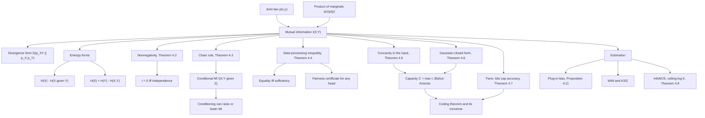

# Module 05 — Mutual Information

Entropy measures uncertainty inside one variable and KL divergence measures the gap between two
distributions. Mutual information sits between them and answers the operational question: **how many
bits does observing $Y$ save when you have to describe $X$?**

That single number has four faces — a divergence from the joint law to the product of the marginals,
two differences of entropies, and an overlap of entropy areas — and this module proves they are
equal before using any of them. The proof is short, and it is what licenses reading a channel, a
feature and a learned representation with the same instrument.

The structural result is the **data-processing inequality**: along a Markov chain
$X \to Y \to Z$ no function of $Y$ carries more about $X$ than $Y$ does, and the amount destroyed is
exactly $I(X; Y \mid Z)$. It makes channel capacity a hard ceiling rather than an engineering
target, and it makes a fairness bound proved at one layer survive every layer downstream.

The last third of the module is about measurement, because mutual information is easy to define and
hard to estimate. The plug-in estimator of two independent variables never returns zero, every
lower bound built from $K$ contrastive samples is capped at $\log K$ nats, and both failures are
measured here rather than asserted.

> [!NOTE]
> **Data-processing inequality.** If $X \to Y \to Z$ is a Markov chain then
> $I(X; Y) - I(X; Z) = I(X; Y \mid Z) \ge 0$, with equality exactly when $Z$ is a sufficient
> statistic of $Y$ for $X$. Post-processing never creates information, and the loss is an identity,
> not a bound.

## Prerequisites and downstream modules

**Prerequisites.**

- [Module 04 — KL Divergence and $f$-Divergences](../04_kl_divergence_and_f_divergences/) — the divergence whose special case mutual information is; the direct predecessor in [the module graph](../../docs/prerequisites.md).

Two earlier modules in this area are used through it and are worth having at hand:

- [Module 01 — Self-Information and Entropy](../01_self_information_and_entropy/) — entropy, differential entropy, and the binary entropy function $H_b$.
- [Module 02 — Joint and Conditional Entropy](../02_joint_and_conditional_entropy/) — the entropy chain rule, and the canonical proof of Fano's inequality cited in Theorem 4.7.

**Downstream modules unlocked by this one.**

- [Module 06 — Information Theory in Deep Learning](../06_information_theory_in_deep_learning/)

The full dependency graph is in [docs/prerequisites.md](../../docs/prerequisites.md), and the symbol
conventions used below are fixed in [docs/notation.md](../../docs/notation.md).

## Learning outcomes

After working through this module you will be able to:

- move between all four forms of $I(X; Y)$ and say which one survives the passage to continuous variables and why;
- prove nonnegativity from the tangent-line bound $\ln t \le t - 1$ and identify the equality case;
- expand a multi-feature information with the chain rule, and explain why marginal feature ranking fails on XOR;
- apply the data-processing inequality, recognize its equality case as sufficiency, and diagnose the failure when the Markov hypothesis is dropped;
- compute the capacity of the binary symmetric, binary erasure and additive white Gaussian noise channels in closed form, and of any small discrete channel by Blahut-Arimoto;
- state the concavity of $I$ in the input and use the resulting KKT conditions as an optimality certificate;
- convert bits into an accuracy ceiling with Fano, solving the inequality numerically rather than through its weakened corollary;
- prove the InfoNCE bound in the unnormalized convention and quote its $\log K$ ceiling correctly;
- prove the converse to the channel coding theorem from Fano plus the single-letter bound;
- recognize the plug-in bias, size it as $(K-1)(L-1)/(2N)$ nats, and calibrate any estimate against a permutation null.

## Concept map

## Notation

Drawn from [docs/notation.md](../../docs/notation.md).

| Symbol | Meaning | Convention |
|---|---|---|
| $H(X)$, $H(X, Y)$ | entropy, **joint** entropy | two random-variable arguments never mean cross-entropy |
| $H(Y \mid X)$ | conditional entropy | written with `\mid` |
| $H_b(p)$ | binary entropy function | $-p\log p - (1-p)\log(1-p)$ |
| $h(X)$ | differential entropy | lowercase $h$, distinct from $H$ |
| $I(X; Y)$, $I(X; Y \mid Z)$ | mutual information | semicolon between the two variables |
| $i(x; y)$ | pointwise mutual information | may be negative |
| $D_{\mathrm{KL}}(p \parallel q)$ | Kullback-Leibler divergence | `\parallel`, never a raw pipe |
| $\mathcal{X}$, $K$ | alphabet and its size | $K = \lvert \mathcal{X} \rvert$, including in Fano |
| $C = \max_{p(x)} I(X; Y)$ | channel capacity | bits per channel use unless stated |
| $\mathcal{L}_{\mathrm{NCE}}$ | InfoNCE loss | **unnormalized**: no $1/K$ in the denominator |
| bits, nats | units of $\log_2$ and $\ln$ | every numeric answer carries its unit |

One ruling deserves a second look. The InfoNCE loss is the plain $K$-way softmax cross-entropy, so
$\mathcal{L}_{\mathrm{NCE}} \ge 0$, chance level is $\log K$, and the bound reads
$I \ge \log K - \mathcal{L}_{\mathrm{NCE}}$. Inserting a $1/K$ in the denominator shifts all three
statements by $\log K$.

## Core results

| Result | Statement | Hypotheses | Where |
|---|---|---|---|
| Equivalent forms | $I = H(X) - H(X \mid Y) = H(X) + H(Y) - H(X,Y) = D_{\mathrm{KL}}(P_{XY} \parallel P_X P_Y)$ | finite entropies | Theorem 4.1, Proof 5.1 |
| Nonnegativity | $I \ge 0$, zero iff independent | none | Theorem 4.2, Proof 5.2 |
| Chain rule | $I(X_1, \ldots, X_n; Y) = \sum_i I(X_i; Y \mid X_{\lt i})$ | finite entropies | Theorem 4.3, Proof 5.3 |
| Data-processing inequality | $I(X; Y) - I(X; Z) = I(X; Y \mid Z) \ge 0$ | $X \to Y \to Z$ Markov | Theorem 4.4, Proof 5.4 |
| Concavity and convexity | $I$ concave in $p(x)$, convex in $p(y \mid x)$ | finite alphabets | Theorem 4.5, Proof 5.5 |
| Gaussian and AWGN | $I = -\tfrac{1}{2}\ln(1-\rho^2)$; $C = \tfrac{1}{2}\ln(1 + P/\sigma^2)$ nats | jointly Gaussian; $\mathbb{E}[X^2] \le P$ | Theorem 4.6, Proof 5.6 |
| Fano's inequality | $H(X \mid Y) \le H_b(P_e) + P_e \log(K-1)$ | $X \to Y \to \hat{X}$ | Theorem 4.7, proved in [Module 02](../02_joint_and_conditional_entropy/first_principles.ipynb) |
| Accuracy ceiling | $P_e \ge \left( H(X) - I(X;Y) - \log 2 \right) / \log K$ | as above | Corollary 4.7a, Proof 5.7 |
| InfoNCE bound | $I \ge \log K - \mathcal{L}_{\mathrm{NCE}}$, and the bound is at most $\log K$ | negatives drawn from $p(y)$ | Theorem 4.8, Proof 5.8 |
| Coding theorem, achievability | every rate $R \lt C$ is achievable | discrete memoryless channel | Theorem 4.9, cited not proved |
| Converse | $P_e^{(n)} \ge 1 - C/R - 1/(nR)$, so $R \le C$ | memoryless, uniform message | Theorem 4.10, Proof 5.9 |
| Plug-in bias | $\mathbb{E}[\hat{I}] = I + (K-1)(L-1)/(2N) + O(N^{-2})$ nats | fixed alphabets | Proposition 4.11, cited; measured in Section 7.2 |

## Common misconceptions

1. **"Zero correlation means zero mutual information."** With $X$ uniform on
   $\lbrace -1, 0, 1 \rbrace$ and $Y = X^2$ the correlation is exactly $0$ and
   $I(X; Y) = 0.918296$ bits. Correlation is a second-moment summary; $I$ sees the whole joint law.

2. **"Conditioning always reduces mutual information."** Theorem 4.2 says conditioning reduces
   *entropy*. For independent bits $X, Y$ with $Z = X \oplus Y$ we have $I(X; Y) = 0$ and
   $I(X; Y \mid Z) = 1$ bit, so the interaction information is negative and no three-circle diagram
   exists.

3. **"A deeper network extracts more information about the input."** For $X \to Z_1 \to Z_2$,
   Theorem 4.4 forces $I(X; Z_2) \le I(X; Z_1)$. Depth reorganizes information; a measured increase
   across layers is an estimator artefact.

4. **"Mutual information is a distance between $X$ and $Y$."** It is not a metric. The metric built
   from it is the variation of information $H(X \mid Y) + H(Y \mid X)$.

5. **"Binning gives an unbiased estimate."** The plug-in estimator carries a positive bias of about
   $(K-1)(L-1)/(2N)$ nats. Section 7.2 of the theory notebook measures the exponent as $-1.0173$
   against the predicted $-1$, and at $N = 400$ over a $10 \times 10$ table it reports
   $0.108834$ nats for variables with no dependence at all.

6. **"InfoNCE measures the mutual information of a representation."** It certifies at most
   $\log K$ nats. A batch of $256$ caps the certificate at $8$ bits however large the truth, so the
   correct sentence is "at least this much, as certified by this estimator at this batch size".

7. **"The InfoNCE loss has a $1/K$ in its denominator."** Not in this repository, and not in van den
   Oord et al. equation (4). With the $1/K$ the loss can go as low as $-\log K$ and the bound becomes
   $I \ge -\mathcal{L}_{\mathrm{NCE}}$; mixing the two conventions shifts the headline result by
   $\log K$.

8. **"Fano's corollary gives the accuracy ceiling."** The weakened form
   $P_e \ge (H(X) - I - \log 2)/\log K$ is often vacuous. Example 6.6 has it return $P_e \ge 0$ where
   the unweakened inequality returns $P_e \ge 0.189290$, an $81.07\%$ ceiling.

9. **"Capacity is achieved by the uniform input."** True for symmetric channels, false in general.
   Section 7.4 computes the capacity-achieving input of a Z-channel as $(0.5722, 0.4278)$.

## Exercise index

[`exercises.ipynb`](exercises.ipynb) contains 28 fully solved problems in four tiers. Every problem
carries a statement, a short intuition, a stepwise solution, a boxed answer, a key takeaway, and —
where the answer is numeric or algorithmic — a code cell that recomputes it and prints the check.

| Tier | Count | Coverage |
|---|---:|---|
| L0 — Concept Checks | 6 | independence, self-information, zero correlation with positive information, negative pointwise information, nats against bits, the $\min(H(X), H(Y))$ ceiling |
| L1 — Foundations | 8 | a joint table by hand, the union form, the chain rule on XOR, binary symmetric and binary erasure capacity, Gaussian information and SNR, conditioning that increases information, invariance under invertible maps |
| L2 — Applications (AI/ML and Physics) | 8 | decision-tree information gain, plug-in bias and a permutation null, the InfoNCE ceiling at two batch sizes, mRMR against relevance ranking, the data-processing inequality as a fairness certificate, MINE gradient debiasing, a thermal-noise-limited radio link, spin-spin information in the Ising chain |
| L3 — Challenge Proofs | 6 | sufficiency as the DPI equality case, Gaussian inputs maximize AWGN information, Barber-Agakov and the sample ceiling, a Fano classifier audit, the converse to the coding theorem, concavity and the capacity KKT conditions |

Tier L2 contains two genuine physics problems: the Shannon-Hartley capacity of a link whose noise
floor is thermal (Problem L2.7) and the mutual information between two spins of the
one-dimensional Ising chain, including the halving of the decay length (Problem L2.8).

## References

**Textbooks.**

- Cover, T. M. and Thomas, J. A. *Elements of Information Theory*, 2nd ed. — equivalent forms (section 2.4), the chain rule (section 2.5), the data-processing inequality and sufficiency (section 2.8), Fano's inequality (section 2.10, Theorem 2.10.1), concavity in the input and convexity in the channel (Theorem 2.7.4), the coding theorem (section 7.7, Theorem 7.7.1, pages 199-205), the converse (section 7.9), the Gaussian channel (section 9.1).
- MacKay, D. J. C. *Information Theory, Inference, and Learning Algorithms*, chapters 8 to 10 — the binary symmetric and binary erasure channels, capacity, and the noisy-channel coding theorem.
- Csiszar, I. and Koerner, J. *Information Theory: Coding Theorems for Discrete Memoryless Systems*, 2nd ed., chapter 1 — the same results with sharper finite-blocklength statements.
- Polyanskiy, Y. and Wu, Y. *Information Theory: From Coding to Learning*, chapters 2 to 6 — variational representations of divergence, including the form used in Lemma 5.8a.

**Papers.**

- Shannon, C. E. "A mathematical theory of communication", *Bell System Technical Journal* **27** (1948), 379-423 and 623-656.
- Arimoto, S. *IEEE Transactions on Information Theory* **18**(1) (1972), 14-20, and Blahut, R. *IEEE Transactions on Information Theory* **18**(4) (1972), 460-473 — the capacity iteration.
- Paninski, L. "Estimation of entropy and mutual information", *Neural Computation* **15**(6) (2003), 1191-1253, section 4 — the plug-in bias.
- Kraskov, A., Stoegbauer, H. and Grassberger, P. "Estimating mutual information", *Physical Review E* **69** (2004), 066138 — the $k$-nearest-neighbour estimator.
- Nguyen, X., Wainwright, M. J. and Jordan, M. I. *IEEE Transactions on Information Theory* **56**(11) (2010), 5847-5861 — the variational bound behind Lemma 5.8a.
- Barber, D. and Agakov, F. "The IM algorithm", *NeurIPS* (2003) — the decoder-based lower bound.
- Belghazi, M. I. et al. "MINE: mutual information neural estimation", *ICML* (2018).
- van den Oord, A., Li, Y. and Vinyals, O. "Representation learning with contrastive predictive coding", arXiv:1807.03748 (2018), equation (4) — InfoNCE in the unnormalized convention.
- Poole, B. et al. "On variational bounds of mutual information", *ICML* (2019) — Theorem 4.8 and the $\log K$ ceiling.
- McAllester, D. and Stratos, K. "Formal limitations on the measurement of mutual information", *AISTATS* (2020), Theorem 2.
- Peng, H., Long, F. and Ding, C. *IEEE TPAMI* **27**(8) (2005), 1226-1238 — mRMR.

**In this directory.**

- [`first_principles.ipynb`](first_principles.ipynb) — theory, proofs, eight worked examples, eleven executable code cells and three figures.
- [`exercises.ipynb`](exercises.ipynb) — the 28 solved problems indexed above.
