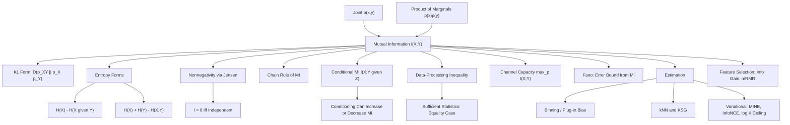

# Topic 05: Mutual Information

## 1. Master Overview

Mutual information $I(X; Y)$ measures how much knowing one variable reduces uncertainty about another. It is defined as the KL divergence between the joint distribution and the product of marginals, $I(X; Y) = D_{\mathrm{KL}}(P_{XY} \parallel P_X P_Y)$, which immediately makes it nonnegative, symmetric, and zero exactly when $X$ and $Y$ are independent. Unrolling the definition produces the equivalent forms $I(X; Y) = H(X) - H(X \mid Y) = H(Y) - H(Y \mid X) = H(X) + H(Y) - H(X, Y)$ — the same number read as "bits of uncertainty removed", "bits of prediction gained", or "bits of overlap between two descriptions".

Unlike correlation, mutual information detects *any* statistical dependence, linear or not, and it is invariant under invertible reparameterizations of either variable. That generality is what makes it the natural currency for representation learning: an encoder is judged by how much information its code retains about the input or the label, a channel by how many bits per use it can carry, a feature by how much it tells us about the target. The **data-processing inequality** — for any Markov chain $X \to Y \to Z$, $I(X; Y) \ge I(X; Z)$ — formalizes the intuition that no amount of post-processing can manufacture information, and it is the structural backbone of both Shannon's coding theorems and modern arguments about what deep networks can and cannot preserve.

The catch is estimation. Mutual information is a functional of a *joint density*, and estimating it from samples in high dimension is provably hard: plug-in histogram estimators are severely biased, $k$-nearest-neighbor (KSG) estimators degrade with dimension, and every sample-based *lower* bound built from $K$ paired examples — InfoNCE most famously — is capped at $\log K$ nats. This module derives the identities and inequalities exactly, then treats estimation honestly, because most practical confusion about mutual information in machine learning comes from trusting a number that the data could not have supported.

> [!NOTE]
> For continuous variables, $I(X; Y)$ remains well defined and finite even though the differential entropies $h(X)$ and $h(X \mid Y)$ individually depend on the choice of units — the unit-dependent constants cancel in the difference. Mutual information, not entropy, is the coordinate-free quantity in the continuous world.

## 2. First-Principles Framework

- **Phenomenon**: Two variables are observed together; sometimes one is informative about the other, sometimes not, and the dependence may be arbitrarily nonlinear.
- **Goal**: Quantify shared information in bits, in a way that is symmetric, invariant to relabeling, zero iff independent, and impossible to inflate by processing.
- **Governing Equation**: $I(X; Y) = \sum_{x, y} p(x, y)\log\frac{p(x, y)}{p(x)p(y)} = D_{\mathrm{KL}}(P_{XY} \parallel P_X P_Y)$.
- **Formulation**: Equivalent entropy forms $H(X) - H(X \mid Y)$ and $H(X) + H(Y) - H(X, Y)$; the conditional version $I(X; Y \mid Z)$; the chain rule $I(X_1, X_2; Y) = I(X_1; Y) + I(X_2; Y \mid X_1)$.
- **Consequences**: $0 \le I(X; Y) \le \min\left(H(X), H(Y)\right)$; data-processing inequality; channel capacity $C = \max_{p(x)} I(X; Y)$; Fano's inequality lower-bounding error probability; variational lower bounds (Barber–Agakov, Donsker–Varadhan/MINE, InfoNCE) used to train representations.

## 3. Mermaid Concept Map

## 4. Common Misconceptions

| Misconception | Mathematical Reality | Correct Mental Model |
|---|---|---|
| *"Zero correlation means zero mutual information."* | $Y = X^2$ with symmetric $X$ has $\mathrm{Corr} = 0$ but $I(X; Y) \gt 0$; correlation sees only the linear projection. | Correlation is a second-moment summary; MI sees the whole joint distribution. |
| *"Conditioning always reduces mutual information."* | With $X, Y$ independent bits and $Z = X \oplus Y$, $I(X; Y) = 0$ but $I(X; Y \mid Z) = 1$ bit. | Conditioning can create dependence (explaining away); only the *unconditional* average $H(X \mid Y) \le H(X)$ is monotone. |
| *"A deeper network can extract more information about the input."* | For a Markov chain $X \to Z_1 \to Z_2$, $I(X; Z_2) \le I(X; Z_1)$ — layers can only lose information. | Depth reorganizes information into a more usable format; it never creates it. |
| *"Mutual information is a distance between $X$ and $Y$."* | $I$ is not a metric on variables; the metric built from it is the variation of information $H(X \mid Y) + H(Y \mid X)$. | MI measures shared content, not separation; use variation of information when a metric is needed. |
| *"Binning the data gives an unbiased MI estimate."* | The plug-in estimator has bias $\approx \frac{(\vert \mathcal{X} \vert - 1)(\vert \mathcal{Y} \vert - 1)}{2N}$ nats — always positive, and it grows with the number of bins. | Independent variables reliably show *spurious* positive MI; correct with Miller–Madow, or shuffle to get a null baseline. |
| *"InfoNCE gives us the mutual information of a representation."* | Any lower bound based on $K$ contrastive samples cannot exceed $\log K$; a batch of 256 caps the estimate at $5.5$ nats no matter the truth. | InfoNCE is a training objective that happens to be a loose lower bound, not a measurement instrument. |
| *"Mutual information between continuous variables is just entropy difference."* | Differential entropies are coordinate-dependent and can be negative; only their difference, $I$, is invariant. | Define $I$ by the KL form; recover entropy forms only when they are well defined. |

## 5. Directory Inventory

| File | Type | Description |
|---|---|---|
| [`README.md`](README.md) | Index | Master overview, first-principles framework, concept map, misconceptions, references. |
| [`first_principles.ipynb`](first_principles.ipynb) | Theory | Definitions and equivalent forms, nonnegativity, chain rule, conditional MI, data-processing inequality, Gaussian MI and capacity, Fano, variational bounds and estimators. |
| [`exercises.ipynb`](exercises.ipynb) | Exercises | 20 fully solved problems in 4 levels: Concept Check (4), Foundation (6), Applications in AI/ML (6), Challenge (4). |

## 6. References

1. **Shannon, C. E.** (1948). *A Mathematical Theory of Communication*. Bell System Technical Journal. — Mutual information and channel capacity.
2. **Cover, T. M., & Thomas, J. A.** (2006). *Elements of Information Theory* (2nd ed.). Wiley. — Chapters 2, 7, 8: MI identities, DPI, Fano, capacity.
3. **MacKay, D. J. C.** (2003). *Information Theory, Inference, and Learning Algorithms*. Cambridge University Press. — Chapters 8–10.
4. **Kraskov, A., Stögbauer, H., & Grassberger, P.** (2004). *Estimating Mutual Information*. Physical Review E, 69, 066138. — The KSG $k$-NN estimator.
5. **Paninski, L.** (2003). *Estimation of Entropy and Mutual Information*. Neural Computation, 15(6). — Bias of plug-in estimators.
6. **Barber, D., & Agakov, F.** (2003). *The IM Algorithm: A Variational Approach to Information Maximization*. NeurIPS. — The variational MI lower bound.
7. **Belghazi, M. I., et al.** (2018). *MINE: Mutual Information Neural Estimation*. ICML. — Donsker–Varadhan estimator.
8. **van den Oord, A., Li, Y., & Vinyals, O.** (2018). *Representation Learning with Contrastive Predictive Coding*. arXiv:1807.03748. — InfoNCE.
9. **Poole, B., et al.** (2019). *On Variational Bounds of Mutual Information*. ICML. — Unified view and the $\log K$ ceiling.
10. **McAllester, D., & Stratos, K.** (2020). *Formal Limitations on the Measurement of Mutual Information*. AISTATS. — Why sample-based MI estimation is hard.
11. **Peng, H., Long, F., & Ding, C.** (2005). *Feature Selection Based on Mutual Information: mRMR*. IEEE TPAMI. — MI-based feature selection.
12. **Tishby, N., Pereira, F. C., & Bialek, W.** (1999). *The Information Bottleneck Method*. Allerton. — MI as the objective of representation compression.
