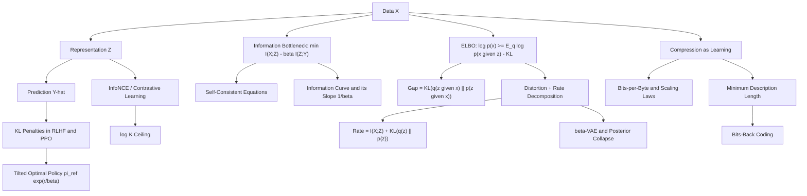

# Topic 06: Information Theory in Deep Learning

## 1. Master Overview

Modern deep learning is, to a surprising degree, applied information theory. The pretraining loss of a language model is a cross-entropy in nats per token; the regularizer of a variational autoencoder is a KL divergence in nats per sample; contrastive self-supervision optimizes a mutual-information lower bound; RLHF holds a fine-tuned policy near its reference with a KL leash; and model selection arguments from Occam to modern scaling laws are description-length arguments in disguise. This module assembles the pieces developed in Topics 01–05 into the objectives practitioners actually train.

Three organizing ideas recur. The **variational bound**: an intractable information quantity ($\log p(x)$, $I(X; Z)$, a posterior KL) is replaced by a tractable bound whose gap is itself a KL divergence, so tightening the bound and fitting the model are the same optimization. The **rate–distortion trade-off**: every objective of the form "reconstruct well while transmitting few bits" — the ELBO, $\beta$-VAE, the Information Bottleneck, neural compression — is a Lagrangian pairing a distortion term against a rate term, and the multiplier is the exchange rate between them. The **description-length view**: a model that compresses the data is a model that has learned, so negative log-likelihood is a code length, KL penalties are bits-back savings, and generalization bounds fall out of counting the bits needed to describe the hypothesis.

The Information Bottleneck deserves its own note. Tishby's formulation — find $Z$ minimizing $I(X; Z) - \beta\, I(Z; Y)$ — is a beautiful statement of what a representation *should* be: maximally predictive, minimally verbose. Its self-consistent equations, its convex information curve, and its Gaussian closed form are all derivable. Its empirical claims about deep networks (the "compression phase") remain contested, largely because of the mutual-information estimation problems catalogued in Topic 05. This module presents the theory as theory and flags the controversy honestly.

> [!NOTE]
> The KL term in a VAE, the $\beta$ of a $\beta$-VAE, and the $\beta$ of the Information Bottleneck all measure the same thing — the **rate**, in nats, of the channel from data to representation — but with different conventions for which side of the Lagrangian carries the multiplier. Always check whether $\beta$ multiplies the rate or the distortion before comparing numbers across papers.

## 2. First-Principles Framework

- **Phenomenon**: Learning systems must extract from high-dimensional data a representation that is predictive, compact, and generalizable, using objectives that are actually differentiable.
- **Goal**: Express "predictive" and "compact" as information quantities, then replace each intractable quantity with a variational bound that a network can descend.
- **Governing Equation**: the Lagrangian $\min_{p(z \mid x)} I(X; Z) - \beta\, I(Z; Y)$ (Information Bottleneck), whose generative-model shadow is $\log p(x) \ge \mathbb{E}_{q}\left[\log p(x \mid z)\right] - D_{\mathrm{KL}}\left(q(z \mid x) \parallel p(z)\right)$ (the ELBO).
- **Formulation**: Every bound gap is a KL divergence — the ELBO gap is $D_{\mathrm{KL}}(q(z \mid x) \parallel p(z \mid x))$, the InfoNCE gap closes at the optimal log-density-ratio critic, the Barber–Agakov gap is the decoder's KL error.
- **Consequences**: the average ELBO decomposes as distortion plus rate with $\text{rate} = I(X; Z) + D_{\mathrm{KL}}(q(z) \parallel p(z))$; the KL-regularized RL optimum is the tilted policy $\pi^{*} \propto \pi_{\text{ref}}e^{r/\beta}$; MDL identifies $-\log p(\mathcal{D})$ with a code length and turns compression into a generalization argument.

## 3. Mermaid Concept Map

## 4. Common Misconceptions

| Misconception | Mathematical Reality | Correct Mental Model |
|---|---|---|
| *"The ELBO's KL term measures how much information the latent carries."* | The expected KL equals $I(X; Z) + D_{\mathrm{KL}}\left(q(z) \parallel p(z)\right)$, so it *upper-bounds* the rate; the excess is the aggregate-posterior mismatch. | The KL term is a rate budget, and only part of the budget buys mutual information. |
| *"A larger $\beta$ always gives better disentanglement."* | $\beta$ prices rate; past a threshold the optimal solution collapses latent dimensions entirely, trading all structure for a zero-rate code. | $\beta$ walks the rate–distortion curve; disentanglement is a side effect over a limited range. |
| *"Deep networks provably compress — the information plane says so."* | Reported $I(X; Z)$ curves depend on binning and saturating nonlinearities; with invertible or unbounded activations $I(X; Z)$ is infinite or constant. | Compression claims are estimator claims; use the DPI for what is guaranteed and treat plane plots as hypotheses. |
| *"Minimizing description length is just another regularizer."* | MDL identifies $-\log p(\mathcal{D} \mid M) + \text{code}(M)$ with an actual achievable code length, and bits-back shows the KL term is realizable, not metaphorical. | Compression and learning are the same statement; the "regularizer" is a literal transmission cost. |
| *"The RLHF KL penalty just keeps the model from drifting."* | It defines the optimum: $\pi^{*}(y \mid x) \propto \pi_{\text{ref}}(y \mid x)\exp\left(r(x, y)/\beta\right)$, with optimal value $\beta\log Z$ — a free energy. | The penalty is not a guardrail bolted on; it selects which distribution the objective is maximized by. |
| *"Bigger contrastive batches give a better MI estimate."* | Any $K$-sample lower bound is capped at $\log K$ nats, so batch size raises a ceiling rather than sharpening a measurement. | InfoNCE is a training signal whose certified value grows logarithmically at best. |
| *"Scaling laws show loss goes to zero with enough compute."* | Fitted laws include an irreducible constant $L_\infty$ estimating the entropy rate of the data. | The floor is the data's own entropy; progress is measured in bits saved above that floor. |

## 5. Directory Inventory

| File | Type | Description |
|---|---|---|
| [`README.md`](README.md) | Index | Master overview, first-principles framework, concept map, misconceptions, references. |
| [`first_principles.ipynb`](first_principles.ipynb) | Theory | ELBO derivation and rate–distortion decomposition, Information Bottleneck and its self-consistent equations, InfoNCE optimal critic, KL-regularized RL optimum, MDL and bits-back coding, compression as learning. |
| [`exercises.ipynb`](exercises.ipynb) | Exercises | 20 fully solved problems in 4 levels: Concept Check (4), Foundation (6), Applications in AI/ML (6), Challenge (4). |

## 6. References

1. **Shannon, C. E.** (1948). *A Mathematical Theory of Communication*. Bell System Technical Journal.
2. **Cover, T. M., & Thomas, J. A.** (2006). *Elements of Information Theory* (2nd ed.). Wiley. — Chapter 10: rate–distortion theory.
3. **Tishby, N., Pereira, F. C., & Bialek, W.** (1999). *The Information Bottleneck Method*. Allerton Conference.
4. **Tishby, N., & Zaslavsky, N.** (2015). *Deep Learning and the Information Bottleneck Principle*. IEEE ITW.
5. **Shwartz-Ziv, R., & Tishby, N.** (2017). *Opening the Black Box of Deep Neural Networks via Information*. arXiv:1703.00810; and **Saxe, A. M., et al.** (2018). *On the Information Bottleneck Theory of Deep Learning*. ICLR — the rebuttal.
6. **Kingma, D. P., & Welling, M.** (2014). *Auto-Encoding Variational Bayes*. ICLR.
7. **Higgins, I., et al.** (2017). *beta-VAE: Learning Basic Visual Concepts with a Constrained Variational Framework*. ICLR.
8. **Alemi, A. A., et al.** (2017). *Deep Variational Information Bottleneck*. ICLR; and **Alemi, A. A., et al.** (2018). *Fixing a Broken ELBO*. ICML — the rate–distortion view.
9. **van den Oord, A., Li, Y., & Vinyals, O.** (2018). *Representation Learning with Contrastive Predictive Coding*. arXiv:1807.03748.
10. **Belghazi, M. I., et al.** (2018). *MINE: Mutual Information Neural Estimation*. ICML.
11. **Hinton, G. E., & van Camp, D.** (1993). *Keeping Neural Networks Simple by Minimizing the Description Length of the Weights*. COLT.
12. **Rissanen, J.** (1978). *Modeling by Shortest Data Description*. Automatica; **Grünwald, P.** (2007). *The Minimum Description Length Principle*. MIT Press.
13. **Ziegler, D. M., et al.** (2019). *Fine-Tuning Language Models from Human Preferences*. arXiv:1909.08593; **Schulman, J., et al.** (2017). *Proximal Policy Optimization Algorithms*. arXiv:1707.06347.
14. **Kaplan, J., et al.** (2020). *Scaling Laws for Neural Language Models*. arXiv:2001.08361; **Hoffmann, J., et al.** (2022). *Training Compute-Optimal Large Language Models*. NeurIPS.
