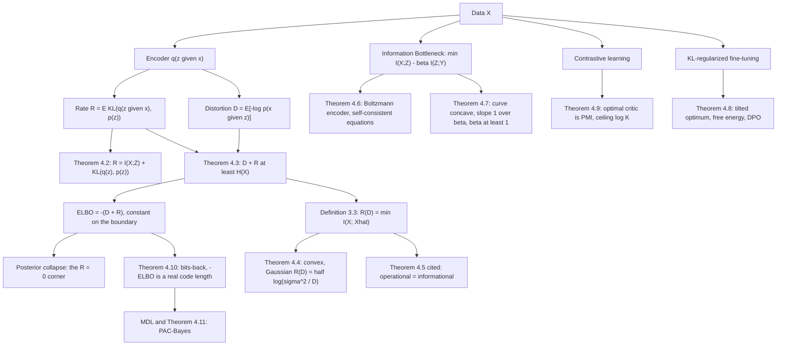

# Module 06 — Information Theory in Deep Learning

A training script reports one number, a loss in nats, and puts a regularizer beside it. This
module shows that the two are the two axes of a single trade-off, and that the trade-off has a
name: Shannon's rate-distortion function.

Two questions generate every objective here. *How many nats does this model need to describe the
data?* — cross-entropy, negative log-likelihood, description length, bits per byte. *How many
nats does this representation keep, and about what?* — mutual information, the rate of a code,
the KL term of a variational autoencoder, the InfoNCE score.

The route taken is the honest one. The rate-distortion function is defined, its convexity is
proved, and the Gaussian formula $R(D) = \tfrac12\log(\sigma^2/D)$ is proved in both directions —
converse by a maximum-entropy argument, achievability by an explicit test channel. Only the
coding theorem that connects the informational $R(D)$ to actual block codes is quoted rather than
proved, and its single-letter converse is carried out in the exercises.

Everything else is that picture applied. The evidence lower bound is $-(D + R)$, so it is
constant along the boundary $D + R = H(X)$ and cannot tell a code carrying the whole message from
one carrying nothing. The Information Bottleneck traces the same frontier with $\beta$ as
reciprocal slope. The RLHF penalty is the Gibbs variational principle with $\beta$ a temperature.
Contrastive learning estimates a density ratio and certifies at most $\log K$ nats.

> [!NOTE]
> **The feasible region.** For any encoder $q(z \mid x)$, any prior $p(z)$ and any decoder
> $p(x \mid z)$, the rate $R = \mathbb{E}_x D_{\mathrm{KL}}\left(q(z \mid x) \parallel p(z)\right)$
> and the distortion $D = \mathbb{E}\left[-\log p(x \mid z)\right]$ obey
> $D + R \ge H(X)$, and the average ELBO is exactly $-(D + R)$. The ELBO is therefore **constant**
> on the boundary line: reaching the optimum tells you the sum and nothing about where on the line
> you landed. Posterior collapse is that indifference, not an optimizer failure.

## Prerequisites and downstream modules

**Prerequisites.**

- [information_theory/05 — Mutual Information](../05_mutual_information/) — the data-processing inequality used to bound the information curve, and the InfoNCE convention.
- [probability_statistics/10 — Bayesian Inference](../../probability_statistics/10_bayesian_inference/) — posteriors, marginal likelihood and the Bayesian reading of MDL.
- [optimization/08 — Stochastic Optimization for ML](../../optimization/08_stochastic_optimization_for_ml/) — the training loop these objectives are handed to.

**Downstream modules.** This is the terminal module of the information-theory area; nothing in
the curriculum depends on it. Its results are used informally by anyone reading a modern
representation-learning or alignment paper.

The full dependency graph is in [docs/prerequisites.md](../../docs/prerequisites.md), and the
symbol conventions used below are fixed in [docs/notation.md](../../docs/notation.md).

## Learning outcomes

After working through this module you will be able to:

- decompose $\log p_\theta(x)$ into an ELBO and a KL gap, and say which component of a model each half blames;
- split a VAE's KL term into mutual information plus prior-hole waste, and compute both on a small explicit encoder;
- place any encoder-decoder pair in the $(R, D)$ plane, and explain posterior collapse as a statement about level sets;
- define Shannon's rate-distortion function, prove its convexity, and derive $R(D) = \tfrac12\log(\sigma^2/D)$ for a Gaussian source;
- run reverse water-filling on a vector source and say which components are not coded at all;
- derive the Information Bottleneck self-consistent equations, including the derivative step where the two constants cancel;
- prove the information curve is concave with slope $1/\beta$, and explain why $\beta \lt 1$ can only return the constant representation;
- solve a KL-regularized reward problem in closed form, read the answer as a Boltzmann distribution, and carry the inversion through to DPO;
- state the InfoNCE bound with the unnormalized convention, and read a contrastive loss against $\log K$ rather than zero;
- quote PAC-Bayes with its hypotheses and say which one makes the theorem false if dropped.

## Concept map

## Notation

Drawn from [docs/notation.md](../../docs/notation.md).

| Symbol | Meaning | Convention |
|---|---|---|
| $H(X)$, $H(X, Y)$ | entropy, **joint** entropy | two random-variable arguments |
| $H_{\times}(p, q)$ | cross-entropy between distributions | distinct symbol; $H_{\times} = H + D_{\mathrm{KL}}$ |
| $D_{\mathrm{KL}}(p \parallel q)$ | relative entropy | `\parallel`, never a raw pipe |
| $I(X; Z)$ | mutual information | semicolon between the variables |
| $h(X)$ | differential entropy | lowercase, distinct from $H$ |
| $R$, $D$ | rate and distortion of an encoder-decoder pair | Definition 3.2, both in nats |
| $R(D)$ | Shannon's rate-distortion function | Definition 3.3 |
| $q(z \mid x)$, $q(z)$, $p(z)$ | encoder, aggregate posterior, prior | $q(z) = \mathbb{E}_{p(x)}\left[q(z \mid x)\right]$ |
| $\mathcal{L}_{\mathrm{ELBO}}$ | evidence lower bound | $\mathbb{E}\left[\mathcal{L}_{\mathrm{ELBO}}\right] = -(D + R)$ |
| $\mathcal{L}_{\mathrm{NCE}}$, $K$ | InfoNCE loss, number of candidates | **unnormalized**; chance level $\log K$ |
| $\beta$ | Lagrange multiplier | IB: multiplies $I(Z;Y)$; RLHF: multiplies the KL |
| $\mathcal{Z}$ | partition function | value $\beta \log \mathcal{Z}$ is a free energy |

Everything in this module is in **nats**; a quantity printed in bits says so. That follows the
register's split, in which modules 01 to 03 work in bits and 05 to 06 in nats.

One collision is worth stating explicitly: $H(X, Y)$ with random-variable arguments is joint
entropy, while cross-entropy between two *distributions* is written $H_{\times}(p, q)$ here and
never $H(p, q)$.

## Core results

| Result | Statement | Hypotheses | Where |
|---|---|---|---|
| ELBO decomposition | $\log p_\theta(x) = \mathcal{L}_{\mathrm{ELBO}} + D_{\mathrm{KL}}\left(q_\phi \parallel p_\theta(\cdot \mid x)\right)$ | $q_\phi \ll p_\theta(\cdot \mid x)$ | Theorem 4.1, Proof 5.1 |
| Rate decomposition | $R = I(X; Z) + D_{\mathrm{KL}}\left(q(z) \parallel p(z)\right)$ | $q(z \mid x) \ll p(z)$ | Theorem 4.2, Proof 5.2 |
| Feasible region | $D + R \ge H(X)$; ELBO constant on the boundary | $X$ discrete, any decoder | Theorem 4.3, Proof 5.3 |
| Rate-distortion function | convex, non-increasing; Gaussian $R(D) = \tfrac12\log(\sigma^2/D)$ | squared error; $X$ Gaussian for the formula | Theorem 4.4, Proof 5.4 |
| Coding theorem | operational $R(D)$ equals the informational one | bounded distortion, i.i.d. source | Theorem 4.5 (cited) |
| IB stationarity | $p(z \mid x) \propto p(z)e^{-\beta D_{\mathrm{KL}}\left(p(y \mid x) \parallel p(y \mid z)\right)}$ | finite alphabets, $Y \to X \to Z$ | Theorem 4.6, Proof 5.5 |
| Information curve | concave, $\mathcal{I}(R) \le \min(R, I(X;Y))$, slope $1/\beta$, $\beta \ge 1$ | $Y \to X \to Z$, time-sharing available | Theorem 4.7, Proof 5.6 |
| KL-regularized optimum | $\pi^{\star} \propto \pi_{\mathrm{ref}}e^{r/\beta}$, value $\beta\log\mathcal{Z}$ | $r$ bounded, $\beta \gt 0$ | Theorem 4.8, Proof 5.7 |
| InfoNCE | $f^{\star} = \operatorname{PMI} + c(x)$; $I(X;Y) \ge \log K - \mathcal{L}_{\mathrm{NCE}}$ | negatives drawn from $p(y)$ | Theorem 4.9, Proof 5.8 |
| Bits-back | net code length $= D + R = -\mathcal{L}_{\mathrm{ELBO}}$ | non-empty auxiliary bit queue | Theorem 4.10, Proof 5.9 |
| PAC-Bayes | $L_{\mathcal{D}}(Q) \le \widehat{L}_S(Q) + \sqrt{\left(D_{\mathrm{KL}}(Q \parallel P) + \log\frac{2\sqrt{n}}{\delta}\right) / (2n)}$ | loss in $[0,1]$, prior fixed before $S$ | Theorem 4.11 (cited) |

## Common misconceptions

1. **"The ELBO's KL term measures how much information the latent carries."** It
   *upper-bounds* it. Theorem 4.2 gives
   $R = I(X; Z) + D_{\mathrm{KL}}\left(q(z) \parallel p(z)\right)$, and Example 6.2 exhibits an
   encoder whose rate is $2.10$ times the information it buys.

2. **"A good ELBO means a good representation."** The ELBO is $-(D + R)$ and is constant along
   $D + R = H(X)$. Example 6.3 works out three ELBO-optimal solutions with rates
   $0$, $0.1308$ and $0.6931$ nats; the objective cannot rank them.

3. **"Larger $\beta$ always gives better disentanglement."** $\beta$ prices rate. Past a
   threshold the optimum collapses latent dimensions entirely, and below $\beta = 1$ the
   Information Bottleneck admits nothing but the constant representation (Theorem 4.7).

4. **"$\beta \ge 1$ is enough for a non-trivial bottleneck."** It is necessary, not sufficient.
   For the four-point joint of Example 6.5 the first genuine split happens near $\beta = 2$; the
   theory notebook locates it by bisection.

5. **"The Information Bottleneck derivative is $p(x)\left[\ln\frac{p(z \mid x)}{p(z)} + 1\right]$."**
   The $+1$ from $\partial_p(p \ln p)$ is cancelled by the one coming from the $p(z)$ term. The
   correct derivative is $p(x)\ln\frac{p(z \mid x)}{p(z)}$, and Proof 5.5 Step 2 shows the
   cancellation explicitly.

6. **"Bigger contrastive batches give a better MI estimate."** They raise a ceiling. Any
   $K$-sample lower bound is capped at $\log K$ nats; on a channel with $I(X;Y) = 4.158$ nats and
   $K = 4$ the certified bound stalls at $1.354$.

7. **"$R(D) = \tfrac12\log(\sigma^2/D)$ for any source of variance $\sigma^2$."** That formula is
   exact only for the Gaussian, which is the *worst* case at fixed variance. Section 7.3 runs a
   uniform source of the same variance and finds a strictly smaller rate at every distortion.

8. **"Deep networks provably compress — the information plane says so."** Reported $I(X;Z)$
   curves depend on binning and on saturating nonlinearities; for a deterministic encoder with
   continuous input $I(X; Z)$ is infinite or constant. The data-processing conclusions survive;
   the dynamical claims do not follow from them.

9. **"PAC-Bayes bounds hold for any prior."** The prior must be fixed before the sample is seen.
   A prior fitted on the same data makes Theorem 4.11 false, not merely loose — and the loss must
   be bounded.

10. **"Scaling laws show loss goes to zero with enough compute."** Fitted laws carry an
    irreducible constant $L_{\infty}$ estimating the entropy rate of the data. Progress is
    measured in bits saved above that floor.

## Exercise index

[`exercises.ipynb`](exercises.ipynb) contains 26 problems, all fully solved, in four tiers. Every
problem carries a statement, a short intuition, a stepwise solution, a boxed answer, a key
takeaway, and — where the answer is numeric or algorithmic — a code cell that recomputes it and
prints the check.

| Tier | Count | Coverage |
|---|---:|---|
| L0 — Concept Checks | 6 | ELBO gap arithmetic, the two limits of the IB multiplier, chance-level InfoNCE, two-part codes, half a bit per halving, nats per token to bits per byte |
| L1 — Foundations | 7 | the ELBO two ways, Gaussian KL and collapse geometry, the rate decomposition, $\beta$-VAE as constrained optimization, bits-back, the optimal contrastive critic, Gaussian $R(D)$ and reverse water-filling |
| L2 — Applications (AI/ML and Physics) | 8 | RLHF KL budgets, deep VIB, contrastive batch size and temperature, scaling laws as compression, InfoGAN, weight noise as description length, Landauer's principle, the Boltzmann distribution as a KL-regularized optimum |
| L3 — Challenge Proofs | 5 | IB self-consistent equations, concavity and slope of the information curve, why every $K$-sample bound is capped, the ELBO isoline and posterior collapse, the rate-distortion converse |

Tier L2 contains two genuine physics problems: the thermodynamic floor on erasure at $300$ K
(Problem L2.7) and the two-level system whose Boltzmann populations and Helmholtz free energy come
straight out of Theorem 4.8 (Problem L2.8).

## References

**Textbooks.**

- Cover, T. M. and Thomas, J. A. *Elements of Information Theory*, 2nd ed. — Chapter 10 throughout: the rate-distortion function (section 10.2), the coding theorem (Theorem 10.2.1, p. 306), its converse (section 10.4) and achievability (section 10.5), the Gaussian formula (Theorem 10.3.2), reverse water-filling (Theorem 10.3.3) and Blahut-Arimoto (section 10.8). The maximum-entropy lemma of Proof 5.4 is Theorem 8.6.5.
- MacKay, D. J. C. *Information Theory, Inference, and Learning Algorithms* — Chapter 4 (source coding), Chapter 28 (model comparison and Occam's razor), Chapter 33 (variational methods).
- Grunwald, P. *The Minimum Description Length Principle*, MIT Press (2007) — Chapters 5 and 10, two-part codes through to normalized maximum likelihood.
- Bishop, C. M. *Pattern Recognition and Machine Learning*, section 10.1 — the variational lower bound and the exact decomposition of Theorem 4.1.
- Boyd, S. and Vandenberghe, L. *Convex Optimization*, section 5.5 — the duality and envelope argument behind Proof 5.6 Step 4.

**Papers.**

- Tishby, N., Pereira, F. C. and Bialek, W. "The information bottleneck method", *37th Allerton Conference* (1999), 368-377.
- Kingma, D. P. and Welling, M. "Auto-encoding variational Bayes", ICLR 2014, Appendix B for the Gaussian KL.
- Higgins, I. et al. "beta-VAE", ICLR 2017.
- Alemi, A. A., Fischer, I., Dillon, J. V. and Murphy, K. "Deep variational information bottleneck", ICLR 2017.
- Alemi, A. A. et al. "Fixing a broken ELBO", ICML 2018 — the $(R, D)$ plane of Theorem 4.3.
- van den Oord, A., Li, Y. and Vinyals, O. "Representation learning with contrastive predictive coding", arXiv:1807.03748 (2018), eq. (4).
- Poole, B. et al. "On variational bounds of mutual information", ICML 2019 — Theorem 4.9 and the ceiling.
- McAllester, D. and Stratos, K. "Formal limitations on the measurement of mutual information", AISTATS 2020.
- Hinton, G. E. and van Camp, D. "Keeping neural networks simple by minimizing the description length of the weights", COLT 1993.
- Townsend, J., Bird, T. and Barber, D. "Practical lossless compression with latent variables using bits back coding", ICLR 2019.
- Maurer, A. "A note on the PAC-Bayesian theorem", arXiv:cs/0411099 (2004), Theorem 5.
- Rafailov, R. et al. "Direct preference optimization", NeurIPS 2023.
- Kaplan, J. et al. "Scaling laws for neural language models", arXiv:2001.08361 (2020); Hoffmann, J. et al. "Training compute-optimal large language models", NeurIPS 2022.
- Shwartz-Ziv, R. and Tishby, N. "Opening the black box of deep neural networks via information", arXiv:1703.00810 (2017); Saxe, A. M. et al. "On the information bottleneck theory of deep learning", ICLR 2018.
- Landauer, R. "Irreversibility and heat generation in the computing process", *IBM Journal of Research and Development* **5**(3) (1961), 183-191 — Problem L2.7.

**In this directory.**

- [`first_principles.ipynb`](first_principles.ipynb) — theory, proofs, seven worked examples, twelve executable code cells and three figures.
- [`exercises.ipynb`](exercises.ipynb) — the 26 problems indexed above.
