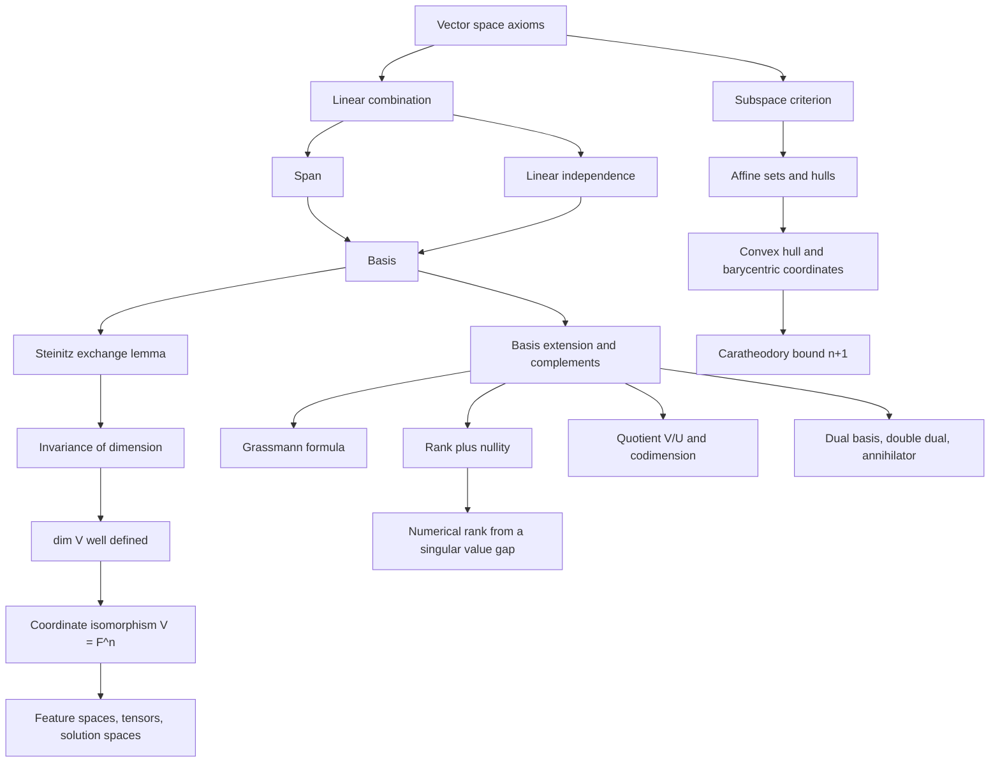

# Module 01 — Vectors, Spaces, and Subspaces

Forces add, signals add, probability distributions mix, and images brighten. A **vector space**
is the minimal axiom set that captures addition and scaling and nothing else, so that every
theorem proved from it holds at once for arrows, matrices, polynomials, solutions of a
differential equation, and the activations of a neural network.

Once the axioms are fixed, three questions remain. How much of the space can a set of vectors
reach? How much of that reaching is redundant? And how many numbers does it take to name a
point? Those are **span**, **linear independence** and **dimension**.

Dimension is the one that needs a proof. A space has many bases, and it is not obvious that they
all have the same length. This module proves that they do — by the Steinitz exchange lemma — and
only then defines the word.

Everything else follows from that count: rank and nullity, the Grassmann formula, quotients and
codimension, coordinates, dual spaces and annihilators, and the affine and convex hulls that
carry the same ideas into optimisation and probability.

> [!NOTE]
> **Invariance of dimension.** Every basis of a finite-dimensional vector space has the same
> length, so $\dim V$ is well defined. It follows from the Steinitz exchange lemma: an
> independent list is never longer than a spanning list. Rank, nullity, codimension and
> "number of degrees of freedom" are invariants of the space, not artefacts of a chosen basis.

## Prerequisites and downstream modules

**Prerequisites.**

- [mathematical_reasoning/02 — Sets, Relations and Functions](../../mathematical_reasoning/02_sets_relations_and_functions/) — set notation, injective and surjective maps, used in Definition 3.10.
- [mathematical_reasoning/03 — Proof Techniques](../../mathematical_reasoning/03_proof_techniques/) — induction, contradiction and double inclusion, used throughout Section 5.

**Downstream modules unlocked by this one.**

- [Module 02 — Linear Maps and Matrix Transformations](../02_linear_maps_and_matrix_transformations/)
- [calculus/10 — Multivariable Functions and Partial Derivatives](../../calculus/10_multivariable_functions_partials/)
- [differential_equations/03 — Second-Order Linear ODEs](../../differential_equations/03_second_order_linear_odes/)

The full dependency graph is in [docs/prerequisites.md](../../docs/prerequisites.md), and the
symbol conventions used below are fixed in [docs/notation.md](../../docs/notation.md).

## Learning outcomes

After working through this module you will be able to:

- decide whether a set is a subspace with a single closure check, and name which hypothesis fails when it is not;
- compute a span, test independence, and read a basis and a dimension off a row reduction;
- prove the Steinitz exchange lemma, and deduce from it that dimension is well defined;
- extend any independent list to a basis, extract a basis from any spanning list, and build a complement;
- apply the Grassmann formula to sums and intersections, and recognise when a sum is direct;
- prove and use $\operatorname{rank} + \operatorname{nullity} = n$ and $\dim(V/U) = \dim V - \dim U$;
- construct a dual basis and compute an annihilator, and read a hyperplane as the kernel of a functional;
- compute barycentric coordinates and apply Caratheodory's bound to a convex hull;
- read dimension numerically off a gap in the singular values, and say why counting zeros fails.

## Concept map

## Notation

Drawn from [docs/notation.md](../../docs/notation.md).

| Symbol | Meaning | Convention |
|---|---|---|
| $\mathbb{F}$, $V$, $U$, $W$ | scalar field, vector space, subspaces | $\mathbb{F}$ is $\mathbb{R}$ or $\mathbb{C}$ |
| $u$, $v$, $x$ | vectors | lowercase, always **column** vectors |
| $\alpha, \beta \in \mathbb{F}$ | scalars | |
| $\operatorname{span}(S)$ | set of all finite linear combinations | $\operatorname{span}(\emptyset) = \lbrace 0 \rbrace$ |
| $\dim V$ | dimension | length of any basis, well defined by Theorem 4.2 |
| $U + W$, $U \oplus W$ | sum, direct sum | direct means $U \cap W = \lbrace 0 \rbrace$ |
| $V/U$, $\operatorname{codim} U$ | quotient space, codimension | $\operatorname{codim} U = \dim(V/U)$ |
| $V^{\ast}$, $\varphi_i$ | dual space, dual basis | $\varphi_i(e_j) = \delta_{ij}$ |
| $U^{0}$, ${}^{0}S$ | annihilator, pre-annihilator | $U^{0} \subseteq V^{\ast}$, ${}^{0}S \subseteq V$ |
| $\operatorname{Col}(A)$, $\operatorname{Row}(A)$, $\operatorname{Null}(A)$ | column, row and null space | `\operatorname` |
| $\operatorname{rank}(A)$ | $\dim \operatorname{Col}(A)$ | equals $\dim \operatorname{Row}(A)$ by Theorem 4.7 |
| $A^{\top}$, $\lVert x \rVert$ | transpose, norm | `\top` and `\lVert ... \rVert`, never a bare pipe |
| $\operatorname{aff}(S)$, $\operatorname{conv}(S)$ | affine hull, convex hull | coefficients sum to $1$; convex adds $\alpha_i \ge 0$ |
| $V \otimes W$ | tensor product | $\dim(V \otimes W) = \dim V \cdot \dim W$ |

## Core results

| Result | Statement | Hypotheses | Where |
|---|---|---|---|
| Steinitz exchange | independent list length $\le$ spanning list length | both lists finite | Theorem 4.1, Proof 5.1 |
| Invariance of dimension | all bases have the same length | $V$ finite-dimensional | Theorem 4.2, Proof 5.2 |
| Subspace criterion | $0 \in U$ and $\alpha u + v \in U$ | none | Theorem 4.3, Proof 5.3 |
| Extension and extraction | independent extends, spanning contains, complements exist | $V$ finite-dimensional | Theorem 4.4, Proof 5.4 |
| Subspace dimension | $\dim U \le \dim V$, equality iff $U = V$ | $V$ finite-dimensional | Theorem 4.5, Proof 5.5 |
| Grassmann formula | $\dim(U+W) + \dim(U \cap W) = \dim U + \dim W$ | $U$, $W$ finite-dimensional | Theorem 4.6, Proof 5.6 |
| Rank identities | row rank $=$ column rank; $\operatorname{rank} + \operatorname{nullity} = n$ | none | Theorem 4.7, Proof 5.7 |
| Quotient dimension | $\dim(V/U) = \dim V - \dim U$ | $U$ a subspace | Theorem 4.8, Proof 5.8 |
| Coordinate isomorphism | $V \cong \mathbb{F}^n$; isomorphic iff equal dimension | same field | Theorem 4.9, Proof 5.9 |
| Duality | $\dim V^{\ast} = \dim V$, $V \cong V^{\ast\ast}$, $\dim U + \dim U^{0} = \dim V$ | $V$ finite-dimensional | Theorem 4.10, Proof 5.10 |
| Caratheodory | at most $n+1$ points suffice in $\operatorname{conv}(S)$ | $S \subseteq \mathbb{R}^n$ | Theorem 4.11, Proof 5.11 |
| Union of subspaces | $U \cup W$ is a subspace iff one contains the other | none | Proposition 4.12, Proof 5.12 |
| Hamel basis | every vector space has a basis | uses Zorn's lemma | Theorem 4.13, Proof 5.13 |

## Common misconceptions

1. **"Vectors are lists of numbers or arrows."** A vector is any element of a vector space.
   Polynomials, matrices, continuous functions and solutions of $y'' + \omega^2 y = 0$ are
   vectors, and Theorem 4.9 says a finite-dimensional example is $\mathbb{F}^n$ only *up to
   isomorphism*.

2. **"Any flat set is a subspace."** A subspace must contain the origin. The line $x + y = 1$ is
   flat and is not a subspace; it is an affine set (Definition 3.8), the coset of a subspace.

3. **"Closure under scaling is enough."** The set $\lbrace (x,y) : xy \ge 0 \rbrace$ contains $0$
   and survives every scaling, yet $(2,1) + (-1,-2) = (1,-1)$ leaves it. Theorem 4.3 asks for
   both operations, and Section 7.3 of the theory notebook runs the failure.

4. **"Span and basis are the same."** A span is a set; a basis is a minimal list producing it. A
   spanning list can be dependent, in which case the coefficients of a vector are not unique.

5. **"Dimension is the number of components."** It is the length of a basis. $\mathbb{R}^{2\times2}$
   has four entries and dimension $4$, but its symmetric part has dimension $3$ inside the same
   four entries. And dimension depends on the field: $\dim_{\mathbb{C}} \mathbb{C} = 1$ while
   $\dim_{\mathbb{R}} \mathbb{C} = 2$.

6. **"$\dim(U+W) = \dim U + \dim W$."** Only when $U \cap W = \lbrace 0 \rbrace$. Two coplanar
   planes in $\mathbb{R}^3$ give $2$, not $4$; the intersection term in Theorem 4.6 is exactly
   the correction.

7. **"Dual vectors are row vectors."** In coordinates they can be written that way, but a
   functional is a map, and the identification $V \cong V^{\ast}$ depends on a chosen basis. Only
   the double dual $V \cong V^{\ast\ast}$ is canonical (Theorem 4.10).

8. **"Numerical rank is the count of non-zero singular values."** In floating point nothing is
   exactly zero. A rank-two product of $5 \times 2$ and $2 \times 8$ Gaussian factors already has
   five non-zero singular values, and perturbing it at the $10^{-9}$ level makes
   `numpy.linalg.matrix_rank` report $5$ with its default tolerance. Dimension must be read off a
   **gap**, with a tolerance set by the noise.

## Exercise index

[`exercises.ipynb`](exercises.ipynb) contains 59 problems in four tiers, all fully solved. Every
problem carries a statement, a short intuition, a stepwise solution, a boxed answer, a key
takeaway, and — where the answer is numeric or algorithmic — a code cell that recomputes it.

| Tier | Count | Coverage |
|---|---:|---|
| L0 — Concept Checks | 8 | the zero subspace, dimensions of matrix and polynomial spaces, scaling closure, the empty span, the independence ceiling, dimension over two fields |
| L1 — Foundations | 18 | subspace verifications, spans and independence, bases and determinants, intersections, coordinates, rank and nullity, symmetric, traceless and triangular matrices, basis extension, quotients, affine hulls, barycentric coordinates, Grassmann |
| L2 — Applications (AI/ML and Physics) | 10 | centred data, the harmonic oscillator, tensor dimensions, collinear features, circuit cycle spaces, gauge freedom, the probability simplex, bottleneck layers, coupled-mass normal modes, subspace recovery by SVD |
| L3 — Challenge Proofs | 23 | symmetric-skew splitting, hyperplanes, direct sums, sequence spaces, Newton bases, orthogonal complements, invariant lines, rank subadditivity, the modular law, unions of subspaces, finite covers, codimension of intersections, common complements, nilpotent chains, commuting matrices, singular matrix subspaces, double annihilators, field extensions, integral-free functions, dense subspaces, the Grassmannian, RKHS point evaluation, flag manifolds |

Tier L2 contains four genuine physics problems: the solution space of a harmonic oscillator
(Problem L2.2), the cycle space of a circuit under Kirchhoff's current law (Problem L2.5), gauge
freedom in a discrete potential (Problem L2.6), and the normal modes of two coupled masses
(Problem L2.9).

## References

**Textbooks.**

- Axler, S. *Linear Algebra Done Right*, 3rd ed. — section 1.C (subspaces and sums), section 2.A (span and independence, Theorem 2.23), section 2.C (dimension, Theorem 2.43 for the dimension of a sum), section 3.E (products and quotients), section 3.F (duality, dual bases, annihilators).
- Halmos, P. R. *Finite-Dimensional Vector Spaces*, 2nd ed. — sections 5 to 8 (dependence, bases, dimension), sections 10 to 12 (subspaces), sections 13 to 17 (dual spaces, dual bases, reflexivity, annihilators), sections 18 to 22 (direct sums, quotient spaces).
- Halmos, P. R. *Naive Set Theory*, section 16 — Zorn's lemma, the input to Theorem 4.13.
- Strang, G. *Linear Algebra and Learning from Data*, section I.3 — the four fundamental subspaces and the rank identities read off a factorization $A = CR$.
- Boyd, S. and Vandenberghe, L. *Introduction to Applied Linear Algebra*, chapter 1 (vectors) and chapter 5 (linear independence, basis, the independence-dimension inequality).
- Horn, R. A. and Johnson, C. R. *Matrix Analysis*, 2nd ed., section 0.1 (vector spaces, span, independence, basis) and section 0.4 (rank identities).
- Trefethen, L. N. and Bau, D. *Numerical Linear Algebra*, Lecture 1 (range, null space, rank) and Lecture 5 (the SVD and numerical rank).
- Rockafellar, R. T. *Convex Analysis*, section 2 (affine sets and hulls) and section 17 (Theorem 17.1, Caratheodory's theorem).
- Boyd, S. and Vandenberghe, L. *Convex Optimization*, section 2.1 (affine and convex sets, hulls, the simplex).

**Papers.**

- Edelman, A. "Eigenvalues and condition numbers of random matrices", *SIAM Journal on Matrix Analysis and Applications* **9**(4) (1988), 543-560 — the $n^{-1/2}$ scaling measured in Section 7.4 of the theory notebook.
- Blass, A. "Existence of bases implies the axiom of choice", *Contemporary Mathematics* **31** (1984), 31-33 — the converse to Theorem 4.13.
- Dieudonne, J. "Sur une generalisation du groupe orthogonal a quatre variables", *Archiv der Mathematik* **1** (1948), 282-287 — the bound $\dim W \le n^2 - n$ quoted in Problem L3.16.
- Aronszajn, N. "Theory of reproducing kernels", *Transactions of the American Mathematical Society* **68** (1950), 337-404, section I.2 — the reproducing property used in Problem L3.22.

**In this directory.**

- [`first_principles.ipynb`](first_principles.ipynb) — theory, thirteen numbered results with full proofs, six worked numerical examples, eleven executable code cells and three figures.
- [`exercises.ipynb`](exercises.ipynb) — the 59 solved problems indexed above.
