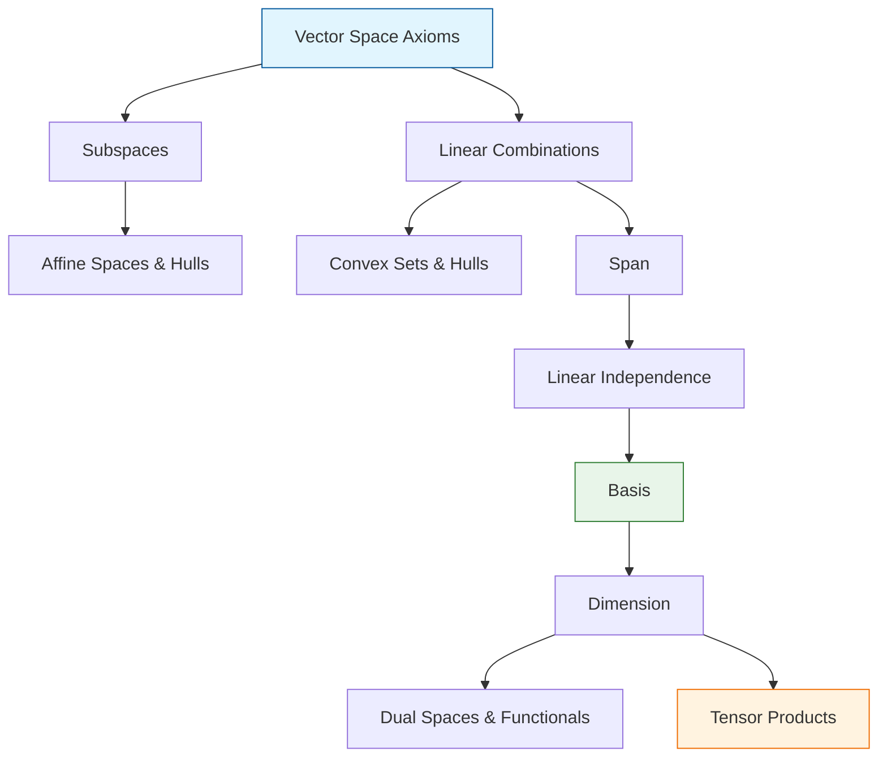

# Topic 01: Vectors, Spaces, and Subspaces

## Master Overview

The concept of a **Vector Space** provides the mathematical stage upon which all of linear algebra is performed. At its core, linear algebra is not merely about grids of numbers (matrices) or arrows in 3D space, but about abstractions of *linearity*.

A vector space (or linear space) is defined by its closure under two fundamental operations: **vector addition** and **scalar multiplication**. If you can scale an object and add two objects together without leaving the set, and these operations follow natural algebraic rules, that set is a vector space.

From this foundation, we identify **subspaces** (spaces living within spaces), **span** (the reach of a set of vectors), **linear independence** (the absence of redundancy), **basis** (a minimal generating set), and **dimension** (the size or capacity of the space).

These ideas extend far beyond geometric arrows: they govern signals, polynomials, functions, and the high-dimensional embeddings found in modern artificial intelligence and machine learning.

## Core Pillars Table

| Concept | Mathematical Definition | Geometric Intuition | AI / ML Application |
| :--- | :--- | :--- | :--- |
| **Vector Space $V$** | A set closed under addition and scalar multiplication satisfying 8 axioms. | The "universe" of valid points or directions. | The feature space or embedding space where representations live. |
| **Subspace $U \subseteq V$** | A subset of $V$ that is itself a vector space. | A flat plane or line passing through the origin. | Constrained manifolds, e.g., the span of principal components (PCA). |
| **Span** | $\text{span}(S) = \left\{ \sum_{i} c_i v_i \mid v_i \in S, c_i \in \mathbb{F} \right\}$ | The set of all reachable points using combinations of given vectors. | The representational capacity of a set of basis features or weights. |
| **Linear Independence** | $\sum_{i} c_i v_i = 0 \implies c_i = 0$ for all $i$. | No vector lies in the span of the others; no redundant directions. | Non-redundant features; full-rank covariance matrices. |
| **Basis & Dimension** | A linearly independent spanning set. Its size is the dimension. | The minimal set of axes needed to describe the entire space. | The intrinsic dimensionality of data (e.g., latent space in autoencoders). |
| **Dual Space $V^*$** | The space of all linear functionals from $V$ to the scalar field. | Hyperplanes or contour lines acting on vectors. | Gradient vectors, covectors, and the backpropagation of error signals. |

## First-Principles Framework

This topic is structured rigorously through the **First-Principles Framework**, systematically taking the reader from the physical/geometric observation of proportionality and superposition to formal axiomatic definitions, culminating in high-dimensional tensor representations used in deep learning.

We cover the transition from finite to infinite dimensions, examining affine hulls, convex hulls, and barycentric coordinates along the way.

## Concept Map

## Common Misconceptions

1. **"Vectors are just lists of numbers or arrows."**

   > **Correction:** Vectors are *any* objects belonging to a vector space. They can be functions, matrices, polynomials, or probability distributions, as long as addition and scalar multiplication are well-defined.

2. **"Any plane or line is a subspace."**

   > **Correction:** A subspace *must* contain the zero vector (the origin). A plane not passing through the origin is an *affine space*, not a subspace.

3. **"Span and Basis are the same thing."**

   > **Correction:** A span is the set of all possible linear combinations. A basis is a *specific choice* of linearly independent vectors that generates that span.

4. **"Dimension is just the number of components."**

   > **Correction:** Dimension is the cardinality of a basis. For example, the space of $2 \times 2$ matrices has vectors with 4 components, and its dimension is 4, but it is not $\mathbb{R}^4$ itself (though it is isomorphic to it).

5. **"Dual spaces are just the space of row vectors."**

   > **Correction:** In finite dimensions with an inner product, dual vectors can be represented as row vectors (via the Riesz Representation Theorem). But conceptually, dual spaces consist of *functions* (linear functionals) acting on vectors.

## Literature References

This module synthesizes concepts from benchmark literature in linear algebra, numerical analysis, and machine learning:

- **Sheldon Axler**, *Linear Algebra Done Right* (Chapter 1: Vector Spaces, Chapter 2: Finite-Dimensional Vector Spaces)
- **Gilbert Strang**, *Introduction to Linear Algebra* & *Linear Algebra and Learning from Data* (Chapter 1)
- **Stephen Boyd & Lieven Vandenberghe**, *Applied Linear Algebra* (Chapter 1)
- **Lloyd N. Trefethen & David Bau III**, *Numerical Linear Algebra* (Part I)
