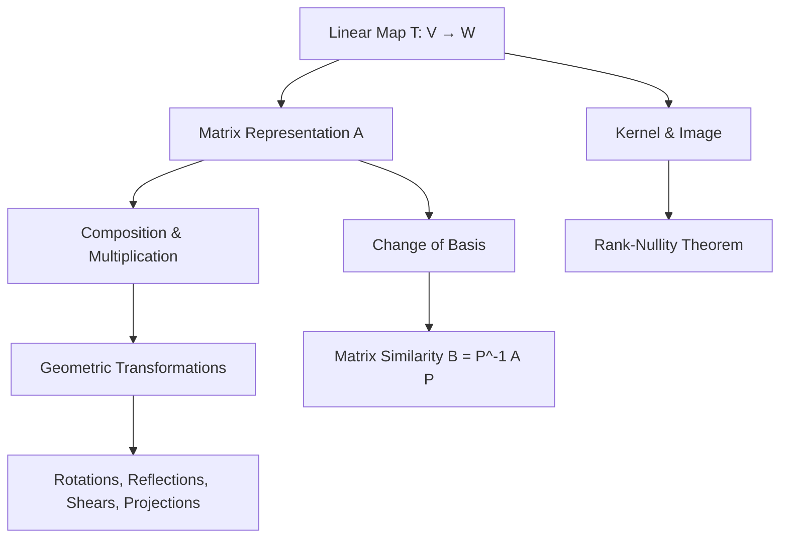

# Topic 02: Linear Maps and Matrix Transformations

## Master Overview

Linear maps (or linear transformations) are the core morphisms of vector spaces—functions that preserve vector addition and scalar multiplication. 

When vector spaces are finite-dimensional, these abstract operators can be uniquely represented by matrices, bridging profound algebraic theory with robust computational methods. 

This module establishes the foundations of linear transformations, exploring their defining properties, matrix representations, fundamental spaces (kernel and image), and the geometry of transformations.

## First-Principles Framework

The journey from phenomenon to AI application:

1. **Phenomenon**: Geometric transformations, coordinate changes, and feature space mappings.
2. **Assumptions**: Superposition holds (linearity).
3. **Variables**: Vectors $\mathbf{x}$, matrices $A$, basis vectors $\mathbf{v}_i$.
4. **Governing Principles**: Preservation of vector space structure ($T(c\mathbf{x} + \mathbf{y}) = cT(\mathbf{x}) + T(\mathbf{y})$).
5. **Mathematical Formulation**: $T: V \to W$, mapped to $A \in \mathbb{R}^{m \times n}$.
6. **Computation**: Matrix-vector multiplication, matrix multiplication for composition.
7. **Verification**: Rank-Nullity Theorem ($\dim(\ker T) + \dim(\text{im} T) = \dim(V)$).
8. **Real-World Application**: Computer graphics, robotics kinematics, structural engineering.
9. **AI Connection**: Neural network weight matrices, attention mechanisms, dimensionality reduction (PCA).

## Concept Map

## Core Pillars

| Concept | Definition | Mathematical Representation |
| :--- | :--- | :--- |
| **Linear Map** | A function preserving vector operations. | $T(c\mathbf{u} + \mathbf{v}) = cT(\mathbf{u}) + T(\mathbf{v})$ |
| **Matrix Representation** | Array of scalars defining $T$ given bases. | $[T(\mathbf{x})]_C = [T]_{B \to C} [\mathbf{x}]_B$ |
| **Kernel (Nullspace)** | Vectors mapped to the zero vector. | $\ker T = \{ \mathbf{v} \in V \mid T(\mathbf{v}) = \mathbf{0} \}$ |
| **Image (Column Space)** | The set of all possible outputs. | $\text{im} T = \{ T(\mathbf{v}) \mid \mathbf{v} \in V \}$ |
| **Similarity** | Matrices representing the same map in different bases. | $B = P^{-1} A P$ |

## Common Misconceptions

1. **Mistaking the map for the matrix**: A linear map is an abstract operator; a matrix is merely its representation in a specific basis.
2. **Changing basis vs. transforming vectors**: $P^{-1}AP$ changes the viewpoint, whereas $A\mathbf{x}$ physically moves the vector in the current coordinate system.
3. **Confusing left and right multiplication**: Applying maps sequentially as $T \circ S$ corresponds to matrix multiplication $AB$, where $B$ (representing $S$) acts first.

## Literature References

- **Strang, G.** *Introduction to Linear Algebra* (Ch. 7: Linear Transformations)
- **Axler, S.** *Linear Algebra Done Right* (Ch. 3: Linear Maps)
- **Horn, R. A., & Johnson, C. R.** *Matrix Analysis* (Ch. 1: Eigenvalues, Eigenvectors, and Similarity)
