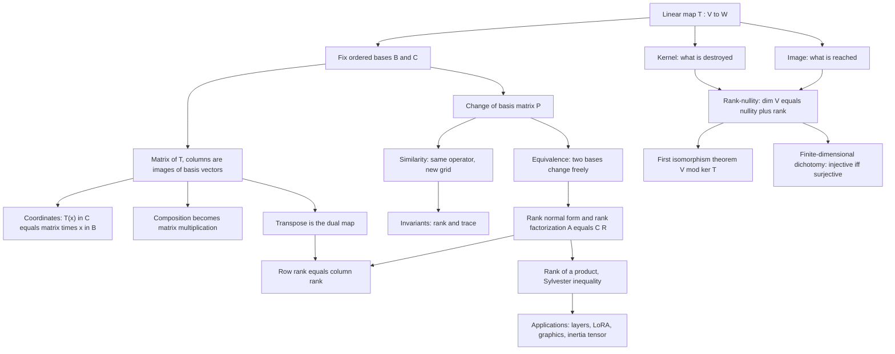

# Module 02 — Linear Maps and Matrix Transformations

A vector space is a set with two operations. A **linear map** is a function between two such sets
that respects both, and it is the only kind of function linear algebra studies.

Singling them out buys economy. A linear map on an $n$-dimensional space is pinned down by what it
does to $n$ basis vectors, so an object defined on infinitely many inputs is stored as $mn$
numbers — a matrix.

This module builds the dictionary between maps and matrices and proves it is a perfect
dictionary: the correspondence $T \mapsto [T]_{C,B}$ is an isomorphism of vector spaces, it turns
composition into matrix multiplication, and it makes matrix multiplication a forced definition
rather than a convention.

The rest of the module asks what survives a change of basis. Two normal forms answer it:
similarity for operators, where rank and trace are invariant, and equivalence for maps, where only
the rank survives. Rank-nullity, the first isomorphism theorem and the transpose-as-dual-map all
fall out of the same construction.

> [!NOTE]
> **Representation theorem.** Fixing ordered bases $B$ of $V$ and $C$ of $W$ makes
> $T \mapsto [T]_{C,B}$ an isomorphism $\mathcal{L}(V,W) \cong \mathbb{F}^{m \times n}$ with
> $[T(x)]_C = [T]_{C,B}[x]_B$ and $[S \circ T]_{C,A} = [S]_{C,B}[T]_{B,A}$. The isomorphism is
> basis-dependent, never canonical.

## Prerequisites and downstream modules

**Prerequisites.**

- [Module 01 — Vectors, Spaces and Subspaces](../01_vectors_spaces_and_subspaces/) — bases, dimension, the basis extension theorem, quotient spaces and dual spaces.

**Downstream modules unlocked by this one.**

- [Module 03 — Linear Systems and Direct Factorizations](../03_linear_systems_and_direct_factorizations/)
- [Module 05 — Determinants, Trace and Matrix Polynomials](../05_determinants_trace_and_matrix_polynomials/)
- [calculus_optimization/01 — Derivatives and Gradients for ML](../../calculus_optimization/01_derivatives_and_gradients_for_ml/)
- [optimization/05 — Constrained Optimization and Lagrange Multipliers](../../optimization/05_constrained_optimization_lagrange/)
- [graph_theory/01 — Graph Fundamentals and Representations](../../graph_theory/01_graph_fundamentals_and_representations/)

The full dependency graph is in [docs/prerequisites.md](../../docs/prerequisites.md), and the
symbol conventions used below are fixed in [docs/notation.md](../../docs/notation.md).

## Learning outcomes

After working through this module you will be able to:

- test a candidate map against both axioms of linearity, and produce a map that satisfies one and fails the other;
- write down $[T]_{C,B}$ for a map between two spaces with non-standard bases on both sides, and evaluate $T$ through it;
- prove that composition of maps is multiplication of matrices, and say exactly which hypothesis makes the middle basis cancel;
- prove rank-nullity from a basis adapted to the kernel, and use it to count the dimension of an image or a null space;
- prove the first isomorphism theorem $V/\ker T \cong \operatorname{im} T$ and recover rank-nullity from it;
- decide invertibility in equal finite dimensions from injectivity alone, and exhibit the infinite-dimensional counterexample;
- convert between $[T]_B$ and $[T]_{B'}$ by conjugation, and name the invariants that survive;
- produce the rank normal form $A = P\Sigma_r Q$ and the rank factorization $A = CR$, and read row rank equals column rank off them;
- bound the rank of a product from both sides, including Sylvester's inequality;
- identify the transpose as the matrix of the dual map, and place the four fundamental subspaces as orthogonal complements.

## Concept map

## Notation

Drawn from [docs/notation.md](../../docs/notation.md).

| Symbol | Meaning | Convention |
|---|---|---|
| $T \in \mathcal{L}(V, W)$ | linear map, and the space of them | declared exception: $\mathcal{L}$ is the Lagrangian elsewhere |
| $B = (v_1, \ldots, v_n)$ | ordered basis | a tuple, not a set: the order fixes the columns |
| $[x]_B$ | coordinate vector of $x$ | a column in $\mathbb{F}^n$ |
| $[T]_{C,B}$ | matrix of $T$ from $B$ to $C$ | column $j$ is $[T(v_j)]_C$; $[T]_B$ when $C = B$ |
| $\ker T$, $\operatorname{im} T$ | kernel and image | $\operatorname{Null}(A)$, $\operatorname{Col}(A)$ for matrices |
| $\operatorname{rank}$, $\operatorname{nullity}$ | $\dim \operatorname{im} T$, $\dim \ker T$ | $\operatorname{rank}(A) = \dim \operatorname{Col}(A)$ |
| $\operatorname{Row}(A)$ | row space | $\operatorname{Col}(A^{\top})$ |
| $A^{\top}$ | transpose | `\top`, never `^T` |
| $P = [\operatorname{id}]_{B,B'}$ | change-of-basis matrix | column $j$ is $[v'_j]_B$ |
| $A' = P^{-1} A P$ | similar matrices | one operator, two bases |
| $A' = PAQ$ | equivalent matrices | one map, two independent basis changes |
| $\Sigma_r$ | rank normal form | $I_r$ in the corner, zeros elsewhere |
| $V'$, $T'$ | dual space, dual map | $T'(g) = g \circ T$ |
| $\lVert A \rVert_{\mathrm{op}}$ | operator norm | $\max_{\lVert x \rVert_2 = 1} \lVert Ax \rVert_2$ |

## Core results

| Result | Statement | Hypotheses | Where |
|---|---|---|---|
| Representation theorem | $T \mapsto [T]_{C,B}$ is an isomorphism onto $\mathbb{F}^{m \times n}$ | same field, finite dimension, ordered bases | Theorem 4.1, Proof 5.1 |
| Composition | $[S \circ T]_{C,A} = [S]_{C,B}[T]_{B,A}$ | the same middle basis $B$ on both factors | Theorem 4.2, Proof 5.2 |
| Rank-nullity | $\dim V = \dim \ker T + \dim \operatorname{im} T$ | $\dim V$ finite | Theorem 4.3, Proof 5.3 |
| First isomorphism theorem | $V/\ker T \cong \operatorname{im} T$ | none beyond linearity | Theorem 4.4, Proof 5.4 |
| Dichotomy | injective, surjective, bijective and invertible coincide | $\dim V = \dim W$ finite | Theorem 4.5, Proof 5.5 |
| Change of basis | $[T]_{B'} = P^{-1}[T]_B P$; rank and trace invariant | one operator, one space | Theorem 4.6, Proof 5.6 |
| Rank normal form | $A = P \Sigma_r Q$; row rank equals column rank; $A = CR$ | none | Theorem 4.7, Proof 5.7 |
| Rank of a product | $\operatorname{rank} A + \operatorname{rank} B - n \le \operatorname{rank}(AB) \le \min$ | product defined | Theorem 4.8, Proof 5.8 |
| Dual map | $[T']_{B^{\star},C^{\star}} = [T]_{C,B}^{\top}$, equal ranks | finite dimension | Theorem 4.9, Proof 5.9 |
| Four subspaces | $\operatorname{Row}(A) = \operatorname{Null}(A)^{\perp}$ and its three partners | real entries, standard inner product | Proposition 4.10, Proof 5.10 |
| Neumann series | $(I-A)^{-1} = \sum_k A^k$ with geometric truncation error | $\lVert A \rVert_{\mathrm{op}} \lt 1$ | Proposition 4.11, Proof 5.11 |

## Common misconceptions

1. **"A matrix is a linear map."** A matrix is a linear map *plus a choice of two bases*. Change
   the bases and every entry changes while the map does not; Example 6.1 does this on a
   $2 \times 2$.

2. **"The isomorphism $\mathcal{L}(V,W) \cong \mathbb{F}^{m \times n}$ is canonical."** It is
   basis-dependent, and there is no basis-free version. Only the relation between two such
   isomorphisms — conjugation by $P$ — is canonical.

3. **"$T(0) = 0$ makes a map linear."** The Euclidean norm satisfies it and is not linear
   (Problem L0.4). Additivity alone does not suffice either: complex conjugation on $\mathbb{C}$
   is additive and not homogeneous (Problem L0.7).

4. **"$[S \circ T] = [S][T]$ always."** Only when the same basis of the middle space is used on
   both factors. Section 7.3 of the theory notebook mixes two bases and measures an error of order
   one — not a rounding effect.

5. **"An injective operator on a space might fail to be surjective."** Impossible when
   $\dim V = \dim W \lt \infty$. On the space of all polynomials $p \mapsto xp$ is injective and
   not surjective, and Section 7.3 runs it.

6. **"Similar and equivalent are the same thing."** Similarity uses one basis change,
   $A' = P^{-1}AP$, and preserves rank and trace. Equivalence uses two independent ones,
   $A' = PAQ$, and preserves only the rank — which is exactly the classification of
   Theorem 4.7.

7. **"An idempotent $T^2 = T$ splits the space orthogonally."** It splits it, but obliquely in
   general: $\left[\begin{smallmatrix}1 & 1 \\ 0 & 0\end{smallmatrix}\right]$ has kernel and image
   meeting at $45$ degrees. Orthogonality is the extra hypothesis $T = T^{\top}$ (Problem L3.2).

8. **"Row rank equals column rank is obvious."** It is a theorem, and the proof needs the rank
   normal form or the dual map. Proof 5.7 gets it from $A = P\Sigma_r Q$ in two lines, and Proof
   5.10 then uses it to place the four subspaces.

## Exercise index

[`exercises.ipynb`](exercises.ipynb) contains 46 fully solved problems in four tiers. Every one
carries a statement, a short intuition, a stepwise solution, a boxed answer, a key takeaway, and a
code cell that recomputes the answer and prints the check.

| Tier | Count | Coverage |
|---|---:|---|
| L0 — Concept Checks | 7 | affine maps, the identity matrix, columns as images, the norm, a shear, change of basis, additive but not homogeneous |
| L1 — Foundations | 18 | reflections, kernel and image bases, rank-nullity, matrices in non-standard bases on one and both sides, composition, the derivative and integration operators, invertibility, projections, transposition, the trace functional, similarity, invariant lines, dual bases, rank of a product |
| L2 — Applications (AI/ML and Physics) | 8 | rank-deficient weights, homogeneous coordinates, contractive layers, LoRA parameter counts, Lipschitz constants, layer Jacobians, Lorentz boosts, the inertia tensor |
| L3 — Challenge Proofs | 13 | nilpotent chains, idempotent splittings, similarity invariants, the commutator obstruction, Sylvester's inequality, Fitting's lemma, commuting operators, resolutions of the identity, the Woodbury identity, orthogonal maps, $AB$ against $BA$, Kronecker traces, factoring through a quotient |

Tier L2 contains two genuine physics problems: composing Lorentz boosts by adding rapidities
(Problem L2.7) and the inertia tensor under a change of frame (Problem L2.8).

## References

**Textbooks.**

- Axler, S. *Linear Algebra Done Right*, 3rd ed. — section 3.A (linear maps and $\mathcal{L}(V,W)$), section 3.B (null space, range, and the Fundamental Theorem of Linear Maps 3.22), section 3.C (matrices, and $\dim \mathcal{L}(V,W) = mn$), section 3.D (invertibility and isomorphisms), section 3.E (products and quotients, with the first isomorphism theorem), section 3.F (duality and column rank equals row rank).
- Hoffman, K. and Kunze, R. *Linear Algebra*, 2nd ed. — sections 3.1-3.4 (linear transformations, the algebra of maps, isomorphism, representation by matrices), section 3.7 (the transpose of a linear transformation).
- Horn, R. A. and Johnson, C. R. *Matrix Analysis*, 2nd ed. — section 0.2 (matrix representations and change of basis), section 0.4 (rank and rank inequalities, including Sylvester's), section 0.7.3 (equivalence and the rank normal form).
- Meyer, C. D. *Matrix Analysis and Applied Linear Algebra* — section 3.8 (flop counts), section 4.7 (rank normal form and matrix equivalence), section 4.8 (the four fundamental subspaces).
- Strang, G. *Linear Algebra and Learning from Data* — section I.1 ($A = CR$ and the equality of row and column rank), section I.9 (linear maps in learning).
- Trefethen, L. N. and Bau, D. *Numerical Linear Algebra* — Lecture 1 (matrix-vector multiplication as a linear map on the columns), Lecture 3 (operator norms and submultiplicativity).

**In this directory.**

- [`first_principles.ipynb`](first_principles.ipynb) — theory, eleven numbered results with full proofs, seven worked numerical examples, ten executable code cells and three figures.
- [`exercises.ipynb`](exercises.ipynb) — the solved problems indexed above.
