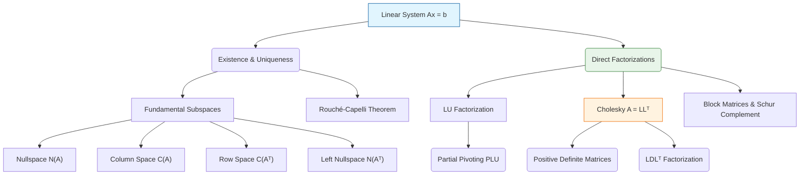

# Topic 03: Linear Systems and Direct Factorizations

## Master Overview

Solving the linear system $Ax = b$ is the fundamental problem of numerical linear algebra. This topic explores the theoretical conditions for solvability (the Fundamental Theorem of Linear Algebra and Rouché-Capelli), the geometric meaning of the four fundamental subspaces, and the primary algorithmic methods for direct solution (LU, PLU, Cholesky, and $LDL^T$ factorizations). By understanding matrix factorizations, we shift from abstract equation-solving to structured data decomposition, a perspective crucial for modern machine learning, optimization, and scientific computing.

## First-Principles Framework

The journey from physical observation to computational solve and AI application:

1. **Phenomenon**: Interacting linear equations and systems of physical/data balances where observed outcomes are linear combinations of unknown variables.

2. **Goal**: Solve $Ax = b$ efficiently and stably for $x \in \mathbb{R}^n$, or factor $A$ into simpler structural matrices (triangular, diagonal, or permutation).

3. **Assumptions**: Linearity holds; coefficients $A$ are static; calculations use floating-point arithmetic requiring numerical pivoting.

4. **Variables & Parameters**: System matrix $A \in \mathbb{R}^{m \times n}$, state vector $x \in \mathbb{R}^n$, target vector $b \in \mathbb{R}^m$, factor matrices $L, U, P, D$.

5. **Governing Principles**: **Decomposition** (reducing dense operations to triangular solves) and **Orthogonal Complementarity** ($\text{N}(A) = \text{C}(A^T)^\perp$).

6. **Mathematical Formulation**: $Ax = b$, $PA = LU$, $A = LL^T$, and $A = LDL^T$.

7. **Computation**: Triangular forward/backward substitution ($O(n^2)$) following elimination ($O(n^3)$).

8. **Verification**: Residual check $\|b - Ax\| / \|b\| \approx \epsilon_{\text{mach}}$, condition number $\kappa(A) = \|A\|\|A^{-1}\|$, Sylvester's criterion for SPD matrices.

9. **Real-World Application**: Finite element analysis (FEA) stiffness solves, electric circuit analysis, structural stress modeling.

10. **AI Connection**: Gaussian process inference (Cholesky of kernel matrices), second-order optimization (Hessian solves $H \Delta \theta = -g$), block matrix inversion via Schur complement in neural network architectures.

## Mermaid Concept Map

## Core Pillars Table

| Concept | Mathematical Meaning | Computational Implication | AI & ML Connection |
| :--- | :--- | :--- | :--- |
| **Solvability** | $b \in \text{C}(A)$ | Determines if exact solution exists or least-squares is needed. | Basis for linear regression and feature representation. |
| **Four Subspaces** | $\text{N}(A) = \text{C}(A^T)^\perp$ | Defines the structure of solutions and transformations. | SVD, dimensionality reduction, feature extraction. |
| **LU Factorization** | $A = LU$ | Solves $Ax = b$ in $\approx \frac{2}{3}n^3$ flops via triangular solves. | Forward/backward passes in simple networks, preconditioning. |
| **PLU Factorization** | $PA = LU$ | Ensures numerical stability via partial pivoting. | Robust numerical routines in deep learning libraries. |
| **Cholesky** | $A = LL^T$ | Exploits symmetry & positive definiteness in $\approx \frac{1}{3}n^3$ flops. | Gaussian processes, Kalman filters, Hessian approximations. |
| **Schur Complement** | $S = D - CA^{-1}B$ | Arises in block matrix inversion and elimination. | Gaussian conditioning, graph neural network propagation. |

## Common Misconceptions

1. **Misconception:** $Ax = b$ should be solved by computing $A^{-1}b$.
   
   *Correction:* Computing $A^{-1}$ explicitly is numerically unstable and computationally wasteful ($\frac{8}{3}n^3$ flops via LU inversion or $2n^3$ via Gauss-Jordan vs $\frac{2}{3}n^3$ for direct LU solve). We factor $A = LU$ and solve two triangular systems instead.

2. **Misconception:** The left nullspace $\text{N}(A^T)$ is the same as the nullspace $\text{N}(A)$.
   
   *Correction:* They exist in different spaces. $\text{N}(A) \subseteq \mathbb{R}^n$ while $\text{N}(A^T) \subseteq \mathbb{R}^m$.

3. **Misconception:** Any symmetric matrix has a Cholesky factorization.
   
   *Correction:* The matrix must be Symmetric Positive Definite (SPD). If it is only indefinite symmetric, $LDL^T$ with pivoting or other methods are required.

4. **Misconception:** Pivoting is only needed when a diagonal element is exactly zero.
   
   *Correction:* Pivoting is required for numerical stability when a pivot is very small (not just zero) to avoid catastrophic cancellation and round-off amplification.

## Literature References

- **Strang, G.** *Introduction to Linear Algebra* (5th ed., Ch. 2-3). Intuition for solving systems, Gauss elimination, and the four fundamental subspaces.

- **Golub, G. H., & Van Loan, C. F.** *Matrix Computations* (4th ed., Ch. 3). Rigorous treatment of LU, Cholesky, pivoting, and stability analysis.

- **Trefethen, L. N., & Bau, D.** *Numerical Linear Algebra* (Lectures 20-23). Geometric insights into Gaussian elimination and conditioning.

- **Boyd, S., & Vandenberghe, L.** *Applied Linear Algebra* (Ch. 11). Practical implications of direct factorizations in optimization.

