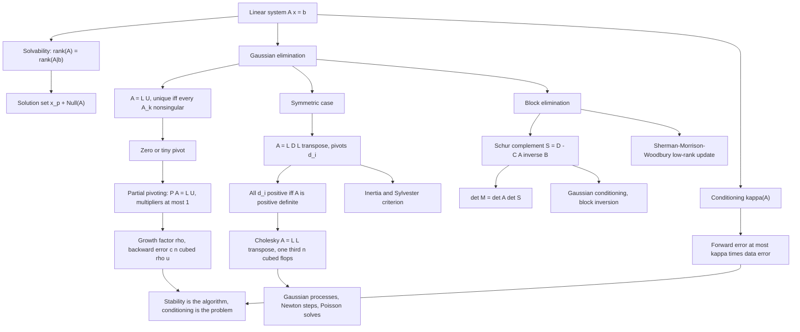

# Module 03 — Linear Systems and Direct Factorizations

Almost every quantitative model ends at the same line of code: solve $Ax = b$. Regression,
Newton steps, Kalman updates, finite-element stress, Gaussian-process inference and graph
diffusion all reduce to it.

Two questions come before any arithmetic. Does a solution exist, and is it unique? Both are
settled by comparing the rank of $A$ with the rank of the augmented matrix $[A \mid b]$, and the
answer describes the whole solution set at once: a particular solution plus the null space.

The second half of the module is about *how*. Gaussian elimination is not a procedure to be
memorized; it is a **factorization**. Writing $A$ as a product of triangular matrices turns one
$O(n^3)$ investment into $O(n^2)$ per right-hand side, and the factors themselves carry the
determinant, the inertia and the definiteness of $A$.

The last third separates two ideas that are constantly confused. **Conditioning** is a property
of the problem and bounds what any algorithm can achieve; **stability** is a property of the
algorithm. A well-conditioned system solved by an unstable method is still wrong, and this
module exhibits exactly such a case in code.

> [!NOTE]
> **Factorization theorems.** For nonsingular $A$, the factorization $A = LU$ with $L$ unit
> lower triangular exists and is unique **if and only if** every leading principal submatrix
> $A_1, \dots, A_{n-1}$ is nonsingular. Row permutation removes the exception: $PA = LU$ exists
> for every square $A$, and partial pivoting forces $\lvert l_{ij} \rvert \le 1$. For symmetric
> $A$, positive definiteness is **equivalent** to the existence of $A = LL^\top$ with
> $l_{ii} \gt 0$.

## Prerequisites and downstream modules

**Prerequisites.**

- [Module 02 — Linear Maps and Matrix Transformations](../02_linear_maps_and_matrix_transformations/) — matrices as linear maps, rank, kernel and image, and the rank factorization $A = CR$.

**Downstream modules unlocked by this one.**

- [Module 04 — Orthogonality, Projections and QR](../04_orthogonality_projections_and_qr/)
- [optimization/04 — Line Search, Newton and Quasi-Newton](../../optimization/04_line_search_newton_quasi_newton/)
- [numerical_methods/04 — Polynomial and Spline Interpolation](../../numerical_methods/04_polynomial_and_spline_interpolation/)

The full dependency graph is in [docs/prerequisites.md](../../docs/prerequisites.md), and the
symbol conventions used below are fixed in [docs/notation.md](../../docs/notation.md).

## Learning outcomes

After working through this module you will be able to:

- decide whether $Ax = b$ is solvable from a rank comparison, and write the complete solution set as $x_p + \operatorname{Null}(A)$;
- prove that row rank equals column rank, and use it to close the dimension count of the four fundamental subspaces;
- compute an LU, PLU, Cholesky or $LDL^\top$ factorization of a small matrix by hand, showing the multipliers and pivots;
- state and prove both directions of the LU existence-and-uniqueness theorem, and name the matrix that breaks it;
- decide positive definiteness from the pivots, from the Cholesky factor, or from Sylvester's criterion, and read the inertia off $D$;
- form a Schur complement, use it for block elimination, block inversion, determinants and Gaussian conditioning;
- apply Sherman-Morrison-Woodbury to update an inverse after a low-rank change in $O(n^2)$;
- separate conditioning from stability: bound the forward error by $\kappa(A)$ times the data error, and compute the backward error exactly as $\lVert r \rVert_2 / \lVert \hat{x} \rVert_2$;
- explain why partial pivoting is used despite a $2^{n-1}$ worst-case growth factor, and exhibit the matrix that attains it.

## Concept map

## Notation

Drawn from [docs/notation.md](../../docs/notation.md).

| Symbol | Meaning | Convention |
|---|---|---|
| $A \in \mathbb{R}^{m \times n}$ | system matrix | $m$ rows, $n$ columns |
| $\operatorname{Col}(A)$, $\operatorname{Null}(A)$, $\operatorname{Row}(A)$ | column, null and row space | `\operatorname` |
| $r = \operatorname{rank}(A)$ | rank | $\dim \operatorname{Col}(A) = \dim \operatorname{Col}(A^\top)$ |
| $A_k$ | leading principal submatrix | top-left $k \times k$ block |
| $A = LU$, $PA = LU$ | LU and PLU factorizations | $L$ unit lower triangular |
| $A = LL^\top$ | Cholesky factorization | $l_{ii} \gt 0$ |
| $A = LDL^\top$ | symmetric factorization | $L$ unit lower triangular, $D$ diagonal |
| $S = D - CA^{-1}B$ | Schur complement of $A$ in $M$ | |
| $\lVert x \rVert$, $\lVert A \rVert_\infty$, $\lVert A \rVert_F$ | norms | `\lVert`, never a bare pipe |
| $\kappa(A) = \lVert A \rVert \, \lVert A^{-1} \rVert$ | condition number | subscript names the norm |
| $\varepsilon_{\mathrm{mach}} = 2^{-52}$, $u = 2^{-53}$ | machine epsilon, unit roundoff | $u = \tfrac12 \varepsilon_{\mathrm{mach}}$ |
| $\gamma_k = ku/(1-ku)$ | Wilkinson's rounding accumulator | |
| $\rho$ | growth factor of elimination | Definition 3.7 |
| $(n_+, n_-, n_0)$ | inertia of a symmetric matrix | positive, negative, zero eigenvalues |

## Core results

| Result | Statement | Hypotheses | Where |
|---|---|---|---|
| Row rank equals column rank | $\dim \operatorname{Col}(A) = \dim \operatorname{Col}(A^\top)$ | none | Proposition 4.1, Proof 5.1 |
| Rouché-Capelli | solvable iff $\operatorname{rank}(A) = \operatorname{rank}([A \mid b])$; solution set $x_p + \operatorname{Null}(A)$ | none | Theorem 4.2, Proof 5.2 |
| Four fundamental subspaces | $\operatorname{Null}(A) = \operatorname{Col}(A^\top)^{\perp}$ | real entries | Theorem 4.3, Proof 5.3 |
| LU existence and uniqueness | $A = LU$ iff every $A_k$, $k \le n-1$, is nonsingular | $A$ nonsingular | Theorem 4.4, Proof 5.4 |
| PLU always exists | $PA = LU$ with $\lvert l_{ij} \rvert \le 1$ | none | Theorem 4.5, Proof 5.5 |
| Cholesky | $A = LL^\top$, $l_{ii} \gt 0$, iff $A \succ 0$ | $A$ symmetric | Theorem 4.6, Proof 5.6 |
| Positive pivots and Sylvester | $A \succ 0$ iff all $d_i \gt 0$ iff all $\det A_k \gt 0$ | $A$ symmetric | Theorem 4.7, Proof 5.7 |
| Schur complement | block LDU; $\det M = \det A \det S$; $M \succ 0 \Rightarrow S \succ 0$ | $A$ nonsingular | Theorem 4.8, Proof 5.8 |
| Sherman-Morrison-Woodbury | $(A + UCV)^{-1} = A^{-1} - A^{-1}U(C^{-1} + VA^{-1}U)^{-1}VA^{-1}$ | inner matrix nonsingular | Theorem 4.9, Proof 5.9 |
| Perturbation bound | relative forward error at most $\kappa(A)$ times relative data error | $\lVert A^{-1} \rVert \lVert \delta A \rVert \lt 1$ | Theorem 4.10, Proof 5.10 |
| Backward error identity | $\min \lVert \delta A \rVert_2 = \lVert r \rVert_2 / \lVert \hat{x} \rVert_2$ | $\hat{x} \neq 0$ | Theorem 4.11, Proof 5.11 |
| Wilkinson's GEPP bound | $\lVert \delta A \rVert_\infty \le c\,n^3 \rho\, u \lVert A \rVert_\infty$ | cited; the $n^2$ step is proved | Theorem 4.12, Proof 5.12 |

## Common misconceptions

1. **"Solve $Ax = b$ by computing $A^{-1}b$."** Explicit inversion costs about $2n^3$ flops
   against $\tfrac23 n^3$ for an LU factorization plus $2n^2$ for the two triangular solves, and
   it is less accurate. Cramer's rule is worse still: $n+1$ determinants, so $O(n^4)$ even with
   a fast determinant.

2. **"$\operatorname{Null}(A^\top)$ is $\operatorname{Null}(A)$."** They live in different
   spaces: $\operatorname{Null}(A) \subseteq \mathbb{R}^n$ and
   $\operatorname{Null}(A^\top) \subseteq \mathbb{R}^m$, with dimensions $n-r$ and $m-r$.

3. **"Every symmetric matrix has a Cholesky factorization."** Only positive definite ones. For
   $\left[\begin{smallmatrix}1 & 2 \\ 2 & 3\end{smallmatrix}\right]$ the second radicand is
   $3 - 4 = -1$.

4. **"Every symmetric matrix has an $LDL^\top$ with $D$ diagonal."** It does not.
   $\left[\begin{smallmatrix}0 & 1 \\ 1 & 0\end{smallmatrix}\right]$ has none, because $d_1 = 0$
   makes $l_{21}d_1 = 1$ unsolvable. The general case needs Bunch-Kaufman's $2 \times 2$ blocks.

5. **"Pivoting only matters when a pivot is exactly zero."** A tiny pivot is worse, because it
   is silent. Section 7.3 of the theory notebook solves a system with
   $\kappa_\infty(A) \approx 4$ and gets $x_1 = 0$ instead of $x_1 = 1$ without pivoting, and
   the exact answer with it.

6. **"A small residual means an accurate answer."** It means a small *backward* error. By
   Theorem 4.11 the smallest perturbation making $\hat{x}$ exact has norm
   $\lVert r \rVert_2/\lVert \hat{x} \rVert_2$; converting that into forward error costs a
   factor $\kappa(A)$.

7. **"$\kappa(A) \approx 10^k$ means every algorithm loses about $k$ digits."** It means a
   **backward-stable** algorithm loses about $k$ digits, and that this is the best possible. An
   unstable algorithm is not covered by the rule and can lose everything.

8. **"Householder QR is unconditionally stable, so it always gives the right answer."** It is
   unconditionally *backward* stable. The forward error is still $O(\kappa(A)u)$, exactly as for
   LU.

9. **"Gaussian elimination with partial pivoting is proved stable."** The proved bound is
   $c\,n^3 \rho u$ with $\rho \le 2^{n-1}$, and the Wilkinson matrix attains the exponent.
   Practice is far better than the worst case, but the worst case is real.

## Exercise index

[`exercises.ipynb`](exercises.ipynb) contains 40 fully solved problems in four tiers. Every
problem carries a statement, a short intuition, a stepwise solution, a boxed answer, a key
takeaway, and a code cell that recomputes the answer and prints the check.

| Tier | Count | Coverage |
|---|---:|---|
| L0 — Concept Checks | 8 | back and forward substitution, elimination matrices, a $2 \times 2$ solve, permutation matrices, a matrix with no LU, Cholesky breakdown, a kernel Cholesky |
| L1 — Foundations | 14 | LU of a $3 \times 3$, solving with the factors, $LDU$, one pivoting step, LU and Cholesky flop counts, $LDL^\top$, determinant from LU, triangular inverse, the residual bound, a $3 \times 3$ Cholesky, subspace dimensions, solvability by rank, the complete solution set |
| L2 — Applications (AI/ML and Physics) | 10 | steady heat conduction and the Thomas algorithm, a resistor network as a Laplacian solve, a near-singular calibration matrix, error amplification, LU against QR, block inversion and Gaussian conditioning, Sherman-Morrison in recursive least squares, Woodbury and the Kalman gain, a rank-one Cholesky update, Gaussian-process posteriors |
| L3 — Challenge Proofs | 8 | bandwidth preservation, block LU, block triangular inverse, the Schur determinant identity, the $2^{n-1}$ growth bound, uniqueness of LU, the rigorous perturbation theorem, inertia and Sylvester's law |

Tier L2 contains two genuine physics problems: steady heat conduction on a rod solved by the
Thomas algorithm (Problem L2.1) and a resistor network solved as a grounded Laplacian system
(Problem L2.2).

## References

**Textbooks.**

- Golub, G. H. and Van Loan, C. F. *Matrix Computations*, 4th ed. — LU existence and uniqueness (Theorem 3.2.1), partial pivoting and the growth factor (section 3.4.1, Theorem 3.4.1), the $8n^3\rho u$ backward-error bound (section 3.4.6), Cholesky (Theorem 4.2.7), banded and tridiagonal factorizations (section 4.3), the Schur complement (section 3.2.10).
- Trefethen, L. N. and Bau, D. *Numerical Linear Algebra* — Gaussian elimination and LU (Lecture 20), pivoting (Lecture 21), stability of Gaussian elimination and the Wilkinson matrix (Lecture 22), Cholesky (Lecture 23), conditioning and backward stability (Lectures 12 to 15).
- Higham, N. J. *Accuracy and Stability of Numerical Algorithms*, 2nd ed. — the elementwise Wilkinson bound (Theorem 9.3), the $\lVert \lvert L \rvert \lvert U \rvert \rVert$ estimate (equation 9.14), complete-pivoting growth (section 9.4), the Rigal-Gaches backward-error identity (Theorem 7.1), iterative refinement (Chapter 12).
- Strang, G. *Linear Algebra and Learning from Data*, sections I.1 to I.4 — the four fundamental subspaces, elimination as factorization, and the $A = CR$ argument.
- Boyd, S. and Vandenberghe, L. *Introduction to Applied Linear Algebra*, Chapters 8 and 11 — linear systems, factor-solve, and the cost model.
- Rasmussen, C. E. and Williams, C. K. I. *Gaussian Processes for Machine Learning*, Algorithm 2.1 — the Cholesky implementation used in Section 8.1.

**Papers.**

- Rigal, J. L. and Gaches, J. "On the compatibility of a given solution with the data of a linear system", *Journal of the ACM* **14**(3) (1967), 543-548.
- Bunch, J. R. and Kaufman, L. "Some stable methods for calculating inertia and solving symmetric linear systems", *Mathematics of Computation* **31** (1977), 163-179.
- Wilkinson, J. H. "Error analysis of direct methods of matrix inversion", *Journal of the ACM* **8**(3) (1961), 281-330.

**In this directory.**

- [`first_principles.ipynb`](first_principles.ipynb) — theory, proofs, eight worked examples, twelve executable code cells and three figures.
- [`exercises.ipynb`](exercises.ipynb) — the 40 solved problems indexed above.
