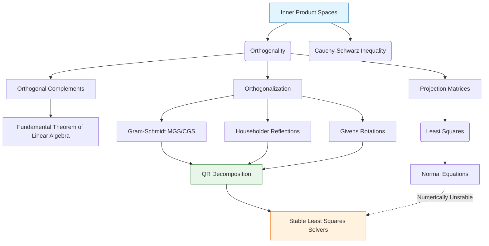

# Topic 04: Orthogonality, Projections, and QR Decomposition

## Master Overview

Orthogonality represents the algebraic formalization of the geometric concept of perpendicularity. In higher-dimensional spaces and function spaces, orthogonality provides the most robust framework for approximation, decomposition, and optimal estimation. When basis vectors are orthogonal, systems decouple, computations stabilize, and projections minimize error distance.

This topic explores inner product spaces, orthogonal projections, and their profound implications in both pure and numerical linear algebra. We build from fundamental inequalities (Cauchy-Schwarz) to orthogonal complements, projection matrices, and computationally stable orthogonalization processes (Gram-Schmidt, Householder Reflections, Givens Rotations). We culminate with the QR Decomposition—the workhorse of numerical linear algebra—and its pivotal role in solving the linear least-squares problem accurately.

## First-Principles Framework

This topic is structured rigorously around fundamental geometric and numerical principles:

1. **Orthogonality & Inner Products**: Quantifying vector angles and lengths through inner products, bounded by the Cauchy-Schwarz inequality $\lvert\langle u, v \rangle\rvert \le \Vert u \Vert \Vert v \Vert$.

2. **Subspace Decompositions**: Splitting vector spaces into orthogonal complements ($V = W \oplus W^\perp$) and expressing vectors uniquely as $v = w + w^\perp$.

3. **Best Approximation & Projections**: Minimizing distance $\|b - p\|$ to a subspace, where the error $e = b - p$ is orthogonal to the subspace ($A^T(b - A\hat{x}) = 0$).

4. **Stable Factorization**: Transforming ill-conditioned systems into orthogonal systems ($A = Q R$) where $Q^T Q = I$, preserving vector norms and avoiding condition number squaring.

## Concept Map

## Core Pillars

| Concept | Mathematical Definition | Geometric Intuition | AI / ML Application |
| :--- | :--- | :--- | :--- |
| **Inner Products & Norms** | $\lvert\langle u, v \rangle\rvert \le \Vert u \Vert \Vert v \Vert$ | Angle & length measurement; generalized dot product. | Cosine similarity, attention key-query inner products. |
| **Orthogonal Complements** | $V = W \oplus W^\perp$ | Decomposition of space into target subspace and perpendicular directions. | Null-space constraints, linear residual connections. |
| **Projection Matrices** | $P = A(A^T A)^{-1} A^T$ (full rank $A$) | Casting an orthogonal shadow onto a subspace ($P^2 = P, P^T = P$). | Closed-form linear regression, subspace constrained optimization. |
| **QR Decomposition** | $A = Q R$ | Factoring matrix into orthonormal basis $Q$ and triangular coefficients $R$. | Stable least squares, Gram-Schmidt layers, eigenvalue iterations. |
| **Least Squares Approximation** | $A^T A \hat{x} = A^T b$ | Finding closest point in column space to target vector ($e \perp \text{Col}(A)$). | Mean squared error (MSE) minimization, parameter fitting. |
| **Householder Reflections** | $H = I - 2\frac{v v^T}{v^T v}$ | Reflecting vectors across hyperplanes to zero out sub-diagonal entries. | Numerically stable QR, orthogonal neural network layers. |

## Common Misconceptions

1. **"Gram-Schmidt is always the optimal algorithm for computing QR decomposition."**

   *Correction:* Classical Gram-Schmidt (CGS) suffers from severe loss of orthogonality due to floating-point rounding errors. Modified Gram-Schmidt (MGS) improves numerical behavior, but **Householder reflections** are the gold standard for numerical stability.

2. **"Least squares problems should always be solved via Normal Equations ($A^T A \hat{x} = A^T b$)."**

   *Correction:* The condition number squares ($\kappa(A^T A) = \kappa(A)^2$), making Normal Equations numerically unstable for ill-conditioned matrices. Solving via QR ($R\hat{x} = Q^T b$) avoids squaring the condition number.

3. **"Any idempotent matrix ($P^2 = P$) is an orthogonal projection."**

   *Correction:* $P^2 = P$ defines an *oblique projection*. For a projection to be an *orthogonal projection*, it must also be symmetric ($P^T = P$).

## Literature References

This topic synthesizes concepts from benchmark literature in linear algebra, numerical analysis, and machine learning:

- **Gilbert Strang**, *Introduction to Linear Algebra* & *Linear Algebra and Learning from Data* (Chapter 4: Orthogonality)

- **Lloyd N. Trefethen & David Bau III**, *Numerical Linear Algebra* (Lectures 6–10: QR Factorization and Least Squares)

- **Gene H. Golub & Charles F. Van Loan**, *Matrix Computations* (Chapter 5: Orthogonalization and Least Squares)

- **Sheldon Axler**, *Linear Algebra Done Right* (Chapter 6: Inner Product Spaces)

- **Stephen Boyd & Lieven Vandenberghe**, *Applied Linear Algebra* (Chapters 5 & 12: Orthogonality and Least Squares)
