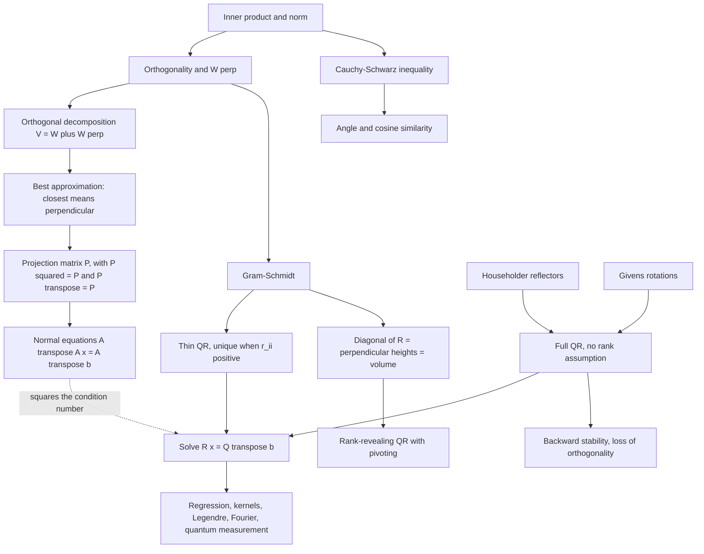

# Module 04 — Orthogonality, Projections, and QR

Most linear systems built from data are inconsistent: more measurements than unknowns, and the
measurements disagree. The useful question stops being "which $x$ solves $Ax = b$" and becomes
"which $x$ comes closest".

That turns algebra into geometry. The closest point of a subspace to a given vector is the one
whose error is perpendicular to the subspace, and perpendicularity is an equation you can write
down and solve.

Applying the same idea to the columns of $A$ one at a time produces the **QR factorization**
$A = QR$: an orthonormal basis for $\operatorname{Col}(A)$ together with the coordinates of the
original columns in it. Gram-Schmidt, Householder reflectors and Givens rotations are three ways
to compute it, and they are not interchangeable in floating point.

The module proves both headline results in full — the best-approximation theorem and the existence
and uniqueness of QR — and then measures, in executable code, the price of computing the same
answer the wrong way.

> [!NOTE]
> **Closest means perpendicular.** For a finite-dimensional subspace $W$ and any $v$, the vector
> $p \in W$ minimizes $\lVert v - w \rVert$ over $w \in W$ **if and only if** $v - p \perp W$; the
> minimizer exists, is unique, and equals $P_W v$. Every least-squares formula in this module is
> that sentence in coordinates.

## Prerequisites and downstream modules

**Prerequisites.**

- [Module 03 — Linear Systems and Direct Factorizations](../03_linear_systems_and_direct_factorizations/) — Gaussian elimination, the Cholesky factorization used in Problem L3.12, and the conditioning vocabulary.

**Downstream modules unlocked by this one.**

- [Module 06 — Eigenvalues, Eigenvectors and Spectral Theory](../06_eigenvalues_eigenvectors_spectral_theory/) — Gram-Schmidt supplies the basis extension in the Schur deflation step.
- [Module 07 — Canonical Forms and SVD](../07_canonical_forms_and_svd/) — settles the rank-$k$ approximation problem left open in Problem L2.3.
- [calculus/11 — Gradients and Directional Derivatives](../../calculus/11_gradients_directional_derivatives/) — the gradient as the normal to a level set.
- [numerical_methods/07 — Linear Least Squares](../../numerical_methods/07_linear_least_squares/) — the algorithmic continuation of Section 7.

The full dependency graph is in [docs/prerequisites.md](../../docs/prerequisites.md), and the
symbol conventions used below are fixed in [docs/notation.md](../../docs/notation.md).

## Learning outcomes

After working through this module you will be able to:

- decide when a vector is the closest point of a subspace, and prove it two ways — by perpendicularity and by Pythagoras;
- build the orthogonal projector onto a subspace from a spanning set, from a QR factorization, or from an orthonormal basis, and say which form to compute with;
- write down and solve the normal equations, and explain why they are always consistent but rarely the right thing to compute;
- prove that a QR factorization exists for every $A$ with $m \ge n$, and that the thin factorization with positive diagonal is unique when $A$ has full column rank;
- carry out Gram-Schmidt, a Householder reflection and a Givens rotation by hand on a small matrix, and reconcile the sign differences between them;
- read the diagonal of $R$ as a list of perpendicular heights, hence as a volume and as a rank detector;
- predict the accuracy of an algorithm from $\kappa_2$, using $\kappa_2(QA) = \kappa_2(A)$ and $\kappa_2(A^\top A) = \kappa_2(A)^2$;
- recognize what breaks when a hypothesis is dropped: oblique projections, rank deficiency, and the Lauchli matrix in double precision;
- apply the same geometry to regression, kernel methods, Legendre polynomials, Fourier energy and quantum measurement.

## Concept map

## Notation

Drawn from [docs/notation.md](../../docs/notation.md).

| Symbol | Meaning | Convention |
|---|---|---|
| $\langle u, v \rangle$ | inner product | linear in the first argument, conjugate symmetric |
| $\lVert v \rVert$ | induced norm | write with `\lVert`, never a bare pipe |
| $u \perp v$ | orthogonality | $\langle u, v \rangle = 0$ |
| $W^{\perp}$ | orthogonal complement of $W$ | a subspace, with $W \cap W^{\perp} = \lbrace 0 \rbrace$ |
| $P$, $P_W$ | orthogonal projection matrix | $P^2 = P$ and $P^{\top} = P$ |
| $G = A^{\top}A$ | Gram matrix | positive semidefinite always |
| $A = QR$ | QR factorization | $Q^{\top}Q = I$, $R$ upper triangular |
| $\hat{Q}, \hat{R}$ | thin factors | $\hat{Q} \in \mathbb{R}^{m \times n}$, $\hat{R} \in \mathbb{R}^{n \times n}$ |
| $H = I - 2vv^{\top}/v^{\top}v$ | Householder reflector | symmetric and orthogonal |
| $A^{+} = (A^{\top}A)^{-1}A^{\top}$ | pseudoinverse | full column rank; no $A^{-1}$ for rectangular $A$ |
| $\kappa_2(A) = \lVert A \rVert_2 \lVert A^{+} \rVert_2$ | 2-norm condition number | equals $\sigma_1/\sigma_n$ |
| $u = 2^{-53}$ | unit roundoff | $\varepsilon_{\mathrm{mach}} = 2u$ |

## Core results

| Result | Statement | Hypotheses | Where |
|---|---|---|---|
| Cauchy-Schwarz | $\lvert \langle u,v \rangle \rvert \le \lVert u \rVert \lVert v \rVert$, equality iff dependent | inner product axioms | Theorem 4.1, Proof 5.1 |
| Bessel and Parseval | $\sum_i \lvert \langle v,e_i \rangle \rvert^2 \le \lVert v \rVert^2$; equality for **all** $v$ iff a basis | $\lbrace e_i \rbrace$ orthonormal | Theorem 4.2, Proof 5.2 |
| Gram-Schmidt | orthonormal $q_k$ with matching nested spans | columns independent | Theorem 4.3, Proof 5.3 |
| Orthogonal decomposition | $V = W \oplus W^{\perp}$, uniquely | $W$ finite-dimensional | Theorem 4.4, Proof 5.4 |
| Best approximation | closest iff error perpendicular; minimizer unique | $W$ a subspace | Theorem 4.5, Proof 5.5 |
| Projection matrices | orthogonal projector iff $P^2 = P$ and $P^{\top} = P$; $P = A(A^{\top}A)^{-1}A^{\top} = \hat{Q}\hat{Q}^{\top}$ | full column rank for the formula | Theorem 4.6, Proof 5.6 |
| Normal equations | $A^{\top}A\hat{x} = A^{\top}b$; unique iff full column rank | none for existence | Theorem 4.7, Proof 5.7 |
| QR existence and uniqueness | full QR always exists; thin QR with $r_{ii} \gt 0$ unique | $m \ge n$; full column rank for uniqueness | Theorem 4.8, Proof 5.8 |
| Volume | $\operatorname{Vol}(a_1,\dots,a_n) = \prod_i r_{ii}$ | columns independent | Theorem 4.9, Proof 5.9 |
| Orthogonal invariance | $\kappa_2(QA) = \kappa_2(A)$ and $\kappa_2(A^{\top}A) = \kappa_2(A)^2$ | $Q^{\top}Q = I$; full column rank | Theorem 4.10, Proof 5.10 |
| Stability of QR | Householder backward stable; loss of orthogonality $O(u\kappa_2)$ for MGS, $O(u\kappa_2^2)$ for CGS | IEEE arithmetic | Theorem 4.11 (cited, not proved) |
| Lauchli breakdown | $\varepsilon^2 \lt u$ makes the computed $A^{\top}A$ rank $1$ | round-to-nearest | Proposition 4.12, Proof 5.11 |

## Common misconceptions

1. **"Any idempotent matrix is an orthogonal projection."** $P^2 = P$ alone gives an *oblique*
   projection, which lands in the right subspace but does not minimize distance. Section 7.4 of the
   theory notebook runs $P = \left[\begin{smallmatrix}1 & 1 \\ 0 & 0\end{smallmatrix}\right]$ and
   measures an error $41.4$ percent longer than the true minimum. Symmetry is the missing
   hypothesis.

2. **"Least squares should be solved by the normal equations."** $\kappa_2(A^{\top}A) = \kappa_2(A)^2$
   (Theorem 4.10), so half of the available digits are destroyed before the solve begins.
   Section 7.5 measures a relative-error exponent of $1.94$ for the normal equations against
   $0.97$ for QR.

3. **"Gram-Schmidt is the way to compute QR."** Classical Gram-Schmidt loses orthogonality at
   $O(u\kappa_2^2)$ and the modified version at $O(u\kappa_2)$, while Householder stays at $O(u)$
   regardless of conditioning. Section 7.3 measures the three exponents as $1.93$, $0.96$ and
   $-0.02$.

4. **"Equality in Bessel's inequality means the orthonormal set is a basis."** Only if equality
   holds for *every* $v$. In $\mathbb{R}^2$ the set $\lbrace e_1 \rbrace$ gives equality at
   $v = e_1$ and is not a basis; the quantifier is the whole content of Parseval.

5. **"A random sketching matrix is a random projection."** A subsampled randomized Hadamard
   transform maps $\mathbb{R}^n \to \mathbb{R}^l$ with $l \lt n$, so $S^2$ is not even a defined
   product. It is a *subspace embedding*: $\lVert Sy \rVert = (1 \pm \varepsilon)\lVert y \rVert$
   on one fixed subspace. Problem L2.5 makes the distinction precise.

6. **"Householder QR preserves norms exactly."** Only in exact arithmetic. The correct statement
   is backward stability: the computed factors satisfy $A + \Delta A = \tilde{Q}\hat{R}$ with
   $\lVert \Delta A \rVert_2 = O(u)\lVert A \rVert_2$, and
   $\lVert \hat{Q}^{\top}\hat{Q} - I \rVert_2 = O(u)$ (Theorem 4.11).

7. **"The condition number of a rectangular matrix is $\lVert A \rVert_2 \lVert A^{-1} \rVert_2$."**
   There is no $A^{-1}$. The definition is $\kappa_2(A) = \lVert A \rVert_2 \lVert A^{+} \rVert_2$
   with $A^{+}$ the pseudoinverse (Definition 3.7).

8. **"The Householder sign choice matters only for positive $x_1$."** Matching the sign of $x_1$
   avoids cancellation for *either* sign; the opposite choice cancels whenever $x$ is nearly
   parallel to $e_1$, and gives $v = 0$ exactly when it is parallel. Section 7.6 runs both.

## Exercise index

[`exercises.ipynb`](exercises.ipynb) contains 43 fully solved problems in four tiers. Every
problem carries a statement, a short intuition, a stepwise solution, a boxed answer, a key
takeaway, and — where the answer is numeric or algorithmic — a code cell that recomputes it.

| Tier | Count | Coverage |
|---|---:|---|
| L0 — Concept Checks | 8 | orthogonality and norms, normalization, angles, scalar and vector projection, isometry of orthogonal matrices, the two projection scale factors, trace as rank, the rank-one projector |
| L1 — Foundations | 13 | Gram-Schmidt in the plane, projector onto a plane, thin QR by Gram-Schmidt, $I - P$, point-to-plane distance, an explicit reflector, least squares by QR, a Givens rotation, Householder QR of a $2 \times 2$, Bessel and its deficit, the fundamental theorem part II, CGS against MGS, minimality equals perpendicularity |
| L2 — Applications (AI/ML and Physics) | 10 | normal equations for regression, minimum-norm solutions, fixed-subspace low-rank approximation, kernel ridge regression, SRHT sketching, streaming QR updates, loss of orthogonality on the Lauchli matrix, measuring $g$ from drop data, quantum measurement projectors, Fourier truncation and energy |
| L3 — Challenge Proofs | 12 | operator norm as a maximized quadratic form, $\lVert P - Q \rVert_2 \le 1$, $\lVert P \rVert_2 = \lVert I - P \rVert_2$, von Neumann alternating projections, commuting projectors, Parseval in a Hilbert space, Hessenberg reduction, rank-revealing QR, both Cayley transforms, non-expansiveness of convex projection, two trace inequalities |

Tier L2 contains three genuine physics problems: measuring $g$ by least squares from drop
distances (Problem L2.8), the measurement projectors and Born rule of a spin-$\tfrac12$ system
(Problem L2.9), and Fourier truncation as an orthogonal projection with Parseval as energy
conservation (Problem L2.10).

## References

**Textbooks.**

- Trefethen, L. N. and Bau, D. *Numerical Linear Algebra* — Lecture 6 (projectors), Lecture 7 (QR factorization), Lecture 8 (Gram-Schmidt), Lecture 10 (Householder triangularization), Lecture 11 (least squares), Lecture 16 (stability of Householder triangularization), Lecture 18 (conditioning of least squares), Lecture 19 (stability of least-squares algorithms).
- Golub, G. H. and Van Loan, C. F. *Matrix Computations*, 4th ed. — section 5.1 (Householder and Givens transformations), section 5.2 (QR and Gram-Schmidt), section 5.3 (full-rank least squares), section 5.4 (rank-deficient least squares and column pivoting).
- Higham, N. J. *Accuracy and Stability of Numerical Algorithms*, 2nd ed. — section 19.3 (Theorem 19.4, backward stability of Householder QR), section 19.8 (Gram-Schmidt), section 20.1 (the normal equations and the squared condition number).
- Axler, S. *Linear Algebra Done Right*, 3rd ed., chapter 6 — inner product spaces, orthonormal bases, Gram-Schmidt, and the minimizing property of orthogonal projections (6.56, 6.61).
- Strang, G. *Linear Algebra and Learning from Data*, section I.5 (orthogonal matrices and subspaces), section II.2 (least squares, four ways).
- Boyd, S. and Vandenberghe, L. *Introduction to Applied Linear Algebra*, chapters 5 and 10 (orthonormal vectors, QR), chapters 12 and 13 (least squares and data fitting).

**Papers.**

- Lauchli, P. "Jordan-Elimination und Ausgleichung nach kleinsten Quadraten", *Numerische Mathematik* **3** (1961), 226-240.
- Bjorck, A. "Solving linear least squares problems by Gram-Schmidt orthogonalization", *BIT* **7** (1967), 1-21.
- Giraud, L., Langou, J., Rozloznik, M. and van den Eshof, J. "Rounding error analysis of the classical Gram-Schmidt orthogonalization process", *Numerische Mathematik* **101** (2005), 87-100.
- Szyld, D. B. "The many proofs of an identity on the norm of oblique projections", *Numerical Algorithms* **42** (2006), 309-323.
- Tropp, J. A. "Improved analysis of the subsampled randomized Hadamard transform", *Advances in Adaptive Data Analysis* **3** (2011), 115-126.

**In this directory.**

- [`first_principles.ipynb`](first_principles.ipynb) — theory, proofs, seven worked examples, twelve executable code cells and three figures.
- [`exercises.ipynb`](exercises.ipynb) — the 43 solved problems indexed above.
