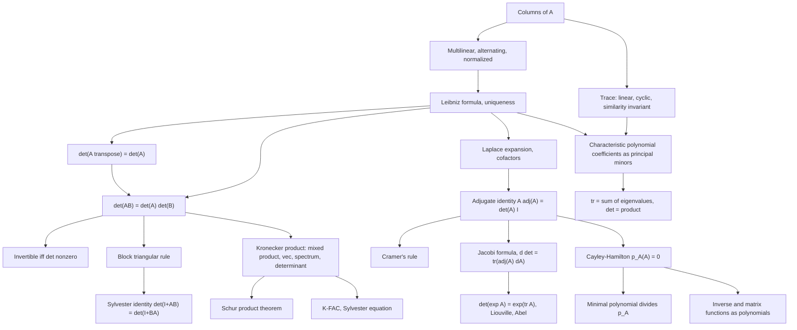

# Module 05 — Determinants, Trace, and Matrix Polynomials

A square matrix carries $n^2$ numbers, and almost every structural question about it — invertible
or not, how much it scales volume, how its powers behave — is answered by a handful of scalars
built from those entries.

Two scalars do most of the work. The **determinant** is the signed volume factor of $x \mapsto Ax$
and vanishes exactly when the map is not invertible. The **trace** is its infinitesimal version:
the rate at which volume changes when the map is switched on slowly.

The bridge between them is the characteristic polynomial $p_A(t) = \det(tI - A)$, whose
coefficients are the signed sums of principal minors and interpolate between trace and
determinant. Its roots are the eigenvalues, which appear here only as roots — eigenvectors are
[Module 06](../06_eigenvalues_eigenvectors_spectral_theory/)'s subject.

This module is built so that nothing is assumed before it is proved. The determinant is
introduced by its three axioms and pinned down by a uniqueness theorem; transpose invariance is
established **before** any row operation is used; multiplicativity, the adjugate identity,
Cayley-Hamilton, Jacobi's formula and the Kronecker spectrum then follow in that order, each from
the results above it.

> [!NOTE]
> **Cayley-Hamilton.** Every $A \in \mathbb{F}^{n \times n}$ over a commutative ring satisfies its
> own characteristic polynomial: $p_A(A) = 0$ where $p_A(t) = \det(tI - A)$. Consequently $A^{n}$
> is a combination of $I, A, \dots, A^{n-1}$, and when $A$ is invertible,
> $A^{-1} = -\frac{1}{c_0}\bigl(A^{n-1} + c_{n-1}A^{n-2} + \cdots + c_1 I\bigr)$ with
> $c_0 = (-1)^n \det A$.

## Prerequisites and downstream modules

**Prerequisites.**

- [Module 02 — Linear Maps and Matrix Transformations](../02_linear_maps_and_matrix_transformations/) — matrices as linear maps, similarity and change of basis, used for every invariance statement.
- [Module 03 — Linear Systems and Direct Factorizations](../03_linear_systems_and_direct_factorizations/) — the Cholesky factorization used in the proof of the Schur product theorem, and the LU route to a determinant.
- [Module 04 — Orthogonality, Projections and QR](../04_orthogonality_projections_and_qr/) — the QR factorization behind Hadamard's inequality.

**Downstream modules unlocked by this one.**

- [Module 06 — Eigenvalues, Eigenvectors and Spectral Theory](../06_eigenvalues_eigenvectors_spectral_theory/)
- [calculus/13 — Multiple Integrals and Coordinate Transforms](../../calculus/13_multiple_integrals_coordinate_transforms/)
- [graph_theory/03 — Trees and Minimum Spanning Trees](../../graph_theory/03_trees_and_minimum_spanning_trees/)

The full dependency graph is in [docs/prerequisites.md](../../docs/prerequisites.md), and the
symbol conventions used below are fixed in [docs/notation.md](../../docs/notation.md).

## Learning outcomes

After working through this module you will be able to:

- state the three determinant axioms and derive the Leibniz formula from them, including the uniqueness half that most proofs in the module rely on;
- prove $\det(A^{\top}) = \det(A)$ from the Leibniz formula, and explain why every argument using row operations depends on it;
- prove multiplicativity, the block triangular rule and the adjugate identity, and use Cramer's rule while knowing why it is a bad algorithm;
- read the coefficients of the characteristic polynomial as signed sums of principal minors, and recover $\operatorname{tr}A = \sum_i \lambda_i$ and $\det A = \prod_i \lambda_i$;
- prove the Cayley-Hamilton theorem by coefficient comparison, name the step that needs commutativity, and exhibit the quaternionic counterexample;
- compute a minimal polynomial, and read off from it whether a matrix is diagonalizable;
- differentiate a determinant with Jacobi's formula and deduce $\det(e^{A}) = e^{\operatorname{tr}A}$, Liouville's theorem and Abel's identity;
- compute with Kronecker, Hadamard, outer and Khatri-Rao products: the mixed-product property, the vec identity, the full spectrum of $A \otimes B$, and the Schur product theorem;
- choose $\log\det$ over $\det$ in floating point, and estimate a trace stochastically when the matrix is only available through products.

## Concept map

## Notation

Drawn from [docs/notation.md](../../docs/notation.md).

| Symbol | Meaning | Convention |
|---|---|---|
| $A^{\top}$, $A^{\ast}$ | transpose, conjugate transpose | `\top`, never `^T` |
| $\det A$, $\operatorname{tr} A$ | determinant, trace | `\operatorname{...}` |
| $\operatorname{sgn}(\sigma)$ | sign of a permutation | $+1$ for even, $-1$ for odd |
| $M_{ij}$, $C_{ij}$ | minor and cofactor | $C_{ij} = (-1)^{i+j}\det M_{ij}$ |
| $\operatorname{adj}A$ | adjugate | $(\operatorname{adj}A)_{ij} = C_{ji}$ |
| $p_A(t) = \det(tI - A)$ | characteristic polynomial | monic; Module 06 writes $\det(A - zI) = (-1)^n p_A(z)$ |
| $m_A(t)$ | minimal polynomial | monic of least degree with $m_A(A) = 0$ |
| $E_k(A)$ | sum of the principal $k \times k$ minors | $E_1 = \operatorname{tr}A$, $E_n = \det A$ |
| $\lambda_1 \ge \cdots \ge \lambda_n$ | eigenvalues when real | descending |
| $u v^{\top}$, $A \circ B$ | outer product, Hadamard product | rank one; entrywise |
| $A \otimes B$, $A \ast B$ | Kronecker, Khatri-Rao product | $mp \times nq$; column-wise Kronecker |
| $\operatorname{vec}(X)$ | column stacking | $\operatorname{vec}(AXB) = (B^{\top} \otimes A)\operatorname{vec}(X)$ |
| $A \succeq 0$, $A \succ 0$ | positive semidefinite, positive definite | Löwner order |
| $\lVert A \rVert_F$ | Frobenius norm | $\lVert A \rVert_F^2 = \operatorname{tr}(A^{\top}A)$ |

## Core results

| Result | Statement | Hypotheses | Where |
|---|---|---|---|
| Uniqueness of $\det$ | multilinear alternating $D$ equals $D(I)\det$; Leibniz formula | none | Theorem 4.1, Proof 5.1 |
| Transpose invariance | $\det(A^{\top}) = \det(A)$ | none | Theorem 4.2, Proof 5.2 |
| Multiplicativity | $\det(AB) = \det(A)\det(B)$; block triangular rule | both square, same size | Theorem 4.3, Proof 5.3 |
| Laplace, adjugate, Cramer | $A\operatorname{adj}(A) = \det(A) I$; $x_i = \det(A_i)/\det(A)$ | Cramer needs $\det A \neq 0$ | Theorem 4.4, Proof 5.4 |
| Trace properties | $\operatorname{tr}(AB) = \operatorname{tr}(BA)$, cyclic, similarity invariant | shapes compatible | Theorem 4.5, Proof 5.5 |
| Characteristic coefficients | $p_A(t) = \sum_k (-1)^k E_k(A) t^{n-k}$ | root form needs $\mathbb{C}$ | Theorem 4.6, Proof 5.6 |
| Cayley-Hamilton | $p_A(A) = 0$ | entries commute | Theorem 4.7, Proof 5.7 |
| Minimal polynomial | unique, divides $p_A$, same roots | $\mathbb{F}$ a field | Theorem 4.8, Proof 5.8 |
| Jacobi's formula | $\frac{d}{dt}\det A = \operatorname{tr}(\operatorname{adj}(A)A')$; $\det e^{A} = e^{\operatorname{tr}A}$ | inverse form needs $\det A \neq 0$ | Theorem 4.9, Proof 5.9 |
| Triangularization | $A = STS^{-1}$ with $T$ upper triangular | field is $\mathbb{C}$ | Lemma 4.10, Proof 5.10 |
| Kronecker product | mixed product, vec identity, $\operatorname{spec} = \lbrace \lambda_i\mu_j \rbrace$, $\det = (\det A)^m(\det B)^n$ | spectrum needs $\mathbb{C}$ | Theorem 4.11, Proof 5.11 |
| Sylvester identity | $\det(I_m + AB) = \det(I_n + BA)$ | shapes only | Theorem 4.12, Proof 5.12 |
| Schur product theorem | $A, B \succeq 0 \implies A \circ B \succeq 0$ | both semidefinite | Theorem 4.13, Proof 5.13 |

## Common misconceptions

1. **"$\det(A + B) = \det(A) + \det(B)$."** The determinant is linear in one column at a time,
   never in the matrix. $\operatorname{diag}(1,0)$ and $\operatorname{diag}(0,1)$ both have
   determinant $0$ while their sum is $I$ with determinant $1$.

2. **"Row operations are obviously allowed, since determinants are multilinear."** The axioms of
   Definition 3.2 are stated on **columns**. Row multilinearity is a consequence of
   $\det(A^{\top}) = \det(A)$, so that theorem must be proved first — otherwise the proof of
   multiplicativity is circular.

3. **"The trace is symmetric in its factors."** It is *cyclic*, not symmetric. Section 7 of the
   theory notebook runs explicit $2 \times 2$ matrices with
   $\operatorname{tr}(ABC) = 30$ and $\operatorname{tr}(ACB) = 22$.

4. **"Cayley-Hamilton follows from substituting $t = A$ into $\det(tI - A)$."** That substitution
   produces the *scalar* $\det(A - A) = 0$, whereas $p_A(A)$ is a *matrix*. The real proof
   compares coefficients in a matrix polynomial identity, and it needs the entries to commute.

5. **"Cayley-Hamilton holds over any ring."** Over the quaternions,
   $A = \operatorname{diag}(i, j)$ gives $A^{2} - (i+j)A + ij\,I = \operatorname{diag}(2k, 0) \neq 0$.

6. **"The minimal polynomial equals the characteristic polynomial."** It divides it and shares its
   roots, but the multiplicities can drop. The $4 \times 4$ matrix of Example 6.6 has
   $p = (t-2)^3(t-5)$ and $m = (t-2)^2(t-5)$.

7. **"$\det(A \otimes B) = \det(A)\det(B)$."** The exponents are the *other* matrix's size:
   $\det(A \otimes B) = (\det A)^{m}(\det B)^{n}$ for $A$ of size $n$ and $B$ of size $m$.

8. **"The Hadamard product multiplies determinants."** It multiplies nothing. What it preserves is
   the positive semidefinite cone, which is the Schur product theorem;
   $\det(P \circ Q) = 3$ while $\det(P)\det(Q) = 0$ for the pair in Example 6.8.

9. **"Compute $\det\Sigma$, then take its logarithm."** For a $200 \times 200$ covariance the
   determinant overflows double precision while $\log\det$ is around $10^{3}$. Always use
   `slogdet` or $2\sum_i \log L_{ii}$ from a Cholesky factor.

## Exercise index

[`exercises.ipynb`](exercises.ipynb) contains 54 fully solved problems in four tiers. Every
problem carries a statement, a short intuition, a stepwise solution, a boxed answer, a key
takeaway, and — where the answer is numeric or algorithmic — a code cell that recomputes it.

| Tier | Count | Coverage |
|---|---:|---|
| L0 — Concept Checks | 10 | trace of the identity, diagonal and triangular determinants, outer-product rank, Hadamard identity element, the $2 \times 2$ formula, products and inverses, trace and determinant from a spectrum, scaling, triangular characteristic polynomial, Kronecker shapes |
| L1 — Foundations | 17 | commutator trace, $2 \times 2$ Cayley-Hamilton, trace of an outer product, orthogonal determinants, singular and definite $2 \times 2$, Frobenius norm, $\nabla \operatorname{tr}(AX)$, Sherman-Morrison, nilpotent spectra, block triangular determinants, inverse from an annihilator, Kronecker trace, minimal against characteristic polynomial, nilpotent exponential, rank-one determinant updates, Kronecker eigenvectors, the $3 \times 3$ Vandermonde |
| L2 — Applications (AI/ML and Physics) | 14 | PCA explained variance, the trace trick, Gaussian entropy, LSTM gating, $\nabla \log\det$, softmax Jacobian, Sylvester equation, Khatri-Rao in CP decomposition, K-FAC, resolvent series, Hutchinson estimator, Liouville's theorem, Abel's identity, quantum purity |
| L3 — Challenge Proofs | 13 | Jacobi's formula and the Hessian of $\log\det$, non-commutative failure of Cayley-Hamilton, Schur complement determinant, $\det = \exp\operatorname{tr}\log$, Hadamard's inequality, Cauchy-Binet, the general Vandermonde, adjugate identities, an explicit minimal polynomial, the Matrix-Tree theorem, Newton's identities and Faddeev-LeVerrier, convexity of $-\log\det$, unsolvability of $ST - TS = I$ |

Tier L2 contains three genuine physics problems: Liouville's theorem for a linear Hamiltonian
flow (Problem L2.12), Abel's identity for the Wronskian of a damped oscillator (Problem L2.13),
and the purity of a quantum density matrix (Problem L2.14).

## References

**Textbooks.**

- Axler, S. *Linear Algebra Done Right*, 3rd ed., chapter 10 — trace and determinant developed through operators and generalized eigenvectors rather than permutations.
- Horn, R. A. and Johnson, C. R. *Matrix Analysis*, 2nd ed. — determinants and the Leibniz formula (section 0.3), the adjugate and Cramer's rule (section 0.8), the characteristic polynomial and its principal-minor coefficients (section 1.2), Cayley-Hamilton and the minimal polynomial (section 2.4), the Schur product theorem (Theorem 7.5.3).
- Horn, R. A. and Johnson, C. R. *Topics in Matrix Analysis* — the Kronecker product and the vec identity (chapter 4), the Hadamard product (chapter 5).
- Strang, G. *Introduction to Linear Algebra*, 5th ed., chapter 5 — the three defining properties (section 5.1), permutations and cofactors (section 5.2), Cramer's rule, inverses and volumes (section 5.3).
- Meyer, C. D. *Matrix Analysis and Applied Linear Algebra*, section 6.1 (determinants) and section 7.3 (functions of a matrix).
- Golub, G. H. and Van Loan, C. F. *Matrix Computations*, 4th ed., section 1.3.6 (Kronecker products), section 3.2 (determinants through LU), section 12.3 (Kronecker product computations).
- Bollobás, B. *Modern Graph Theory*, section II.3 — the Matrix-Tree theorem.

**Papers.**

- Van Loan, C. F. "The ubiquitous Kronecker product", *Journal of Computational and Applied Mathematics* **123** (2000), 85-100.
- Martens, J. and Grosse, R. "Optimizing neural networks with Kronecker-factored approximate curvature", *ICML* (2015).
- Hutchinson, M. F. "A stochastic estimator of the trace of the influence matrix for Laplacian smoothing splines", *Communications in Statistics - Simulation and Computation* **19**(2) (1990), 433-450.
- Chen, R. T. Q., Rubanova, Y., Bettencourt, J. and Duvenaud, D. "Neural ordinary differential equations", *NeurIPS* (2018).

**In this directory.**

- [`first_principles.ipynb`](first_principles.ipynb) — theory, thirteen numbered results with proofs, eight worked examples, eleven executable code cells and three figures.
- [`exercises.ipynb`](exercises.ipynb) — the 54 solved problems indexed above.
