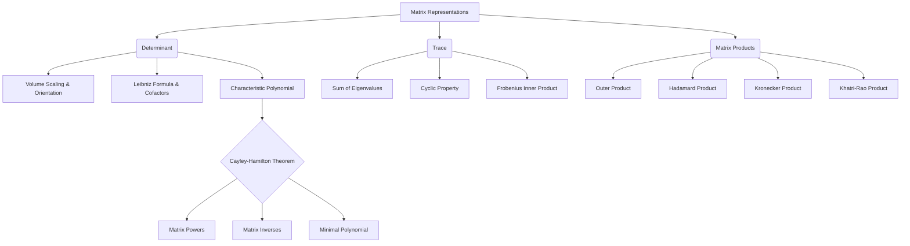

# Topic 05: Determinants, Trace, and Matrix Polynomials

## Master Overview

Welcome to the fifth foundational module in Linear Algebra.

This module unifies three deeply related concepts: **Determinants**, **Trace**, and **Matrix Polynomials** (including the pivotal Cayley-Hamilton Theorem), alongside advanced matrix products (Kronecker, Hadamard, Outer, and Khatri-Rao). 

These tools allow us to encapsulate global properties of linear transformations into singular scalar values, manipulate tensor-like structures, and understand the algebraic constraints that matrices naturally satisfy.

The determinant, geometrically, measures the signed volume scaling factor of a linear transformation. 

The trace captures the sum of the eigenvalues and relates to the divergence of vector fields. 

Matrix polynomials provide an algebraic framework to compute functions of matrices, leading to the Cayley-Hamilton theorem, which states that every square matrix satisfies its own characteristic polynomial. 

Advanced matrix products form the foundation of multilinear algebra, essential for modern machine learning, quantum computing, and signal processing.

## Learning Framework

This module follows the **Flexible Learning Unit System**:

- `first_principles.md`: A 20-part foundational breakdown of determinants, trace, advanced matrix products, and matrix polynomials, concluding with the Cayley-Hamilton theorem.
- `exercises.md`: A 40-problem, 5-level collection of solved exercises designed to solidify computational mechanics and theoretical proofs.

## Concept Map

## Core Pillars

| Concept | Description | Key Formula |
| :--- | :--- | :--- |
| **Determinant** | Signed volume scaling factor; test for invertibility. | $\det(A) = \sum_{\sigma \in S_n} \text{sgn}(\sigma) \prod_{i=1}^n A_{i,\sigma(i)}$ |
| **Trace** | Sum of diagonal elements; sum of eigenvalues. | $\text{tr}(A) = \sum_{i=1}^n A_{ii} = \sum_{i=1}^n \lambda_i$ |
| **Kronecker Product** | Tensor product of matrices; expands state space. | $A \otimes B = [a_{ij} B]$ |
| **Hadamard Product** | Element-wise product; preserves positive semi-definiteness. | $(A \circ B)_{ij} = A_{ij} B_{ij}$ |
| **Cayley-Hamilton** | A matrix is a root of its own characteristic polynomial. | $p_A(A) = \mathbf{0}$ |

## Common Misconceptions

1. **Misconception:** $\det(A+B) = \det(A) + \det(B)$.

   > **Reality:** The determinant is only linear with respect to individual rows or columns (multilinear), not the whole matrix addition.

2. **Misconception:** The trace is the product of eigenvalues.

   > **Reality:** The trace is the *sum* of eigenvalues. The determinant is the *product* of eigenvalues.

3. **Misconception:** The minimal polynomial is always equal to the characteristic polynomial.

   > **Reality:** The minimal polynomial divides the characteristic polynomial but can have lower degree if the maximal Jordan block size for repeated eigenvalues is strictly smaller than their algebraic multiplicity (e.g., when the matrix is diagonalizable).

4. **Misconception:** $A \otimes B = B \otimes A$.

   > **Reality:** The Kronecker product is generally non-commutative, although they are permutation equivalent.

## Literature References

1. **Axler, S.** *Linear Algebra Done Right* (Chapter 10) - Formal treatment of trace and determinant via generalized eigenvectors.
2. **Strang, G.** *Introduction to Linear Algebra* (Chapter 5) - Intuitive and geometric properties of determinants.
3. **Horn, R. A., & Johnson, C. R.** *Matrix Analysis* (Chapter 4) - Comprehensive theory on matrix products (Kronecker, Hadamard) and polynomials.
4. **Golub, G. H., & Van Loan, C. F.** *Matrix Computations* - Algorithmic aspects of computing determinants and traces efficiently.
