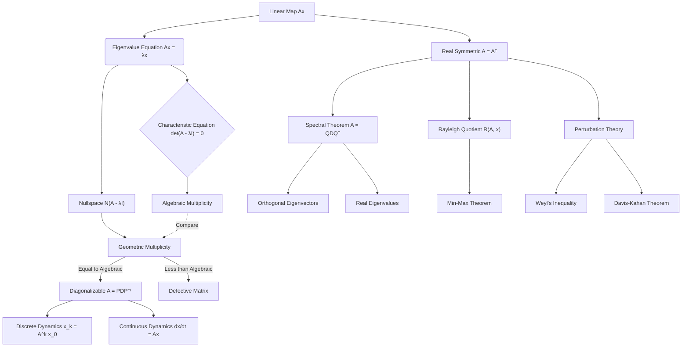

# Topic 06: Eigenvalues, Eigenvectors, and Spectral Theory

## 1. Master Overview

Eigenvalues and eigenvectors represent the fundamental "modes" of linear transformations, revealing the intrinsic geometry hidden within a matrix. By isolating the directions along which a linear map acts simply as a scalar multiplication, we can decouple complex, multidimensional systems into independent, one-dimensional scalar problems.

Spectral Theory extends these concepts to define classes of operators (such as symmetric and Hermitian matrices) that possess guaranteed, well-behaved eigen-structures, forming the mathematical backbone of quantum mechanics, structural engineering, stability analysis, and modern machine learning algorithms like Principal Component Analysis (PCA).

> [!NOTE]
> Spectral Theory guarantees that every real symmetric matrix is orthogonally diagonalizable with real eigenvalues. This result forms the foundation for Principal Component Analysis (PCA), Spectral Graph Theory, and Quantum Mechanics.

## 2. First-Principles Framework

The first-principles approach to eigenvalues stems from the desire to find invariant directions:

- **Phenomenon**: A linear transformation $T: V \to V$ typically rotates, shears, and scales vectors in complex ways.
- **Goal**: Find directions (vectors $x \neq 0$) that are purely scaled by the transformation, maintaining their span.
- **Governing Equation**: $Ax = \lambda x$.
- **Formulation**: This leads to $(A - \lambda I)x = 0$, requiring the operator $(A - \lambda I)$ to be singular, hence the characteristic equation $\det(A - \lambda I) = 0$.
- **Decomposition**: If enough independent eigenvectors exist, we achieve diagonalization $A = PDP^{-1}$, completely decoupling the system dynamics.

## 3. Mermaid Concept Map

## 4. Core Pillars

| Concept | Mathematical Description | Geometric/Physical Meaning |
| :--- | :--- | :--- |
| **Eigenvalue ($\lambda$)** | Root of $\det(A - \lambda I) = 0$ | The scaling factor along an invariant direction. |
| **Eigenvector ($x$)** | Non-zero vector in $\text{ker}(A - \lambda I)$ | A direction that remains invariant under transformation. |
| **Algebraic Multiplicity ($m_\lambda$)** | Multiplicity of $\lambda$ as a root of the characteristic polynomial | How many times the eigenvalue appears algebraically. |
| **Geometric Multiplicity ($g_\lambda$)** | Dimension of eigenspace $\text{dim}(\text{ker}(A - \lambda I))$ | How many linearly independent eigenvectors correspond to $\lambda$. |
| **Diagonalization** | $A = PDP^{-1}$ | Changing basis to the eigenvectors to decouple the system. |
| **Spectral Theorem** | $A = Q \Lambda Q^T$ (for $A = A^T$) | Symmetric matrices have real eigenvalues and orthogonal eigenvectors. |
| **Rayleigh Quotient** | $R(A, x) = \frac{x^T A x}{x^T x}$ | Continuous function whose critical points are the eigenvectors. |

## 5. Common Misconceptions

1. **Misconception**: Every matrix can be diagonalized.
   - **Correction**: Only matrices where the geometric multiplicity equals the algebraic multiplicity for every eigenvalue are diagonalizable. Defective matrices require the Jordan Canonical Form.

2. **Misconception**: If a matrix is invertible, it is diagonalizable.
   - **Correction**: Invertibility (non-zero eigenvalues) and diagonalizability (complete set of eigenvectors) are entirely independent properties. For example, $\left[\begin{smallmatrix} 1 & 1 \\ 0 & 1 \end{smallmatrix}\right]$ is invertible but not diagonalizable.

3. **Misconception**: Eigenvectors corresponding to distinct eigenvalues are always orthogonal.
   - **Correction**: They are linearly independent, but only guaranteed to be orthogonal if the matrix is normal (e.g., symmetric or Hermitian).

4. **Misconception**: Matrix perturbations drastically change eigenvalues.
   - **Correction**: For symmetric matrices, Weyl's Inequality guarantees that eigenvalues are well-conditioned and stable under small perturbations, though eigenvectors might rotate significantly if eigenvalues are closely packed (Davis-Kahan).

## 6. Exercise Index

The `exercises.md` file contains 40 carefully structured problems:

- **Foundation (5 Problems)** - Definitions, characteristic equations, 2x2 examples.
- **Understanding (10 Problems)** - Computing eigenspaces, multiplicities, diagonalization.
- **Advanced (10 Problems)** - PCA, Markov Chains, PageRank, dynamical systems.
- **Olympiad (10 Problems)** - Spectral theorem proofs, Rayleigh quotient, perturbation bounds.
- **Research (5 Problems)** - Davis-Kahan applications, pseudo-spectra, continuous dynamics.

## 7. Literature References

- **Axler, S.** *Linear Algebra Done Right* (Chapter 5: Eigenvalues, Eigenvectors, and Invariant Subspaces).
- **Strang, G.** *Introduction to Linear Algebra* (Chapter 6: Eigenvalues and Eigenvectors).
- **Strang, G.** *Linear Algebra and Learning from Data* (Focus on Spectral Theorem and PCA).
- **Horn, R. A., & Johnson, C. R.** *Matrix Analysis* (Chapters 1, 2, and 4: Eigenvalues, Canonical Forms, and Hermitian Matrices).
- **Golub, G. H., & Van Loan, C. F.** *Matrix Computations* (Chapters 7 and 8: Symmetric Eigenvalue Problems).
- **Trefethen, L. N., & Bau, D.** *Numerical Linear Algebra* (Eigenvalue Algorithms and Perturbation Theory).
