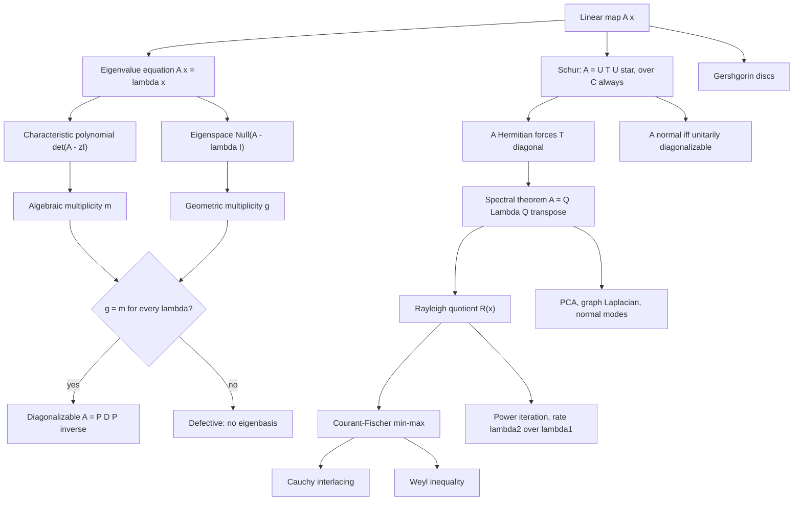

# Module 06 — Eigenvalues, Eigenvectors, and Spectral Theory

A matrix is a rule for moving vectors, and after a few applications that rule becomes unreadable
from the entries alone. Eigenvectors are the directions along which the rule degenerates to
multiplication by a single number, so that a million applications is one number raised to the
millionth power.

This module answers one question: **when does a basis exist in which $A$ acts diagonally?** Not
every matrix has one. The answer for the class that matters most in practice — real symmetric
matrices — is that such a basis always exists and can be chosen orthonormal.

The route taken here is the honest one. Schur triangularization is proved first, by induction with
an explicit deflation step, and the spectral theorem is then deduced from it: a Hermitian
triangular matrix is diagonal. The equality of algebraic and geometric multiplicity comes out as a
*consequence*, never as an assumption.

The second half is what makes the theorem usable in floating point: the variational
characterization of eigenvalues, the perturbation bounds that follow from it, cheap localization
by Gershgorin discs, and the measured convergence rate of power iteration.

> [!NOTE]
> **Spectral theorem.** Every real symmetric $A$ factors as $A = Q\Lambda Q^{\top}$ with $Q$
> orthogonal and $\Lambda$ real diagonal, $\lambda_1 \ge \cdots \ge \lambda_n$. Equivalently
> $A = \sum_i \lambda_i q_i q_i^{\top}$. Symmetry alone buys a real spectrum, a full eigenbasis,
> and an orthogonal one.

## Prerequisites and downstream modules

**Prerequisites.**

- [Module 04 — Orthogonality, Projections and QR](../04_orthogonality_projections_and_qr/) — Gram-Schmidt supplies the basis extension used in the deflation step.
- [Module 05 — Determinants, Trace and Matrix Polynomials](../05_determinants_trace_and_matrix_polynomials/) — the characteristic polynomial, Cayley-Hamilton and the trace and determinant identities.

**Downstream modules unlocked by this one.**

- [Module 07 — Canonical Forms and SVD](../07_canonical_forms_and_svd/)
- [Module 08 — Numerical Linear Algebra and Iterative Solvers](../08_numerical_linear_algebra_iterative_solvers/)
- [Module 09 — Numerical Spectrum Algorithms](../09_numerical_spectrum_algorithms/)
- [Module 10 — Matrix Calculus, Graphs and AI Applications](../10_matrix_calculus_graph_and_ai_applications/)
- [calculus/12 — Hessian, Jacobian and Curvature](../../calculus/12_hessian_jacobian_curvature/)
- [probability_statistics/07 — Joint Distributions and the Multivariate Normal](../../probability_statistics/07_joint_distributions_and_multivariate_normal/)
- [calculus_optimization/03 — Gradient Descent Mechanics](../../calculus_optimization/03_gradient_descent_mechanics/)
- [optimization/01 — Problem Formulation and Convexity](../../optimization/01_problem_formulation_and_convexity/)
- [numerical_methods/03 — Fixed Point Iteration and Convergence](../../numerical_methods/03_fixed_point_iteration_and_convergence/)
- [differential_equations/07 — Boundary Value Problems](../../differential_equations/07_boundary_value_problems_and_pde_preview/)
- [graph_theory/06 — Graph Laplacian and Spectral Theory](../../graph_theory/06_graph_laplacian_and_spectral_theory/)

The full dependency graph is in [docs/prerequisites.md](../../docs/prerequisites.md), and the
symbol conventions used below are fixed in [docs/notation.md](../../docs/notation.md).

## Learning outcomes

After working through this module you will be able to:

- compute eigenvalues, eigenspaces and both multiplicities of a small matrix by hand, and decide diagonalizability from them;
- prove Schur triangularization by induction, carrying out the deflation step explicitly;
- deduce the spectral theorem from Schur, and explain why $g_\lambda = m_\lambda$ is a conclusion rather than a hypothesis;
- state and use the Courant-Fischer characterization, and derive Cauchy interlacing and Weyl's inequality from it;
- bound a spectrum with Gershgorin discs and count eigenvalues in an isolated group of discs;
- predict the convergence rate of power iteration from the spectral gap, and explain why the Rayleigh quotient converges at the square of that rate;
- recognize what fails when symmetry is dropped: complex spectra, defective matrices, non-orthogonal eigenbases;
- apply the theorem to PCA, Markov chains, graph Laplacians, normal modes and quantum observables.

## Concept map

## Notation

Drawn from [docs/notation.md](../../docs/notation.md).

| Symbol | Meaning | Convention |
|---|---|---|
| $\lambda_1 \ge \lambda_2 \ge \cdots \ge \lambda_n$ | eigenvalues of a symmetric matrix | descending |
| $\Lambda$ | $\operatorname{diag}(\lambda_1, \ldots, \lambda_n)$ | eigenvalue matrix |
| $Q$, $U$ | real orthogonal, complex unitary | $Q^{\top}Q = I$, $U^{\ast}U = I$ |
| $T$ | upper triangular Schur factor | $A = UTU^{\ast}$ |
| $E_\lambda = \operatorname{Null}(A - \lambda I)$ | eigenspace | |
| $m_\lambda$, $g_\lambda$ | algebraic, geometric multiplicity | $1 \le g_\lambda \le m_\lambda$ |
| $R_A(x) = x^{\top}Ax / x^{\top}x$ | Rayleigh quotient | defined for $x \neq 0$ |
| $\rho(A)$ | spectral radius | $\max_i \lvert \lambda_i \rvert$ |
| $\lVert A \rVert_{\mathrm{op}}$, $\lVert A \rVert_F$ | operator and Frobenius norms | write with `\lVert`, never a bare pipe |
| $\theta(u,v)$ | angle between two lines | $\arccos \lvert u^{\ast} v \rvert$ |
| $P$, $\pi$ | column-stochastic matrix, stationary vector | $P\pi = \pi$ |

Two declared exceptions apply. Laplacian spectra are indexed **ascending**, so that $\lambda_2$ is
the algebraic connectivity. Horn and Johnson state Courant-Fischer with ascending eigenvalues; the
statement here is theirs transcribed into the descending order.

## Core results

| Result | Statement | Hypotheses | Where |
|---|---|---|---|
| Schur triangularization | $A = UTU^{\ast}$, $T$ upper triangular | field is $\mathbb{C}$ | Theorem 4.1, Proof 5.1 |
| Spectral theorem | $A = Q\Lambda Q^{\top}$, $\Lambda$ real | $A$ real symmetric | Theorem 4.2, Proof 5.2 |
| Normal matrices | $A = UDU^{\ast}$ iff $A^{\ast}A = AA^{\ast}$ | none beyond squareness | Theorem 4.3, Proof 5.3 |
| Courant-Fischer | $\lambda_k = \max_{\dim S = k} \min_{0 \neq x \in S} R_A(x)$ | $A$ symmetric | Theorem 4.4, Proof 5.4 |
| Cauchy interlacing | $\lambda_k(A) \ge \lambda_k(B) \ge \lambda_{k+1}(A)$ | $B$ a principal submatrix | Theorem 4.5, Proof 5.5 |
| Weyl's inequality | $\max_k \lvert \lambda_k(A+E) - \lambda_k(A) \rvert \le \lVert E \rVert_{\mathrm{op}}$ | $A$, $E$ symmetric | Theorem 4.6, Proof 5.6 |
| Power iteration | error contracts at $\lambda_2/\lambda_1$, Rayleigh error at its square | $A \succeq 0$, $\lambda_1 \gt \lambda_2$ | Theorem 4.7, Proof 5.7 |
| Gershgorin discs | every $\lambda$ within $r_i$ of some $a_{ii}$ | none | Theorem 4.8, Proof 5.8 |
| Bauer-Fike, Davis-Kahan | perturbation bounds for the non-symmetric and eigenvector cases | cited, not proved | Theorem 4.9 |
| Multiplicity inequality | $1 \le g_\lambda \le m_\lambda$; diagonalizable iff equality throughout | none | Proposition 4.10, Proof 5.9 |

## Common misconceptions

1. **"Every matrix can be diagonalized."** Only those with $g_\lambda = m_\lambda$ for every
   eigenvalue. The shear $\left[\begin{smallmatrix}1 & 1 \\ 0 & 1\end{smallmatrix}\right]$ has
   $g_1 = 1 \lt m_1 = 2$; its eigenvector matrix has rank $1$, so $V\Lambda V^{-1}$ cannot even be
   formed.

2. **"Invertible implies diagonalizable."** The two properties are independent. The same shear is
   invertible and defective; the zero matrix is singular and diagonal.

3. **"Eigenvectors for distinct eigenvalues are orthogonal."** They are linearly independent
   always, orthogonal only for normal matrices. For
   $\left[\begin{smallmatrix}2 & 1 \\ 0 & 3\end{smallmatrix}\right]$ the eigenvectors meet at
   $45$ degrees.

4. **"`numpy.linalg.eigh` is just a faster `eig`."** It reads only one triangle. Applied to the
   rotation $\left[\begin{smallmatrix}0 & -1 \\ 1 & 0\end{smallmatrix}\right]$ it silently returns
   $\pm 1$, with residual $\lVert Rq - \lambda q \rVert = 1.41$ instead of machine epsilon.

5. **"Eigenvalues and eigenvectors are equally well conditioned."** Eigenvalues of a symmetric
   matrix move by at most $\lVert E \rVert_{\mathrm{op}}$; eigenvectors move by roughly
   $\lVert E \rVert_{\mathrm{op}}$ divided by the spectral gap, which is unbounded when
   eigenvalues cluster.

6. **"The Davis-Kahan bound is $\lVert E \rVert_{\mathrm{op}} / \delta$."** That form is false.
   Section 7 of the theory notebook runs an explicit $2 \times 2$ case with
   $\lVert E \rVert_{\mathrm{op}} / \delta = 0.492$ and $\sin\theta = 0.615$. The factor $2$ in
   Theorem 4.9 is load-bearing.

7. **"Spectral radius less than one means the powers shrink monotonically."** For the shear,
   $\rho = 1$ yet $\lVert N^k \rVert_{\mathrm{op}}$ grows linearly in $k$; for a non-normal matrix
   with $\rho \lt 1$ the norms can grow for many steps before decaying.

## Exercise index

[`exercises.ipynb`](exercises.ipynb) contains 40 fully solved problems in four tiers. Every
problem carries a statement, a short intuition, a stepwise solution, a boxed answer, a key
takeaway, and — where the answer is numeric or algorithmic — a code cell that recomputes it.

| Tier | Count | Coverage |
|---|---:|---|
| L0 — Concept Checks | 8 | identity and diagonal spectra, matrix polynomials, inverses, transposes, projections, involutions, spectral radius |
| L1 — Foundations | 11 | defective matrices, trace and determinant identities, symmetric $2 \times 2$ eigenpairs, rank-one spectra, rotations, skew-symmetry, multiplicities, projector decomposition, Gershgorin, Cayley-Hamilton, quadratic matrix equations |
| L2 — Applications (AI/ML and Physics) | 10 | PCA, Markov chains, power-iteration rates, PageRank damping, companion matrices, algebraic connectivity, cycle spectral gaps, spring normal modes, a two-level quantum system, dynamic mode decomposition |
| L3 — Challenge Proofs | 11 | Rayleigh characterization, simultaneous diagonalization, symmetric cube roots, trace-power nilpotency, $AB$ against $BA$, skew-symmetric and orthogonal spectra, real complex structures, products of positive definite matrices, the matrix of minima, Wigner semicircle moments |

Tier L2 contains two genuine physics problems: the normal modes of a two-mass spring chain
(Problem L2.8) and the Rabi oscillation of a two-level Hamiltonian (Problem L2.9).

## References

**Textbooks.**

- Axler, S. *Linear Algebra Done Right*, 3rd ed., section 7.B — complex and real spectral theorems, developed without determinants.
- Horn, R. A. and Johnson, C. R. *Matrix Analysis*, 2nd ed. — Schur triangularization (Theorem 2.3.1), Hermitian spectral theorem (Theorem 2.5.6), Courant-Fischer (Theorem 4.2.6), Weyl's inequality (Theorem 4.3.1), Cauchy interlacing (Theorem 4.3.17), Gershgorin and the connected-component refinement (Theorem 6.1.1).
- Trefethen, L. N. and Bau, D. *Numerical Linear Algebra*, Lecture 24 (eigenvalue problems, Schur factorization) and Lecture 27 (Rayleigh quotient, inverse iteration, convergence rates).
- Golub, G. H. and Van Loan, C. F. *Matrix Computations*, 4th ed., section 8.1 (symmetric eigenproblem), section 8.2 (power and inverse iteration), section 8.5 (Jacobi methods).
- Strang, G. *Linear Algebra and Learning from Data*, sections I.6 and I.7 (eigenvalues, symmetric positive definite matrices) and section I.9 (principal components).

**Papers.**

- Bauer, F. L. and Fike, C. T. "Norms and exclusion theorems", *Numerische Mathematik* **2** (1960), 137-141.
- Davis, C. and Kahan, W. M. "The rotation of eigenvectors by a perturbation. III", *SIAM Journal on Numerical Analysis* **7**(1) (1970), 1-46.
- Yu, Y., Wang, T. and Samworth, R. J. "A useful variant of the Davis-Kahan theorem for statisticians", *Biometrika* **102**(2) (2015), 315-323.

**In this directory.**

- [`first_principles.ipynb`](first_principles.ipynb) — theory, proofs, worked examples, twelve executable code cells and three figures.
- [`exercises.ipynb`](exercises.ipynb) — the 40 solved problems indexed above.
