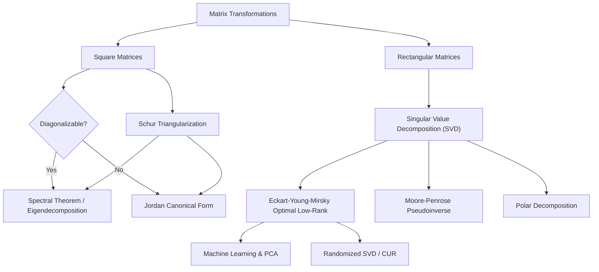

# Canonical Forms and Singular Value Decomposition (SVD)

## 1. Master Overview

In linear algebra, canonical forms are standard ways of presenting objects as mathematical expressions. They expose the fundamental structure of a linear operator or matrix. While eigenvalues and eigenvectors (diagonalization) are deeply powerful, not every matrix is diagonalizable. This limitation motivates the **Jordan Canonical Form (JCF)** and the universally applicable **Schur Triangularization**.

Beyond square matrices, we need tools to analyze rectangular systems. The **Singular Value Decomposition (SVD)** stands as the crown jewel of applied linear algebra. It generalizes diagonalization to any $m \times n$ matrix, decoupling the transformation into a rotation, a scaling, and another rotation.

From the SVD, we derive the **Moore-Penrose Pseudoinverse**, **Polar Decomposition**, and the optimal low-rank approximation given by the **Eckart-Young-Mirsky Theorem**. Modern machine learning scales these ideas further using **Randomized SVD**, **CUR Decomposition**, and **Interpolative Decomposition**.

This module bridges the gap between theoretical matrix analysis (Schur, JCF) and modern numerical linear algebra (SVD, CUR, Randomized methods) used in AI.

---

## 2. First-Principles Framework

The `first_principles.md` document follows a strict 20-part framework:

1. **Phenomenon**: Geometric transformations, invariant subspaces, and information compression.
2. **Goal**: Isolate orthogonal bases that optimally explain variance or decouple systems.
3. **Assumptions**: Properties of matrices (real, complex, Hermitian, defective).
4. **Variables**: Input vectors, transformed states, error residuals.
5. **Parameters**: Singular values $\sigma_i$, generalized eigenvalues $\lambda_i$, rank $k$.
6. **Units & Dimensions**: $m \times n$ mappings between vector spaces.
7. **Domain Constraints**: Field restrictions ($\mathbb{R}, \mathbb{C}$), rank limits, non-negativity of singular values.
8. **Governing Principles**: Orthogonal projection, spectral mapping, invariant subspaces, rank-$k$ optimality.
9. **Mathematical Formulation**: JCF ($A = P J P^{-1}$), Schur ($A = U T U^H$), SVD ($A = U \Sigma V^T$).
10. **Derivation**: Step-by-step rigorous proofs of Schur and SVD.
11. **Computation**: Algorithms for SVD, Randomized SVD.
12. **Algorithmic Complexity**: Flop counts ($\mathcal{O}(mn^2)$ for full SVD).
13. **Edge Cases**: Defective matrices, null spaces, repeated singular values.
14. **Stability & Robustness**: Condition numbers, numerical stability of orthogonal transformations.
15. **Verification**: Eckart-Young approximation error norms, pseudo-inverse properties.
16. **Interpretation**: Rotations, stretchings, latent factors.
17. **Real-World Applications**: Data compression, control theory, signal processing.
18. **AI Connections**: PCA, Latent Semantic Analysis (LSA), Transformer attention matrices, low-rank adaptation (LoRA).
19. **Limitations**: Computational bottlenecks for massive dense matrices.
20. **Future Directions**: Distributed factorizations, sketched SVDs, quantum SVDs.

---

## 3. Mermaid Concept Map

---

## 4. Core Pillars Table

| Concept | Mathematical Formulation | Intuition & Geometric Meaning | Application |
| :--- | :--- | :--- | :--- |
| **Schur Form** | $A = U T U^H$ | Any matrix can be upper-triangularized via a unitary basis. | Numerically stable eigenvalue computation (QR algorithm). |
| **Jordan Form** | $A = P J P^{-1}$ | Block-diagonal form handling defective matrices with generalized eigenvectors. | Theoretical solutions to linear ODE systems. |
| **SVD** | $A = U \Sigma V^T$ | Every matrix decomposes into orthogonal inputs ($V^T$), scaling ($\Sigma$), orthogonal outputs ($U$). | Universally applicable data compression, PCA, image processing. |
| **Pseudoinverse** | $A^+ = V \Sigma^+ U^T$ | Best-fit generalization of inverse for non-square or rank-deficient systems. | Least-squares, solving underdetermined systems. |
| **Eckart-Young** | $A_k = \sum_{i=1}^k \sigma_i u_i v_i^T$ | The rank-$k$ matrix minimizing Frobenius and Spectral norm distance to $A$. | LSA, recommendation systems, low-rank adaptation (LoRA). |
| **Polar Decomp** | $A = Q H$ | Factoring a transformation into a rotation ($Q$) followed by a stretch ($H$). | Computer graphics, continuum mechanics. |

---

## 5. Misconceptions

1. **"SVD and Eigendecomposition are the same."**
   - *Correction*: Eigendecomposition requires a square matrix and uses the same basis for domain and codomain (often non-orthogonal). SVD applies to *any* shape and uses two orthogonal bases ($U, V$).

2. **"Jordan Canonical Form is used for computation."**
   - *Correction*: JCF is highly unstable numerically (small perturbations destroy the Jordan blocks). Schur form is used for practical computation.

3. **"The Pseudoinverse always solves $A x = b$ exactly."**
   - *Correction*: It gives the exact solution if $b \in \text{im}(A)$. Otherwise, it gives the least-squares solution with the minimum Euclidean norm.

4. **"Low-rank approximation by SVD is computationally optimal for large data."**
   - *Correction*: Exact SVD is $\mathcal{O}(mn^2)$. For massive data, Randomized SVD or CUR decompositions are required.

---

## 6. Exercise Index

The `exercises.md` file contains **40 Solved Problems**:

- **Foundation**: 5 Problems — Core definitions, shapes, identities.
- **Understanding**: 10 Problems — Computing SVD, pseudoinverses, polar decompositions.
- **Advanced**: 10 Problems — Recommender systems, PCA proofs, optimal rank-$k$ errors.
- **Olympiad**: 10 Problems — Spectral norm inequalities, JCF proofs, continuity of singular values.
- **Research**: 5 Problems — Randomized SVD bounds, CUR error guarantees, tensor SVD extensions.

---

## 7. Literature References

This module synthesizes concepts from benchmark linear algebra texts:

- **Trefethen, L. N., & Bau III, D.** *Numerical Linear Algebra*. Lectures 4–5 (SVD, Projectors), Lecture 11 (Pseudoinverse), Lecture 24 (Schur).
- **Golub, G. H., & Van Loan, C. F.** *Matrix Computations*. Chapter 2 (Matrix Analysis), Chapter 8 (Symmetric Eigenvalue and SVD).
- **Horn, R. A., & Johnson, C. R.** *Matrix Analysis*. Chapter 3 (Canonical Forms), Chapter 7 (SVD & Polar Decomposition).
- **Strang, G.** *Linear Algebra and Learning from Data*. Chapter 7 (SVD in Machine Learning, Randomized Matrix Math).

