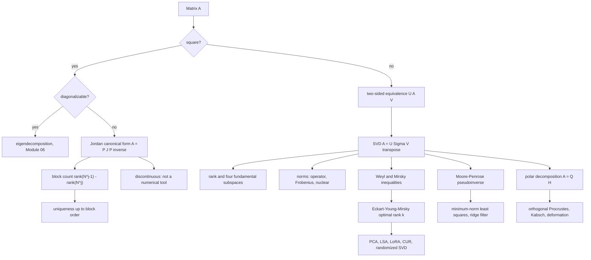

# Module 07 — Canonical Forms and the Singular Value Decomposition

[Module 06](../06_eigenvalues_eigenvectors_spectral_theory/) answered one question: when is there a
basis in which $A$ acts diagonally? Symmetric matrices always have one; general matrices do not,
and rectangular matrices cannot even be asked.

This module closes both gaps. The **Jordan canonical form** says exactly how much of diagonality
survives when eigenvectors run out: a diagonal of eigenvalues plus a single superdiagonal of ones,
and nothing else. It is a complete invariant for similarity, and the rank formula
$\operatorname{rank}((A-\lambda I)^{j-1}) - \operatorname{rank}((A-\lambda I)^{j})$ both counts its
blocks and makes it unique.

The **singular value decomposition** gives up on using one basis for domain and codomain. With two
independent orthonormal bases, *every* matrix becomes diagonal — no symmetry, no squareness, no
full rank required. Rank, the four fundamental subspaces, the operator, Frobenius and nuclear
norms, the condition number, the pseudoinverse, the optimal low-rank approximation and the polar
decomposition are all read off one SVD.

The proofs here are the honest ones. The Jordan form is built from the primary decomposition and
the cyclic decomposition of a nilpotent operator, both proved. Eckart-Young-Mirsky is proved in the
Frobenius norm through the Mirsky singular-value inequality, not through the common argument that
zeroes off-diagonal entries — an operation that can raise the rank, as
[`first_principles.ipynb`](first_principles.ipynb) Section 7.3 runs and shows.

> [!NOTE]
> **Eckart-Young-Mirsky.** For every $A$ and every $k \lt \operatorname{rank}(A)$, the truncated SVD
> $A_k = \sum_{i \le k}\sigma_i u_i v_i^{\top}$ minimizes $\lVert A - B \rVert$ over all
> $\operatorname{rank}(B) \le k$, in both the operator and the Frobenius norm, with
> $\lVert A - A_k \rVert_{\mathrm{op}} = \sigma_{k+1}$ and
> $\lVert A - A_k \rVert_F^2 = \sum_{i \gt k}\sigma_i^2$. The error is exactly what was discarded.

## Prerequisites and downstream modules

**Prerequisites.**

- [Module 06 — Eigenvalues, Eigenvectors and Spectral Theory](../06_eigenvalues_eigenvectors_spectral_theory/) — the spectral theorem for $A^{\top}A$, Schur triangularization and Courant-Fischer, all used directly in the proofs here.

Two earlier modules are used as tools rather than as gates:
[Module 04](../04_orthogonality_projections_and_qr/) supplies Gram-Schmidt basis extension, and
[Module 05](../05_determinants_trace_and_matrix_polynomials/) supplies Cayley-Hamilton, which
Step 1 of the Jordan proof needs.

**Downstream modules unlocked by this one.**

- [Module 09 — Numerical Spectrum Algorithms](../09_numerical_spectrum_algorithms/)
- [Module 10 — Matrix Calculus, Graphs and AI Applications](../10_matrix_calculus_graph_and_ai_applications/)
- [calculus/15 — Ordinary Differential Equations](../../calculus/15_ordinary_differential_equations/)
- [numerical_computing/03 — Conditioning and Condition Numbers](../../numerical_computing/03_conditioning_and_condition_numbers/)
- [numerical_methods/07 — Linear Least Squares](../../numerical_methods/07_linear_least_squares/)
- [optimization/07 — Linear, Quadratic and Conic Programs](../../optimization/07_linear_quadratic_conic_programs/)
- [differential_equations/04 — Systems of ODEs and the Matrix Exponential](../../differential_equations/04_systems_of_odes_matrix_exponential/)

The full dependency graph is in [docs/prerequisites.md](../../docs/prerequisites.md), and the
symbol conventions used below are fixed in [docs/notation.md](../../docs/notation.md).

## Learning outcomes

After working through this module you will be able to:

- compute the Jordan form of a small defective matrix from its rank sequence, and build the chain vectors that realize it;
- explain why the Jordan form is unique and why it is nonetheless useless in floating point;
- compute a full SVD of a small matrix by hand, from either side, and read rank, the four fundamental subspaces and three norms off it;
- reproduce both existence proofs of the SVD, the algebraic one through $A^{\top}A$ and the variational one through compactness of the unit sphere;
- state and use the Weyl and Mirsky inequalities for singular values, and derive Eckart-Young-Mirsky from them in both norms;
- construct the Moore-Penrose pseudoinverse, prove it unique, and use it for minimum-norm least squares;
- factor a matrix into rotation and stretch, and use the same factor to solve the orthogonal Procrustes problem;
- apply all of this to PCA, ridge regression, low-rank adaptation, CUR, deformation gradients and rigid-body alignment.

## Concept map

## Notation

Drawn from [docs/notation.md](../../docs/notation.md).

| Symbol | Meaning | Convention |
|---|---|---|
| $\sigma_1 \ge \sigma_2 \ge \cdots \ge \sigma_r \gt 0$ | singular values | descending |
| $A = U\Sigma V^{\top}$ | singular value decomposition | $U$, $V$ orthogonal; $\Sigma$ is the singular-value matrix, never a covariance |
| $u_i$, $v_i$ | left and right singular vectors | $Av_i = \sigma_i u_i$ |
| $A_k = \sum_{i \le k}\sigma_i u_i v_i^{\top}$ | truncated SVD | an approximation, not a factorization |
| $r = \operatorname{rank}(A)$ | rank | the number of positive $\sigma_i$ |
| $\lVert A \rVert_{\mathrm{op}}$, $\lVert A \rVert_F$, $\lVert A \rVert_{\ast}$ | operator, Frobenius, nuclear norm | $\sigma_1$; $(\sum_i \sigma_i^2)^{1/2}$; $\sum_i \sigma_i$ |
| $\kappa_2(A) = \sigma_1/\sigma_n$ | 2-norm condition number | full-rank square or tall $A$ |
| $A^{+}$ | Moore-Penrose pseudoinverse | $V\Sigma^{+}U^{\top}$, with $1/0$ read as $0$ |
| $J_k(\lambda)$, $N_k$ | Jordan block, nilpotent shift | $J_k(\lambda) = \lambda I_k + N_k$ |
| $K_\lambda$, $m_\lambda$, $g_\lambda$ | generalized eigenspace, algebraic and geometric multiplicity | $\dim K_\lambda = m_\lambda$ |
| $A = QH$ | right polar decomposition | $Q^{\top}Q = I_n$, $H = (A^{\top}A)^{1/2} \succeq 0$ |
| $\lambda_1 \ge \cdots \ge \lambda_n$ | eigenvalues of a symmetric matrix | descending, as in Module 06 |

## Core results

| Result | Statement | Hypotheses | Where |
|---|---|---|---|
| Jordan canonical form | $A = PJP^{-1}$ with $J$ a Jordan matrix | field algebraically closed | Theorem 4.1, Proof 5.1 |
| Block count and uniqueness | blocks of size $\ge j$ number $r_{j-1} - r_j$ | none further | Theorem 4.2, Proof 5.2 |
| SVD existence | $A = U\Sigma V^{\top}$ | none at all | Theorem 4.3, Proofs 5.3 and 5.4 |
| What the SVD reads off | rank, four subspaces, three norms, uniqueness | $A = U\Sigma V^{\top}$ | Theorem 4.4, Proof 5.5 |
| Weyl and Mirsky | $\sigma_{i+j-1}(X+Y) \le \sigma_i(X) + \sigma_j(Y)$ | $X$, $Y$ of equal shape | Theorem 4.5, Proof 5.6 |
| Eckart-Young-Mirsky | $A_k$ minimizes $\lVert A - B \rVert$ over $\operatorname{rank}(B) \le k$ | operator or Frobenius norm | Theorem 4.6, Proof 5.7 |
| Pseudoinverse | $A^{+}$ exists, is unique, gives minimum-norm least squares | none | Theorem 4.7, Proof 5.8 |
| Polar decomposition | $A = QH$, $H$ unique; $Q$ is the nearest orthogonal matrix | $m \ge n$ | Theorem 4.8, Proof 5.9 |
| Randomized range finder, Wedin | expected error and singular-subspace perturbation | cited, not proved | Theorem 4.9 |
| Hermitian dilation | the spectrum of $\left[\begin{smallmatrix}0 & A \\ A^{\top} & 0\end{smallmatrix}\right]$ is $\pm\sigma_i$ plus zeros | none | Proposition 4.10, Proof 5.10 |

## Common misconceptions

1. **"Singular values are eigenvalues."** Only for positive semidefinite matrices. For symmetric
   $A$ they are $\lvert \lambda_i \rvert$; for the non-normal
   $\left[\begin{smallmatrix}0 & 10 \\ 0 & 0\end{smallmatrix}\right]$ the spectrum is
   $\lbrace 0, 0 \rbrace$ while $\sigma_1 = 10$.

2. **"The Jordan form is what you compute for a defective matrix."** It is discontinuous in the
   entries. $\left[\begin{smallmatrix}0 & 1 \\ \varepsilon & 0\end{smallmatrix}\right]$ is
   diagonalizable for every $\varepsilon \gt 0$, and its eigenvalues move by $\sqrt{\varepsilon}$
   — an amplification of $10^{8}$ at $\varepsilon = 10^{-16}$. Software computes the Schur form and
   the SVD instead.

3. **"The Frobenius half of Eckart-Young follows by zeroing the off-diagonals."** It does not.
   Zeroing off-diagonal entries can *raise* the rank: the all-ones $2 \times 2$ matrix has rank
   $1$, its diagonal part has rank $2$. Section 7.3 exhibits a rank-1 matrix whose "improved"
   version scores $3.25$ against a true minimum of $4$ — proof that the step leaves the feasible
   set.

4. **"The pseudoinverse always solves $Ax = b$."** It solves it exactly when
   $b \in \operatorname{Col}(A)$; otherwise it returns the minimum-norm least-squares solution.
   And $A \mapsto A^{+}$ is not continuous at a rank drop.

5. **"PCA means taking the eigendecomposition of the covariance matrix."** That squares the
   condition number. Section 8.1 shows a design matrix with $\kappa_2 = 10^{8}$ whose smallest
   singular value is recovered to $5 \times 10^{-10}$ by the SVD and to only $0.84$ percent by the
   covariance route.

6. **"Truncated SVD is unique."** $A_k$ is *a* minimizer, not *the* minimizer: when
   $\sigma_k = \sigma_{k+1}$ others exist, and the singular vectors inside a repeated singular
   value are determined only up to an orthogonal mixing (Problem L3.3).

7. **"Polar decomposition gives a rotation."** It gives an *orthogonal* matrix, which may have
   determinant $-1$. Rigid-body alignment needs the determinant correction of Problem L2.10;
   without it the fitted transform can be a mirror image.

## Exercise index

[`exercises.ipynb`](exercises.ipynb) contains 42 problems, all fully solved, in four tiers. Every problem
carries a statement, a short intuition, a stepwise solution, a boxed answer, a key takeaway, and —
where the answer is numeric or algorithmic — a code cell that recomputes it.

| Tier | Count | Coverage |
|---|---:|---|
| L0 — Concept Checks | 8 | existence of the SVD, scalar pseudoinverse, outer products, condition number, rank-one truncation, transposes, Jordan blocks, square-zero matrices |
| L1 — Foundations | 15 | Frobenius norm from singular values, singular vectors as eigenvectors, explicit SVDs, symmetric case, truncation error, pseudoinverses and least squares, three polar decompositions, defective Jordan forms, Jordan chains, real Schur forms |
| L2 — Applications (AI/ML and Physics) | 10 | PCA, latent semantic analysis, low-rank adaptation, energy-based rank selection, conditioning of a solve, CUR cores, HOSVD all-orthogonality, the fixed-rank manifold, deformation gradients, rigid-body alignment |
| L3 — Challenge Proofs | 9 | uniqueness of the pseudoinverse, Weyl via Courant-Fischer, SVD non-uniqueness, minimal polynomials from the Jordan form, skew-symmetric spectra, orthogonality criterion, the nuclear norm as a support function, the randomized range-finder bound, interpolative decomposition |

Tier L2 contains two genuine physics problems: the polar decomposition of a deformation gradient
with material frame indifference (Problem L2.9) and the Kabsch algorithm for rigid-body
superposition (Problem L2.10).

## References

**Textbooks.**

- Trefethen, L. N. and Bau, D. *Numerical Linear Algebra* — Lecture 4 (the SVD and the geometric existence proof), Lecture 5 (low-rank approximation, Theorem 5.8), Lecture 11 (least squares and the pseudoinverse).
- Horn, R. A. and Johnson, C. R. *Matrix Analysis*, 2nd ed. — Chapter 3 (Jordan existence, Theorem 3.1.11, and the block-count and uniqueness statements in section 3.1.3), Chapter 7 (SVD Theorem 7.3.5, polar decomposition Theorem 7.3.1, singular-value perturbation Theorem 7.3.8, Eckart-Young-Mirsky Corollary 7.4.9.3).
- Golub, G. H. and Van Loan, C. F. *Matrix Computations*, 4th ed. — section 2.4 (SVD properties), section 5.5 (pseudoinverse and rank-deficient least squares), section 8.6 (one-sided Jacobi SVD).
- Strang, G. *Linear Algebra and Learning from Data* — section I.8 (singular values and vectors), section I.9 (principal components and the best low-rank matrix), section II.4 (randomized linear algebra).
- Stewart, G. W. and Sun, J.-G. *Matrix Perturbation Theory* — Chapter IV section 4 (singular value inequalities), Chapter V section 4 (Wedin's theorem).
- Higham, N. J. *Accuracy and Stability of Numerical Algorithms*, 2nd ed., Chapter 20 — backward stability of the computed SVD.

**Papers.**

- Eckart, C. and Young, G. "The approximation of one matrix by another of lower rank", *Psychometrika* **1**(3) (1936), 211-218.
- Mirsky, L. "Symmetric gauge functions and unitarily invariant norms", *Quarterly Journal of Mathematics* **11** (1960), 50-59.
- Wedin, P.-A. "Perturbation bounds in connection with singular value decomposition", *BIT* **12**(1) (1972), 99-111.
- Halko, N., Martinsson, P.-G. and Tropp, J. A. "Finding structure with randomness", *SIAM Review* **53**(2) (2011), 217-288 — Algorithms 4.1 and 4.3, Theorem 9.1 and Theorem 10.5.
- Drineas, P., Mahoney, M. W. and Muthukrishnan, S. "Relative-error CUR matrix decompositions", *SIAM Journal on Matrix Analysis and Applications* **30**(2) (2008), 844-881, Theorem 4.
- Gu, M. and Eisenstat, S. C. "Efficient algorithms for computing a strong rank-revealing QR factorization", *SIAM Journal on Scientific Computing* **17**(4) (1996), 848-869, Theorem 3.2.
- Kabsch, W. "A solution for the best rotation to relate two sets of vectors", *Acta Crystallographica* **A32** (1976), 922-923.

**In this directory.**

- [`first_principles.ipynb`](first_principles.ipynb) — theory, ten numbered proofs, six worked examples, twelve executable code cells and three figures.
- [`exercises.ipynb`](exercises.ipynb) — the 42 solved problems indexed above.
