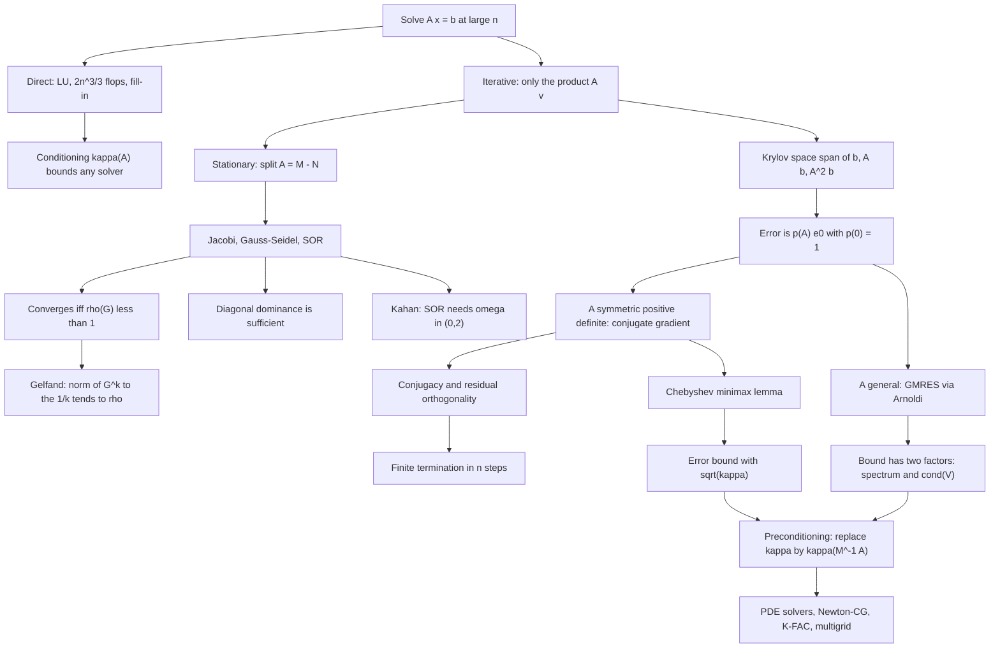

# Module 08 — Numerical Linear Algebra and Iterative Solvers

Every earlier module solves $Ax = b$ by factoring $A$. That costs $\tfrac23 n^3$ flops and fills
in the zeros, so at $n = 10^6$ it is not slow — it is impossible. This module builds solvers whose
only contact with $A$ is the product $Av$.

Two questions decide everything about such a solver: does it converge, and how fast. For a
stationary method the answer is the spectral radius of one matrix. For the conjugate gradient
method it is $\sqrt{\kappa_2(A)}$, and that square root is the difference between $10^4$
iterations and $10^2$.

The route is the honest one. The spectral-radius criterion is proved from Schur triangularization,
with Gelfand's formula as a corollary. The conjugate gradient algorithm is written down before it
is analysed, its conjugacy and residual orthogonality are proved by a single simultaneous
induction, and the Chebyshev bound is derived from an equioscillation argument rather than
asserted.

The last third is about what the theory does not promise: two matrices on which GMRES stalls for
completely different reasons, a positive definite matrix on which Jacobi diverges, and an
iteration whose error grows nineteen-fold before it decays.

> [!NOTE]
> **Conjugate gradient error bound.** For symmetric positive definite $A$ with
> $\kappa = \kappa_2(A)$, the energy-norm error satisfies
> $\lVert e_k \rVert_A \le 2\bigl((\sqrt{\kappa}-1)/(\sqrt{\kappa}+1)\bigr)^{k}\lVert e_0 \rVert_A$.
> Gradient descent on the same system contracts at $(\kappa-1)/(\kappa+1)$ instead. The square
> root is the whole point of Krylov methods.

## Prerequisites and downstream modules

**Prerequisites.**

- [Module 06 — Eigenvalues, Eigenvectors and Spectral Theory](../06_eigenvalues_eigenvectors_spectral_theory/) — Schur triangularization, the spectral theorem and the spectral radius, all used in the convergence proofs.
- [numerical_computing/03 — Conditioning and Condition Numbers](../../numerical_computing/03_conditioning_and_condition_numbers/) — the floating-point model, backward stability, and the separation of conditioning from stability.

**Downstream modules unlocked by this one.**

- [Module 09 — Numerical Spectrum Algorithms](../09_numerical_spectrum_algorithms/)

The full dependency graph is in [docs/prerequisites.md](../../docs/prerequisites.md), and the
symbol conventions used below are fixed in [docs/notation.md](../../docs/notation.md).

## Learning outcomes

After working through this module you will be able to:

- bound the error of a computed solution by the condition number times the data perturbation, and explain why a backward stable solver can still return a bad answer;
- write down the Jacobi, Gauss-Seidel and SOR splittings and decide convergence from $\rho(M^{-1}N)$;
- prove that a stationary iteration converges for every starting vector if and only if $\rho(G) \lt 1$, and derive Gelfand's formula from the same construction;
- prove that strict diagonal dominance suffices for Jacobi and Gauss-Seidel, and exhibit a positive definite matrix on which Jacobi diverges;
- state the conjugate gradient algorithm, prove conjugacy, residual orthogonality, Krylov optimality and finite termination, and predict its rate from the spectrum;
- prove the Chebyshev minimax lemma by equioscillation and deduce the $\sqrt{\kappa}$ bound;
- derive the Arnoldi relation, reduce GMRES to a small least-squares problem, and explain the two independent factors that govern its convergence;
- choose and analyse a preconditioner, and predict the resulting iteration count from $\kappa_2(M^{-1}A)$;
- recognize the failure modes: SOR outside $(0,2)$, CG on an indefinite matrix, GMRES on a spectrum encircling the origin, and transient growth when $\rho \lt 1$.

## Concept map

## Notation

Drawn from [docs/notation.md](../../docs/notation.md).

| Symbol | Meaning | Convention |
|---|---|---|
| $x_k$, $e_k = x - x_k$, $r_k = b - Ax_k$ | iterate, error, residual | subscript indexes iterations |
| $\kappa(A) = \lVert A \rVert \lVert A^{-1} \rVert$ | condition number | $\kappa_2(A) = \sigma_1/\sigma_n$ |
| $\rho(A)$ | spectral radius | $\max_i \lvert \lambda_i \rvert$ |
| $\lVert A \rVert_{\mathrm{op}}$, $\lVert A \rVert_F$ | operator and Frobenius norms | write with `\lVert`, never a bare pipe |
| $A = D - L - U$ | diagonal, strict lower, strict upper parts | signs as shown |
| $M$, $N$, $G = M^{-1}N$ | splitting and iteration matrix | $A = M - N$ |
| $\omega \in (0,2)$ | SOR relaxation parameter | $\omega = 1$ is Gauss-Seidel |
| $\mathcal{K}_k(A,v)$ | Krylov subspace | $\operatorname{span}\lbrace v, Av, \ldots, A^{k-1}v \rbrace$ |
| $\lVert v \rVert_A = \sqrt{v^{\top}Av}$ | energy norm | $A$ symmetric positive definite |
| $p_k$, $\alpha_k$, $\beta_k$ | CG direction, step, conjugacy coefficient | Definition 3.8 |
| $T_k$ | Chebyshev polynomial of the first kind | $T_{k+1} = 2yT_k - T_{k-1}$ |
| $u = 2^{-t}$, $\varepsilon_{\mathrm{mach}} = 2u$ | unit roundoff, gap at $1$ | $t = 53$ for binary64 |
| $\gamma_n = nu/(1-nu)$ | Wilkinson's rounding accumulator | |
| $\lambda_1 \ge \cdots \ge \lambda_n$ | eigenvalues of a symmetric matrix | descending |

## Core results

| Result | Statement | Hypotheses | Where |
|---|---|---|---|
| Error amplification | relative error $\le \kappa(A)$ times relative perturbation, and attained | $A$ non-singular | Theorem 4.1, Proof 5.1 |
| Convergence criterion | iteration converges for every $x_0$ iff $\rho(G) \lt 1$ | $M$ non-singular | Theorem 4.2, Proof 5.2 |
| Gelfand's formula | $\lVert G^k \rVert^{1/k} \to \rho(G)$ | none | Theorem 4.2, Proof 5.2 |
| Diagonal dominance | $\rho(G_{\mathrm{GS}}) \le \lVert G_{\mathrm{GS}} \rVert_\infty \le \lVert G_{\mathrm{J}} \rVert_\infty \lt 1$ | strict row dominance | Theorem 4.3, Proof 5.3 |
| Kahan | $\rho(G_\omega) \ge \lvert 1-\omega \rvert$ | $D$ invertible | Theorem 4.4, Proof 5.4 |
| Ostrowski-Reich | SOR converges iff $0 \lt \omega \lt 2$ | $A$ symmetric positive definite | Theorem 4.5, cited |
| Conjugate gradient | conjugacy, residual orthogonality, energy-norm optimality, termination in $\le n$ steps | $A$ symmetric positive definite | Theorem 4.6, Proof 5.5 |
| Chebyshev minimax | the scaled $T_k$ is the unique minimizer over $p(0)=1$ | $0 \lt a \le b$ | Lemma 5.6.1 |
| CG error bound | $\lVert e_k \rVert_A \le 2\bigl((\sqrt\kappa-1)/(\sqrt\kappa+1)\bigr)^k \lVert e_0 \rVert_A$ | $A$ symmetric positive definite | Theorem 4.7, Proof 5.6 |
| GMRES | Arnoldi relation, small least squares, monotone residuals, bound with $\kappa_2(V)$ | $A$ non-singular; part 4 needs $A$ diagonalizable | Theorem 4.8, Proof 5.7 |
| Preconditioning | $\kappa_2(L^{-1}AL^{-\top}) = \kappa_2(M^{-1}A)$ | $A$, $M$ symmetric positive definite | Theorem 4.9, Proof 5.8 |
| Multigrid | one V-cycle costs $O(n)$; mesh-independent rate | smoothing and approximation properties | Theorem 4.10, Proof 5.9 (cost only) |

## Common misconceptions

1. **"A large error means a bad algorithm."** It usually means an ill-conditioned problem. A
   backward stable solver has forward error about $\kappa(A)u$ and no better, and Theorem 4.1
   shows the bound is attained — Example 6.1 hits it exactly on a $3 \times 3$ matrix.

2. **"$\rho(G) \lt 1$ means the error decreases every step."** It means it decreases
   *eventually*. Example 6.5 has $\rho(G) = 0.9$ while $\lVert G^k \rVert_{\mathrm{op}}$ climbs to
   $19.38$ at $k = 9$ and does not return below $1$ until $k = 55$.

3. **"Positive definiteness makes Jacobi converge."** It does not. Section 7.4 runs
   $A = 0.1I + 0.9\mathbf{1}\mathbf{1}^{\top}$, which is positive definite with spectrum
   $\{2.8, 0.1, 0.1\}$ and $\rho(G_{\mathrm{J}}) = 1.8$; Gauss-Seidel on the same matrix
   converges.

4. **"Gauss-Seidel always beats Jacobi."** Only under extra structure — consistent ordering, or
   the sign pattern of Problem L3.3. In general neither dominates, and the previous item shows
   one diverging while the other converges.

5. **"CG needs only symmetry."** It needs positive definiteness. On
   $A = \operatorname{diag}(1,-1)$ with $b = (1,1)^{\top}$ the first step computes
   $p_0^{\top}Ap_0 = 0$ exactly and divides by zero. Symmetric indefinite systems go to MINRES.

6. **"The CG bound tells you how many iterations you need."** It tells you an upper bound from
   $\lambda_{\min}$ and $\lambda_{\max}$ alone. Section 7.2 runs two matrices with the identical
   $\kappa = 100$: one takes $47$ steps, the other $12$, against a common bound of $119$.

7. **"GMRES stalls because the matrix is non-normal."** The $n \times n$ cyclic shift is a
   permutation matrix — orthogonal, hence normal, with $\kappa_2(V) = 1$ — and GMRES holds its
   residual at exactly $\lVert r_0 \rVert$ for $n-1$ steps. The cause there is a spectrum
   encircling the origin. The genuinely non-normal failure is a different matrix, defective with
   spectrum $\{1\}$, which stalls at relative residual $0.32$.

8. **"Preconditioning is just rescaling."** It replaces the spectrum. Section 8 cuts $\kappa_2$
   from $2.74 \times 10^{4}$ to $116.5$ with one diagonal, taking the iteration count from $670$
   to $54$.

## Exercise index

[`exercises.ipynb`](exercises.ipynb) contains 43 fully solved problems in four tiers. Every
problem carries a statement, a short intuition, a stepwise solution, a boxed answer, a key
takeaway, and a code cell that recomputes the answer and prints the check.

| Tier | Count | Coverage |
|---|---:|---|
| L0 — Concept Checks | 9 | unit roundoff, sparse flop counts, condition number of an orthogonal and of a diagonal matrix, Krylov dimension, the Gauss-Seidel splitting, residual against error, a $2 \times 2$ Jacobi matrix and its spectral radius |
| L1 — Foundations | 14 | diagonal dominance, the Thomas algorithm, Gauss-Seidel spectral radius, Kahan's condition, optimal SOR, the Laplacian condition number, exact line search, conjugate directions, the CG coefficients, the Arnoldi relation, GMRES as least squares, residual monotonicity, Lanczos |
| L2 — Applications (AI/ML and Physics) | 12 | gradient descent as Richardson iteration, optimal step size, CG iteration counts, split preconditioning, spectral clustering by a preconditioner, MINRES, electrostatics of a charged slab, implicit Euler for the heat equation, K-FAC, randomized Nystrom, PageRank, Krylov solvers for a Schrodinger-type operator |
| L3 — Challenge Proofs | 8 | distance to singularity, the Chebyshev minimax lemma, Stein-Rosenberg, Elman's field-of-values bound, superlinear CG under a low-rank perturbation, Young's relation, randomized Kaczmarz, GMRES stagnation on a permutation |

Tier L2 contains three genuine physics problems: the electrostatic potential of a uniformly
charged slab (Problem L2.7), the conditioning of implicit Euler for the heat equation
(Problem L2.8), and Krylov solvers for a Schrodinger-type elliptic operator (Problem L2.12).

## References

**Textbooks.**

- Trefethen, L. N. and Bau, D. *Numerical Linear Algebra*, SIAM 1997 — Lecture 12 (conditioning), Lectures 14-15 (backward stability), Lecture 33 (Arnoldi), Lecture 35 (GMRES), Lecture 38 (conjugate gradients, Theorem 38.5).
- Saad, Y. *Iterative Methods for Sparse Linear Systems*, 2nd ed., SIAM 2003 — chapter 4 (stationary methods, Theorems 4.1-4.9), chapter 6 (Krylov methods, Theorem 6.11), chapter 10 (preconditioning).
- Golub, G. H. and Van Loan, C. F. *Matrix Computations*, 4th ed., JHU Press 2013 — section 11.2 (classical iterations), section 11.3 (conjugate gradients, Theorem 11.3.3), section 11.5 (preconditioning).
- Higham, N. J. *Accuracy and Stability of Numerical Algorithms*, 2nd ed., SIAM 2002 — section 3.1 ($\gamma_n$), Theorem 8.5 (componentwise backward error of substitution), chapter 7 (perturbation theory).
- Nocedal, J. and Wright, S. J. *Numerical Optimization*, 2nd ed., Springer 2006 — chapter 5 (conjugate gradient, Theorems 5.1-5.5), section 7.1 (Newton-CG).
- Young, D. M. *Iterative Solution of Large Linear Systems*, Academic Press 1971 — Theorem 3.4.1 (Kahan), Theorem 4.3.6 (Ostrowski-Reich), Theorem 5.2.1 (consistent ordering), chapter 6 (optimal SOR).
- Varga, R. S. *Matrix Iterative Analysis*, 2nd ed., Springer 2000 — Theorem 3.11 (Ostrowski-Reich), Theorem 3.15 (Stein-Rosenberg), Theorem 4.3 (consistent ordering).
- Hackbusch, W. *Multi-Grid Methods and Applications*, Springer 1985 — Theorems 6.1.7, 7.1.2, 7.2.2 (smoothing and approximation properties, mesh-independent convergence).
- Briggs, W. L., Henson, V. E. and McCormick, S. F. *A Multigrid Tutorial*, 2nd ed., SIAM 2000 — chapters 2-4.

**Papers.**

- Hestenes, M. R. and Stiefel, E. "Methods of conjugate gradients for solving linear systems", *J. Res. Nat. Bur. Standards* **49**(6) (1952), 409-436.
- Saad, Y. and Schultz, M. H. "GMRES: a generalized minimal residual algorithm for solving nonsymmetric linear systems", *SIAM J. Sci. Stat. Comput.* **7**(3) (1986), 856-869.
- Paige, C. C. "Error analysis of the Lanczos algorithm for tridiagonalizing a symmetric matrix", *IMA J. Appl. Math.* **18**(3) (1976), 341-349.
- Greenbaum, A., Ptak, V. and Strakos, Z. "Any nonincreasing convergence curve is possible for GMRES", *SIAM J. Matrix Anal. Appl.* **17**(3) (1996), 465-469.
- Strohmer, T. and Vershynin, R. "A randomized Kaczmarz algorithm with exponential convergence", *J. Fourier Anal. Appl.* **15**(2) (2009), 262-278.

**In this directory.**

- [`first_principles.ipynb`](first_principles.ipynb) — theory, proofs, worked examples, twelve executable code cells and four figures.
- [`exercises.ipynb`](exercises.ipynb) — the 43 solved problems indexed above.
