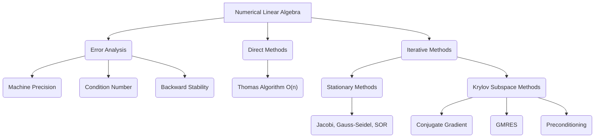

# Topic 08: Numerical Linear Algebra & Iterative Solvers

## 1. Master Overview

This module explores **Numerical Linear Algebra**, transitioning from theoretical linear algebra (exact arithmetic) to applied linear algebra (floating-point arithmetic).

We investigate how linear systems $Ax = b$ and eigenvalue problems are solved in reality, where infinite precision is impossible, and matrices can be massive and sparse.

We cover condition numbers, stability, direct vs. iterative methods, and the highly powerful Krylov Subspace Methods (Conjugate Gradient, GMRES) fundamental to modern large-scale scientific computing and AI optimization.

## 2. First-Principles Framework

* **Phenomenon**: Continuous and discrete systems modeled by large linear systems.
* **Assumptions**: Computations occur in finite-precision floating-point arithmetic.
* **Governing Principles**: Error amplification bound, backward stability, spectral radius convergence, and polynomial approximation in Krylov subspaces.

## 3. Mermaid Concept Map

## 4. Core Pillars Table

| Pillar | Concept | Mathematical Representation | Significance |
| :--- | :--- | :--- | :--- |
| **Stability** | Backward Error Analysis | $\tilde{f}(x) = f(x + \Delta x)$ | Solves exactly a slightly perturbed problem. |
| **Conditioning** | Condition Number | $\kappa(A) = \Vert A \Vert \cdot \Vert A^{-1} \Vert$ | Bounds error amplification: $\frac{\Vert \Delta x \Vert}{\Vert x \Vert} \le \kappa(A) \frac{\Vert \Delta b \Vert}{\Vert b \Vert}$. |
| **Iterative Convergence** | Spectral Radius | $\rho(G) < 1$ | Guarantees stationary method convergence ($G = M^{-1}N$). |
| **Krylov Subspaces** | Space Generation | $\mathcal{K}_k(A, b) = \text{span}\{b, Ab, \dots, A^{k-1}b\}$ | Finds optimal solutions in growing nested subspaces. |

## 5. Common Misconceptions

> **Common Mistake:** An algorithm is bad if it produces a large error.
>
> *Correction*: The problem might be ill-conditioned (large $\kappa(A)$). A backward-stable algorithm on an ill-conditioned problem will still produce a large error, which is the problem's fault, not the algorithm's.

> **Common Mistake:** Direct solvers (like LU) are always preferred over iterative solvers.
>
> *Correction*: Direct solvers are $O(n^3)$ for dense matrices and ruin sparsity (fill-in). Iterative solvers are essential for large, sparse systems.

> **Common Mistake:** Preconditioning is just scaling the matrix.
>
> *Correction*: Preconditioning $M^{-1}Ax = M^{-1}b$ clusters eigenvalues and improves the condition number, fundamentally changing convergence dynamics in Krylov methods.

## 6. Exercise Index

* **Level 0**: Floating point fundamentals, flop counting, Thomas algorithm basics.
* **Level 1**: Matrix norms, condition number calculations, stationary methods (Jacobi, GS).
* **Level 2**: GMRES, Preconditioning, AI optimization parallels.
* **Level 3**: Proof of CG error bounds, backward error theorems, Spectral radius derivations.
* **Level 4**: Advanced preconditioned Krylov methods, continuous operators.

## 7. Literature References

1. **Trefethen, L. N., & Bau III, D.** *Numerical Linear Algebra*. SIAM. (Lectures 24-38: Stability, Conditioning, CG, GMRES).
2. **Saad, Y.** *Iterative Methods for Sparse Linear Systems*. SIAM. (Ch. 1-6: Sparse formats, Krylov methods, Preconditioning).
3. **Golub, G. H., & Van Loan, C. F.** *Matrix Computations*. JHU Press. (Ch. 10-11: Iterative solvers).
4. **Nocedal, J., & Wright, S.** *Numerical Optimization*. Springer. (Ch. 5: Conjugate Gradient Methods).
