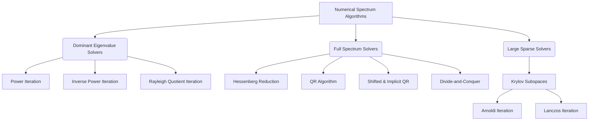

# Topic 09: Numerical Spectrum Algorithms

## Master Overview

Numerical spectrum algorithms form the foundation of modern scientific computing and data science, focusing on the reliable and efficient computation of eigenvalues and eigenvectors. While analytical calculation using characteristic polynomials is theoretically possible for small matrices, it is computationally unstable and impractical for large-scale applications. Numerical methods approach the eigenvalue problem iteratively, converting matrices into forms where eigenvalues can be easily read or approximated with high precision.

This module covers the mathematical principles, algorithm design, and convergence behavior of iterative methods for computing matrix spectra. It begins with fundamental iterations (Power, Inverse, and Rayleigh Quotient), progresses to full spectrum solvers via the QR algorithm, and explores large sparse matrix techniques (Arnoldi and Lanczos) used in modern machine learning and physical modeling.

## Concept Map

## Core Pillars

| Concept | Description | Mathematical Expression / Complexity |
| :--- | :--- | :--- |
| **Power Iteration** | Iteratively multiplies a vector by $A$ to find the dominant eigenvalue and eigenvector. | Convergence rate: $\mathcal{O}(\vert\lambda_2 / \lambda_1\vert^k)$ |
| **Inverse Iteration** | Applies power iteration to $(A - \mu I)^{-1}$ to find the eigenvalue closest to shift $\mu$. | Convergence rate: $\mathcal{O}(\vert(\lambda_{\text{closest}} - \mu) / (\lambda_{\text{next}} - \mu)\vert^k)$ |
| **Rayleigh Quotient Iteration** | Adapts the shift $\mu_k$ using the Rayleigh quotient to achieve cubic convergence for symmetric matrices. | $\mu_k = \frac{x_k^T A x_k}{x_k^T x_k}$, Cubic convergence: $\Vert x_{k+1} - v\Vert = \mathcal{O}(\Vert x_k - v\Vert^3)$ |
| **Hessenberg Reduction** | Preprocessing step that uses Householder reflectors to reduce $A$ to upper Hessenberg form. | Complexity: $\frac{10}{3}n^3 \text{ flops}$ |
| **QR Algorithm** | Iteratively computes QR factorization $A_k = Q_k R_k$ and updates $A_{k+1} = R_k Q_k$ to converge to Schur form. | Complexity per step (Hessenberg): $\mathcal{O}(n^2)$ |
| **Arnoldi Iteration** | Orthogonal projection onto Krylov subspace $\mathcal{K}_m(A, b)$ for non-symmetric sparse matrices. | $A Q_m = Q_m H_m + h_{m+1, m} q_{m+1} e_m^T$ |
| **Lanczos Iteration** | Simplification of Arnoldi for symmetric matrices, yielding a tridiagonal matrix via a three-term recurrence. | $A Q_m = Q_m T_m + \beta_m q_{m+1} e_m^T$ |

## Common Misconceptions

1. **Misconception:** We compute eigenvalues by finding the roots of the characteristic polynomial.

   > **Reality:** Root-finding for polynomials of degree $n > 4$ is algebraically impossible in general (Abel-Ruffini) and numerically unstable (e.g., Wilkinson's polynomial). All practical matrix eigenvalue algorithms are iterative.

2. **Misconception:** The QR algorithm computes $A^k$ directly.

   > **Reality:** While related to power iteration, the QR algorithm implicitly computes the orthogonal basis for the dominant subspaces of $A^k$ without the overflow issues of computing $A^k$ directly.

3. **Misconception:** Lanczos iteration always yields a perfectly orthogonal basis.

   > **Reality:** In floating-point arithmetic, Lanczos vectors lose orthogonality extremely quickly as eigenvalues converge, requiring full or selective reorthogonalization strategies.

## References & Literature

- **Trefethen, L. N., & Bau, D. (1997).** *Numerical Linear Algebra*. SIAM. (Lectures 25–31).

- **Golub, G. H., & Van Loan, C. F. (2013).** *Matrix Computations*. JHU Press. (Chapters 7–8).

- **Saad, Y. (2011).** *Numerical Methods for Large Eigenvalue Problems*. SIAM. (Chapters 7–8).

- **Strang, G. (2016).** *Introduction to Linear Algebra*. Wellesley-Cambridge Press.

- **Axler, S. (2015).** *Linear Algebra Done Right*. Springer.

- **Boyd, S., & Vandenberghe, L. (2018).** *Introduction to Applied Linear Algebra*. Cambridge University Press.

- **Horn, R. A., & Johnson, C. R. (2012).** *Matrix Analysis*. Cambridge University Press.

- **Nocedal, J., & Wright, S. (2006).** *Numerical Optimization*. Springer.
