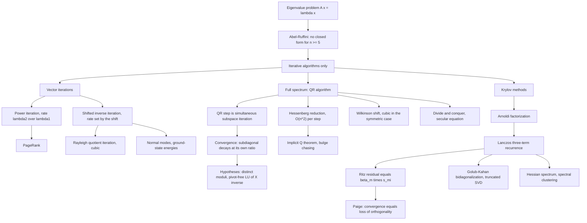

# Module 09 — Numerical Spectrum Algorithms

[Module 06](../06_eigenvalues_eigenvectors_spectral_theory/) proves that eigenvalues exist and
that a symmetric matrix has an orthonormal eigenbasis. It does not say how to find either. The
obvious route is closed: eigenvalues are the roots of $\det(A - zI)$, and by Abel-Ruffini a
polynomial of degree five or more has no solution in radicals.

Every practical eigenvalue algorithm is therefore iterative, and the subject becomes the study of
convergence rates in floating-point arithmetic. This module proves the rate of each of the three
vector iterations, proves the convergence of the QR algorithm with the hypotheses it actually
needs, derives the Krylov recurrences that make $n = 10^{6}$ tractable, and measures every rate it
predicts.

The route taken here is the honest one. The convergence theorem for the unshifted QR algorithm is
proved in full — including the pivot-free LU hypothesis on $X^{-1}$ that is usually omitted — and
a two-by-two counterexample is run to show that dropping that hypothesis does not slow the
algorithm down, it changes what the algorithm converges to.

The last section is about arithmetic rather than algebra: in finite precision the Lanczos basis
loses orthogonality at exactly the moment a Ritz pair converges, and the notebook measures both
sides of that statement on the same run.

> [!NOTE]
> **Convergence of the unshifted QR algorithm.** Let $A = X\Lambda X^{-1}$ be diagonalizable with
> $\lvert \lambda_1 \rvert \gt \cdots \gt \lvert \lambda_n \rvert \gt 0$, and let $X^{-1}$ admit an
> LU factorization without pivoting. Then the QR iterates satisfy
> $\lvert (A_k)_{j+1,j} \rvert = O(\lvert \lambda_{j+1}/\lambda_j \rvert^{k})$ and
> $(A_k)_{jj} \to \lambda_j$ in decreasing modulus. Each subdiagonal entry decays at **its own**
> eigenvalue ratio, and the LU hypothesis is what fixes the ordering of the limit.

## Prerequisites and downstream modules

**Prerequisites.**

- [Module 07 — Canonical Forms and SVD](../07_canonical_forms_and_svd/) — the Schur form, the SVD, and the augmented matrix used for singular values.
- [Module 08 — Numerical Linear Algebra and Iterative Solvers](../08_numerical_linear_algebra_iterative_solvers/) — Krylov subspaces for linear systems, conditioning, and the arithmetic model.

**Downstream modules unlocked by this one.**

- [graph_theory/07 — Spectral Clustering and GNN Applications](../../graph_theory/07_spectral_clustering_and_gnn_applications/)

The full dependency graph is in [docs/prerequisites.md](../../docs/prerequisites.md), and the
symbol conventions used below are fixed in [docs/notation.md](../../docs/notation.md).

## Learning outcomes

After working through this module you will be able to:

- predict the convergence rate of power, shifted inverse and Rayleigh quotient iteration from the spectrum alone, and prove each rate;
- prove that RQI is cubically convergent for a symmetric matrix, and exhibit a $2 \times 2$ case where the recursion $\tan\delta_{k+1} = -\tan^{3}\delta_k$ is exact;
- explain the QR algorithm as simultaneous subspace iteration, and prove $A^{k} = \underline{Q}_k\underline{R}_k$;
- state and prove the convergence theorem for the unshifted QR algorithm with all four of its hypotheses, and exhibit what breaks when two of them are dropped;
- explain why Hessenberg reduction turns an $O(n^{4})$ algorithm into an $O(n^{3})$ one, and why the Implicit Q theorem licenses bulge chasing;
- compute a Wilkinson shift, including the degenerate case, and say why the quotient form is the one to implement;
- derive the Arnoldi and Lanczos recurrences and the exact Ritz residual $\beta_m\lvert s_{mi} \rvert$;
- explain why a Lanczos basis loses orthogonality precisely when a Ritz pair converges, and choose between full and selective reorthogonalization;
- choose the right algorithm for a spectrum problem given its size, structure and which eigenvalues are wanted.

## Concept map

## Notation

Drawn from [docs/notation.md](../../docs/notation.md).

| Symbol | Meaning | Convention |
|---|---|---|
| $\lambda_1, \ldots, \lambda_n$ | eigenvalues | listed in **descending modulus** |
| $\Lambda$ | $\operatorname{diag}(\lambda_1, \ldots, \lambda_n)$ | eigenvalue matrix |
| $A = X\Lambda X^{-1}$ | eigendecomposition of a diagonalizable matrix | $X$ holds the eigenvectors as columns |
| $A_k$, $Q_k$, $R_k$ | the $k$-th QR iterate and its factors | $R_k$ normalized to a positive diagonal |
| $\underline{Q}_k$, $\underline{R}_k$ | accumulated orthogonal and triangular factors | $A^{k} = \underline{Q}_k\underline{R}_k$ |
| $H$, $T$ | upper Hessenberg matrix, tridiagonal or triangular matrix | see the callout below |
| $\mu$, $\mu_k$ | shift, shift at step $k$ | Wilkinson shift in Definition 3.5 |
| $R_A(x) = x^{\top}Ax / x^{\top}x$ | Rayleigh quotient | defined for $x \neq 0$ |
| $\mathcal{K}_m(A,b)$ | Krylov subspace of dimension at most $m$ | Definition 3.6 |
| $\alpha_j$, $\beta_j$ | Lanczos diagonal and subdiagonal coefficients | $T_m$ is tridiagonal |
| $\theta_i$, $y_i$, $s_i$ | Ritz value, Ritz vector, small eigenvector | $y_i = Q_ms_i$ |
| $\lVert A \rVert_{\mathrm{op}}$, $\lVert A \rVert_F$ | operator and Frobenius norms | written with `\lVert`, never a bare pipe |
| $u = 2^{-53}$, $\varepsilon_{\mathrm{mach}} = 2^{-52}$ | unit roundoff, machine epsilon | binary64 |
| $d$ | PageRank damping factor | $d \in (0,1)$, typically $0.85$ |

> [!NOTE]
> **Declared symbol collision.** In this module $T$ is always a triangular or tridiagonal matrix,
> never a Chebyshev polynomial — which is the repository-wide meaning of $T_k$. Chebyshev
> polynomials do not appear here; they belong to
> [Module 08](../08_numerical_linear_algebra_iterative_solvers/). The damping factor is written
> $d$, not $\alpha$, because $\alpha_j$ is a Lanczos coefficient.

## Core results

| Result | Statement | Hypotheses | Where |
|---|---|---|---|
| Shifted inverse iteration | $\tan\theta_k \le r^{k}\tan\theta_0$, $r = \lvert \lambda_j - \mu \rvert / \min_{i \neq j}\lvert \lambda_i - \mu \rvert$ | $A$ symmetric, unique closest eigenvalue | Theorem 4.1, Proof 5.1 |
| RQI is cubic | $\tan\theta_{k+1} \le \tfrac{2\Delta}{\gamma}\tan^{3}\theta_k$ | $A$ symmetric, $\lambda_j$ simple, small enough start | Theorem 4.2, Proof 5.2 |
| QR is subspace iteration | $A^{k} = \underline{Q}_k\underline{R}_k$ and $A_k = \underline{Q}_k^{\top}A\underline{Q}_k$ | none | Theorem 4.3, Proof 5.3 |
| Unshifted QR converges | $\lvert (A_k)_{j+1,j} \rvert = O(\lvert \lambda_{j+1}/\lambda_j \rvert^{k})$, $(A_k)_{jj} \to \lambda_j$ | diagonalizable, distinct moduli, no zero eigenvalue, pivot-free LU of $X^{-1}$ | Theorem 4.4, Proof 5.4 |
| Hessenberg invariance | $H$ Hessenberg $\Rightarrow RQ$ Hessenberg, at $O(n^{2})$ | none | Theorem 4.5, Proof 5.5 |
| Implicit Q theorem | first column determines the reduction up to signs | both forms unreduced Hessenberg | Theorem 4.6, Proof 5.6 |
| Arnoldi and Lanczos | $AQ_m = Q_mH_m + h_{m+1,m}q_{m+1}e_m^{\top}$; symmetric gives three terms | no breakdown before step $m$ | Theorem 4.7, Proof 5.7 |
| Exact Ritz residual | $\lVert Ay_i - \theta_iy_i \rVert_2 = \beta_m\lvert s_{mi} \rvert$ | exact arithmetic | Theorem 4.8, Proof 5.8 |
| Wilkinson cubic rate, Paige bound | cubic subdiagonal decay; $\lvert q_{m+1}^{\top}y_i \rvert = O(u\lVert A \rVert / \text{residual})$ | cited, not proved | Theorem 4.9 |
| Wilkinson shift | well defined with $\operatorname{sgn}(0) = 1$, equals the nearer eigenvalue | trailing off-diagonal entry non-zero | Proposition 4.10, Proof 5.9 |
| Jacobi sweep | $\operatorname{off}(J^{\top}AJ)^{2} = \operatorname{off}(A)^{2} - 2a_{pq}^{2}$ | $A$ symmetric | Proposition 4.11, Proof 5.10 |
| Secular equation | $1 + \beta\sum_i z_i^{2}/(d_i - \lambda) = 0$ | $\beta \neq 0$, $\lambda$ not a $d_i$ | Proposition 4.12, Proof 5.11 |

## Common misconceptions

1. **"Eigenvalues are computed from the characteristic polynomial."** For $n \ge 5$ no closed form
   exists, and forming the polynomial is catastrophically ill-conditioned. Every practical
   algorithm is iterative. Even LAPACK's polynomial root finder works by building a companion
   matrix and running the QR algorithm on it — the reverse of the naive route.

2. **"Unshifted QR always converges."** It has a fixed point at
   $\left[\begin{smallmatrix}0 & 1 \\ 1 & 0\end{smallmatrix}\right]$, where the subdiagonal entry
   stays at exactly $1$ forever, because the two eigenvalues have equal modulus.

3. **"If the subdiagonal has converged, the diagonal holds the eigenvalues in decreasing
   modulus."** Only under the pivot-free LU hypothesis on $X^{-1}$. For
   $\left[\begin{smallmatrix}1 & 1 \\ 0 & 2\end{smallmatrix}\right]$ the subdiagonal is exactly
   zero from the start and the diagonal reads $(1, 2)$ — increasing.

4. **"Divide-and-conquer is an $O(n^{2})$ algorithm."** Its worst case is $O(n^{3})$. The
   frequently quoted $O(n^{2.3})$ is an empirical average produced by deflation, and $O(n^{2})$
   occurs only when deflation is extreme.

5. **"The Wilkinson shift formula is $\mu = c + d - \operatorname{sgn}(d)\sqrt{d^{2}+b^{2}}$."**
   Algebraically yes, numerically no: that form cancels catastrophically when
   $\lvert b \rvert \ll \lvert d \rvert$. The quotient form of Definition 3.5 does not, and it also
   needs the convention $\operatorname{sgn}(0) = 1$ to be defined at $d = 0$.

6. **"Lanczos loses orthogonality gradually as rounding accumulates."** It loses it abruptly and
   in one specific direction: that of a Ritz vector, at the moment that Ritz pair converges. The
   theory notebook measures a defect that climbs from $10^{-14}$ to $O(1)$ across ten steps while
   the corresponding residual falls through the same decades.

7. **"More Lanczos steps give a better answer."** Without reorthogonalization, more steps produce
   **ghost** eigenvalues: the theory notebook finds four copies of the same converged eigenvalue
   among seventy Ritz values.

8. **"Krylov methods find any eigenvalue you ask for."** They find well-separated **extremes**.
   An interior eigenvalue needs a shift and an inverse, which turns it into an extreme one — the
   difference between a $500$ percent error and a $10^{-13}$ error in Problem L2.9.

## Exercise index

[`exercises.ipynb`](exercises.ipynb) contains 43 fully solved problems in four tiers. Every problem
carries a statement, a short intuition, a stepwise solution, a boxed answer, a key takeaway, and —
where the answer is numeric or algorithmic — a code cell that recomputes it and asserts the result.

| Tier | Count | Coverage |
|---|---:|---|
| L0 — Concept Checks | 8 | power-iteration rate from a spectrum, shift targeting, Rayleigh quotient, Gershgorin discs, Wilkinson shift, Givens rotation, Hotelling deflation, the RQI shift |
| L1 — Foundations | 12 | unitary similarity, single steps of power, inverse and QR iteration, Householder reflectors, Hessenberg flop count, first Lanczos step, stationarity and quadratic accuracy of the Rayleigh quotient, Hessenberg invariance, Krylov dimension, reflector spectra |
| L2 — Applications (AI/ML and Physics) | 10 | PageRank damping, matrix-free Hessian spectra, randomized SVD, Golub-Kahan bidiagonalization, the augmented matrix, Bauer-Fike, Lanczos flop counts, spring-chain normal modes, quantum harmonic-oscillator levels, spectral normalization |
| L3 — Challenge Proofs | 13 | Courant-Fischer and Ritz interlacing, Hoffman-Wielandt, Implicit Q, inverse-iteration rate, unshifted QR convergence, the power identity, shifted-QR acceleration, the Lanczos recurrence, Rayleigh-Ritz, Gershgorin components, the bilinear norm characterization, two-sided RQI, Paige's theorem |

Tier L2 contains two genuine physics problems: the normal modes of a three-mass spring chain
(Problem L2.8) and the energy levels of a quantum harmonic oscillator (Problem L2.9).

## References

**Textbooks.**

- Trefethen, L. N. and Bau, D. *Numerical Linear Algebra*, SIAM, 1997 — Lecture 25 (reduction to Hessenberg and tridiagonal form), Lecture 27 (Rayleigh quotient and inverse iteration, cubic convergence), Lecture 28 (unshifted QR as simultaneous iteration), Lecture 29 (shifts, the Wilkinson shift), Lecture 33 (Arnoldi), Lecture 36 (Lanczos).
- Golub, G. H. and Van Loan, C. F. *Matrix Computations*, 4th ed., Johns Hopkins, 2013 — section 7.3 (unshifted QR and its convergence), section 7.5 (practical Hessenberg-QR, the Implicit Q theorem), section 8.3 (symmetric QR, the Wilkinson shift, cubic convergence), section 8.4 (Jacobi methods), section 8.5 (divide-and-conquer, the secular equation), section 10.1 (Lanczos and loss of orthogonality).
- Parlett, B. N. *The Symmetric Eigenvalue Problem*, SIAM Classics, 1998 — Ch. 4 (Rayleigh quotient iteration), Ch. 8 section 8.10 (convergence of shifted QR), Ch. 13 section 13.4 (Paige's theorem, selective reorthogonalization).
- Watkins, D. S. *The Matrix Eigenvalue Problem: GR and Krylov Subspace Methods*, SIAM, 2007 — Ch. 2 (subspace-iteration reading of the QR algorithm).
- Saad, Y. *Numerical Methods for Large Eigenvalue Problems*, 2nd ed., SIAM, 2011 — Ch. 6 (Krylov methods), Ch. 7 (restarting and filtering).
- Wilkinson, J. H. *The Algebraic Eigenvalue Problem*, Oxford, 1965 — Ch. 8 section 39 (global convergence of shifted symmetric QR).
- Horn, R. A. and Johnson, C. R. *Matrix Analysis*, 2nd ed., Cambridge, 2013 — section 2.4 (Schur form), section 6.1 (Gershgorin and its refinement).

**Papers.**

- Francis, J. G. F. "The QR transformation, parts I and II", *The Computer Journal* **4** (1961-62), 265-271 and 332-345.
- Kublanovskaya, V. N. "On some algorithms for the solution of the complete eigenvalue problem", *USSR Comput. Math. and Math. Phys.* **1**(3) (1961), 637-657.
- Paige, C. C. "Error analysis of the Lanczos algorithm for tridiagonalizing a symmetric matrix", *IMA J. Appl. Math.* **18**(3) (1976), 341-349.
- Parlett, B. N. and Scott, D. S. "The Lanczos algorithm with selective orthogonalization", *Math. Comp.* **33**(145) (1979), 217-238.
- Cuppen, J. J. M. "A divide and conquer method for the symmetric tridiagonal eigenproblem", *Numer. Math.* **36** (1981), 177-195.
- Sorensen, D. C. "Implicit application of polynomial filters in a k-step Arnoldi method", *SIAM J. Matrix Anal. Appl.* **13**(1) (1992), 357-385.
- Pearlmutter, B. A. "Fast exact multiplication by the Hessian", *Neural Computation* **6**(1) (1994), 147-160.
- Halko, N., Martinsson, P.-G. and Tropp, J. A. "Finding structure with randomness", *SIAM Review* **53**(2) (2011), 217-288.

**In this directory.**

- [`first_principles.ipynb`](first_principles.ipynb) — theory, twelve numbered results with proofs, eight worked examples, twelve executable code cells and three figures.
- [`exercises.ipynb`](exercises.ipynb) — the 43 solved problems indexed above.
