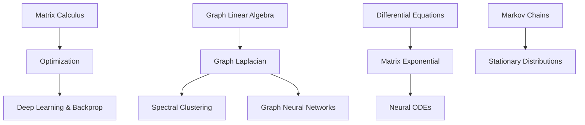

# Topic 10: Matrix Calculus, Graphs, and AI Applications

## 1. Master Overview

This module bridges the continuous world of calculus with the discrete structure of linear algebra, forming the foundational language for modern artificial intelligence, graph theory, and dynamical systems. Matrix calculus powers the backpropagation algorithms at the heart of deep learning.

Graph linear algebra uncovers the hidden structure of networks, connecting spectral properties to clustering and semi-supervised learning. The matrix exponential reveals the exact evolution of continuous-time differential equations, while Markov chains extend these ideas to discrete-time probability distributions.

Together, these tools provide the rigorous mathematical framework needed to optimize, analyze, and deploy real-world AI models.

## 2. Concept Map

## 3. Core Pillars

| Pillar | Description | Mathematical Focus | AI Application |
| :--- | :--- | :--- | :--- |
| **Matrix Calculus** | Differentiation of vectors and matrices. | Jacobians, Hessians, $\nabla_x (x^T A x)$ | Gradient descent, Backpropagation |
| **Graph Linear Algebra** | Matrix representations of networks. | Laplacian $L = D - A$, Fiedler vector | Spectral clustering, GNNs |
| **Markov Chains** | State transitions over discrete time. | $P \pi = \pi$, stochastic matrices | PageRank, Reinforcement Learning |
| **Matrix Exponential** | Continuous-time linear dynamical systems. | $e^{At} = \sum_{k=0}^{\infty} \frac{(At)^k}{k!}$ | Continuous control, Neural ODEs |

## 4. Common Misconceptions

* **Misconception:** Matrix calculus requires learning entirely new rules of differentiation.

  > **Correction:** Matrix calculus is just multivariable calculus organized systematically. The product and chain rules still apply, just with careful attention to dimensions and non-commutativity.

* **Misconception:** The matrix exponential $e^A$ is found by exponentiating each element of $A$.

  > **Correction:** The matrix exponential is defined by the Taylor series $e^A = I + A + \frac{1}{2}A^2 + \dots$, and generally $e^A \neq [e^{A_{ij}}]$.

* **Misconception:** Any symmetric matrix can represent a graph Laplacian.

  > **Correction:** A graph Laplacian must have non-positive off-diagonal entries and rows that sum to zero, ensuring it is positive semi-definite and its smallest eigenvalue is 0.

## 5. References

* **Goodfellow, I., Bengio, Y., & Courville, A.** *Deep Learning* (Chapter 2: Linear Algebra, Chapter 4: Numerical Computation).
* **Boyd, S., & Vandenberghe, L.** *Convex Optimization* (Appendix A: Mathematical Background).
* **Strogatz, S. H.** *Nonlinear Dynamics and Chaos* (Chapter 5: Linear Systems).
* **Chung, F. R. K.** *Spectral Graph Theory* (CBMS Regional Conference Series in Mathematics).
