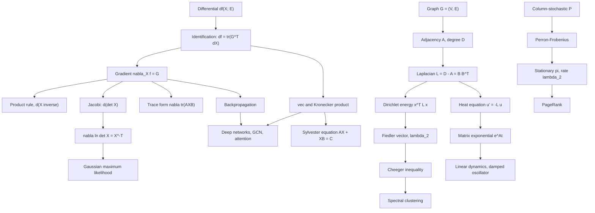

# Module 10 — Matrix Calculus, Graphs, and AI Applications

A loss in machine learning is a scalar whose arguments are matrices. Differentiating it entry by
entry is correct and unusable. This module builds the tool that removes the indices: write the
first-order change of $f$ as a linear form in the perturbation $dX$, and read the gradient off
that form.

That one move — the first identification theorem — generates the whole subject. The product rule,
the derivative of an inverse, Jacobi's formula, the log-determinant gradient and backpropagation
are each a three-line consequence of it, and the module proves all of them.

The second half applies the same linear algebra to objects that are not obviously analytic. A
graph is a matrix, and its Laplacian converts the combinatorial question *where does this network
split apart?* into an eigenvalue question. A linear dynamical system is a matrix in an exponent,
and a Markov chain is a matrix raised to a power.

The point of putting these together is that backpropagation, spectral clustering, PageRank and a
damped oscillator turn out to be four readings of the same three theorems. Every one of them is
run in this module on numbers small enough to check by hand.

> [!NOTE]
> **First identification theorem.** If $f : \mathbb{R}^{m \times n} \to \mathbb{R}$ is
> differentiable at $X$, there is exactly one matrix $G$ with
> $df(X; E) = \operatorname{tr}(G^{\top}E)$ for every $E$, and $G = \nabla_X f$ with
> $G_{ij} = \partial f / \partial X_{ij}$. To differentiate, compute $df$ by ordinary algebra,
> push it into the form $\operatorname{tr}(G^{\top}dX)$, and read off $G$.

## Prerequisites and downstream modules

**Prerequisites.**

- [Module 07 — Canonical Forms and SVD](../07_canonical_forms_and_svd/) — the SVD and the pseudoinverse, used for the nuclear norm and for effective resistance.
- [calculus/12 — Hessian, Jacobian and Curvature](../../calculus/12_hessian_jacobian_curvature/) — differentiability in several variables, and the Jacobian as a linear approximation.

Two earlier results are used by name and are proved where they live:
[Module 06](../06_eigenvalues_eigenvectors_spectral_theory/) supplies Schur triangularization,
which Proof 5.3 and Proof 5.8 both need, and the spectral theorem for symmetric matrices, which
every Laplacian argument uses.

**Downstream modules.** The dependency graph in
[docs/prerequisites.md](../../docs/prerequisites.md) records no module that requires this one; it
is a terminal node of the `linear_algebra` chain.

Three modules develop, at greater depth, topics this one only borrows:

- [graph_theory/06 — Graph Laplacian and Spectral Theory](../../graph_theory/06_graph_laplacian_and_spectral_theory/) owns the Laplacian, the Fiedler vector and Cheeger's inequality.
- [graph_theory/07 — Spectral Clustering and GNN Applications](../../graph_theory/07_spectral_clustering_and_gnn_applications/) owns RatioCut, NCut and the rounding step.
- [differential_equations/04 — Systems of ODEs and the Matrix Exponential](../../differential_equations/04_systems_of_odes_matrix_exponential/) owns the defective case, Putzer's algorithm and scaling-and-squaring.

## Learning outcomes

After working through this module you will be able to:

- differentiate a scalar function of a matrix by computing its differential and identifying the gradient, without ever writing a partial derivative;
- derive and use the four core identities — product rule, $d(X^{-1})$, Jacobi's formula, and the trace form — and explain why $\nabla_X \ln\det X = X^{-\top}$ changes under a symmetry constraint;
- turn a linear matrix equation into a vector system with $\operatorname{vec}$ and $\otimes$, and decide solvability of $AX + XB = C$ from the two spectra;
- derive backpropagation from the identification theorem and state exactly which hypothesis fails at a ReLU kink;
- prove that a graph Laplacian is positive semidefinite and that its null-space dimension counts connected components;
- state Cheeger's inequality with matching normalizations, prove the easy direction with an explicit test vector, and explain what the hard direction adds;
- solve $\dot{x} = Ax$ with the matrix exponential, and produce a two-by-two pair for which $e^{A+B} \neq e^{A}e^{B}$;
- predict the convergence rate of a primitive Markov chain from $\lvert \lambda_2 \rvert$, and explain why irreducibility alone is not enough;
- check every one of the above numerically: identity residuals at machine epsilon, measured convergence orders, and hand-rolled code against SciPy.

## Concept map

## Notation

Drawn from [docs/notation.md](../../docs/notation.md).

| Symbol | Meaning | Convention |
|---|---|---|
| $df(X; E)$ | differential of $f$ at $X$ in direction $E$ | a linear functional of $E$ |
| $\nabla_X f$ | gradient of a scalar function of a matrix | same shape as $X$ |
| $J_F$ | Jacobian of $F : \mathbb{R}^n \to \mathbb{R}^m$ | $m \times n$; $J_f = (\nabla f)^{\top}$ when $m = 1$ |
| $\langle A, B \rangle_F = \operatorname{tr}(A^{\top}B)$ | Frobenius inner product | the inner product the gradient represents $df$ in |
| $\operatorname{vec}(X)$, $A \otimes B$ | column stacking, Kronecker product | $\operatorname{vec}(AXB) = (B^{\top}\otimes A)\operatorname{vec}(X)$ |
| $\odot$ | Hadamard (entrywise) product | |
| $A$, $D$, $L = D - A$ | adjacency, degree, combinatorial Laplacian | $A_{ij} \ge 0$, $A_{ii} = 0$ |
| $B$ | oriented incidence matrix | $L = BB^{\top}$ |
| $L_{\mathrm{sym}} = D^{-1/2}LD^{-1/2}$, $L_{\mathrm{rw}} = D^{-1}L$ | normalized Laplacians | $\operatorname{spec}(L_{\mathrm{sym}}) \subseteq [0, 2]$ |
| $0 = \lambda_1 \le \lambda_2 \le \cdots \le \lambda_n$ | Laplacian spectrum | **ascending**, a declared exception |
| $\operatorname{vol}(S)$, $\lvert \partial S \rvert$, $h(G)$ | volume, cut weight, conductance | $h$ uses $\min\lbrace \operatorname{vol}S, \operatorname{vol}\bar S \rbrace$ |
| $e^{A}$ | matrix exponential | the series, never the entrywise exponential |
| $P$, $\pi$ | column-stochastic matrix, stationary vector | $P\pi = \pi$, $\mathbf{1}^{\top}\pi = 1$ |
| $\delta_k$, $z_k$, $a_k$ | backward signal, pre-activation, activation | $\delta_k = \nabla_{z_k}J$ |

Two conventions deserve a second look. Laplacian eigenvalues run **ascending** here, the reverse
of the repository default, so that $\lambda_2$ is the algebraic connectivity; the theory notebook
carries a callout at its first use. And $h(G)$ is the **normalized** conductance, which is the one
that pairs with $\lambda_2(L_{\mathrm{sym}})$ — pairing it with $\lambda_2(L)$ gives a false
inequality.

## Core results

| Result | Statement | Hypotheses | Where |
|---|---|---|---|
| First identification theorem | a unique $G$ has $df = \operatorname{tr}(G^{\top}dX)$, and $G = \nabla_X f$ | $f$ differentiable at $X$, domain open | Theorem 4.1, Proof 5.1 |
| Four core differentials | product rule; $d(X^{-1})$; Jacobi; $d\operatorname{tr}(AXB)$ | invertibility where an inverse appears | Theorem 4.2, Proof 5.2 |
| Log-determinant gradient | $\nabla_X \ln\det X = X^{-\top}$ | $\det X \gt 0$, $X$ unconstrained | Theorem 4.2, Example 6.1 |
| vec-Kronecker identity | $\operatorname{vec}(AXB) = (B^{\top}\otimes A)\operatorname{vec}(X)$ | conformability only | Theorem 4.3, Proof 5.3 |
| Sylvester solvability | unique $X$ for every $C$ iff $\operatorname{spec}(A) \cap \operatorname{spec}(-B) = \emptyset$ | $A$, $B$ square | Theorem 4.3, Proof 5.3 |
| Backpropagation | $\nabla_{W_k}J = \delta_k a_{k-1}^{\top}$, $\delta_{k-1} = (W_k^{\top}\delta_k)\odot\sigma'(z_{k-1})$ | each $\sigma_k$ entrywise and differentiable at $z_k$ | Theorem 4.4, Proof 5.4 |
| Laplacian structure | $L = BB^{\top} \succeq 0$; $\dim\operatorname{Null}(L)$ counts components | non-negative weights | Theorem 4.5, Proof 5.5 |
| Cheeger, easy direction | $\lambda_2(L_{\mathrm{sym}})/2 \le h(G)$ | $G$ connected, all $d_i \gt 0$ | Theorem 4.6, Proof 5.6 |
| Cheeger, hard direction | $h(G) \le \sqrt{2\lambda_2(L_{\mathrm{sym}})}$ | same | Theorem 4.6b, cited to Chung Ch. 2 |
| Matrix exponential | series converges; $x(t) = e^{At}x_0$ is the unique solution; $e^{A+B} = e^{A}e^{B}$ iff the factors commute | commutation for the last clause | Theorem 4.7, Proof 5.7 |
| Markov convergence | $P^k\pi_0 \to \pi$ geometrically at rate $\lvert \lambda_2 \rvert$ | $P$ column-stochastic and **primitive** | Theorem 4.8, Proof 5.8 |
| Perron-Frobenius | $\rho(P)$ simple, positive eigenvector, all other $\lvert \lambda \rvert$ strictly smaller | $P$ primitive non-negative | Theorem 4.8b, cited to Horn and Johnson section 8.5 |

## Common misconceptions

1. **"$\nabla_X \ln\det X = X^{-1}$ for a covariance matrix."** Only if $X$ is unconstrained. If
   $X$ is parameterized as symmetric, perturbing an off-diagonal free parameter moves two entries,
   and the derivative with respect to that parameter is $2(X^{-1})_{ij}$. The correct constrained
   gradient is $2X^{-1} - \operatorname{diag}(X^{-1})$; Problem L1.5 measures both.

2. **"$e^{A}$ is the matrix of $e^{A_{ij}}$."** For
   $A = \left[\begin{smallmatrix}0&1\\0&0\end{smallmatrix}\right]$ the matrix exponential is
   $\left[\begin{smallmatrix}1&1\\0&1\end{smallmatrix}\right]$ and the entrywise one is
   $\left[\begin{smallmatrix}1&e\\1&1\end{smallmatrix}\right]$. In code, `numpy.exp` is the wrong
   one and `scipy.linalg.expm` is the right one.

3. **"$e^{A+B} = e^{A}e^{B}$."** True only when $AB = BA$. Section 7.3 of the theory notebook runs
   $A = E_{12}$, $B = E_{21}$, where the two sides differ by $0.752$ in Frobenius norm — an
   $O(1)$ discrepancy, not a rounding effect.

4. **"An irreducible chain converges to its stationary distribution."** The two-state swap
   $\left[\begin{smallmatrix}0&1\\1&0\end{smallmatrix}\right]$ is irreducible, has the stationary
   distribution $(0.5, 0.5)$, and $P^k e_1$ alternates forever at distance $0.707$ from it.
   Primitivity, not irreducibility, is the hypothesis of Theorem 4.8.

5. **"The Cheeger constant is $\min \lvert \partial S \rvert / \lvert S \rvert$."** That is the
   unnormalized edge expansion, and it pairs with $\lambda_2(L)$. The conductance form with
   $\operatorname{vol}$ in the denominator is the one that pairs with $\lambda_2(L_{\mathrm{sym}})$.
   Mixing the two produces an inequality that is simply false.

6. **"A primitive stochastic matrix can be expanded in an eigenbasis."** Primitivity does not
   imply diagonalizability. Proof 5.8 avoids the assumption entirely by writing
   $Q = P - \pi\mathbf{1}^{\top}$ and showing $\rho(Q) \lt 1$ forces $Q^k \to 0$ through a Schur
   argument.

7. **"Backpropagation needs the chain rule for Jacobians of matrices."** It needs one scalar
   identity, $dJ = \operatorname{tr}(G^{\top}dX)$, applied once per layer. The result is one outer
   product and one transposed matrix-vector product per layer, and nothing else.

8. **"Spectral clustering is a heuristic with no guarantee."** The Fiedler relaxation has the
   two-sided guarantee of Theorem 4.6. On the two-cluster graph of Section 7.5 the sweep cut finds
   the exactly optimal set out of all $1022$ non-trivial subsets, and the sandwich reads
   $0.0363 \le 0.0476 \le 0.3811$.

## Exercise index

[`exercises.ipynb`](exercises.ipynb) contains 48 fully solved problems in four tiers. Every
problem carries a statement, a short intuition, a stepwise solution, a boxed answer, a key
takeaway, and a code cell that recomputes the answer and prints the check.

| Tier | Count | Coverage |
|---|---:|---|
| L0 — Concept Checks | 10 | gradient and Jacobian shapes, the Frobenius inner product, linear and quadratic gradients, exponentials of diagonal and nilpotent matrices, entrywise versus matrix exponential, $L\mathbf{1} = 0$, $\operatorname{tr}(L) = 2\lvert E \rvert$, vec and Kronecker, one Markov step |
| L1 — Foundations | 15 | quadratic-form gradient, least-squares gradient and Hessian, trace derivatives, log-determinant, Jacobi's formula, derivative of an inverse, the Jacobian of $X \mapsto AXB$, Laplacian quadratic form, incidence factorization, normalized Laplacians, algebraic connectivity, stochastic spectra, Jordan-block exponential |
| L2 — Applications (AI/ML and Physics) | 14 | softmax Jacobian, softmax with cross-entropy, low-rank factorization, LoRA, GCN backpropagation, graph Fourier transform, Chebyshev filters, attention gradients, PageRank, the Fiedler relaxation, neural graph ODEs, a driven oscillator, effective resistance, the heat-kernel trace |
| L3 — Challenge Proofs | 9 | uniqueness of the stationary distribution, the Frechet derivative of $e^{X}$, Lie-Trotter with its rate, the nuclear-norm gradient, random-walk mixing, Cartesian product Laplacians, the graph Dirac operator, implicit differentiation of an equilibrium GNN, the strict saddle property |

Tier L2 contains three genuine physics problems: the driven linear oscillator solved by variation
of parameters (Problem L2.12), the effective resistance of a resistor network (Problem L2.13), and
the short-time heat-kernel trace (Problem L2.14).

## References

**Matrix calculus.**

- Magnus, J. R. and Neudecker, H. *Matrix Differential Calculus with Applications in Statistics and Econometrics*, 3rd ed. — Ch. 2 (Kronecker products and the vec operator), Ch. 5 (differentiability and the first identification theorem), Ch. 8 (differentials of the determinant, the inverse and the trace).
- Petersen, K. B. and Pedersen, M. S. *The Matrix Cookbook* (2012 revision), section 2.1 (determinant), section 2.2 (inverse), section 2.5 (traces).
- Boyd, S. and Vandenberghe, L. *Convex Optimization*, Appendix A.4 (derivatives and the chain rule in matrix form).
- Horn, R. A. and Johnson, C. R. *Topics in Matrix Analysis*, section 4.2 (Kronecker products and their spectra), section 4.4 (the Sylvester equation and Kronecker sums).

**Graphs and spectra.**

- Chung, F. R. K. *Spectral Graph Theory*, Ch. 1 section 1.2 (the normalized Laplacian), Ch. 2 section 2.2 (Cheeger's inequality, Theorem 2.2).
- Spielman, D. A. *Spectral and Algebraic Graph Theory*, Ch. 20-21 (conductance, the sweep cut, and a modern proof of Cheeger).
- Fiedler, M. "Algebraic connectivity of graphs", *Czechoslovak Mathematical Journal* **23**(98) (1973), 298-305.
- von Luxburg, U. "A tutorial on spectral clustering", *Statistics and Computing* **17**(4) (2007), 395-416, sections 3-5.

**Dynamics.**

- Horn, R. A. and Johnson, C. R. *Matrix Analysis*, 2nd ed., section 8.2 (Perron's theorem), section 8.5 (primitive matrices).
- Higham, N. J. *Functions of Matrices: Theory and Computation*, Ch. 10 (the matrix exponential).
- Moler, C. and Van Loan, C. F. "Nineteen dubious ways to compute the exponential of a matrix, twenty-five years later", *SIAM Review* **45**(1) (2003), 3-49.
- Golub, G. H. and Van Loan, C. F. *Matrix Computations*, 4th ed., section 9.3 (computing the matrix exponential).

**Machine learning.**

- Goodfellow, I., Bengio, Y. and Courville, A. *Deep Learning*, section 6.5 (back-propagation).
- Strang, G. *Linear Algebra and Learning from Data*, section VII.3 (backpropagation and the chain rule).
- Kipf, T. N. and Welling, M. "Semi-supervised classification with graph convolutional networks", *ICLR* (2017).
- Defferrard, M., Bresson, X. and Vandergheynst, P. "Convolutional neural networks on graphs with fast localized spectral filtering", *NeurIPS* (2016).
- Page, L., Brin, S., Motwani, R. and Winograd, T. "The PageRank citation ranking: bringing order to the web", Stanford InfoLab Technical Report 1999-66.

**In this directory.**

- [`first_principles.ipynb`](first_principles.ipynb) — theory, proofs, six worked examples, twelve executable code cells and four figures.
- [`exercises.ipynb`](exercises.ipynb) — the 48 solved problems indexed above.
