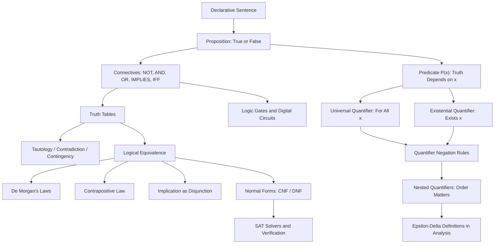

# Topic 01: Propositional and Predicate Logic

## 1. Master Overview

Propositional and predicate logic form the grammar of mathematics: they specify exactly which sentences carry a definite truth value and how the truth of compound statements is computed from the truth of their parts. A proposition is a declarative sentence that is either true or false; connectives such as negation, conjunction, disjunction, implication, and the biconditional combine propositions into larger ones whose truth values are determined mechanically by truth tables. This truth-functional viewpoint turns "reasoning" into computation and is the reason logical arguments can be checked, automated, and even executed on hardware.

Predicate logic extends this machinery with variables, predicates, and the quantifiers $\forall$ ("for all") and $\exists$ ("there exists"). Almost every serious mathematical statement — the $\epsilon$-$\delta$ definition of continuity, the definition of convergence, the statement that a model is robust to perturbations — is a nested quantified formula, and manipulating such statements correctly (especially negating them) is a prerequisite for every proof technique studied later in this curriculum.

Beyond pure mathematics, this material is the foundation of digital circuit design, SAT solving, database query semantics, formal program verification, and the precise specification of machine learning claims such as adversarial robustness.

> [!NOTE]
> The single most used equivalence in all of mathematics is the contrapositive law $(p \to q) \equiv (\neg q \to \neg p)$, and the single most common error is confusing an implication with its converse $(q \to p)$, which is *not* equivalent. Mastering these two facts prevents the majority of beginner proof mistakes.

## 2. First-Principles Framework

- **Phenomenon**: Natural language is ambiguous — "or" can be inclusive or exclusive, "if" can suggest causation, and sentences like "every rule has an exception" collapse under scrutiny. Mathematics cannot be built on ambiguous sentences.
- **Goal**: Build a formal language in which every well-formed statement has an unambiguous truth value, and in which the truth of compound statements is *computed* from the truth of atomic parts.
- **Governing principle**: Truth-functionality — the truth value of $\neg p$, $p \wedge q$, $p \vee q$, $p \to q$, $p \leftrightarrow q$ depends only on the truth values of $p$ and $q$, as codified by truth tables.
- **Formulation**: Two formulas are logically equivalent, written $\varphi \equiv \psi$, when they agree in every row of the truth table; a tautology is true in every row; quantified statements are handled by the semantic rules for $\forall x\,P(x)$ and $\exists x\,P(x)$ over a domain of discourse.
- **Consequence**: A finite, checkable calculus of equivalences (De Morgan, contrapositive, distributivity, quantifier negation) that mechanizes correct reasoning and underlies SAT solvers, verification tools, and digital hardware.

## 3. Mermaid Concept Map

## 4. Common Misconceptions

| Misconception | Mathematical Reality | Correct Mental Model |
|---|---|---|
| "An implication $p \to q$ asserts that $p$ causes $q$." | Implication is purely truth-functional: $p \to q$ is false only when $p$ is true and $q$ is false. No causal link is claimed. | Read $p \to q$ as a promise: it is broken only by a true hypothesis with a false conclusion. |
| "If the hypothesis is false, the implication is false (or meaningless)." | When $p$ is false, $p \to q$ is **vacuously true** regardless of $q$. | A promise about a situation that never occurs is never broken. |
| "An implication and its converse say the same thing." | $(p \to q) \not\equiv (q \to p)$; only the contrapositive $(\neg q \to \neg p)$ is equivalent to $p \to q$. | "Even square implies even" and "even implies even square" are different claims that both need proof. |
| "The 'or' in mathematics is exclusive." | $p \vee q$ is inclusive: it is true when both $p$ and $q$ hold. Exclusive or is a different connective ($\oplus$). | "$x \geq 0$ or $x \leq 0$" is true at $x = 0$. |
| "The negation of 'all $x$ satisfy $P$' is 'no $x$ satisfies $P$'." | $\neg(\forall x\,P(x)) \equiv \exists x\,\neg P(x)$ — one counterexample suffices. | To refute "all swans are white," exhibit a single non-white swan. |
| "Quantifier order does not matter." | $\forall x\,\exists y\,P(x,y)$ lets $y$ depend on $x$; $\exists y\,\forall x\,P(x,y)$ demands one uniform $y$. They are not equivalent. | "Everyone has a mother" versus "someone is everyone's mother." |
| "A predicate like $x \gt 5$ is true or false." | A predicate has no truth value until its variables are bound by substitution or quantification. | $P(x)$ is a truth-valued *function* of $x$, not a proposition. |

## 5. Directory Inventory

| File | Description |
|---|---|
| [`README.md`](README.md) | Master overview, first-principles framework, concept map, misconceptions, references. |
| [`first_principles.ipynb`](first_principles.ipynb) | Markdown-only theory notebook: intuition, rigorous definitions, six complete proofs (De Morgan, contrapositive, implication laws, quantifier negation, quantifier order, distributivity), computational insights, and AI/ML applications. |
| [`exercises.ipynb`](exercises.ipynb) | 20 fully solved problems across 4 levels: Concept Check (4), Foundation (6), Applications in AI/ML and CS (6), Challenge (4). |

## 6. References

1. **Velleman, D. J.** (2019). *How to Prove It: A Structured Approach* (3rd ed.). Cambridge University Press. — Chapters 1–2: sentential and quantificational logic.
2. **Rosen, K. H.** (2019). *Discrete Mathematics and Its Applications* (8th ed.). McGraw-Hill. — Chapter 1: the foundations of logic and proofs.
3. **Hammack, R.** (2018). *Book of Proof* (3rd ed.). Virginia Commonwealth University. — Chapters 2 and 7: logic and quantified statements.
4. **Enderton, H. B.** (2001). *A Mathematical Introduction to Logic* (2nd ed.). Academic Press. — Formal semantics of propositional and first-order logic.
5. **Huth, M., & Ryan, M.** (2004). *Logic in Computer Science* (2nd ed.). Cambridge University Press. — Model checking and program verification applications.
6. **Graham, R. L., Knuth, D. E., & Patashnik, O.** (1994). *Concrete Mathematics* (2nd ed.). Addison-Wesley. — Precise manipulation of mathematical statements.
7. **Pólya, G.** (1945). *How to Solve It*. Princeton University Press. — Heuristics for translating problems into precise statements.
8. **Cormen, T. H., Leiserson, C. E., Rivest, R. L., & Stein, C.** (2022). *Introduction to Algorithms* (4th ed.). MIT Press. — NP-completeness of satisfiability (Chapter 34).
