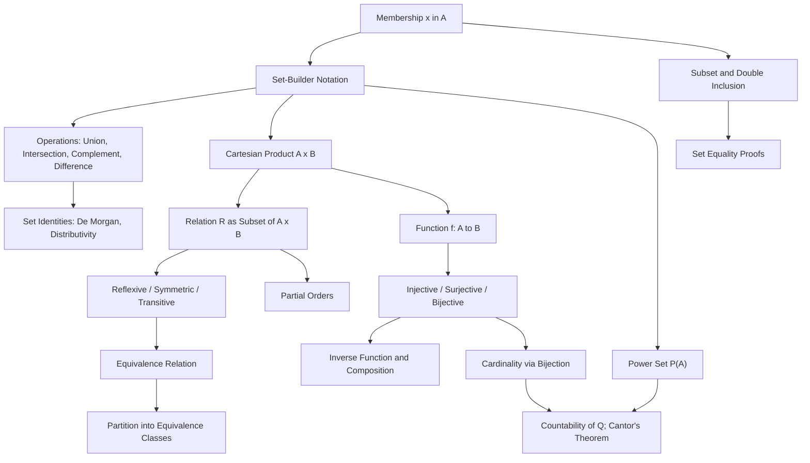

# Topic 02: Sets, Relations, and Functions

## 1. Master Overview

Set theory is the assembly language of mathematics: numbers, sequences, graphs, probability spaces, and machine learning models are all ultimately built from sets. A set is an unordered collection of distinct objects, and a handful of operations — union, intersection, complement, difference, Cartesian product, power set — combine sets exactly as the logical connectives of Topic 01 combine propositions. Indeed, under the dictionary $\cup \leftrightarrow \vee$, $\cap \leftrightarrow \wedge$, complement $\leftrightarrow \neg$, every propositional law becomes a set identity, and the standard proof pattern "element chasing" is just predicate logic applied to membership statements.

Relations and functions are then defined *as sets*: a relation from $A$ to $B$ is a subset of $A \times B$, and a function is a relation in which every input relates to exactly one output. This uncompromising definition pays off immediately: properties such as reflexivity, symmetry, transitivity, injectivity, surjectivity, and bijectivity become checkable statements about sets of pairs, equivalence relations are revealed as partitions in disguise, and cardinality comparisons via bijections lead to the first genuinely astonishing theorems of mathematics — the countability of $\mathbb{Q}$ and Cantor's proof that no set can be matched with its own power set.

For modeling and machine learning, this topic supplies the working vocabulary: datasets are sets, features are functions, train/validation/test splits are partitions, one-hot encodings are injections, and parameter identifiability is precisely the injectivity of the parameters-to-predictions map.

> [!NOTE]
> To prove two sets are equal, prove two inclusions: $A = B$ iff $A \subseteq B$ and $B \subseteq A$. This "double inclusion" template, executed by element chasing, is the set-theoretic workhorse used in virtually every proof of this topic and reappears throughout analysis and linear algebra.

## 2. First-Principles Framework

- **Phenomenon**: Mathematics constantly speaks of collections — solution sets, domains, event spaces, datasets — and of associations between collections: orderings, groupings, input-output assignments.
- **Goal**: Give collections and associations a single rigorous foundation, with operations and proof templates that behave predictably.
- **Governing principle**: Extensionality — a set is completely determined by its members ($A = B$ iff they have exactly the same elements), so membership statements $x \in A$ are the atomic facts, and set operations are defined by logical conditions on membership.
- **Formulation**: $A \cup B = \{x : x \in A \vee x \in B\}$, $A \cap B = \{x : x \in A \wedge x \in B\}$, $A^{c} = \{x \in U : x \notin A\}$; a relation is $R \subseteq A \times B$; a function $f: A \to B$ is a relation assigning to each $a \in A$ exactly one $b \in B$.
- **Consequence**: Logic laws transfer wholesale to sets (De Morgan, distributivity), equivalence relations biject with partitions, and bijections give a rigorous theory of size — finite counting rules (Topic 05) and infinite cardinalities (Cantor) alike.

## 3. Mermaid Concept Map

## 4. Common Misconceptions

| Misconception | Mathematical Reality | Correct Mental Model |
|---|---|---|
| "The empty set and the set containing it are the same: $\emptyset = \{\emptyset\}$." | $\emptyset$ has 0 elements; $\{\emptyset\}$ has 1 element (namely $\emptyset$). | A box that is empty differs from a box containing an empty box. |
| "$x \in A$ and $\{x\} \subseteq A$ are interchangeable with $x \subseteq A$." | Membership and inclusion are different relations: $x \in A \iff \{x\} \subseteq A$, but $x \subseteq A$ is usually false or meaningless for elements. | $\in$ relates an object to a set; $\subseteq$ relates a set to a set. |
| "Sets can contain repeated elements, so $\{1,1,2\}$ has three elements." | Sets ignore multiplicity and order: $\{1,1,2\} = \{1,2\}$, with cardinality 2. | Multiplicity needs a different structure (multiset or tuple). |
| "A function is a formula." | A function is a set of ordered pairs with the uniqueness property; most functions have no formula, and one formula can define different functions on different domains. | A function is its graph together with its domain and codomain. |
| "Every injective function is surjective (or vice versa)." | The properties are independent: $f(x) = 2x$ on $\mathbb{Z}$ is injective, not surjective; $f(x) = x^2$ from $\mathbb{R}$ onto $[0, \infty)$ is surjective, not injective. | Injectivity is about no collisions; surjectivity is about full coverage of the codomain. |
| "A relation that is symmetric and transitive must be reflexive." | The standard fallacious argument ($aRb \Rightarrow bRa \Rightarrow aRa$) silently assumes some $b$ related to $a$ exists; the empty relation on a nonempty set is symmetric and transitive but not reflexive. | Reflexivity must be checked for every element, including isolated ones. |
| "All infinite sets have the same size." | $\mathbb{Q}$ is countable but Cantor's diagonal argument shows $\mathbb{R}$ is not; in general $\vert A \vert \lt \vert \mathcal{P}(A) \vert$ always. | Bijections define size; infinite sets come in an endless hierarchy of cardinalities. |

## 5. Directory Inventory

| File | Description |
|---|---|
| [`README.md`](README.md) | Master overview, first-principles framework, concept map, misconceptions, references. |
| [`first_principles.ipynb`](first_principles.ipynb) | Markdown-only theory notebook: intuition, rigorous definitions, six complete proofs (De Morgan for sets, distributivity, inclusion-exclusion for two sets, equivalence classes partition, composition of injections, Cantor's theorem), computational insights, and AI/ML applications. |
| [`exercises.ipynb`](exercises.ipynb) | 20 fully solved problems across 4 levels: Concept Check (4), Foundation (6), Applications in AI/ML and CS (6), Challenge (4). |

## 6. References

1. **Halmos, P. R.** (1960). *Naive Set Theory*. Van Nostrand (reprinted by Springer). — The classic concise treatment of sets, relations, functions, and cardinality.
2. **Velleman, D. J.** (2019). *How to Prove It: A Structured Approach* (3rd ed.). Cambridge University Press. — Chapters 3–7: set proofs, relations, functions, and infinite sets.
3. **Rosen, K. H.** (2019). *Discrete Mathematics and Its Applications* (8th ed.). McGraw-Hill. — Chapters 2 and 9: sets, functions, and relations.
4. **Hammack, R.** (2018). *Book of Proof* (3rd ed.). Virginia Commonwealth University. — Chapters 1, 11, 12: sets, relations, functions.
5. **Graham, R. L., Knuth, D. E., & Patashnik, O.** (1994). *Concrete Mathematics* (2nd ed.). Addison-Wesley. — Chapter 4 and passim: number-theoretic relations and floor/ceiling functions.
6. **Cantor, G.** (1891). *Über eine elementare Frage der Mannigfaltigkeitslehre*. Jahresbericht der DMV. — The original diagonal argument.
7. **Cormen, T. H., Leiserson, C. E., Rivest, R. L., & Stein, C.** (2022). *Introduction to Algorithms* (4th ed.). MIT Press. — Appendix B: sets, relations, functions, and graphs for computer science.
8. **Pólya, G.** (1945). *How to Solve It*. Princeton University Press. — Notation and problem representation heuristics.
