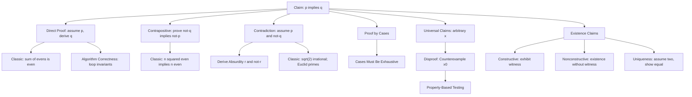

# Topic 03: Proof Techniques

## 1. Master Overview

A proof is a finite chain of logically valid steps that transforms accepted statements (axioms, definitions, previously proved theorems) into the statement to be established. Proof techniques are the reusable *strategies* for building such chains: direct proof (assume the hypothesis, march to the conclusion), proof by contrapositive (prove the logically equivalent $\neg q \to \neg p$ instead), proof by contradiction (assume the claim fails and derive an absurdity), proof by cases (cover all possibilities), existence and uniqueness arguments, and refutation by counterexample. Each strategy is nothing more than a propositional equivalence from Topic 01 turned into a writing template.

The craft lies in *choosing* the right technique. Hypotheses that unpack into usable algebra suggest direct proof; conclusions whose negation is concrete ("$n$ is odd" rather than "$n$ is even after squaring") suggest contrapositive; global impossibility statements ("$\sqrt{2}$ is irrational", "there is no largest prime") almost demand contradiction, because assuming the negation hands you a concrete object to dismantle. This module works through the classical masterpieces — the irrationality of $\sqrt{2}$, Euclid's infinitude of primes, parity arguments, uniqueness proofs — as deliberate technique studies.

For computational disciplines these techniques are daily tools: algorithm correctness is a direct proof threaded through a loop invariant, termination arguments are contradiction proofs against infinite descent, property-based testing is automated counterexample search, and every claim about a machine learning method ("gradient descent converges", "the argmax is invariant under monotone transforms") either has a proof or is waiting for its counterexample.

> [!NOTE]
> Proof by contradiction and proof by contrapositive are cousins but not identical: contrapositive proves $p \to q$ by a *direct* proof of $\neg q \to \neg p$, while contradiction assumes $p \wedge \neg q$ and may derive absurdity from anywhere. When a contradiction proof only ever uses $\neg q$ to reach $\neg p$, it is a contrapositive proof in disguise and is cleaner when written as one.

## 2. First-Principles Framework

- **Phenomenon**: Mathematical claims range over infinitely many cases — no amount of example-checking can establish "for all $n$"; yet mathematicians settle such claims with finite arguments.
- **Goal**: Develop finite, checkable argument patterns that establish universally quantified statements with certainty, and refute false ones efficiently.
- **Governing principle**: Logical equivalence — each technique is a tautology of propositional logic: direct proof implements modus ponens, contrapositive uses $(p \to q) \equiv (\neg q \to \neg p)$, contradiction uses $\neg\neg p \equiv p$ via $(\neg p \to \text{F}) \to p$, and cases use $(p_1 \vee p_2) \wedge (p_1 \to q) \wedge (p_2 \to q) \to q$.
- **Formulation**: To prove $\forall x\,(P(x) \to Q(x))$: fix an arbitrary $x$, then establish $P(x) \to Q(x)$ by the chosen template; to disprove it, exhibit one witness $x_0$ with $P(x_0) \wedge \neg Q(x_0)$.
- **Consequence**: A small toolkit — six templates — suffices for the vast majority of proofs in analysis, algebra, discrete mathematics, and the correctness arguments of computer science.

## 3. Mermaid Concept Map

## 4. Common Misconceptions

| Misconception | Mathematical Reality | Correct Mental Model |
|---|---|---|
| "Checking many examples proves a universal claim." | Examples support but never prove $\forall$ statements over infinite domains; $n^2 + n + 41$ is prime for $n = 0, \ldots, 39$ yet fails at $n = 40$. | Examples generate conjectures; only a general argument over an arbitrary element proves them. |
| "One counterexample is not enough to disprove a theorem-like claim." | $\neg\forall x\,P(x) \equiv \exists x\,\neg P(x)$: a single valid counterexample is a complete disproof. | Refutation is existential; one witness ends the discussion. |
| "Proof by contradiction and contrapositive are the same technique." | Contrapositive directly proves $\neg q \to \neg p$; contradiction assumes $p \wedge \neg q$ and may contradict *any* known fact. | Contradiction has strictly more hypotheses available, but yields messier proofs when the extra hypothesis is unused. |
| "To prove an if-then statement, start by assuming the conclusion." | Assuming $q$ and deriving $p$ proves the converse, not the claim. | Always begin from the hypothesis (or the negated conclusion in contrapositive form). |
| "Proving existence requires an explicit example." | Nonconstructive proofs (e.g. via contradiction or counting) establish existence without exhibiting a witness — famously, irrationals $a, b$ with $a^b$ rational. | Existence and construction are different achievements; both are valid proofs of $\exists$. |
| "Cases may be chosen for convenience." | A case split is valid only if the cases exhaust all possibilities (their disjunction must be a tautology); overlapping is harmless, gaps are fatal. | Always verify coverage: even/odd, zero/nonzero, rational/irrational. |
| "Uniqueness follows from existence." | Existence and uniqueness are independent: $x^2 = 4$ has solutions but not a unique one. | Prove uniqueness separately: assume two solutions, show they are equal. |

## 5. Directory Inventory

| File | Description |
|---|---|
| [`README.md`](README.md) | Master overview, first-principles framework, concept map, misconceptions, references. |
| [`first_principles.ipynb`](first_principles.ipynb) | Markdown-only theory notebook: intuition, rigorous templates, six complete proofs (sum of evens, $n^2$ even implies $n$ even, irrationality of $\sqrt{2}$, Euclid's infinitude of primes, cases, existence-uniqueness, nonconstructive existence), computational insights, and AI/ML applications. |
| [`exercises.ipynb`](exercises.ipynb) | 20 fully solved problems across 4 levels: Concept Check (4), Foundation (6), Applications in AI/ML and CS (6), Challenge (4). |

## 6. References

1. **Velleman, D. J.** (2019). *How to Prove It: A Structured Approach* (3rd ed.). Cambridge University Press. — The definitive template-driven treatment of proof strategies.
2. **Hammack, R.** (2018). *Book of Proof* (3rd ed.). Virginia Commonwealth University. — Chapters 4–10: direct proof, contrapositive, contradiction, disproof.
3. **Pólya, G.** (1945). *How to Solve It*. Princeton University Press. — The four-phase method: understand, plan, execute, look back.
4. **Rosen, K. H.** (2019). *Discrete Mathematics and Its Applications* (8th ed.). McGraw-Hill. — Chapter 1.7–1.8: proof methods and strategy.
5. **Hardy, G. H., & Wright, E. M.** (2008). *An Introduction to the Theory of Numbers* (6th ed.). Oxford University Press. — Canonical proofs: irrationality, infinitude of primes.
6. **Cormen, T. H., Leiserson, C. E., Rivest, R. L., & Stein, C.** (2022). *Introduction to Algorithms* (4th ed.). MIT Press. — Chapter 2: loop invariants and correctness proofs.
7. **Graham, R. L., Knuth, D. E., & Patashnik, O.** (1994). *Concrete Mathematics* (2nd ed.). Addison-Wesley. — Manipulation-heavy proofs and the art of checking special cases.
8. **Lakatos, I.** (1976). *Proofs and Refutations*. Cambridge University Press. — How counterexamples reshape theorems and definitions.
