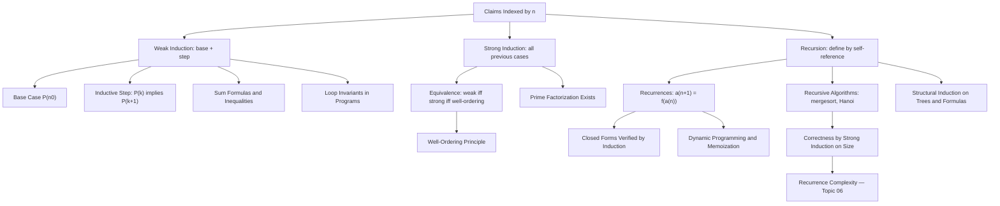

# Topic 04: Induction and Recursion

## 1. Master Overview

Mathematical induction is the proof technique purpose-built for the natural numbers: to prove $P(n)$ for all $n \geq n_0$, verify the base case $P(n_0)$ and prove the inductive step — that $P(k)$ implies $P(k+1)$ for arbitrary $k \geq n_0$. The domino image is exact: the first tile falls, each falling tile topples the next, so all fall. Strong induction lets the step assume *all* previous cases $P(n_0), \ldots, P(k)$ rather than only $P(k)$; despite feeling more powerful it is logically equivalent to weak induction, and both are equivalent to the well-ordering principle — every nonempty set of natural numbers has a least element. Proving these equivalences is one of the highlights of this module.

Recursion is induction's mirror image on the definitional side: a recursively defined object (a sequence $a_{n+1} = f(a_n)$, a recursive function, a tree datatype) is *constructed* by exactly the pattern that induction *verifies*. Consequently every claim about a recursive definition — a closed form for a recurrence, correctness of merge sort, a bound on Fibonacci growth — is proved by induction, with the recursive structure dictating the shape of the inductive step. Structural induction extends the method from $\mathbb{N}$ to trees, formulas, and any inductively defined datatype.

For computer science and machine learning this is arguably the single most load-bearing proof technique: loop invariants are inductive proofs threaded through iterations, divide-and-conquer correctness is strong induction on input size, dynamic programming is recursion with memoization, and unrolled recurrent networks or iterative optimizers are analyzed by induction on the time step.

> [!NOTE]
> The inductive step must be proved for an *arbitrary* $k$, using the inductive hypothesis $P(k)$ as an assumption — never by assuming $P(k+1)$. And the base case is not a formality: the famous "all horses are the same color" fallacy has a flawless-looking inductive step that silently fails at $n = 2$, precisely where the base case cannot reach.

## 2. First-Principles Framework

- **Phenomenon**: Claims indexed by natural numbers — formulas $\sum_{i=1}^{n} i = n(n+1)/2$, growth bounds, correctness of the $n$-th loop iteration — assert infinitely many facts at once, one per $n$.
- **Goal**: Establish all infinitely many instances with a finite, two-part argument, and define infinite objects (sequences, datatypes) by finite self-referential rules.
- **Governing principle**: The induction axiom of $\mathbb{N}$ — if a set $S \subseteq \mathbb{N}$ contains $n_0$ and is closed under successor, then $S$ contains every $n \geq n_0$; equivalently (well-ordering) every nonempty subset of $\mathbb{N}$ has a least element.
- **Formulation**: Weak induction: $P(n_0) \wedge \bigl(\forall k \geq n_0,\ P(k) \to P(k+1)\bigr) \implies \forall n \geq n_0,\ P(n)$. Strong induction replaces the hypothesis by $P(n_0) \wedge \cdots \wedge P(k)$. Recursion: base values plus a rule computing each value from earlier ones define a unique total function.
- **Consequence**: Closed forms for recurrences, correctness proofs of recursive and iterative algorithms, structural induction over datatypes, and the analytical machinery behind divide-and-conquer complexity (developed further in Topic 06).

## 3. Mermaid Concept Map

## 4. Common Misconceptions

| Misconception | Mathematical Reality | Correct Mental Model |
|---|---|---|
| "The base case is a formality that can be skipped." | Without a base case nothing starts: the step $P(k) \to P(k+1)$ alone proves nothing (e.g. "$n = n+1$" has a valid-looking step from a false hypothesis and no true instance). | The first domino must actually fall. |
| "In the inductive step you assume what you are trying to prove." | You assume $P(k)$ for one arbitrary $k$ and *prove* $P(k+1)$ — an implication, not the theorem itself; circularity would be assuming $P(k+1)$. | The step is a conditional claim; the engine of induction chains conditionals from the base. |
| "Strong induction is genuinely stronger than weak induction." | Each implies the other: strong induction for $P$ is weak induction for $Q(k) = P(n_0) \wedge \cdots \wedge P(k)$. | "Strong" refers to the richer hypothesis available in the step, not to greater logical power. |
| "One base case always suffices." | Steps that reach back $r$ places (e.g. $a_{k+1}$ defined from $a_k$ and $a_{k-1}$) need $r$ base cases; the horses paradox fails exactly because the step needs $n \geq 3$ to overlap two groups. | Match the number of base cases to how far back the step reaches, and check the step at its smallest instance. |
| "Induction only proves formulas about sums." | Induction proves divisibility facts, inequalities, correctness of algorithms, properties of all trees/formulas (structural induction), and existence claims like prime factorization. | Induction is a proof scheme for any inductively generated collection, not a formula-checking trick. |
| "A recurrence *is* its closed form." | A recurrence defines values; a proposed closed form is a theorem *about* them requiring proof (typically induction). Guessing from patterns can mislead: regions of a circle from $n$ chords follow $1, 2, 4, 8, 16, 31$. | Conjecture from small cases, then prove by induction — the conjecture step can fail, the proof step cannot. |
| "Recursion and iteration are fundamentally different computations." | Every primitive recursion unrolls to iteration with accumulators and vice versa; induction on time step proves the equivalence. | Recursion is definition by self-reference; iteration is its unrolled evaluation — one structure, two readings. |

## 5. Directory Inventory

| File | Description |
|---|---|
| [`README.md`](README.md) | Master overview, first-principles framework, concept map, misconceptions, references. |
| [`first_principles.ipynb`](first_principles.ipynb) | Markdown-only theory notebook: intuition, rigorous statements of weak/strong induction and well-ordering, six complete proofs (sum formula, geometric series, Bernoulli inequality, strong-weak-well-ordering equivalence, prime factorization, Tower of Hanoi closed form), computational insights, and AI/ML applications. |
| [`exercises.ipynb`](exercises.ipynb) | 20 fully solved problems across 4 levels: Concept Check (4), Foundation (6), Applications in AI/ML and CS (6), Challenge (4). |

## 6. References

1. **Velleman, D. J.** (2019). *How to Prove It: A Structured Approach* (3rd ed.). Cambridge University Press. — Chapter 6: mathematical induction in all its forms.
2. **Rosen, K. H.** (2019). *Discrete Mathematics and Its Applications* (8th ed.). McGraw-Hill. — Chapter 5: induction, strong induction, well-ordering, recursive definitions, structural induction.
3. **Graham, R. L., Knuth, D. E., & Patashnik, O.** (1994). *Concrete Mathematics* (2nd ed.). Addison-Wesley. — Chapters 1–2: recurrent problems (Hanoi, Josephus) and sums.
4. **Hammack, R.** (2018). *Book of Proof* (3rd ed.). Virginia Commonwealth University. — Chapter 10: induction with many worked proofs.
5. **Cormen, T. H., Leiserson, C. E., Rivest, R. L., & Stein, C.** (2022). *Introduction to Algorithms* (4th ed.). MIT Press. — Chapters 2 and 4: loop invariants, divide-and-conquer, recurrences.
6. **Pólya, G.** (1945). *How to Solve It*. Princeton University Press. — Induction and analogy in problem solving.
7. **Knuth, D. E.** (1997). *The Art of Computer Programming, Vol. 1* (3rd ed.). Addison-Wesley. — Section 1.2.1: induction as the fundamental proof method of programming.
8. **Peano, G.** (1889). *Arithmetices principia, nova methodo exposita*. — The induction axiom in its original formulation.
