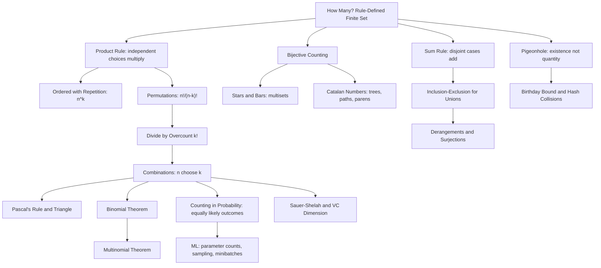

# Topic 05: Combinatorics and Counting

## 1. Master Overview

Combinatorics is the art of counting a set without listing it. Almost every quantitative question that begins "how many" — how many parameters does this network have, how many ways can a batch be shuffled, how many distinct dropout masks exist, how many labelings can a hypothesis class realize — is answered by composing a handful of primitive rules. The two atoms are the **sum rule** (disjoint alternatives add) and the **product rule** (independent successive choices multiply). Everything else in this module is built from them: permutations count ordered selections, combinations count unordered ones, the binomial and multinomial theorems package repeated choices algebraically, and stars-and-bars converts distributions of identical items into a choice of separators.

Beyond the basic rules sit three techniques that repeatedly rescue problems the atoms cannot reach directly. **Inclusion–exclusion** counts unions by alternately adding and subtracting overcounted intersections, and specializes to derangements and surjection counts. The **pigeonhole principle** is the counting argument that proves existence rather than quantity: if $n$ objects occupy $m \lt n$ boxes, some box is shared — an absurdly simple statement that yields hash collisions, the birthday bound, and Erdős–Szekeres monotone subsequences. And **bijective counting** — exhibiting a one-to-one correspondence with a set whose size is already known — is the most elegant weapon of all, turning the Catalan numbers, lattice-path counts, and binary-tree enumerations into one-line consequences of a well-chosen encoding.

For machine learning this material is infrastructure rather than decoration. Discrete probability is counting divided by counting, so every uniform-sampling argument, every combinatorial bound on generalization (Sauer–Shelah, VC dimension), every parameter-count and FLOP estimate, and every analysis of hash tables, negative sampling, and cross-validation splits reduces to the identities developed here. Counting also delivers the bad news: the number of subsets, orderings, architectures, or discrete label assignments grows factorially or exponentially, which is precisely why exhaustive search is hopeless and why continuous relaxation, dynamic programming, and sampling exist.

> [!NOTE]
> Before counting anything, answer two questions explicitly: **does order matter?** and **are repeats allowed?** The four answers give the four basic formulas — ordered with repetition $n^{k}$, ordered without $n!/(n-k)!$, unordered without $\binom{n}{k}$, unordered with $\binom{n+k-1}{k}$. Most counting errors are not algebra slips; they are unnoticed answers to these two questions.

## 2. First-Principles Framework

- **Phenomenon**: Finite collections defined by *rules* rather than by enumeration — all $8$-character passwords, all ways to seat $12$ guests, all subsets of features, all binary trees on $n$ nodes — are far too large to list, yet their sizes are exactly determined.
- **Goal**: Compute cardinalities of rule-defined finite sets exactly, and derive existence results (pigeonhole) and probabilities (equally likely outcomes) from those counts.
- **Governing principle**: Cardinality is invariant under bijection, additive over disjoint unions, and multiplicative over independent choices: $\vert A \cup B \vert = \vert A \vert + \vert B \vert$ when $A \cap B = \varnothing$, and $\vert A \times B \vert = \vert A \vert \cdot \vert B \vert$.
- **Formulation**: Decompose the target set into a sequence of independent choices (multiply), a disjoint case split (add), an overcounted image of a known set (divide by the fibre size), a union with overlaps (inclusion–exclusion), or a bijective copy of a known set (transfer the count).
- **Consequence**: Closed forms for permutations, combinations, multisets, and derangements; the binomial and multinomial theorems; probability of equally likely events; and the combinatorial bounds that underpin learning theory, hashing, and complexity.

The whole of elementary selection counting collapses into one table, obtained by answering the two questions of the callout above — choosing $k$ items from $n$ types:

| | Order matters | Order does not matter |
|---|---|---|
| **Repetition allowed** | $n^{k}$ (functions, strings, dropout masks) | $\binom{n+k-1}{k}$ (multisets, stars and bars) |
| **Repetition forbidden** | $\dfrac{n!}{(n-k)!}$ (injections, rankings) | $\dfrac{n!}{k!\,(n-k)!}$ (subsets, committees, minibatches) |

Every later formula in this module is one of these four modified by a symmetry (divide), a case split (add), or an overlap correction (inclusion–exclusion).

## 3. Mermaid Concept Map

## 4. Common Misconceptions

| Misconception | Mathematical Reality | Correct Mental Model |
|---|---|---|
| "Permutations and combinations are interchangeable if you divide at the end." | $\binom{n}{k} = P(n,k)/k!$ holds only because *every* unordered selection is overcounted by exactly $k!$; when the overcount is not uniform (repeated elements, symmetries of different sizes) the division is invalid. | Divide by an overcount only after proving the fibres all have the same size. |
| "Choosing with replacement and unordered is $n^{k}/k!$." | That expression is usually not even an integer; the correct multiset count is $\binom{n+k-1}{k}$ by stars and bars, because the fibres of the ordering map have *different* sizes when repeats occur. | Model multisets by counts per type, then place $k-1$ bars among $n+k-1$ positions. |
| "Inclusion–exclusion is just subtract the overlap." | Subtracting pairwise intersections over-corrects for triple overlaps; the correct formula alternates signs across all $2^{m}-1$ nonempty index subsets. | Track how many times a single element is counted: $\sum_{j\ge1} (-1)^{j+1}\binom{t}{j} = 1$ for an element in exactly $t$ sets. |
| "The pigeonhole principle tells you which box is crowded." | It is a pure existence statement, proved by contradiction against the sum rule; it names no box and gives no construction. | Pigeonhole answers "must there be a collision", never "where". |
| "Independent choices means statistically independent events." | The product rule requires only that the *number* of options at each stage be constant, regardless of earlier choices — a structural condition, not a probabilistic one. | Check that stage $i$ always offers $n_i$ options; if the count depends on history, split into cases first. |
| "Counting arrangements of a word is $n!$." | Repeated letters create symmetry: distinct arrangements number $n!/(n_1!\,n_2!\cdots)$, the multinomial coefficient. | Every symmetry of the object divides the naive ordered count. |
| "Small combinatorial spaces can be searched exhaustively, so counting is academic." | $50!$ exceeds $10^{64}$ and the subsets of $300$ features exceed the atom count of the observable universe; counting is what proves search is hopeless. | Count first to decide between exact search, dynamic programming, and sampling. |

## 5. Directory Inventory

| File | Description |
|---|---|
| [`README.md`](README.md) | Master overview, first-principles framework, concept map, misconceptions, references. |
| [`first_principles.ipynb`](first_principles.ipynb) | Markdown-only theory notebook: intuition, rigorous definitions of the counting rules, six complete proofs (permutations and combinations, binomial theorem by induction, inclusion–exclusion, stars and bars, derangements, Catalan numbers, pigeonhole), computational insights, and AI/ML applications. |
| [`exercises.ipynb`](exercises.ipynb) | 20 fully solved problems across 4 levels: Concept Check (4), Foundation (6), Applications in AI/ML and CS (6), Challenge (4). |

## 6. References

1. **Rosen, K. H.** (2019). *Discrete Mathematics and Its Applications* (8th ed.). McGraw-Hill. — Chapters 6 and 8: counting, pigeonhole, inclusion–exclusion, generating functions.
2. **Graham, R. L., Knuth, D. E., & Patashnik, O.** (1994). *Concrete Mathematics* (2nd ed.). Addison-Wesley. — Chapter 5: binomial coefficients, the definitive treatment of identities.
3. **Stanley, R. P.** (2011). *Enumerative Combinatorics, Vol. 1* (2nd ed.). Cambridge University Press. — Bijective methods and the twelvefold way.
4. **van Lint, J. H., & Wilson, R. M.** (2001). *A Course in Combinatorics* (2nd ed.). Cambridge University Press. — Pigeonhole, Ramsey theory, designs.
5. **Feller, W.** (1968). *An Introduction to Probability Theory and Its Applications, Vol. 1* (3rd ed.). Wiley. — Counting as the foundation of discrete probability; the birthday problem.
6. **Velleman, D. J.** (2019). *How to Prove It* (3rd ed.). Cambridge University Press. — Chapter 6: combinatorial proofs by induction.
7. **Cormen, T. H., Leiserson, C. E., Rivest, R. L., & Stein, C.** (2022). *Introduction to Algorithms* (4th ed.). MIT Press. — Appendix C and Chapter 11: counting, probability, hashing.
8. **Shalev-Shwartz, S., & Ben-David, S.** (2014). *Understanding Machine Learning*. Cambridge University Press. — Chapter 6: the Sauer–Shelah lemma, counting dichotomies, VC dimension.
9. **Pólya, G.** (1945). *How to Solve It*. Princeton University Press. — Systematic enumeration and the discipline of checking small cases.
