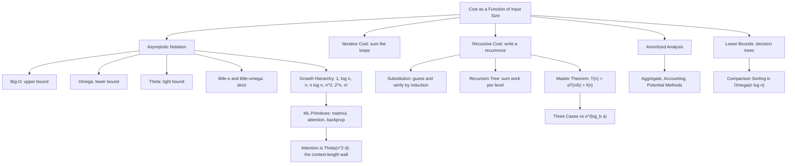

# Topic 06: Asymptotics and Algorithmic Reasoning

## 1. Master Overview

Asymptotic analysis is the discipline of comparing functions by how they *grow*, deliberately discarding constant factors and low-order terms. The motivation is that these discarded quantities are exactly the ones that depend on hardware, compiler, and coding style, while the growth rate is a property of the algorithm itself. Writing $T(n) = \Theta(n\log n)$ asserts something that survives a change of language, processor, and decade; writing $T(n) = 4.7n\log_2 n + 312n$ does not. The five relations — $O$ (upper bound), $\Omega$ (lower bound), $\Theta$ (tight bound), $o$ (strictly smaller), $\omega$ (strictly larger) — are each defined by an explicit quantifier statement with witness constants, and every claim about them is proved by exhibiting those constants or deriving a contradiction from their existence.

The second half of the subject is *getting* the growth rate in the first place. Iterative algorithms are counted directly, usually by summing a series. Recursive algorithms produce recurrences, and three techniques solve them: **substitution** (guess a bound and verify it by induction, exactly the Topic 04 workflow), the **recursion tree** (sum the work level by level, which both suggests the answer and proves it), and the **Master theorem** (a packaged solution for divide-and-conquer recurrences $T(n) = aT(n/b) + f(n)$, whose three cases are decided by comparing $f(n)$ against $n^{\log_b a}$). Beyond worst-case-per-operation analysis lies **amortized analysis**, which bounds the cost of a *sequence* of operations — the aggregate, accounting, and potential methods — and explains why a dynamic array with occasional $O(n)$ resizes still supports $O(1)$ amortized appends.

For machine learning the payoff is direct and quantitative. Matrix multiplication of an $m \times k$ by a $k \times n$ pair costs $\Theta(mkn)$; self-attention over $n$ tokens of width $d$ costs $\Theta(n^{2}d)$ time and $\Theta(n^{2})$ memory for the score matrix, which is why context length is expensive and why linear-attention, sparse, and IO-aware (FlashAttention) variants exist; backpropagation costs a small constant multiple of the forward pass by the Baur–Strassen principle; transformer training runs at roughly $6N$ FLOPs per token for $N$ parameters. Asymptotics tells you which of these terms will dominate at scale, and the constants tell you where the crossover sits — both matter, and confusing the two is the most common analytical error in practice.

> [!NOTE]
> $O$ is an *upper bound*, not a description of the running time: $n\log n$ sorting is correctly (if uselessly) described as $O(n^{5})$, and "worst case" versus "average case" is an orthogonal axis to $O$ versus $\Omega$ versus $\Theta$. State both: "merge sort's worst case is $\Theta(n\log n)$" says far more than either half alone.

## 2. First-Principles Framework

- **Phenomenon**: Exact operation counts are unstable — they depend on machine, language, and implementation detail — yet the *relative* performance of two algorithms on large inputs is stable and predictable.
- **Goal**: Classify functions by growth rate so that algorithms can be compared in a machine-independent way, and compute those growth rates from an algorithm's structure.
- **Governing principle**: Two functions are equivalent if their ratio is bounded above and below by positive constants for all sufficiently large $n$; the resulting equivalence classes ($\Theta$-classes) form a hierarchy ordered by eventual domination.
- **Formulation**: $f(n) = O(g(n))$ iff $\exists c \gt 0, n_0$ such that $0 \le f(n) \le c\,g(n)$ for all $n \ge n_0$; $\Omega$ reverses the inequality; $\Theta$ is the conjunction; $o$ and $\omega$ replace "some constant" by "every constant". Costs are obtained by summing loops, solving recurrences, or amortizing over sequences.
- **Consequence**: A stable vocabulary for algorithm comparison, provable lower bounds (comparison sorting is $\Omega(n\log n)$), the Master theorem for divide-and-conquer, amortized guarantees for dynamic data structures, and the cost model that governs the scaling of machine learning systems.

The hierarchy that results is the practical summary of the whole topic — each row is eventually dominated by the next, with the feasibility frontier sitting between the polynomial and exponential blocks:

| Class | Representative algorithm | Feasible $n$ at $10^{9}$ steps |
|---|---|---|
| $\Theta(1)$, $\Theta(\log n)$ | Hash lookup, binary search | Effectively unbounded |
| $\Theta(n)$, $\Theta(n\log n)$ | Linear scan, merge sort, FFT | $10^{9}$ / $10^{7.5}$ |
| $\Theta(n^{2})$, $\Theta(n^{3})$ | Self-attention scores, dense matmul | $10^{4.5}$ / $10^{3}$ |
| $\Theta(2^{n})$, $\Theta(n!)$ | Subset enumeration, brute-force TSP | $30$ / $12$ |

Everything below the horizontal midpoint is where relaxation, approximation, and sampling replace exact computation.

## 3. Mermaid Concept Map

## 4. Common Misconceptions

| Misconception | Mathematical Reality | Correct Mental Model |
|---|---|---|
| "$O(g)$ means the running time *is* $g$." | $O$ is only an upper bound, so $n = O(n^{3})$ is a true and legitimate statement. Tightness is claimed by $\Theta$. | Say $\Theta$ when you mean tight; reserve $O$ for guarantees and $\Omega$ for impossibility. |
| "Big-O is about the worst case, $\Omega$ about the best case." | The two axes are independent: one can state $\Omega$ bounds on the worst case, or $O$ bounds on the average case. Quicksort is $\Theta(n^{2})$ worst case and $\Theta(n\log n)$ expected. | Always name the case *and* the bound: "worst-case $\Theta$", "expected $O$". |
| "Constants do not matter." | Asymptotics deliberately hides constants, but at realistic $n$ they decide everything: Strassen's $\Theta(n^{2.807})$ beats the cubic algorithm only above a crossover of hundreds, and a cache-friendly $\Theta(n^{2})$ routine can beat a $\Theta(n\log n)$ one with poor locality. | Asymptotics ranks algorithms as $n \to \infty$; benchmarks decide at your $n$. |
| "The Master theorem solves every recurrence." | It requires the form $T(n) = aT(n/b) + f(n)$ with constant $a, b$, and its three cases leave gaps — $T(n) = 2T(n/2) + n\log n$ falls between cases 2 and 3 and needs a recursion tree or Akra–Bazzi. | Treat the Master theorem as a fast path, the recursion tree as the general method. |
| "Amortized and average-case are the same." | Amortized bounds are worst-case guarantees over any sequence of operations, with no probability involved; average-case bounds assume an input distribution. | Amortization redistributes deterministic cost; averaging integrates over randomness. |
| "A faster growth rate always means a slower program." | Growth rates compare the *same* cost measure; a $\Theta(n^{2})$ algorithm running in registers can beat a $\Theta(n\log n)$ one that thrashes memory, and modern hardware makes FLOPs cheaper than memory traffic. | Model the resource that is actually scarce — often memory bandwidth, not arithmetic. |
| "$\log n$ is basically constant, so log factors can be ignored." | $\log_2 n$ reaches $40$ at $n = 10^{12}$, and an extra log factor is exactly the gap between a linear-time and a sorting-based solution at scale. | Logs are small but real; state them and let the constants decide. |

## 5. Directory Inventory

| File | Description |
|---|---|
| [`README.md`](README.md) | Master overview, first-principles framework, concept map, misconceptions, references. |
| [`first_principles.ipynb`](first_principles.ipynb) | Markdown-only theory notebook: intuition, rigorous definitions of $O$, $\Omega$, $\Theta$, $o$, $\omega$, six complete proofs (tight bound from the definition, growth hierarchy, Master theorem by recursion tree, substitution with a strengthened hypothesis, amortized dynamic arrays, comparison-sorting lower bound), computational insights, and AI/ML applications. |
| [`exercises.ipynb`](exercises.ipynb) | 20 fully solved problems across 4 levels: Concept Check (4), Foundation (6), Applications in AI/ML and CS (6), Challenge (4). |

## 6. References

1. **Cormen, T. H., Leiserson, C. E., Rivest, R. L., & Stein, C.** (2022). *Introduction to Algorithms* (4th ed.). MIT Press. — Chapters 3–4 and 16: asymptotic notation, recurrences, the Master theorem, amortized analysis.
2. **Graham, R. L., Knuth, D. E., & Patashnik, O.** (1994). *Concrete Mathematics* (2nd ed.). Addison-Wesley. — Chapter 9: asymptotics, $O$-manipulation, and Stirling's approximation.
3. **Knuth, D. E.** (1997). *The Art of Computer Programming, Vol. 1* (3rd ed.). Addison-Wesley. — Section 1.2.11: the original careful treatment of $O$ notation in algorithm analysis.
4. **Sedgewick, R., & Flajolet, P.** (2013). *An Introduction to the Analysis of Algorithms* (2nd ed.). Addison-Wesley. — Precise (constant-carrying) analysis beyond $\Theta$.
5. **Kleinberg, J., & Tardos, É.** (2005). *Algorithm Design*. Pearson. — Chapter 2 and 5: growth rates and divide-and-conquer recurrences.
6. **Arora, S., & Barak, B.** (2009). *Computational Complexity: A Modern Approach*. Cambridge University Press. — Complexity classes and lower-bound techniques.
7. **Rosen, K. H.** (2019). *Discrete Mathematics and Its Applications* (8th ed.). McGraw-Hill. — Chapter 3: growth of functions with worked constant-witness proofs.
8. **Golub, G. H., & Van Loan, C. F.** (2013). *Matrix Computations* (4th ed.). Johns Hopkins University Press. — Flop counts for the linear-algebra kernels underlying machine learning.
9. **Dao, T., Fu, D., Ermon, S., Rudra, A., & Ré, C.** (2022). *FlashAttention: Fast and Memory-Efficient Exact Attention with IO-Awareness*. NeurIPS. — Why memory traffic, not FLOP count, bounds attention in practice.
