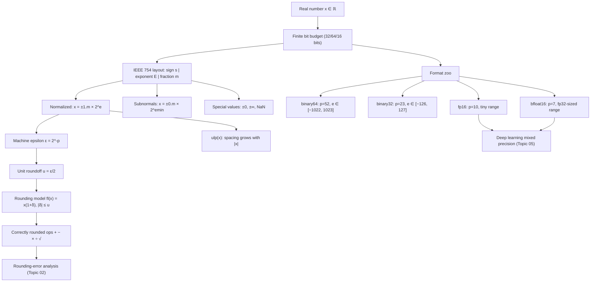

# Topic 01: IEEE 754 Floating-Point Representation

## 1. Master Overview

Every number a computer manipulates is a finite pattern of bits, yet the real line is uncountably infinite. The IEEE 754 standard resolves this tension by defining a discrete, sign-magnitude, exponent-scaled subset of the rationals — the floating-point numbers — together with precise rules for rounding every arithmetic result back into that subset. Understanding this representation from first principles explains why `0.1 + 0.2 != 0.3`, why the gap between adjacent representable numbers grows with magnitude, and why every numerical algorithm must be analyzed against the rounding model $\mathrm{fl}(x) = x(1+\delta)$ with $\lvert\delta\rvert \le u$.

This module builds the entire representation from scratch: the sign/exponent/significand bit layout, normalized and subnormal numbers, machine epsilon versus unit roundoff, units in the last place (ulp), special values ($\pm\infty$, NaN, signed zero), and the four rounding modes. We compare the formats that dominate scientific computing and machine learning — binary64 (double), binary32 (float), binary16 (fp16), and bfloat16 — and quantify the precision/dynamic-range trade-off each one makes.

The payoff is a mental model in which floating-point arithmetic is not "broken real arithmetic" but a fully specified algebraic system with its own exact axioms. Every stability trick in Topics 02–05 is a consequence of the anatomy studied here.

> [!NOTE]
> The single most important fact in this module: IEEE 754 guarantees that every basic operation $\circ \in \{+, -, \times, \div, \sqrt{\phantom{x}}\}$ is *correctly rounded*, i.e. $\mathrm{fl}(x \circ y) = (x \circ y)(1+\delta)$ with $\lvert\delta\rvert \le u$ (unit roundoff). All of rounding-error analysis is built on this one axiom.

## 2. First-Principles Framework

- **Phenomenon**: Real numbers require infinitely many bits; hardware provides finitely many. Storing and operating on reals therefore forces a discretization of the number line, with relative (not absolute) spacing.
- **Goal**: Design a finite number system that (a) covers a huge dynamic range, (b) keeps *relative* representation error uniformly small, and (c) makes arithmetic results predictable and portable across machines.
- **Governing equation**: A binary floating-point number is $x = (-1)^s \cdot (1.m_1 m_2 \dots m_p)_2 \cdot 2^{e}$, with $p$ significand bits and exponent $e \in [e_{\min}, e_{\max}]$; rounding obeys $\mathrm{fl}(x) = x(1+\delta)$ with $\lvert\delta\rvert \le u = 2^{-(p+1)}$ under round-to-nearest (so $u = \frac{1}{2}\varepsilon_{\mathrm{mach}}$).
- **Key quantities**: machine epsilon $\varepsilon = 2^{-p}$ (gap from $1$ to the next float), unit roundoff $u = \varepsilon/2$, $\mathrm{ulp}(x) = 2^{\lfloor \log_2 \lvert x\rvert \rfloor - p}$.
- **Consequences**: representable numbers cluster geometrically near zero; exact integer arithmetic holds up to $2^{p+1}$; comparisons need scale-aware tolerances; subnormals fill the underflow gap at reduced precision.

## 3. Mermaid Concept Map

## 4. Common Misconceptions

| Misconception | Mathematical Reality | Correct Mental Model |
|---|---|---|
| *"Floating-point numbers are spread uniformly on the real line."* | Spacing between neighbors is $\mathrm{ulp}(x) \approx \varepsilon \lvert x\rvert$: it doubles at every power of two. | Floats form a geometric grid: absolute gaps grow with magnitude, relative gaps stay roughly constant. |
| *"`0.1` is stored exactly; the error appears during arithmetic."* | $0.1 = 1/10$ has an infinite repeating binary expansion, so it is rounded at *storage* time: the stored double is $0.1000000000000000055511\dots$ | Representation error precedes arithmetic error; both obey the $(1+\delta)$ model. |
| *"Machine epsilon is the smallest positive float."* | $\varepsilon_{\mathrm{mach}} = 2^{-52} \approx 2.2 \times 10^{-16}$ for doubles, while the smallest subnormal is $2^{-1074} \approx 4.9 \times 10^{-324}$. | Epsilon measures relative *precision* near 1; the underflow threshold measures *range*. They differ by ~300 orders of magnitude. |
| *"Floating-point addition is associative, like real addition."* | $(a+b)+c \ne a+(b+c)$ in general because each partial sum is rounded, e.g. $(1 + 10^{16}) - 10^{16} = 0$ but $1 + (10^{16} - 10^{16}) = 1$. | Every operation rounds; reordering changes which roundings occur. This is why parallel reductions are non-deterministic. |
| *"Comparing floats with `==` is always wrong."* | Integers up to $2^{53}$, small dyadic rationals, and results of exact operations compare exactly; `==` is wrong only after inexact rounding. | Use `==` for exactly representable values; use scale-aware `rtol`/`atol` after inexact computation. |
| *"fp16 and bfloat16 are basically the same 16-bit format."* | fp16 has $p=10$ fraction bits and max $\approx 65504$; bfloat16 has $p=7$ but the full fp32 exponent range (max $\approx 3.4 \times 10^{38}$). | fp16 trades range for precision; bfloat16 trades precision for range — which is why bf16 rarely needs loss scaling (Topic 05). |
| *"NaN can be tested with `x == NaN`."* | IEEE 754 defines NaN as unordered: every comparison with NaN, including `NaN == NaN`, is false. | Test with `isnan(x)`; the self-inequality `x != x` is the classic portable NaN detector. |

## 5. Directory Inventory

| File | Type | Description |
|---|---|---|
| [`README.md`](README.md) | Index | Master overview, concept map, misconceptions, references. |
| [`first_principles.ipynb`](first_principles.ipynb) | Theory | Bit-level construction of IEEE 754, machine epsilon and ulp derivations, rounding-model proofs, format comparison, ML applications. |
| [`exercises.ipynb`](exercises.ipynb) | Practice | 20 fully solved problems across 4 levels (concept checks to challenge derivations on ulp spacing, exact integer ranges, and format design). |

## 6. References

- **Goldberg, D.** (1991). *What Every Computer Scientist Should Know About Floating-Point Arithmetic*. ACM Computing Surveys, 23(1), 5–48.
- **Higham, N. J.** (2002). *Accuracy and Stability of Numerical Algorithms* (2nd ed.). SIAM. — Chapters 1–2: floating-point arithmetic and the rounding model.
- **IEEE Computer Society.** (2019). *IEEE Standard for Floating-Point Arithmetic* (IEEE 754-2019).
- **Trefethen, L. N., & Bau, D.** (1997). *Numerical Linear Algebra*. SIAM. — Lecture 13: floating-point arithmetic.
- **Muller, J.-M., et al.** (2018). *Handbook of Floating-Point Arithmetic* (2nd ed.). Birkhäuser.
- **Kahan, W.** (1997). *Lecture Notes on the Status of IEEE Standard 754 for Binary Floating-Point Arithmetic*. UC Berkeley.
- **Harris, C. R., et al.** (2020). *Array programming with NumPy*. Nature, 585, 357–362. — dtype system and float format support.
