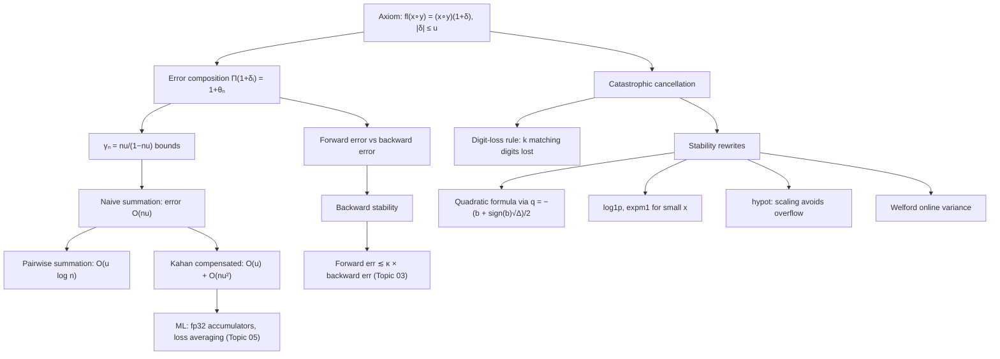

# Topic 02: Error Propagation and Stability Tricks

## 1. Master Overview

Topic 01 established the single axiom of floating-point arithmetic: every operation returns the exact result perturbed by a relative error at most $u$. This module turns that axiom into a *calculus of error propagation* — the discipline of tracking how thousands or billions of $(1+\delta)$ factors compound through an algorithm, and of rewriting formulas so that they do not.

The central phenomenon is **catastrophic cancellation**: subtracting two nearly equal quantities is itself exact (Sterbenz), yet it strips away the leading digits that carried the information, promoting previously negligible rounding errors into the leading digits of the result. Around this phenomenon we build the classical toolbox of numerical practice: forward versus backward error, compensated (Kahan) and pairwise summation, stable rewrites of the quadratic formula, `log1p`/`expm1`, `hypot`, Welford's online variance, and error-free transformations.

The module's governing distinction — *the formula and the algorithm are different objects* — is the intellectual heart of scientific computing. Two algebraically identical expressions can differ by ten orders of magnitude in accuracy. The stability tricks collected here are not ad hoc hacks; each is a principled restructuring that either avoids cancellation of exact quantities or arranges for errors to cancel instead of compound.

> [!NOTE]
> Rule of thumb (Higham): if two numbers agree to $k$ significant digits, their difference loses about $k$ digits of relative accuracy. Cancellation does not *create* error — it *reveals and amplifies* error committed earlier. The cure is always to reformulate so the subtraction happens analytically, before any rounding.

## 2. First-Principles Framework

- **Phenomenon**: Individual rounding errors are tiny ($\sim 10^{-16}$), yet computed results can be wrong in every digit. Errors are amplified by cancellation and accumulate over long chains of operations.
- **Goal**: Predict the accuracy of a computed result via a priori bounds, and restructure algorithms so the accumulated error stays $O(u)$ rather than $O(nu)$ or worse.
- **Governing equation**: composing rounded operations gives products $\prod_{i}(1+\delta_i)$, summarized by the bound $\prod_{i=1}^{n}(1+\delta_i) = 1 + \theta_n$ with $\lvert\theta_n\rvert \le \gamma_n = \frac{nu}{1-nu}$.
- **Forward vs backward error**: forward error asks "how far is $\hat{y}$ from $y = f(x)$?"; backward error asks "for what perturbed input $x + \Delta x$ is $\hat{y} = f(x + \Delta x)$ exact?". The bridge: forward error $\lesssim$ condition number $\times$ backward error (Topic 03).
- **Design principle**: prefer algorithms that are *backward stable* — their computed answer is the exact answer to a nearby question.

## 3. Mermaid Concept Map

## 4. Common Misconceptions

| Misconception | Mathematical Reality | Correct Mental Model |
|---|---|---|
| *"Subtracting nearby numbers introduces a large rounding error."* | By the Sterbenz lemma the subtraction is often *exact*; the damage is that leading digits cancel, leaving previously committed errors as the leading content. | Cancellation is an amplifier of old error, not a source of new error. Restructure so cancellation happens symbolically. |
| *"Summing $n$ numbers always loses $O(nu)$ accuracy."* | The $\gamma_{n-1}$ bound is worst-case for recursive summation; pairwise summation achieves $O(u \log n)$ and Kahan summation $2u + O(nu^2)$ per the relative bound. | The error constant depends on the *summation order and algorithm*, not just on $n$. |
| *"Averaging many rounding errors makes them cancel to zero."* | Independent roundings behave like a random walk: expected error grows like $\sqrt{n}\,u$, not zero; correlated (biased) errors grow like $nu$. | Cancellation-on-average reduces growth from $n$ to $\sqrt{n}$ — helpful, but never free, and never guaranteed. |
| *"The textbook quadratic formula is numerically fine because it is exact algebra."* | When $b^2 \gg 4ac$, one root computes $-b + \sqrt{b^2 - 4ac}$, a difference of nearly equal quantities — losing up to all significant digits. | Compute the well-conditioned root first, then recover the other via the exact product $x_1 x_2 = c/a$. |
| *"`log(1+x)` and `log1p(x)` are the same function."* | For $x \approx 10^{-12}$, `1+x` rounds to a float carrying only ~4 significant digits of $x$; `log1p` computes the series directly, keeping full precision. | Whenever the *deviation from a reference value* is the signal, use the function that takes the deviation as input. |
| *"Two-pass variance $\frac{1}{n}\sum (x_i - \bar{x})^2$ and one-pass $\frac{1}{n}\sum x_i^2 - \bar{x}^2$ agree numerically."* | The one-pass textbook formula subtracts two large nearly equal quantities when the mean dominates the spread, and can even return negative variance. | Use the shifted two-pass form or Welford's online update, both of which subtract small quantities from small quantities. |

## 5. Directory Inventory

| File | Type | Description |
|---|---|---|
| [`README.md`](README.md) | Index | Master overview, concept map, misconceptions, references. |
| [`first_principles.ipynb`](first_principles.ipynb) | Theory | The $\gamma_n$ calculus, cancellation bound, Kahan summation error-bound sketch, stable rewrites (quadratic, log1p, hypot, Welford), forward/backward error, ML accumulation patterns. |
| [`exercises.ipynb`](exercises.ipynb) | Practice | 20 fully solved problems across 4 levels, from digit-loss estimates to a full compensated-summation error proof. |

## 6. References

- **Goldberg, D.** (1991). *What Every Computer Scientist Should Know About Floating-Point Arithmetic*. ACM Computing Surveys, 23(1). — cancellation, guard digits.
- **Higham, N. J.** (2002). *Accuracy and Stability of Numerical Algorithms* (2nd ed.). SIAM. — Chapters 2–4: error analysis and summation.
- **Kahan, W.** (1965). *Further remarks on reducing truncation errors*. Communications of the ACM, 8(1), 40.
- **Trefethen, L. N., & Bau, D.** (1997). *Numerical Linear Algebra*. SIAM. — Lectures 14–15: stability and backward stability.
- **Welford, B. P.** (1962). *Note on a method for calculating corrected sums of squares and products*. Technometrics, 4(3), 419–420.
- **Muller, J.-M., et al.** (2018). *Handbook of Floating-Point Arithmetic* (2nd ed.). Birkhäuser. — error-free transformations (TwoSum, Fast2Sum).
- **Blanchard, P., Higham, N. J., & Mary, T.** (2020). *A class of fast and accurate summation algorithms*. SIAM J. Sci. Comput. — modern mixed-precision summation.
