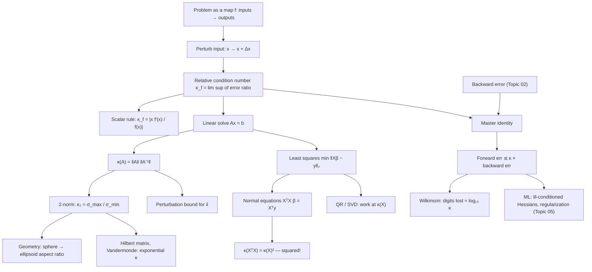

# Topic 03: Conditioning and Condition Numbers

## 1. Master Overview

When a computed answer is wrong, exactly one of two parties is to blame: the *algorithm* (it introduced errors an exact-arithmetic version would not) or the *problem* (its answer is intrinsically hypersensitive to the inputs). Topic 02 studied the first party; this module studies the second. The **condition number** $\kappa$ quantifies the worst-case amplification from relative input perturbations to relative output perturbations — a property of the mathematical map itself, independent of any algorithm, precision, or machine.

The master identity of numerical computing joins the two analyses: *forward error $\lesssim$ condition number $\times$ backward error*. A backward stable algorithm (backward error $O(u)$) applied to a problem of condition $\kappa$ delivers forward accuracy $O(\kappa u)$ — and nothing better is possible, because the rounding of the *inputs alone* already commits an error of that size. Wilkinson's rule of thumb follows: expect to lose about $\log_{10}\kappa$ decimal digits, no matter how carefully you compute.

We develop $\kappa$ for scalar functions ($\kappa_f = \lvert x f'(x)/f(x) \rvert$), for matrix–vector products and linear solves ($\kappa(A) = \lVert A \rVert \lVert A^{-1} \rVert = \sigma_{\max}/\sigma_{\min}$ in the 2-norm), and for least squares — including the famous result that forming the normal equations *squares* the condition number, which is why `lstsq` (QR/SVD) is preferred over inverting $X^{\top}X$. The companion notebook [`../conditioning_stability.ipynb`](../conditioning_stability.ipynb) demonstrates this squaring experimentally.

> [!NOTE]
> Conditioning and stability are orthogonal diagnoses. A stable algorithm on an ill-conditioned problem gives the exact answer to a nearby question — whose answer may be far away. An unstable algorithm on a well-conditioned problem wastes accuracy the problem would happily have provided. Only the pairing (stable algorithm, well-conditioned problem) guarantees an accurate result.

## 2. First-Principles Framework

- **Phenomenon**: Some problems (e.g. solving $Ax = b$ with nearly dependent columns, evaluating roots of polynomials near multiple roots) magnify input uncertainty by factors of $10^{6}$–$10^{16}$; no algorithm can undo this.
- **Goal**: Separate problem sensitivity from algorithmic error; predict achievable accuracy *before* computing; select formulations (QR vs normal equations, `solve` vs `inv`) that do not worsen the intrinsic $\kappa$.
- **Governing equation**: for differentiable $f$, the relative condition number is $\kappa_f(x) = \frac{\lVert J_f(x) \rVert \, \lVert x \rVert}{\lVert f(x) \rVert}$; for linear systems, $\frac{\lVert \Delta x \rVert}{\lVert x \rVert} \le \kappa(A) \left( \frac{\lVert \Delta A \rVert}{\lVert A \rVert} + \frac{\lVert \Delta b \rVert}{\lVert b \rVert} \right)$ to first order.
- **Master inequality**: forward error $\lesssim \kappa \times$ backward error; digits lost $\approx \log_{10} \kappa$.
- **Spectral form**: $\kappa_2(A) = \sigma_{\max}(A)/\sigma_{\min}(A)$ — conditioning is the aspect ratio of the ellipsoid into which $A$ maps the unit sphere.

## 3. Mermaid Concept Map

## 4. Common Misconceptions

| Misconception | Mathematical Reality | Correct Mental Model |
|---|---|---|
| *"A large condition number means the algorithm is bad."* | $\kappa$ is a property of the *problem* (the map and the data), defined without reference to any algorithm or precision. | Diagnose in two steps: measure backward error (algorithm's fault) and $\kappa$ (problem's fault); forward error is their product. |
| *"$\det(A) \approx 0$ means $A$ is ill-conditioned."* | Scaling $I_n$ by $0.1$ gives $\det = 10^{-n}$ (tiny) with perfect $\kappa_2 = 1$; conversely some matrices have $\det = 1$ and huge $\kappa$. | Conditioning is $\sigma_{\max}/\sigma_{\min}$ — a *ratio* of scales, blind to overall volume. The determinant is not a diagnostic. |
| *"A small residual $\lVert b - A\hat{x} \rVert$ means $\hat{x}$ is close to the true solution."* | Small residual certifies small *backward* error; the forward error can still be $\kappa(A)$ times larger. | Residuals certify algorithms, not answers. For $\kappa = 10^{10}$, a $10^{-16}$-residual solution can be wrong in the 6th digit. |
| *"Since the normal equations are algebraically equivalent to least squares, they are numerically equivalent."* | $\kappa_2(X^{\top}X) = \kappa_2(X)^2$: a problem with $\kappa(X) = 10^{5}$ becomes a system with $\kappa = 10^{10}$ — 10 digits lost instead of 5 in binary64. | Every algebraic reformulation must be re-audited for conditioning; equivalence of formulas is not equivalence of algorithms. |
| *"Computing $A^{-1}$ and multiplying is as good as solving $Ax = b$."* | `inv` costs more, and $\hat{x} = \mathrm{fl}(A^{-1} b)$ is not backward stable, with error bounds worse by a factor involving $\kappa(A)$ versus LU-based `solve`. | Never invert to solve. `solve`/factorizations produce small residuals by construction; explicit inverses do not. |
| *"Ill-conditioning is rare in machine learning practice."* | One-hot collinear features, polynomial/interaction features, and near-duplicate columns routinely drive $\kappa(X)$ above $10^{8}$; deep-network Hessians have eigenvalue spreads of $10^{6}$+. | Regularization ($X^{\top}X + \lambda I$) is precisely a conditioning repair: it lifts $\sigma_{\min}$, capping $\kappa \le (\sigma_{\max}^2 + \lambda)/\lambda$. |

## 5. Directory Inventory

| File | Type | Description |
|---|---|---|
| [`README.md`](README.md) | Index | Master overview, concept map, misconceptions, references. |
| [`first_principles.ipynb`](first_principles.ipynb) | Theory | Condition numbers from first principles: scalar rule, linear-solve perturbation theorem, $\kappa(X^{\top}X) = \kappa(X)^2$ proof, Wilkinson digit rule, regularization as preconditioning, ML applications. |
| [`exercises.ipynb`](exercises.ipynb) | Practice | 20 fully solved problems across 4 levels — from computing $\kappa_2$ of $2 \times 2$ matrices to proving the least-squares squaring theorem and analyzing ridge regression's effect on $\kappa$. |

## 6. References

- **Trefethen, L. N., & Bau, D.** (1997). *Numerical Linear Algebra*. SIAM. — Lectures 12–15 & 18–19: conditioning, stability, least squares, and their interplay.
- **Higham, N. J.** (2002). *Accuracy and Stability of Numerical Algorithms* (2nd ed.). SIAM. — Chapters 6–7: norms and perturbation theory for linear systems.
- **Golub, G. H., & Van Loan, C. F.** (2013). *Matrix Computations* (4th ed.). Johns Hopkins. — Sections 2.6–2.7, 5.3: sensitivity and least squares.
- **Wilkinson, J. H.** (1963). *Rounding Errors in Algebraic Processes*. Prentice-Hall.
- **Goldberg, D.** (1991). *What Every Computer Scientist Should Know About Floating-Point Arithmetic*. ACM Computing Surveys, 23(1).
- **Demmel, J. W.** (1997). *Applied Numerical Linear Algebra*. SIAM. — Chapter 2: perturbation theory.
- **Sibling module**: [`../../numerical_methods/`](../../numerical_methods/) derives the factorization algorithms (LU, QR, least squares) whose conditioning behavior this module analyzes.
