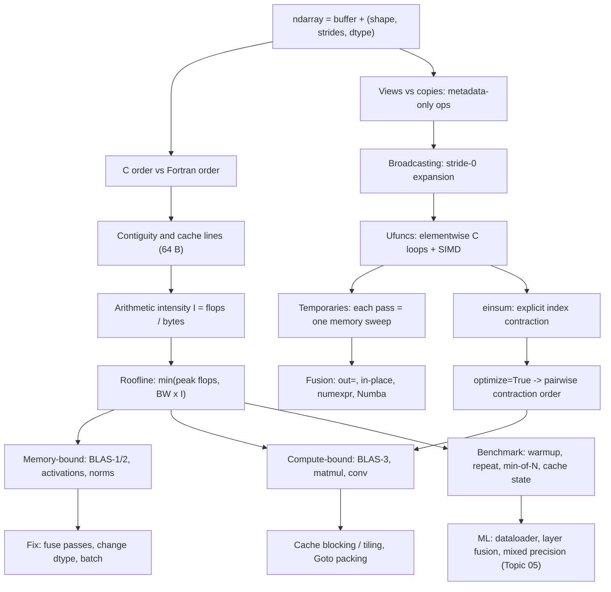

# Topic 04: Vectorization and NumPy Performance

## 1. Master Overview

Topics 01–03 asked how *accurate* a computation can be. This module asks how *fast* — and discovers that the answer is governed by the same hardware realities. A modern CPU core can issue on the order of $10^{11}$ floating-point operations per second but its main memory delivers only $\sim 10^{10}$ bytes per second, a gap of roughly $50\!:\!1$ in operations per byte. Every performance question therefore reduces to one quantity: the **arithmetic intensity** $I = \frac{\text{flops}}{\text{bytes moved}}$. Algorithms with low $I$ (vector adds, elementwise activations, normalization) are *memory-bound* and run at the speed of DRAM; algorithms with high $I$ (matrix–matrix products, convolutions) are *compute-bound* and can approach peak flops — but only if written to reuse data in cache.

NumPy is the concrete setting. An `ndarray` is a flat buffer plus a `(shape, strides, dtype)` descriptor; reshaping, transposing, and slicing are *metadata edits* costing nothing, while a Python-level loop over the same data costs $50$–$200$ ns per element in interpreter overhead alone. Vectorization is the discipline of pushing loops down into precompiled C/Fortran kernels — ufuncs for elementwise work, BLAS for linear algebra — so that the interpreter is entered once instead of $n$ times, SIMD registers stay full, and the memory system streams contiguously.

The module builds the mental model in three layers: the **layout layer** (C vs Fortran order, strides, views vs copies, contiguity), the **kernel layer** (ufuncs, broadcasting, `einsum`, BLAS levels 1/2/3 and their intensities), and the **hardware layer** (cache blocking, the roofline model, and honest benchmarking). The recurring lesson mirrors Topic 02's: *the formula is not the algorithm* — and here, the algorithm is not the implementation. Two mathematically identical expressions can differ by a factor of $10^{3}$ in wall-clock time purely through data movement.

> [!NOTE]
> The single most useful performance question is not "how many flops?" but "how many times does this array cross the memory bus?". Fusing three elementwise passes into one, or replacing $n$ rank-1 updates (BLAS-2, $I \approx \frac{1}{4}$) by one matrix–matrix product (BLAS-3, $I \approx \frac{n}{6}$), changes the *category* of the computation. Micro-optimizing inside a memory-bound loop changes nothing.

## 2. First-Principles Framework

- **Phenomenon**: identical mathematics runs $10$–$1000\times$ slower in a Python loop than in a vectorized call, and a cache-oblivious matrix multiply runs $10\times$ slower than a blocked one on the same silicon.
- **Goal**: predict runtime from data movement, not from operation counts; choose formulations whose arithmetic intensity places them on the compute-bound side of the roofline.
- **Governing model**: the roofline, $\text{attainable flop/s} = \min\left( P_{\text{peak}}, \; B_{\text{mem}} \times I \right)$, with $I$ the arithmetic intensity in flops per byte. The ridge point $I^{*} = P_{\text{peak}}/B_{\text{mem}}$ separates the two regimes.
- **Layout law**: an `ndarray` element at index $(i_1, \dots, i_d)$ lives at byte offset $\sum_k i_k s_k$ for strides $s_k$; C order has $s_d = \text{itemsize}$, Fortran order has $s_1 = \text{itemsize}$. Traversal order that matches the stride pattern streams cache lines; traversal against it wastes $\frac{64 - \text{itemsize}}{64}$ of every fetched line.
- **Broadcasting law**: shapes are right-aligned; each axis must match or be $1$; a length-$1$ axis is expanded by setting its stride to $0$ — no data is copied, which is why broadcasting is free in memory but *not* free in the output it materializes.
- **Reuse law**: a computation with $F$ flops on $D$ bytes of distinct data can reach intensity at most $F/D$; blocking for a fast memory of size $M$ realizes $I = \Theta(\sqrt{M})$ for matrix multiplication, which is the Hong–Kung communication lower bound $\Omega(n^{3}/\sqrt{M})$ in disguise.
- **Interpreter law**: a Python-level loop costs $50$–$200$ ns per iteration against $\sim 0.3$ ns for the underlying instruction, so any per-element Python is a $10^{2}$–$10^{3}$ slowdown before memory effects are even considered.
- **Design principle**: minimize passes over memory (fuse), maximize reuse per byte loaded (block), and never enter the Python interpreter per element.

## 3. Mermaid Concept Map

## 4. Common Misconceptions

| Misconception | Mathematical Reality | Correct Mental Model |
|---|---|---|
| *"Vectorized code is fast because it does fewer operations."* | It usually does the *same* or more flops; the win is amortizing interpreter dispatch over $n$ elements and enabling SIMD plus streaming loads. | Vectorization removes per-element *overhead*, not arithmetic. Speed comes from bytes moved and instructions issued per element. |
| *"`A.T` transposes the data, so it is expensive."* | Transposition only swaps entries of the strides tuple: $O(1)$ time, no copy. The cost appears later, when a kernel traverses the now-non-contiguous axis or is forced to `ascontiguousarray`. | Layout changes are lazy. Ask where the copy actually happens — usually at the first BLAS call or `reshape` that cannot be expressed with strides. |
| *"More flops always means more time."* | A memory-bound kernel at $I \approx \frac{1}{8}$ flop/byte runs at bandwidth speed; adding arithmetic that reuses already-loaded data is *free* until $I$ reaches the ridge point $I^{*} = P_{\text{peak}}/B_{\text{mem}}$. | Time $\approx \max\left( \frac{\text{flops}}{P_{\text{peak}}}, \frac{\text{bytes}}{B_{\text{mem}}} \right)$. Below the ridge, flops are free; above it, bytes are free. |
| *"Broadcasting is free, so `A[:, None] - B[None, :]` is cheap."* | The stride-$0$ expansion is free, but the *result* is a genuine $m \times n$ array that must be written to and read back: an $O(mn)$ memory cost hidden behind $O(m+n)$ inputs. | Broadcasting is free on the *inputs* and fully priced on the *output*. For pairwise distances, prefer the BLAS-3 identity built on `A @ B.T`. |
| *"`einsum` is always the fastest way to write a contraction."* | Without `optimize=True`, `einsum` may evaluate a multi-operand contraction in a naive order with cost $O(n^{4})$ where a pairwise order costs $O(n^{3})$, and its own kernel is not always BLAS-backed. | `einsum` is a *notation* for contraction; performance depends on the contraction order and whether the result can be dispatched to `gemm`. Always pass `optimize=True` for 3+ operands. |
| *"Timing one call with `time.time()` is good enough."* | A single call conflates JIT/first-touch page faults, cold caches, CPU frequency ramping, and allocator behaviour; variance across runs commonly exceeds $50\%$. | Warm up, repeat, report `min` (for throughput) or a robust quantile, control array size relative to L2/L3, and state whether data starts hot or cold. |
| *"float32 is twice as fast as float64 because the ALU is faster."* | For memory-bound kernels the $2\times$ comes purely from halving the bytes moved; for compute-bound kernels it comes from doubling SIMD lane count. Either way, the speedup is structural, not magical. | Pick dtype by the binding resource: bandwidth (bytes) or vector width (lanes). Then check the accuracy budget from Topic 03's digit rule. |

## 5. Directory Inventory

| File | Type | Description |
|---|---|---|
| [`README.md`](README.md) | Index | Master overview, concept map, misconceptions, references. |
| [`first_principles.ipynb`](first_principles.ipynb) | Theory | Strides and layout algebra, broadcasting rules, ufunc semantics, BLAS levels and arithmetic intensity, cache-blocking derivation, roofline model, `einsum` contraction ordering, benchmarking methodology. |
| [`exercises.ipynb`](exercises.ipynb) | Practice | 20 fully solved problems across 4 levels — from stride arithmetic and broadcast-shape derivations to blocked-matmul cache analysis and roofline placement of transformer layers. |
| [`../vectorization_numpy.ipynb`](../vectorization_numpy.ipynb) | Computation | Companion benchmark notebook with executed timing comparisons. |

## 6. References

- **Harris, C. R., et al.** (2020). *Array programming with NumPy*. Nature, 585, 357–362. — the canonical description of the strided-array model, ufuncs, and broadcasting.
- **van der Walt, S., Colbert, S. C., & Varoquaux, G.** (2011). *The NumPy array: a structure for efficient numerical computation*. Computing in Science & Engineering, 13(2), 22–30.
- **Williams, S., Waterman, A., & Patterson, D.** (2009). *Roofline: an insightful visual performance model for multicore architectures*. Communications of the ACM, 52(4), 65–76.
- **Goto, K., & van de Geijn, R. A.** (2008). *Anatomy of high-performance matrix multiplication*. ACM TOMS, 34(3). — packing, blocking, and the micro-kernel behind every modern BLAS.
- **Golub, G. H., & Van Loan, C. F.** (2013). *Matrix Computations* (4th ed.). Johns Hopkins. — Sections 1.1–1.5: BLAS levels, blocking, and data reuse.
- **Drepper, U.** (2007). *What Every Programmer Should Know About Memory*. — cache hierarchy, prefetching, TLB effects.
- **Hennessy, J. L., & Patterson, D. A.** (2019). *Computer Architecture: A Quantitative Approach* (6th ed.). Morgan Kaufmann. — Ch. 2 and Appendix B: memory hierarchy.
- **Frigo, M., Leiserson, C. E., Prokop, H., & Ramachandran, S.** (1999). *Cache-oblivious algorithms*. FOCS. — recursive blocking without tuned parameters.
- **Higham, N. J.** (2002). *Accuracy and Stability of Numerical Algorithms* (2nd ed.). SIAM. — Ch. 13: blocked algorithms keep the same error bounds as unblocked ones.
- **Lam, S. K., Pitrou, A., & Seibert, S.** (2015). *Numba: a LLVM-based Python JIT compiler*. LLVM-HPC. — escaping the interpreter when vectorization is not expressible.
- **Dao, T., et al.** (2022). *FlashAttention: Fast and Memory-Efficient Exact Attention with IO-Awareness*. NeurIPS. — cache blocking applied to the transformer's most bandwidth-bound layer.
- **Micikevicius, P., et al.** (2018). *Mixed Precision Training*. ICLR. — dtype choice as a bandwidth decision; analyzed for accuracy in [Topic 05](../05_numerical_stability_in_deep_learning/README.md).
- **Sibling module**: [`../03_conditioning_and_condition_numbers/`](../03_conditioning_and_condition_numbers/README.md) — the accuracy budget that constrains which dtype the performance analysis is allowed to choose.
