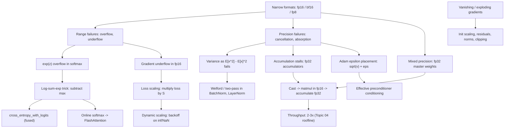

# Topic 05: Numerical Stability in Deep Learning

## 1. Master Overview

Deep learning is the largest numerical computation humanity routinely performs, and it is carried out in the *narrowest* arithmetic ever put into production. A binary64 float carries $\approx 16$ decimal digits and an exponent range of $10^{\pm 308}$; bf16 carries $\approx 2.4$ digits, and fp8 (E4M3) carries barely $1.5$ digits with a maximum representable value of $448$. Every technique in this module exists because the four earlier topics' machinery — the $(1+\delta)$ axiom, cancellation, conditioning, and data movement — meets arithmetic in which the unit roundoff is $2^{-8}$ rather than $2^{-53}$.

Two failure modes dominate, and they are the two ends of the floating-point format. **Range failures** (overflow to `inf`, underflow to zero) come from the exponent field: $e^{z}$ for $z = 100$, gradients below $6 \times 10^{-8}$ in fp16, activation blow-up in an unnormalized residual stream. **Precision failures** (cancellation, absorption, stalled accumulation) come from the significand: variance computed as $\overline{x^{2}} - \bar{x}^{2}$ in fp16, a loss accumulator that stops moving after $2048$ additions, an Adam update whose $\epsilon$ sits in the wrong place. The standard fixes — max-subtraction in softmax, fusing sigmoid/softmax into the loss, loss scaling, fp32 master weights and accumulators, careful $\epsilon$ placement — are each a direct application of Topics 01–03, not folklore.

The unifying discipline is **precision as a resource to be allocated**. Mixed-precision training does not use one arithmetic; it assigns narrow formats to the wide, well-conditioned, bandwidth-bound parts (matmul inputs, activations, communicated gradients) and wide formats to the narrow, ill-conditioned, accumulation-heavy parts (reductions, master weights, optimizer state, normalization statistics). Getting the assignment right is what makes a $3\times$ speedup free rather than a divergence.

> [!NOTE]
> The single most reusable identity in this module is the log-sum-exp trick: $\log\sum_j e^{z_j} = m + \log\sum_j e^{z_j - m}$ with $m = \max_j z_j$. It is exact in real arithmetic, guarantees every exponent is $\le 0$ (so nothing overflows), and guarantees at least one term equals $1$ (so nothing underflows to an all-zero sum). Softmax, cross-entropy from logits, `logsumexp`, mixture-model likelihoods, and FlashAttention's online normalizer are all this one line.

## 2. First-Principles Framework

- **Phenomenon**: training runs produce `NaN` losses, silently frozen metrics, dead gradients, or divergence — usually from arithmetic, not from the model or the data.
- **Goal**: keep every intermediate inside the representable range of its format, avoid subtracting nearly equal quantities, and place accumulations in a format wide enough for their length.
- **Governing constraint**: a format with $p$ significand bits and exponent range $[e_{\min}, e_{\max}]$ admits values in $[2^{e_{\min}}, 2^{e_{\max}+1})$ with unit roundoff $u = 2^{-p}$. Every stability rule is a statement about staying inside one of those two windows.
- **Range table** (approximate, normalized minimum to maximum, and $u$):

| Format | Sig. bits | Min normal | Max | $u$ | Decimal digits |
|---|---|---|---|---|---|
| fp64 | 53 | $2.2 \times 10^{-308}$ | $1.8 \times 10^{308}$ | $1.1 \times 10^{-16}$ | 15.9 |
| fp32 | 24 | $1.2 \times 10^{-38}$ | $3.4 \times 10^{38}$ | $6.0 \times 10^{-8}$ | 7.2 |
| tf32 | 11 | $1.2 \times 10^{-38}$ | $3.4 \times 10^{38}$ | $4.9 \times 10^{-4}$ | 3.3 |
| bf16 | 8 | $1.2 \times 10^{-38}$ | $3.4 \times 10^{38}$ | $3.9 \times 10^{-3}$ | 2.4 |
| fp16 | 11 | $6.1 \times 10^{-5}$ | $65504$ | $4.9 \times 10^{-4}$ | 3.3 |
| fp8 E4M3 | 4 | $2^{-9} \approx 2.0 \times 10^{-3}$ | $448$ | $6.3 \times 10^{-2}$ | 1.5 |
| fp8 E5M2 | 3 | $6.1 \times 10^{-5}$ | $57344$ | $1.3 \times 10^{-1}$ | 1.2 |

- **Design principle**: *narrow where bandwidth-bound and well-conditioned, wide where accumulating or cancelling.* bf16 trades precision for fp32's exponent range and therefore needs no loss scaling; fp16 keeps fp32-like precision in a $10^{\pm 5}$ window and therefore does.

## 3. Mermaid Concept Map

## 4. Common Misconceptions

| Misconception | Mathematical Reality | Correct Mental Model |
|---|---|---|
| *"Softmax is stable because its outputs are probabilities in $[0,1]$."* | The output range says nothing about the intermediates: $e^{z}$ overflows for $z \gt 88$ in fp32 and $z \gt 11.09$ in fp16, producing `inf/inf = NaN` before any normalization happens. | Stability is a property of the *computation path*, not the output range. Subtract $\max_j z_j$ first; every exponent is then in $(0, 1]$. |
| *"`log(softmax(z))` and `log_softmax(z)` differ only in speed."* | The composed form rounds $p_y$ to the grid near its own magnitude and then takes a log with condition number $1/\vert \log p_y \vert$; for confident-and-wrong predictions $p_y$ underflows to $0$ and the loss becomes `inf`. | Fuse analytically: $-\log p_y = -z_y + m + \log\sum_j e^{z_j - m}$, which never forms $p_y$ at all. |
| *"bf16 is just a faster fp16."* | They differ in *which* window they keep: bf16 has fp32's 8 exponent bits (range $10^{\pm 38}$) with only 8 significand bits; fp16 has 5 exponent bits (range $\approx 6\times10^{-5}$ to $65504$) with 11 significand bits. | fp16 needs loss scaling and overflow guards; bf16 needs neither but is $8\times$ coarser per step, so it needs wide accumulators even more. |
| *"Loss scaling changes the optimization problem."* | Multiplying the loss by $S$ scales every gradient by exactly $S$ (linearity of differentiation); dividing the gradients by $S$ before the optimizer step restores them bit-for-bit up to rounding. | Loss scaling is a *change of units* that relocates the gradient histogram into the representable window — mathematically a no-op, numerically decisive. |
| *"Adam's $\epsilon$ is a tiny constant that prevents division by zero, so its value hardly matters."* | $\epsilon$ caps the preconditioner: the effective step is $\hat{m}/(\sqrt{\hat{v}} + \epsilon)$, so it bounds the condition number of the diagonal preconditioner at $\approx \sqrt{v_{\max}}/\epsilon$ and sets the trust region for small-gradient coordinates. Placing it *inside* the square root, $\sqrt{\hat{v} + \epsilon}$, gives different dynamics and different fp16 behaviour. | $\epsilon$ is a conditioning cap (Topic 03's ridge parameter), not a guard. In fp16, $\epsilon = 10^{-8}$ is below the minimum subnormal and silently becomes zero. |
| *"Gradient clipping fixes exploding gradients, so the numerics are handled."* | Clipping bounds the *update*, but the forward pass may already have produced `inf` or `NaN` activations, and a `NaN` propagates through every subsequent operation and every optimizer state entry. | Guard the forward pass (normalization, careful initialization, stable kernels) and the reduction (fp32 accumulate); clip as a last line of defence, and check for non-finite values before the optimizer state is updated. |
| *"If the loss is decreasing, the numerics are fine."* | An fp16 loss accumulator stalls once $\mathrm{ulp}(\text{total}) \gt \text{batch loss}$, freezing the *reported* metric while training proceeds; conversely, a healthy metric can hide gradients that have underflowed to zero in half the layers. | Instrument the arithmetic: log gradient-norm histograms per layer, count non-finite values, and compare a periodic fp32 evaluation against the fp16 one. |

## 5. Directory Inventory

| File | Type | Description |
|---|---|---|
| [`README.md`](README.md) | Index | Master overview, concept map, misconceptions, references. |
| [`first_principles.ipynb`](first_principles.ipynb) | Theory | Format ranges from the IEEE model, log-sum-exp theorem and error bound, fused cross-entropy derivation, loss-scaling analysis, mixed-precision algorithm with master weights, normalization-layer numerics, Adam $\epsilon$ as a conditioning cap, gradient vanishing/exploding as a product-of-Jacobians condition number. |
| [`exercises.ipynb`](exercises.ipynb) | Practice | 20 fully solved problems across 4 levels — overflow thresholds and format ranges, fused-loss derivations, loss-scale selection, BatchNorm variance error analysis, and a full error budget for an fp8 training step. |

## 6. References

- **Micikevicius, P., et al.** (2018). *Mixed Precision Training*. ICLR. — fp32 master weights, loss scaling, fp32 accumulation; the founding paper of the practice.
- **Micikevicius, P., et al.** (2022). *FP8 Formats for Deep Learning*. arXiv:2209.05433. — E4M3/E5M2 definitions, per-tensor scaling.
- **Kalamkar, D., et al.** (2019). *A Study of BFLOAT16 for Deep Learning Training*. arXiv:1905.12322.
- **IEEE** (2019). *IEEE Standard for Floating-Point Arithmetic* (IEEE 754-2019). — the arithmetic model all of the above specialize.
- **Goldberg, D.** (1991). *What Every Computer Scientist Should Know About Floating-Point Arithmetic*. ACM Computing Surveys, 23(1). — cancellation and the guard-digit analysis behind the fused losses.
- **Higham, N. J.** (2002). *Accuracy and Stability of Numerical Algorithms* (2nd ed.). SIAM. — summation bounds used for accumulator sizing.
- **Higham, N. J., & Mary, T.** (2022). *Mixed precision algorithms in numerical linear algebra*. Acta Numerica, 31, 347–414. — the rigorous account of precision allocation.
- **Trefethen, L. N., & Bau, D.** (1997). *Numerical Linear Algebra*. SIAM. — conditioning and stability, applied here to Jacobian products.
- **Blanchard, P., Higham, N. J., & Mary, T.** (2020). *A class of fast and accurate summation algorithms*. SIAM J. Sci. Comput. — blocked/compensated reductions for low-precision data.
- **Ioffe, S., & Szegedy, C.** (2015). *Batch Normalization*. ICML; **Ba, J. L., Kiros, J. R., & Hinton, G. E.** (2016). *Layer Normalization*. arXiv:1607.06450.
- **Kingma, D. P., & Ba, J.** (2015). *Adam: A Method for Stochastic Optimization*. ICLR. — and Reddi et al. (2018) on the $\epsilon$/convergence interaction.
- **Pascanu, R., Mikolov, T., & Bengio, Y.** (2013). *On the difficulty of training recurrent neural networks*. ICML. — vanishing/exploding gradients as a spectral-radius statement; gradient clipping.
- **Glorot, X., & Bengio, Y.** (2010). *Understanding the difficulty of training deep feedforward neural networks*. AISTATS; **He, K., et al.** (2015). *Delving Deep into Rectifiers*. ICCV. — variance-preserving initialization.
- **Dao, T., et al.** (2022). *FlashAttention*. NeurIPS. — the online-softmax normalizer as a streaming log-sum-exp.
- **Harris, C. R., et al.** (2020). *Array programming with NumPy*. Nature, 585, 357–362. — the array semantics assumed throughout, with performance analyzed in [Topic 04](../04_vectorization_and_numpy_performance/README.md).
