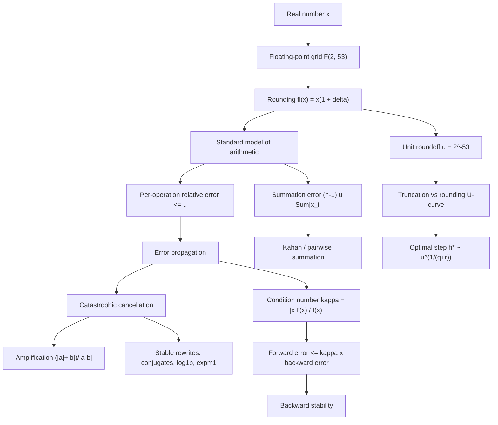

# Topic 01: Error Analysis and Floating Point

## 1. Master Overview

Numerical analysis begins with a confession: computers cannot represent the real numbers, evaluate limits, or carry out infinite processes. Every algorithm in this curriculum returns an approximation, and this module builds the vocabulary for saying *how good* that approximation is — absolute and relative error, significant digits, truncation versus rounding error, machine epsilon, and the standard model of floating-point arithmetic $\mathrm{fl}(a \circ b) = (a \circ b)(1+\delta)$ with $\lvert \delta \rvert \le u$.

The deeper theme is the separation of *problem* from *algorithm*. Conditioning measures how sensitively the exact answer depends on the data; stability measures how faithfully an algorithm tracks exact arithmetic. Forward error factors as roughly "condition number times backward error," which explains why a backward-stable method can still return a poor answer to an ill-conditioned problem — and why no algorithm can do better. Catastrophic cancellation, the amplification of pre-existing errors by subtraction of nearly equal quantities, is analyzed as an instance of ill-conditioning rather than a rounding mishap.

These ideas are load-bearing for every later topic: stopping criteria in root finding, the $u^{1/3}$ optimal step of central differences, ill-conditioned Vandermonde interpolation, and the squared condition number of least-squares normal equations all reduce to the theorems proved here.

> [!NOTE]
> The sibling module [`../../numerical_computing/`](../../numerical_computing/) covers hands-on IEEE-754 practice, conditioning experiments, and vectorization. This topic develops the *analytical theory* of error — the standard model, propagation theorems, and stability proofs that classical numerical analysis is built on.

## 2. First-Principles Framework

- **Phenomenon**: Finite machines replace $\mathbb{R}$ by a discrete grid $F$ and every exact operation by a rounded one, so computed results drift from mathematical truth.
- **Goal**: Predict and bound the drift *a priori* — decompose total error into truncation and rounding parts, and attribute each to the problem (conditioning) or the algorithm (stability).
- **Governing equation**: The standard model $\mathrm{fl}(a \circ b) = (a \circ b)(1 + \delta)$, $\lvert \delta \rvert \le u = 2^{-53}$, combined with first-order propagation $E_{\mathrm{rel}}(f(\hat{x})) \approx \kappa_f(x)\,E_{\mathrm{rel}}(\hat{x})$ where $\kappa_f(x) = \lvert x f'(x) / f(x) \rvert$.
- **Failure mode**: Cancellation, with amplification factor $(\lvert a \rvert + \lvert b \rvert)/\lvert a - b \rvert$, and unstable recurrences whose error-propagation factor exceeds 1.
- **Design principle**: Rewrite formulas to avoid subtracting near-equal quantities; prefer backward-stable algorithms; budget accuracy via digits $\approx 16 - \log_{10}\kappa$.

## 3. Mermaid Concept Map

## 4. Common Misconceptions

| Misconception | Mathematical Reality | Correct Mental Model |
|---|---|---|
| *"Floating-point arithmetic is randomly wrong."* | Each IEEE operation is exact-then-correctly-rounded: $\mathrm{fl}(a \circ b) = (a \circ b)(1+\delta)$, $\lvert \delta \rvert \le u$. | Errors are tiny, deterministic, and analyzable — danger comes only from amplification and accumulation. |
| *"Subtraction of close numbers introduces a large rounding error."* | By the Sterbenz lemma, if $b/2 \le a \le 2b$ the subtraction $a-b$ is *exact*. The damage is amplification of errors already present in $a$ and $b$. | Cancellation is an ill-conditioning of the data, not a flaw of the operation. |
| *"Machine epsilon is the smallest representable positive number."* | $\varepsilon_{\mathrm{mach}} = 2^{-52}$ is the *gap* between 1 and the next float; the smallest positive subnormal is $\approx 4.9 \times 10^{-324}$. | Epsilon measures relative resolution; the underflow threshold measures range. |
| *"A stable algorithm always gives an accurate answer."* | Forward error $\lesssim \kappa \times$ backward error. If $\kappa = 10^{12}$, even a backward-stable method loses about 12 digits. | Accuracy = stability (algorithm) combined with conditioning (problem); neither alone suffices. |
| *"Summing a million terms accumulates a million rounding errors, so results are useless."* | Recursive summation error is bounded by $(n-1)u\sum\lvert x_i \rvert$, and pairwise or Kahan summation reduces growth to $O(u\log n)$ or $O(u)$. | Error growth is linear at worst and can be engineered down to a few ulps. |
| *"Testing `x == y` is fine once values are computed."* | Two mathematically equal expressions generally round differently; exact equality of floats is a coincidence, not a criterion. | Compare with mixed tolerance $\lvert x - y \rvert \le \tau_{a} + \tau_{r}\max(\lvert x \rvert, \lvert y \rvert)$. |

## 5. Directory Inventory

| File | Contents |
|---|---|
| [`README.md`](README.md) | Master overview, first-principles framework, concept map, misconceptions, references. |
| [`first_principles.ipynb`](first_principles.ipynb) | Definitions (error, machine epsilon, standard model, conditioning, backward error), five complete proofs (propagation, cancellation conditioning, digit-loss bound, summation error, Sterbenz lemma), algorithmic insights, AI/ML and physics applications. |
| [`exercises.ipynb`](exercises.ipynb) | 20 fully solved problems: Level 0 concept checks (4), Level 1 foundations (6), Level 2 AI/ML & physics applications (6), Level 3 challenge proofs (4). |

## 6. References

1. **Burden, R. L., & Faires, J. D.** *Numerical Analysis* (9th ed.). — Ch. 1: Mathematical preliminaries and error analysis.
2. **Higham, N. J.** *Accuracy and Stability of Numerical Algorithms* (2nd ed.), SIAM. — Chs. 1–4: standard model, summation, the $\gamma_n$ calculus.
3. **Trefethen, L. N., & Bau, D.** *Numerical Linear Algebra*, SIAM. — Lectures 12–15: conditioning, floating point, stability.
4. **Heath, M. T.** *Scientific Computing: An Introductory Survey* (2nd ed.). — Ch. 1: approximations in scientific computing.
5. **Quarteroni, A., Sacco, R., & Saleri, F.** *Numerical Mathematics* (2nd ed.), Springer. — Ch. 2: principles of numerical mathematics.
6. **Golub, G. H., & Van Loan, C. F.** *Matrix Computations* (4th ed.). — Ch. 2.7: rounding-error analysis conventions.
7. **Goldberg, D.** (1991). *What Every Computer Scientist Should Know About Floating-Point Arithmetic*. ACM Computing Surveys 23(1).
8. **Muller, J.-M., et al.** *Handbook of Floating-Point Arithmetic* (2nd ed.), Birkhäuser. — Ch. 4: exact subtraction and error-free transformations.
