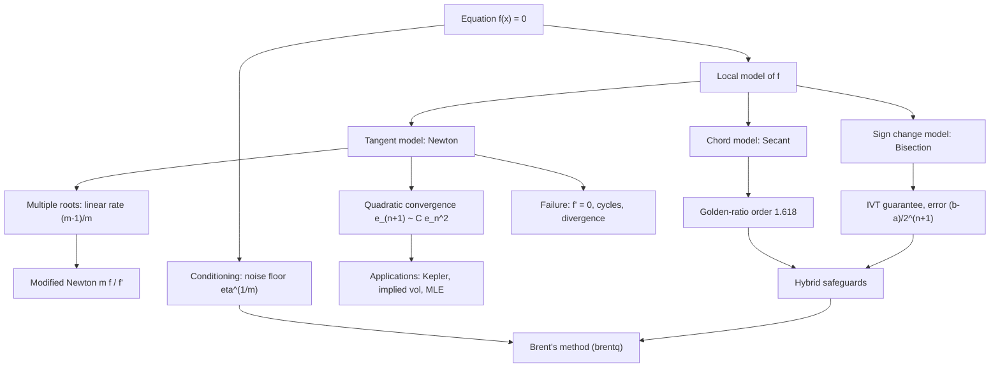

# Topic 02: Root-Finding Methods

## 1. Master Overview

Solving $f(x^{*}) = 0$ is the archetypal problem of computational mathematics. Equilibria of dynamical systems, implied volatilities, Kepler's orbital anomaly, maximum-likelihood score equations, and hardware division all reduce to locating a zero of a scalar function — and since Abel–Ruffini rules out closed forms beyond quartic polynomials, iteration is a mathematical necessity, not a convenience.

Every classical method follows the same design: replace $f$ locally by a solvable model, solve the model, repeat. Bisection models $f$ by a sign change and buys an unconditional guarantee at the price of one bit of accuracy per step. Newton models $f$ by its tangent line and converges quadratically — digits double per iteration — but only locally, and only with a derivative in hand. The secant method uses a chord instead, achieving the golden-ratio order $\varphi \approx 1.618$ with a single function evaluation per step, which makes it *faster than Newton per evaluation*.

The mature engineering answer is hybridization: Brent's method guards a bisection bracket while attempting fast interpolation steps, achieving both the guarantee and the speed. Understanding why each pure method fails — flat tangents, cycles, multiple roots, noise floors $\eta^{1/m}$ — is what makes the hybrid design comprehensible rather than folkloric.

> [!NOTE]
> Convergence *order* is not the whole story: measured per function evaluation, the secant method's efficiency index $\varphi^{1/1} \approx 1.618$ beats Newton's $2^{1/2} \approx 1.414$. This is why derivative-free hybrids dominate production 1-D solvers such as `scipy.optimize.brentq`.

## 2. First-Principles Framework

- **Phenomenon**: Equations $f(x) = 0$ arising from physics, finance, and statistics almost never admit closed-form solutions.
- **Goal**: Construct iterations $x_{n+1} = \Phi(x_n)$ whose fixed point is the root, with provable convergence order and explicit error bounds.
- **Governing equation**: The local-model principle — bisection: $\lvert c_n - x^{*} \rvert \le (b_0 - a_0)/2^{n+1}$; Newton: $x_{n+1} = x_n - f(x_n)/f'(x_n)$ with $e_{n+1} \approx \bigl\lvert \tfrac{f''(x^{*})}{2f'(x^{*})} \bigr\rvert e_n^2$; secant: $e_{n+1} \approx C\,e_n e_{n-1}$, order $p^2 = p + 1$.
- **Failure modes**: $f'(x_n) = 0$, cycling, overshoot divergence, multiplicity $m \ge 2$ degrading Newton to linear rate $\tfrac{m-1}{m}$, and the noise floor $\lvert x - x^{*} \rvert \lesssim \eta / \lvert f'(x^{*}) \rvert$.
- **Design principle**: Combine a guaranteed bracket with opportunistic fast steps; measure cost per function evaluation.

## 3. Mermaid Concept Map

## 4. Common Misconceptions

| Misconception | Mathematical Reality | Correct Mental Model |
|---|---|---|
| *"Newton's method always converges if a root exists."* | Newton is only locally convergent: $f(x) = \arctan x$ diverges for $\lvert x_0 \rvert \gt 1.3917$, and $x^3 - 2x + 2$ cycles from $x_0 = 0$. | Quadratic convergence is a *local* theorem; global reliability needs a bracket or damping. |
| *"A small residual $\lvert f(x_n) \rvert$ means $x_n$ is close to the root."* | Near a flat root, $\lvert f \rvert \le \eta$ over an interval of width $\eta^{1/m}$; the residual can be tiny while the error is large. | Residual and error are related by $\lvert x - x^{*} \rvert \approx \lvert f(x) \rvert / \lvert f'(x^{*}) \rvert$ — divide by the slope. |
| *"Newton's quadratic order makes it the fastest method."* | Per function evaluation, secant's efficiency index $1.618$ exceeds Newton's $\sqrt{2} \approx 1.414$ because Newton also pays for $f'$. | Count convergence per *evaluation*, not per iteration. |
| *"Bisection's slowness makes it useless."* | Bisection gains exactly one bit per step regardless of $f$ — an unconditional guarantee no fast method offers. | Bisection is the safety net inside every robust hybrid (Brent). |
| *"Convergence problems are the algorithm's fault; more iterations will fix them."* | At a multiplicity-$m$ root, *no* method can locate the root better than $\eta^{1/m}$ in the presence of evaluation noise $\eta$. | Root conditioning caps achievable accuracy; detect multiplicity via the error ratio $\tfrac{m-1}{m}$. |
| *"The secant method is just a cheap approximation of Newton with the same behavior."* | Its error recursion $e_{n+1} \approx C e_n e_{n-1}$ is two-term, giving order $\varphi$ from $p^2 = p + 1$ — genuinely different dynamics (and it needs two starting points). | Secant is interpolation-based, with its own theory via divided differences. |

## 5. Directory Inventory

| File | Contents |
|---|---|
| [`README.md`](README.md) | Master overview, first-principles framework, concept map, misconceptions, references. |
| [`first_principles.ipynb`](first_principles.ipynb) | Definitions (multiplicity, convergence order), six theorems, five complete proofs (bisection bound, Newton quadratic convergence, secant golden-ratio order, multiple-root slowdown, global convex Newton), stopping criteria, efficiency indices, Kepler/finance/ML applications. |
| [`exercises.ipynb`](exercises.ipynb) | 20 fully solved problems: Level 0 concept checks (4), Level 1 foundations (6), Level 2 AI/ML & physics applications (6), Level 3 challenge proofs (4). |

## 6. References

1. **Burden, R. L., & Faires, J. D.** *Numerical Analysis* (9th ed.). — Ch. 2: Solutions of equations in one variable.
2. **Heath, M. T.** *Scientific Computing: An Introductory Survey* (2nd ed.). — Ch. 5: Nonlinear equations.
3. **Quarteroni, A., Sacco, R., & Saleri, F.** *Numerical Mathematics* (2nd ed.), Springer. — Chs. 6–7: Root finding for equations and systems.
4. **Brent, R. P.** *Algorithms for Minimization without Derivatives*, Prentice-Hall (1973). — Ch. 4: The guaranteed hybrid method.
5. **Ortega, J. M., & Rheinboldt, W. C.** *Iterative Solution of Nonlinear Equations in Several Variables*, Academic Press (1970). — Global Newton theory.
6. **Trefethen, L. N., & Bau, D.** *Numerical Linear Algebra*, SIAM. — Lecture 25: Polynomial roots as companion-matrix eigenvalues.
7. **Sauer, T.** *Numerical Analysis* (2nd ed.), Pearson. — Ch. 1: Fixed points, Newton fractals, sensitivity.
8. **Moré, J. J.** (1978). *The Levenberg–Marquardt Algorithm: Implementation and Theory*. Springer Lecture Notes in Mathematics 630 — the trust-region secular equation.
