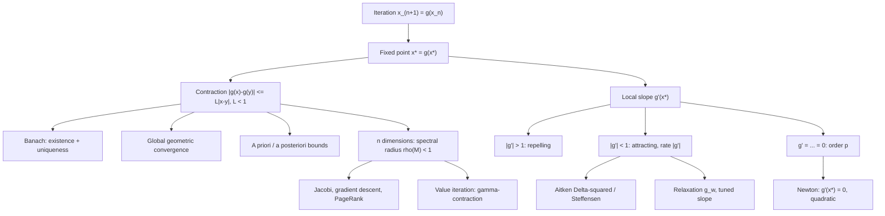

# Topic 03: Fixed-Point Iteration and Convergence Theory

## 1. Master Overview

Nearly every iterative algorithm in computational mathematics — Newton's method, gradient descent, Jacobi and Gauss–Seidel sweeps, power iteration, PageRank, value iteration in reinforcement learning, deep equilibrium layers — is an instance of one scheme: $x_{n+1} = g(x_n)$, whose limits are the fixed points $x^{*} = g(x^{*})$. This module develops the unified convergence theory of such iterations, so that each specific algorithm's behavior becomes a corollary rather than a separate analysis.

The centerpiece is the Banach fixed-point theorem: a contraction ($\lvert g(x) - g(y) \rvert \le L\lvert x - y \rvert$, $L \lt 1$) on a closed invariant set has exactly one fixed point, attracts every starting point at a geometric rate, and comes with computable a priori and a posteriori error bounds. Locally, the derivative tells the whole story: $\lvert g'(x^{*}) \rvert \lt 1$ attracts with linear rate $\lvert g'(x^{*}) \rvert$, $\lvert g'(x^{*}) \rvert \gt 1$ repels, and vanishing derivatives $g' = \cdots = g^{(p-1)} = 0$ raise the order to exactly $p$ — from which Newton's quadratic convergence drops out as the special case $g = \mathrm{id} - f/f'$.

The theory is also constructive: relaxation $g_\omega = (1-\omega)\,\mathrm{id} + \omega g$ tunes the slope at the fixed point, Aitken's $\Delta^2$ extrapolates geometric error patterns to their limit, and Steffensen's method converts acceleration into a derivative-free second-order solver. In $n$ dimensions the same questions reduce to the spectral radius: an affine iteration $x \mapsto Mx + c$ converges from every start if and only if $\rho(M) \lt 1$.

> [!NOTE]
> The discount factor $\gamma$ of reinforcement learning, the step-size rule $\alpha \lt 2/L$ of gradient descent, and the damping factor $d = 0.85$ of PageRank are all the *same* mathematical object: a contraction constant certifying Banach-type convergence.

## 2. First-Principles Framework

- **Phenomenon**: Repeatedly applying a map $g$ either settles to a fixed point, cycles, or escapes — and tiny changes in $g$ (or in how an equation is rearranged into $x = g(x)$) flip the outcome.
- **Goal**: Determine existence, uniqueness, basin, and rate of convergence of $x_{n+1} = g(x_n)$ from analytic properties of $g$ alone.
- **Governing equation**: The contraction estimate $\lvert g(x) - g(y) \rvert \le L \lvert x - y \rvert$ with $L \lt 1$, whose local form is $\lvert g'(x^{*}) \rvert \lt 1$ and whose error consequence is $e_{n+1} \approx g'(x^{*})\,e_n$ (order $p$ when the first $p-1$ derivatives vanish).
- **Error certificates**: a priori $\lvert x_n - x^{*} \rvert \le \frac{L^{n}}{1-L}\lvert x_1 - x_0 \rvert$; a posteriori $\lvert x_n - x^{*} \rvert \le \frac{L}{1-L}\lvert x_n - x_{n-1} \rvert$.
- **Design principle**: Engineer the map — rearrangement, relaxation $\omega$, extrapolation — to shrink $\lvert g'(x^{*}) \rvert$, ideally to zero.

## 3. Mermaid Concept Map

## 4. Common Misconceptions

| Misconception | Mathematical Reality | Correct Mental Model |
|---|---|---|
| *"If the equation $x = g(x)$ is algebraically correct, the iteration will find the solution."* | For $x^2 - x - 1 = 0$, the form $x = x^2 - 1$ has $\lvert g'(\varphi) \rvert \approx 3.24$ and diverges; $x = \sqrt{x+1}$ has $\lvert g' \rvert \approx 0.31$ and converges. | The rearrangement chooses the slope at the solution; the slope chooses the fate. |
| *"The iterates stopped changing, so we have converged."* | The true error satisfies $\lvert x_n - x^{*} \rvert \le \frac{L}{1-L}\lvert x_n - x_{n-1} \rvert$; with $L = 0.99$ the step understates the error by a factor of 99. | Multiply the last step by $\frac{L}{1-L}$ before declaring victory. |
| *"$\lvert g'(x^{*}) \rvert \lt 1$ gives the same guarantees as a contraction."* | The local condition assumes a fixed point exists and controls only an unspecified neighborhood; Banach's uniform $L \lt 1$ on an invariant set gives existence, uniqueness, global convergence, and finite-$n$ bounds. | Local slope = asymptotic rate; uniform contraction = full certificate. |
| *"$\lvert g'(x^{*}) \rvert = 1$ means divergence."* | $g(x) = x + e^{-x} - 1$ has $g'(0) = 1$ yet converges from every $x_0 \gt 0$ — sublinearly, $x_n \sim 2/n$. | The boundary case can converge, but geometric speed is lost; strict inequality is what buys rates. |
| *"Convergence of a linear iteration depends on the norm of $M$."* | $\lVert M \rVert$ can exceed 1 in one norm and be below 1 in another; convergence from every start is equivalent to $\rho(M) \lt 1$ (Gelfand). | Norms bound transient behavior; the spectral radius is the exact asymptotic rate. |
| *"Acceleration tricks like Aitken need new information about $f$."* | Aitken's $\hat{x}_n = x_n - \frac{(\Delta x_n)^2}{\Delta^2 x_n}$ reuses three existing iterates and provably converges faster than $x_n$; Steffensen's feedback version is quadratic, derivative-free. | Extrapolate the geometric error pattern you already observe — the data was free. |

## 5. Directory Inventory

| File | Contents |
|---|---|
| [`README.md`](README.md) | Master overview, first-principles framework, concept map, misconceptions, references. |
| [`first_principles.ipynb`](first_principles.ipynb) | Definitions (fixed point, contraction, attracting/repelling), Banach theorem with full proof, local rate theorem, order-$p$ theorem, Aitken derivation and proof, repelling-point divergence proof, relaxation, spectral radius theory, RL/GD/DEQ/physics applications. |
| [`exercises.ipynb`](exercises.ipynb) | 20 fully solved problems: Level 0 concept checks (4), Level 1 foundations (6), Level 2 AI/ML & physics applications (6), Level 3 challenge proofs (4). |

## 6. References

1. **Burden, R. L., & Faires, J. D.** *Numerical Analysis* (9th ed.). — Ch. 2.2, 2.5: fixed-point iteration, Aitken/Steffensen acceleration.
2. **Quarteroni, A., Sacco, R., & Saleri, F.** *Numerical Mathematics* (2nd ed.), Springer. — Chs. 4, 6: iterative methods and contraction analysis.
3. **Kreyszig, E.** *Introductory Functional Analysis with Applications*, Wiley. — Ch. 5: the Banach fixed-point theorem in metric spaces.
4. **Golub, G. H., & Van Loan, C. F.** *Matrix Computations* (4th ed.). — Ch. 11: classical iterations and spectral radius theory.
5. **Heath, M. T.** *Scientific Computing: An Introductory Survey* (2nd ed.). — Ch. 5: nonlinear equations and fixed points.
6. **Ortega, J. M., & Rheinboldt, W. C.** *Iterative Solution of Nonlinear Equations in Several Variables*, Academic Press. — General fixed-point convergence theory.
7. **Nocedal, J., & Wright, S. J.** *Numerical Optimization* (2nd ed.), Springer. — Ch. 3: gradient-method rates as contraction factors.
8. **Puterman, M. L.** *Markov Decision Processes*, Wiley. — Ch. 6: the Bellman operator as a $\gamma$-contraction.
9. **Bai, S., Kolter, J. Z., & Koltun, V.** (2019). *Deep Equilibrium Models*. NeurIPS — fixed-point layers and implicit differentiation.
