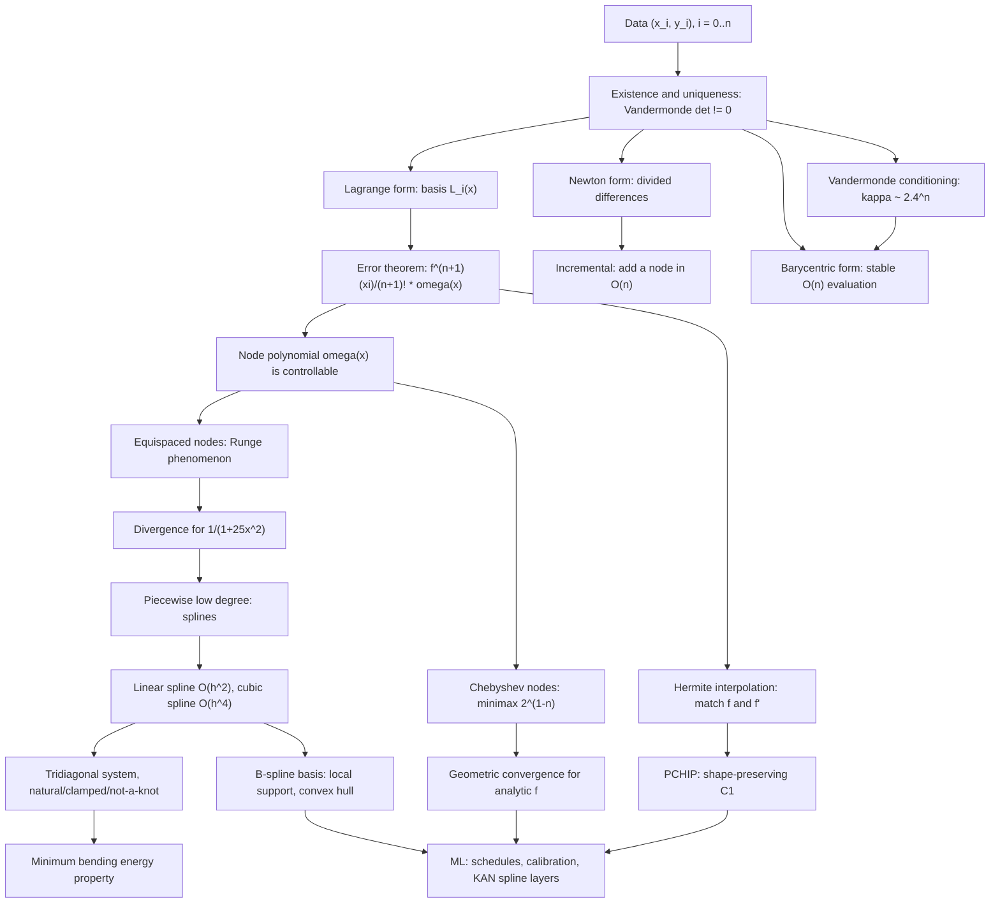

# Topic 04: Polynomial and Spline Interpolation

## 1. Master Overview

Interpolation answers the oldest question in numerical analysis: given $n+1$ samples $(x_i, y_i)$ of an unknown function, what is the function *between* the samples? The classical answer is a polynomial, and the classical theorem is beautifully clean — through any $n+1$ distinct nodes there passes exactly one polynomial of degree $\le n$. Uniqueness makes every representation of that polynomial (Lagrange, Newton divided differences, monomial, barycentric) a different *algorithm* for the same mathematical object, differing only in cost and numerical stability.

The error theorem is the heart of the subject: $f(x) - p_n(x) = \frac{f^{(n+1)}(\xi)}{(n+1)!}\prod_{i}(x - x_i)$. It splits the error into a factor you cannot control (the derivative of $f$) and a factor you *can* (the node polynomial). Equispaced nodes make the node polynomial explode near the interval ends — the Runge phenomenon — so adding more equispaced points can make the interpolant *worse*, diverging exponentially for perfectly smooth functions like $1/(1+25x^2)$. Chebyshev nodes, clustered as $\cos(\pi k/n)$, minimize the node polynomial in the max norm and turn divergence into geometric convergence.

The engineering answer to Runge is to abandon high degree entirely: use low-degree polynomials on small pieces and glue them with smoothness constraints. Cubic splines are the canonical choice — $C^2$ continuous, $O(h^4)$ accurate, computed by solving a symmetric tridiagonal system in $O(n)$ time, and (in the natural case) the minimizer of the bending energy $\int (s'')^2$. This combination of accuracy, stability, locality, and a variational characterization is why splines dominate graphics, CAD, statistics (smoothing splines, GAMs), and increasingly deep learning (spline-parameterized activations in KAN layers).

> [!NOTE]
> Interpolation and *approximation* are different problems. A degree-$n$ interpolant is uniquely determined by data; the best degree-$n$ approximant minimizes error over all polynomials. Chebyshev-node interpolation is within a factor of $O(\log n)$ (the Lebesgue constant) of best approximation — which is why it is used in practice instead of the harder minimax problem.

## 2. First-Principles Framework

- **Phenomenon**: Functions are known only at finitely many points — sampled sensors, tabulated physical constants, evaluated-but-expensive simulations, discrete learning-rate schedules.
- **Goal**: Build a cheap, smooth surrogate $p$ with $p(x_i) = y_i$, and bound $\vert f(x) - p(x) \vert$ everywhere in between.
- **Governing equation**: Existence/uniqueness via the Vandermonde system $V a = y$, $\det V = \prod_{i \lt j}(x_j - x_i) \neq 0$; error $f(x) - p_n(x) = \frac{f^{(n+1)}(\xi_x)}{(n+1)!}\,\omega_{n+1}(x)$ with $\omega_{n+1}(x) = \prod_{i=0}^{n}(x - x_i)$.
- **Control variable**: The node distribution. Equispaced nodes give $\Vert \omega_{n+1} \Vert_\infty \sim n!\,h^{n+1}$ with catastrophic end behavior; Chebyshev nodes give the minimax value $2^{1-n}$ on $[-1,1]$.
- **Two error regimes**: Global polynomial interpolation converges *geometrically* for functions analytic in a Bernstein ellipse and *diverges* for equispaced nodes near a complex singularity; piecewise methods converge *algebraically* but unconditionally.
- **Stability layer**: The mathematical object (the interpolant) is well conditioned at good nodes; the *coordinates* (monomial coefficients from a Vandermonde solve) are not — always separate the two.
- **Design principle**: When degree hurts, lower it and increase the piece count — piecewise cubics with $C^2$ matching give $O(h^4)$ convergence with no Runge blow-up and a banded linear system.

## 3. Mermaid Concept Map

## 4. Common Misconceptions

| Misconception | Mathematical Reality | Correct Mental Model |
|---|---|---|
| *"More interpolation points always mean a better fit."* | For equispaced nodes and $f(x) = 1/(1+25x^2)$, $\Vert f - p_n \Vert_\infty \to \infty$ geometrically as $n \to \infty$. | Convergence depends on nodes and analyticity, not on point count alone; cluster nodes at the ends or lower the degree. |
| *"Lagrange and Newton forms give different polynomials."* | Uniqueness makes them algebraically identical; they differ only in cost ($O(n^2)$ setup, incremental updates) and rounding behavior. | One polynomial, many bases — choose the basis for the algorithmic property you need. |
| *"The Lagrange form is numerically bad, so avoid it."* | The *classical* evaluation is $O(n^2)$ per point, but the **barycentric** rewrite is $O(n)$ per point and provably backward stable. | Barycentric Lagrange is the modern recommended method, not a historical curiosity. |
| *"Runge's phenomenon is caused by rounding error."* | It is exact-arithmetic divergence: $\omega_{n+1}$ grows like $2^{n}$ near the endpoints relative to its center value. | It is an approximation-theory failure of equispaced nodes, present in infinite precision. |
| *"A natural cubic spline is the most accurate boundary choice."* | Natural end conditions force $s'' = 0$ at the ends, degrading accuracy there to $O(h^2)$; clamped and not-a-knot retain $O(h^4)$. | Use not-a-knot (SciPy's default) unless the true second derivative really vanishes at the ends. |
| *"Splines are just smooth-looking curve fitting with no theory."* | The natural cubic spline uniquely minimizes $\int_a^b \vert s''(x) \vert^2 dx$ over all $C^2$ interpolants — a genuine variational theorem. | Splines are the discrete solution of a minimum-curvature energy problem. |
| *"Differentiating an interpolant is as accurate as the interpolant."* | Each derivative loses one order: a cubic spline is $O(h^4)$ in value, $O(h^3)$ in slope, $O(h^2)$ in curvature. | Size the mesh for the highest derivative your code consumes, not for the values. |
| *"Interpolation and regression are the same thing."* | Interpolation forces $p(x_i) = y_i$ exactly; with noisy data this reproduces the noise. Smoothing splines trade fit against $\lambda \int (s'')^2$. | Interpolate exact data, regularize noisy data. |

## 5. Directory Inventory

| File | Contents |
|---|---|
| [`README.md`](README.md) | Master overview, first-principles framework, concept map, misconceptions, references. |
| [`first_principles.ipynb`](first_principles.ipynb) | Definitions (interpolant, divided differences, spline, B-spline), theorems (uniqueness, error formula, Chebyshev minimax, spline accuracy, minimum-energy), six complete proofs, Vandermonde conditioning, tridiagonal spline assembly, ML applications. |
| [`exercises.ipynb`](exercises.ipynb) | 20 fully solved problems: Level 0 concept checks (4), Level 1 foundations (6), Level 2 AI/ML & physics applications (6), Level 3 challenge proofs (4). |

## 6. References

1. **Burden, R. L., & Faires, J. D.** *Numerical Analysis* (9th ed.). — Ch. 3: Interpolation and polynomial approximation, divided differences, Hermite, cubic splines.
2. **Trefethen, L. N.** *Approximation Theory and Approximation Practice*, SIAM (2013). — Chs. 5, 11–15: barycentric formula, Lebesgue constants, Chebyshev interpolation, convergence rates.
3. **Trefethen, L. N., & Bau, D.** *Numerical Linear Algebra*, SIAM. — Lectures 12–13: conditioning of the Vandermonde system.
4. **Quarteroni, A., Sacco, R., & Saleri, F.** *Numerical Mathematics* (2nd ed.), Springer. — Ch. 8: polynomial interpolation, splines, least squares.
5. **de Boor, C.** *A Practical Guide to Splines* (rev. ed.), Springer (2001). — B-splines, knot insertion, not-a-knot end conditions.
6. **Heath, M. T.** *Scientific Computing: An Introductory Survey* (2nd ed.). — Ch. 7: Interpolation.
7. **Press, W. H., et al.** *Numerical Recipes* (3rd ed.), Cambridge. — Ch. 3: Interpolation and extrapolation, practical caveats.
8. **Berrut, J.-P., & Trefethen, L. N.** (2004). *Barycentric Lagrange Interpolation*. SIAM Review 46(3), 501–517.
9. **Fritsch, F. N., & Carlson, R. E.** (1980). *Monotone Piecewise Cubic Interpolation*. SIAM J. Numer. Anal. 17(2), 238–246. — The PCHIP slope limiter.
10. **Liu, Z., et al.** (2024). *KAN: Kolmogorov–Arnold Networks*. arXiv:2404.19756. — Learnable B-spline edge functions and grid refinement.
11. **Green, P. J., & Silverman, B. W.** *Nonparametric Regression and Generalized Linear Models*, Chapman & Hall (1994). — Smoothing splines and the roughness penalty.
