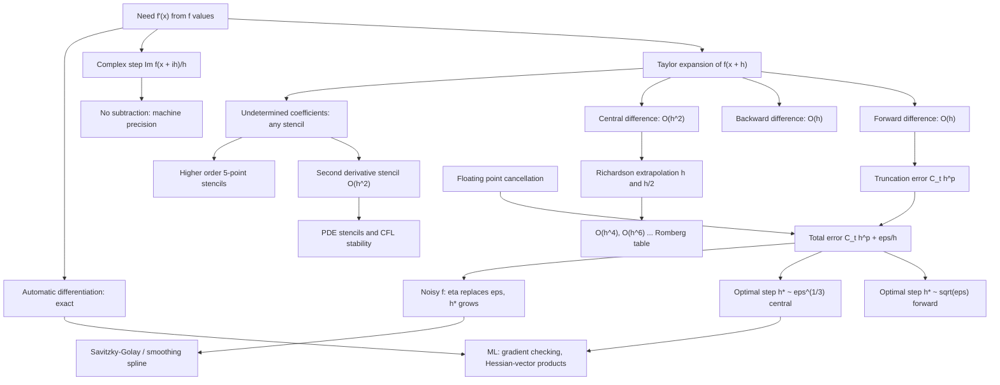

# Topic 05: Numerical Differentiation

## 1. Master Overview

Differentiation is trivial in calculus and treacherous in floating point. The definition $f'(x) = \lim_{h \to 0}\frac{f(x+h) - f(x)}{h}$ suggests an obvious algorithm — take $h$ small — but the algorithm contains its own destruction: as $h$ shrinks, $f(x+h)$ and $f(x)$ agree in more and more leading digits, and their difference loses exactly those digits to cancellation before being amplified by division by a tiny $h$. Numerical differentiation is therefore the canonical **ill-conditioned** problem of scientific computing, the mirror image of integration, which is smoothing and stable.

The quantitative statement is a two-term error model. Taylor expansion gives truncation error $O(h^p)$ for a $p$-th order stencil, while floating-point evaluation with relative accuracy $\varepsilon_M$ contributes roundoff error $O(\varepsilon_M / h)$. Their sum is minimized at a finite, non-zero step: $h^{\ast} \sim \sqrt{\varepsilon_M} \approx 1.5 \times 10^{-8}$ for the first-order forward difference, giving only about 8 correct digits, and $h^{\ast} \sim \varepsilon_M^{1/3} \approx 6 \times 10^{-6}$ for the second-order central difference, giving about 11. No choice of $h$ recovers full precision — the accuracy ceiling is structural, not a coding defect.

Three escape routes exist. **Richardson extrapolation** cancels leading error terms by combining evaluations at $h$ and $h/2$, converting $O(h^2)$ into $O(h^4)$ and beyond, at the price of more evaluations and a worse roundoff floor. **Complex-step differentiation** — $f'(x) \approx \operatorname{Im} f(x + ih)/h$ for real-analytic $f$ — eliminates subtraction entirely and is accurate to machine precision with $h = 10^{-20}$. **Automatic differentiation** abandons approximation altogether, propagating derivative values exactly through the computational graph; it is what PyTorch and JAX do, and it is why finite differences survive in modern ML only as a *verification* tool (gradient checking) and where the function is a black box.

> [!NOTE]
> Finite differences are still indispensable in ML for two reasons: gradient checking (`torch.autograd.gradcheck` compares analytic gradients to central differences) and matrix-free Hessian-vector products $Hv \approx \frac{\nabla f(x + hv) - \nabla f(x - hv)}{2h}$, used in Newton-CG, Hessian spectrum analysis, and influence functions.

## 2. First-Principles Framework

- **Phenomenon**: Derivatives are needed for optimization, sensitivity analysis, and PDE discretization, but the function may be a black box, a legacy simulator, or an experimental data table.
- **Goal**: Approximate $f'(x)$, $f''(x)$, or a directional derivative from function values alone, with a quantified error and a defensible choice of step size.
- **Governing equation**: Taylor's theorem with remainder — $f(x \pm h) = f(x) \pm h f'(x) + \frac{h^2}{2}f''(x) \pm \frac{h^3}{6}f'''(x) + \cdots$ — from which every stencil and every error term is derived by linear combination.
- **Error decomposition**: $E(h) = \underbrace{C_t h^{p}}_{\text{truncation}} + \underbrace{C_r \varepsilon_M / h}_{\text{roundoff}}$, minimized at $h^{\ast} = \bigl(\frac{C_r \varepsilon_M}{p\,C_t}\bigr)^{1/(p+1)}$.
- **Accuracy ceiling**: For a $p$-th order formula for the $k$-th derivative with evaluation noise $\eta$, the best attainable error is $\Theta(\eta^{\,p/(p+k)})$ — a structural bound no arrangement of real function values can beat.
- **The asymmetry with integration**: Differentiation amplifies perturbations by $1/h$; integration averages them away. Noisy data may be integrated freely and must never be differenced naively.
- **Design principle**: Never chase $h \to 0$. Either use a higher-order stencil, extrapolate, switch to complex-step, or use automatic differentiation.

## 3. Mermaid Concept Map

## 4. Common Misconceptions

| Misconception | Mathematical Reality | Correct Mental Model |
|---|---|---|
| *"Choose $h$ as small as possible for accuracy."* | Total error $C_t h + C_r \varepsilon_M / h$ has a minimum at $h^{\ast} \approx \sqrt{\varepsilon_M}$; below that the roundoff term dominates and error grows like $1/h$. | There is an optimal finite step; the error-vs-$h$ curve is V-shaped on a log-log plot. |
| *"The central difference is twice as accurate as the forward difference."* | It is a different *order*: error $O(h^2)$ versus $O(h)$. At $h = 10^{-4}$ that is a factor of $10^4$, not 2. | Order of accuracy, not a constant factor, is what distinguishes stencils. |
| *"Cancellation error is a bug in the subtraction."* | Both $f(x+h)$ and $f(x)$ are correctly rounded; catastrophic cancellation destroys *relative* accuracy of the difference because the leading digits are identical and their error is inherited. | The inputs are inexact; subtraction merely reveals the pre-existing error. |
| *"Richardson extrapolation can be iterated indefinitely."* | Each level cancels one Taylor term but amplifies roundoff; beyond 3–5 levels the extrapolated value degrades. It also requires $f$ to have the assumed smooth error expansion. | Extrapolation buys orders of accuracy until the roundoff floor is met — then it stops helping. |
| *"Complex-step differentiation is just a complex-valued finite difference."* | Because $\operatorname{Im}[f(x+ih)] = h f'(x) - \frac{h^3}{6}f'''(x) + \cdots$ has **no subtraction of nearly equal numbers**, there is no cancellation and $h = 10^{-20}$ is safe. | It is second-order accurate *and* roundoff-free — but requires analytic $f$ and complex-capable code. |
| *"Autodiff is just a fast finite-difference scheme."* | Autodiff applies the chain rule symbolically at the elementary-operation level; the result is exact to machine precision with no step size and reverse mode costs $O(1)$ gradients per function evaluation. | Autodiff is exact differentiation of the program; finite differences approximate the function. |
| *"Second derivatives are just differentiation done twice, so the accuracy is similar."* | The $f''$ stencil divides by $h^{2}$, so roundoff enters as $\varepsilon_M/h^{2}$: the ceiling drops from $\varepsilon_M^{2/3}$ to $\sqrt{\varepsilon_M}$, i.e. from 11 digits to 8. | Each extra derivative order costs roughly half the remaining precision. |
| *"If gradient checking fails, the finite difference is the truth."* | With $h$ badly chosen or a non-smooth function (ReLU, `max`, clipping), the *finite difference* is wrong at the kink while the analytic gradient (a subgradient) is fine. | Check at smooth points, use central differences with $h \approx 10^{-5}$ in float64, and compare relative error. |

## 5. Directory Inventory

| File | Contents |
|---|---|
| [`README.md`](README.md) | Master overview, first-principles framework, concept map, misconceptions, references. |
| [`first_principles.ipynb`](first_principles.ipynb) | Definitions (order of accuracy, stencil, condition of differentiation), theorems (forward/central error, optimal step, Richardson, complex step), five complete proofs with full error analysis, undetermined coefficients, autodiff comparison, ML applications. |
| [`exercises.ipynb`](exercises.ipynb) | 20 fully solved problems: Level 0 concept checks (4), Level 1 foundations (6), Level 2 AI/ML & physics applications (6), Level 3 challenge proofs (4). |

## 6. References

1. **Burden, R. L., & Faires, J. D.** *Numerical Analysis* (9th ed.). — Ch. 4.1–4.2: Numerical differentiation, Richardson extrapolation.
2. **Heath, M. T.** *Scientific Computing: An Introductory Survey* (2nd ed.). — Ch. 8.6: Numerical differentiation and its conditioning.
3. **Quarteroni, A., Sacco, R., & Saleri, F.** *Numerical Mathematics* (2nd ed.), Springer. — Ch. 10: Numerical differentiation and finite differences.
4. **Press, W. H., et al.** *Numerical Recipes* (3rd ed.), Cambridge. — Ch. 5.7: "Numerical derivatives" — practical step-size selection.
5. **Fornberg, B.** (1988). *Generation of Finite Difference Formulas on Arbitrarily Spaced Grids*. Mathematics of Computation 51(184), 699–706.
6. **Squire, W., & Trapp, G.** (1998). *Using Complex Variables to Estimate Derivatives of Real Functions*. SIAM Review 40(1), 110–112.
7. **Martins, J. R. R. A., Sturdza, P., & Alonso, J. J.** (2003). *The Complex-Step Derivative Approximation*. ACM TOMS 29(3), 245–262.
8. **Griewank, A., & Walther, A.** *Evaluating Derivatives: Principles and Techniques of Algorithmic Differentiation* (2nd ed.), SIAM (2008).
9. **Spall, J. C.** (1992). *Multivariate Stochastic Approximation Using a Simultaneous Perturbation Gradient Approximation*. IEEE Trans. Autom. Control 37(3), 332–341. — SPSA.
10. **Baydin, A. G., Pearlmutter, B. A., Radul, A. A., & Siskind, J. M.** (2018). *Automatic Differentiation in Machine Learning: a Survey*. JMLR 18(153). — The modern ML-facing account.
11. **Trefethen, L. N., & Bau, D.** *Numerical Linear Algebra*, SIAM. — Lectures 12–15: conditioning, stability, and backward error.
