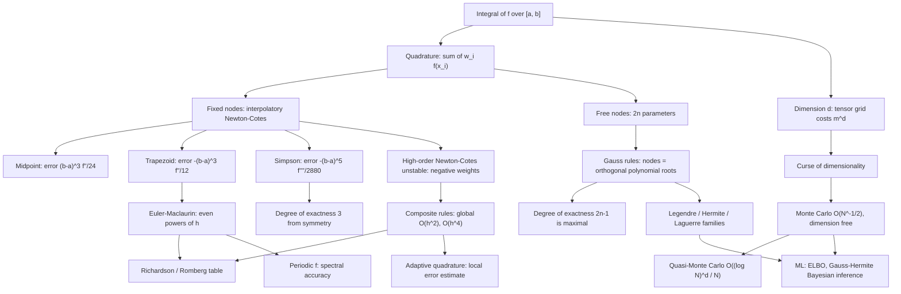

# Topic 06: Numerical Integration (Quadrature)

## 1. Master Overview

Most integrals that matter have no closed form. The Gaussian CDF, the period of a pendulum, the partition function of a statistical model, the evidence lower bound of a variational autoencoder — all must be computed as weighted sums of function values, $\int_a^b f(x)\,dx \approx \sum_{i} w_i f(x_i)$. Every quadrature rule is exactly this: a choice of **nodes** $x_i$ and **weights** $w_i$. The entire theory concerns how to choose them and what error results.

The classical route fixes the nodes (usually equispaced), interpolates $f$ by a polynomial through them, and integrates the interpolant exactly — this yields the Newton–Cotes family: midpoint, trapezoid, Simpson. Their error terms follow directly from the interpolation error theorem, and their **degree of exactness** (the largest polynomial degree integrated exactly) is the standard quality measure: 1 for trapezoid, 3 for Simpson (a free extra degree, gained from symmetry). High-order Newton–Cotes rules inherit Runge's disease — negative weights, exploding constants — so practice uses **composite** rules instead, subdividing $[a,b]$ and summing local rules, which converts local error $O(h^{k+1})$ into global error $O(h^{k})$.

Freeing the nodes changes everything. With $2n$ free parameters ($n$ nodes plus $n$ weights) one can hope for degree of exactness $2n-1$, and Gauss's theorem shows this optimum is achieved precisely when the nodes are the roots of the degree-$n$ orthogonal polynomial for the weight function. Gauss–Legendre, Gauss–Hermite, and Gauss–Laguerre handle $[-1,1]$, Gaussian-weighted, and exponentially-weighted integrals respectively; the last two are exactly the shapes that appear in Bayesian inference. In high dimension the entire deterministic edifice collapses — a tensor grid costs $m^d$ points — and Monte Carlo takes over with its dimension-independent but slow $O(N^{-1/2})$ rate, improved to nearly $O(N^{-1})$ by quasi-Monte Carlo low-discrepancy sequences.

> [!NOTE]
> Integration is *smoothing*: errors in $f$ are averaged, so quadrature is well-conditioned — the opposite of differentiation, where errors are amplified by $1/h$. This is why one can integrate noisy data safely but must never differentiate it naively.

## 2. First-Principles Framework

- **Phenomenon**: Definite integrals — expectations, areas, energies, normalizing constants, evidence terms — rarely admit antiderivatives in elementary functions.
- **Goal**: Choose nodes $x_i$ and weights $w_i$ so that $\sum_i w_i f(x_i)$ approximates $\int_a^b f(x)\,dx$ with a provable, computable error bound.
- **Governing equation**: Interpolatory quadrature — integrate the interpolant, $w_i = \int_a^b L_i(x)\,dx$; the error inherits the interpolation error $\int_a^b \frac{f^{(n+1)}(\xi_x)}{(n+1)!}\omega_{n+1}(x)\,dx$.
- **Quality measure**: Degree of exactness $m$ — the rule is exact for all polynomials of degree $\le m$. Newton–Cotes with $n+1$ nodes gives $m = n$ (or $n+1$ if $n$ is even); Gauss with $n$ nodes gives $m = 2n-1$, which is provably maximal.
- **Stability certificate**: Positive weights give $\sum_i \lvert w_i \rvert = \int \rho$, hence bounded noise amplification at every order and convergence for all continuous integrands; negative weights forfeit both.
- **Conditioning**: Integration is a smoothing operator — a perturbation $\delta$ of $f$ moves $\int f$ by at most $(b-a)\delta$ — so quadrature is perfectly conditioned, the mirror image of differentiation.
- **Design principle**: Match the rule to the integrand's structure — smooth on a finite interval (Gauss–Legendre or Clenshaw–Curtis), Gaussian-weighted (Gauss–Hermite), singular/peaked (adaptive subdivision), high-dimensional (Monte Carlo / QMC).

## 3. Mermaid Concept Map

## 4. Common Misconceptions

| Misconception | Mathematical Reality | Correct Mental Model |
|---|---|---|
| *"Simpson's rule is exact only for quadratics, since it fits a parabola."* | It has degree of exactness **3**: the cubic error term integrates to zero by symmetry about the midpoint, so cubics are integrated exactly for free. | Symmetric rules with an odd node count gain one extra degree of exactness. |
| *"Higher-order Newton–Cotes rules are always more accurate."* | For $n \ge 8$ the weights change sign and grow without bound; the rules amplify data noise and diverge for functions like $1/(1+25x^2)$. | Raise accuracy by subdividing (composite) or by moving the nodes (Gauss), never by raising Newton–Cotes order. |
| *"Local error $O(h^4)$ means global error $O(h^4)$."* | Composite rules sum $\sim (b-a)/h$ subintervals, so a local $O(h^{k+1})$ error yields a global $O(h^{k})$ error — one power is always lost. | Multiply local error by the number of panels to get the global rate. |
| *"Gaussian quadrature is exact because the nodes are special magic points."* | The nodes are the roots of the orthogonal polynomial $p_n$; the proof divides any degree-$2n-1$ polynomial as $f = q p_n + r$ and kills the $q p_n$ term by orthogonality. | Exactness $2n-1$ is a corollary of orthogonality plus polynomial division. |
| *"Monte Carlo is worse than a grid, since $N^{-1/2}$ is a terrible rate."* | The MC rate is *independent of dimension*, while a tensor grid of order $k$ gives $O(N^{-k/d})$ — worse than $N^{-1/2}$ as soon as $d \gt 2k$. | In high dimension a slow dimension-free rate beats a fast dimension-cursed one. |
| *"Doubling MC samples halves the error."* | Error scales as $\sigma/\sqrt{N}$: quadrupling $N$ halves the error, and one extra digit costs $100\times$ the work. | Variance reduction (control variates, importance sampling, antithetics) beats brute-force sampling. |
| *"The trapezoid rule is the crudest method available."* | On a smooth **periodic** integrand every Euler–Maclaurin term vanishes and the trapezoid rule converges *geometrically* — machine precision from about 32 samples. | The DFT/FFT is the periodic trapezoid rule; its exponential accuracy is a quadrature theorem. |
| *"Adaptive quadrature always beats a fixed rule."* | Adaptivity pays a bookkeeping overhead and can be fooled by narrow spikes it never samples; for smooth integrands a fixed Gauss rule of modest order is far cheaper. | Adaptivity buys robustness against localized structure, not accuracy on smooth functions. |

## 5. Directory Inventory

| File | Contents |
|---|---|
| [`README.md`](README.md) | Master overview, first-principles framework, concept map, misconceptions, references. |
| [`first_principles.ipynb`](first_principles.ipynb) | Definitions (quadrature rule, degree of exactness, orthogonal polynomials), theorems (Newton–Cotes errors, composite convergence, Gauss $2n-1$ exactness, positivity of Gauss weights, Monte Carlo rate), six complete proofs with derived error constants, Romberg and adaptive algorithms, ELBO and Gauss–Hermite applications. |
| [`exercises.ipynb`](exercises.ipynb) | 20 fully solved problems: Level 0 concept checks (4), Level 1 foundations (6), Level 2 AI/ML & physics applications (6), Level 3 challenge proofs (4). |

## 6. References

1. **Burden, R. L., & Faires, J. D.** *Numerical Analysis* (9th ed.). — Ch. 4.3–4.8: Newton–Cotes, composite rules, Romberg, adaptive, Gaussian quadrature.
2. **Davis, P. J., & Rabinowitz, P.** *Methods of Numerical Integration* (2nd ed.), Academic Press (1984). — The definitive treatise on quadrature.
3. **Trefethen, L. N.** *Approximation Theory and Approximation Practice*, SIAM (2013). — Chs. 19: Clenshaw–Curtis versus Gauss quadrature.
4. **Quarteroni, A., Sacco, R., & Saleri, F.** *Numerical Mathematics* (2nd ed.), Springer. — Chs. 9–10: Numerical integration, orthogonal polynomials.
5. **Heath, M. T.** *Scientific Computing: An Introductory Survey* (2nd ed.). — Ch. 8: Numerical integration and differentiation.
6. **Press, W. H., et al.** *Numerical Recipes* (3rd ed.), Cambridge. — Ch. 4: Integration of functions; Ch. 7.8–7.9: quasi-random sequences.
7. **Trefethen, L. N., & Bau, D.** *Numerical Linear Algebra*, SIAM. — Lecture 37: Golub–Welsch, Gauss nodes as eigenvalues of the Jacobi matrix.
8. **Caflisch, R. E.** (1998). *Monte Carlo and quasi-Monte Carlo methods*. Acta Numerica 7, 1–49.
9. **Trefethen, L. N., & Weideman, J. A. C.** (2014). *The Exponentially Convergent Trapezoidal Rule*. SIAM Review 56(3), 385–458.
10. **Rasmussen, C. E., & Williams, C. K. I.** *Gaussian Processes for Machine Learning*, MIT Press (2006). — Ch. 3: Gauss–Hermite quadrature for non-Gaussian likelihoods.
11. **Blei, D. M., Kucukelbir, A., & McAuliffe, J. D.** (2017). *Variational Inference: A Review for Statisticians*. JASA 112(518), 859–877. — ELBO integrals and reparameterized Monte Carlo estimates.
