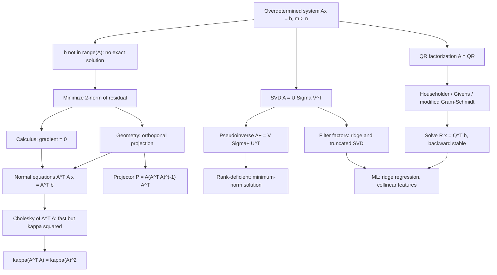

# Topic 07: Linear Least Squares

## 1. Master Overview

Measurement produces more equations than unknowns. A GPS receiver sees eight satellites but needs four coordinates; a physicist records two hundred data points to fit a three-parameter model; a regression problem stacks a million rows against a hundred features. The resulting system $A\mathbf{x} = \mathbf{b}$ with $A \in \mathbb{R}^{m \times n}$, $m \gt n$, is **overdetermined**: $\mathbf{b}$ almost never lies in the $n$-dimensional column space $\mathcal{R}(A)$ sitting inside $\mathbb{R}^{m}$, so no exact solution exists. Least squares replaces the impossible demand $A\mathbf{x} = \mathbf{b}$ with the achievable one: minimize $\Vert A\mathbf{x} - \mathbf{b} \Vert_2$.

That choice of the Euclidean norm is what makes the problem *linear*. Minimizing a quadratic gives a linear gradient condition, and the solution is characterized geometrically: $A\hat{\mathbf{x}}$ is the **orthogonal projection** of $\mathbf{b}$ onto $\mathcal{R}(A)$, and the residual $\mathbf{r} = \mathbf{b} - A\hat{\mathbf{x}}$ is orthogonal to every column of $A$. Writing that orthogonality out gives the **normal equations** $A^{\top}A\hat{\mathbf{x}} = A^{\top}\mathbf{b}$ — the same equations calculus produces by setting $\nabla_{\mathbf{x}} \Vert A\mathbf{x} - \mathbf{b} \Vert_2^2 = 2A^{\top}(A\mathbf{x} - \mathbf{b}) = \mathbf{0}$.

Mathematically the normal equations end the story; numerically they begin a new one. Forming $A^{\top}A$ *squares the condition number*, $\kappa_2(A^{\top}A) = \kappa_2(A)^2$, so a matrix with $\kappa_2(A) = 10^{8}$ — routine for polynomial fits or collinear features — becomes numerically singular in double precision. The professional answer is to never form $A^{\top}A$: factor $A = QR$ by Householder reflections and solve the triangular system $R\hat{\mathbf{x}} = Q^{\top}\mathbf{b}$, or, when the rank itself is in doubt, use the SVD $A = U\Sigma V^{\top}$, the pseudoinverse $A^{+} = V\Sigma^{+}U^{\top}$, and its minimum-norm solution. Regularization (Tikhonov/ridge, truncated SVD) then trades a little bias for a large reduction in variance — which is exactly what ridge regression does in machine learning.

> [!NOTE]
> The single most consequential fact in this topic: solving via the normal equations costs you *half your significant digits*. QR with Householder reflections is backward stable and delivers an error proportional to $\kappa_2(A)$, not $\kappa_2(A)^2$, for only about twice the flops. `numpy.linalg.lstsq` and `scipy.linalg.lstsq` use SVD/QR for precisely this reason — never `inv(A.T @ A) @ A.T @ b`.

## 2. First-Principles Framework

- **Phenomenon**: Data is redundant and noisy, so $\mathbf{b} \notin \mathcal{R}(A)$ and $A\mathbf{x} = \mathbf{b}$ has no solution.
- **Goal**: Find $\hat{\mathbf{x}}$ minimizing $\Vert A\mathbf{x} - \mathbf{b} \Vert_2^2$; when the minimizer is not unique, select the one of smallest norm.
- **Governing equations**: Orthogonality $A^{\top}(\mathbf{b} - A\hat{\mathbf{x}}) = \mathbf{0}$, equivalently the normal equations $A^{\top}A\hat{\mathbf{x}} = A^{\top}\mathbf{b}$; the projector is $P = A(A^{\top}A)^{-1}A^{\top} = QQ^{\top}$.
- **Failure modes**: Rank deficiency ($A^{\top}A$ singular), near-collinearity ($\kappa_2(A)$ huge), catastrophic information loss in forming $A^{\top}A$, and the classical Läuchli example where $A^{\top}A$ rounds to a singular matrix while $A$ has full rank.
- **Design principle**: Work with $A$ itself, never with $A^{\top}A$. Orthogonal transformations preserve the 2-norm, so $Q^{\top}$ can be applied freely; the SVD reveals rank and supplies the filter factors that make regularization transparent.
- **Statistical reading**: Under $\mathbf{b} = A\mathbf{x}_{\text{true}} + \boldsymbol{\varepsilon}$ with $\boldsymbol{\varepsilon} \sim \mathcal{N}(\mathbf{0}, \sigma^2 I)$, least squares is the maximum-likelihood estimator and, by Gauss–Markov, the minimum-variance unbiased linear estimator; ridge is the MAP estimate under a Gaussian prior with $\lambda = \sigma^2/\tau^2$.
- **Cost ledger**: Normal equations plus Cholesky $mn^2 + \tfrac13 n^3$; Householder QR $2mn^2 - \tfrac23 n^3$; SVD $\approx 2mn^2 + 11n^3$. QR costs about twice the normal equations and returns roughly twice the digits — the single best trade in the topic.

**Reading order.** Start with the geometry (residual orthogonality), derive the normal equations twice, then treat every algorithm as a way to *avoid computing them*. The SVD arrives last because it is the most expensive and the most informative: it turns the whole problem into $n$ decoupled scalar equations, and every regularization scheme becomes a choice of what to do with each of them.

## 3. Mermaid Concept Map

## 4. Common Misconceptions

| Misconception | Mathematical Reality | Correct Mental Model |
|---|---|---|
| *"The normal equations are the way to solve least squares."* | They are the right *characterization* but the wrong *algorithm*: $\kappa_2(A^{\top}A) = \kappa_2(A)^2$, so Cholesky on $A^{\top}A$ loses roughly twice as many digits as QR on $A$. | Derive with the normal equations, compute with QR or SVD. |
| *"Least squares needs $A$ to have full column rank."* | Full rank guarantees *uniqueness*. A minimizer always exists (the projection of $\mathbf{b}$ is always defined); rank deficiency simply makes the solution set an affine subspace. | The pseudoinverse picks the unique minimizer of smallest $\Vert \mathbf{x} \Vert_2$ out of that subspace. |
| *"A small residual means a good, well-determined fit."* | Residual size measures *misfit*, not *sensitivity*. With near-collinear columns the residual can be tiny while $\hat{\mathbf{x}}$ swings wildly under $10^{-10}$ perturbations of $\mathbf{b}$. | Report $\kappa_2(A)$ alongside the residual; sensitivity of $\hat{\mathbf{x}}$ scales like $\kappa_2(A) + \kappa_2(A)^2 \tan\theta$. |
| *"Gram–Schmidt is Gram–Schmidt."* | Classical Gram–Schmidt loses orthogonality at a rate proportional to $\kappa_2(A)^2$; the modified version loses it at a rate proportional to $\kappa_2(A)$; Householder is backward stable outright. | Use Householder for dense QR, MGS only when the $Q$ columns must be produced incrementally (e.g. GMRES/Arnoldi). |
| *"Ridge regression is a statistical hack with no numerical meaning."* | Tikhonov regularization is exactly the least-squares problem for the stacked matrix formed from $A$ and $\sqrt{\lambda}\,I$, and in the SVD basis it multiplies each coefficient by the filter factor $\sigma_i^2/(\sigma_i^2 + \lambda)$. | Ridge damps the directions with small $\sigma_i$ — the ones that amplify noise — and its condition number is bounded by $\sqrt{(\sigma_1^2 + \lambda)/(\sigma_n^2 + \lambda)}$. |
| *"Fitting a high-degree polynomial just needs more data points."* | The monomial Vandermonde matrix has condition number growing exponentially in the degree ($\kappa_2 \approx 10^{10}$ by degree 14 on $[0,1]$), so the coefficients become meaningless long before the fit does. | Change the basis: orthogonal polynomials (Chebyshev, Legendre) or splines keep $\kappa_2$ modest. |
| *"Least squares means minimizing vertical distances, so it treats $x$ and $y$ symmetrically."* | Ordinary least squares minimizes residuals in $\mathbf{b}$ only, assuming $A$ is known exactly; errors in the predictors bias the fit toward zero (attenuation). Total least squares minimizes perpendicular distance instead, and is solved by the smallest singular triple of the augmented matrix. | Ask where the noise lives: in $\mathbf{b}$ alone (OLS), in both (TLS / errors-in-variables), or with known covariance (GLS). |
| *"The closed form is always better than gradient descent."* | The normal equations cost $O(mn^2)$; for $n$ in the millions (deep-learning-scale features) that is impossible, and iterative methods converge at a rate governed by $\kappa_2(A)^2$ or, with conjugate gradients on $A$, by $\kappa_2(A)$. | Closed form for small-to-medium $n$; LSQR/CG or SGD when $n$ is large or $A$ is only available as a matrix-vector product. |

## 5. Directory Inventory

| File | Contents |
|---|---|
| [`README.md`](README.md) | Master overview, first-principles framework, concept map, misconceptions, references. |
| [`first_principles.ipynb`](first_principles.ipynb) | Definitions (projection, pseudoinverse, condition number), theorem statements, six complete proofs (normal equations from projection and from calculus, uniqueness under full rank, $\kappa_2(A^{\top}A) = \kappa_2(A)^2$, QR solution equivalence, minimum-norm property of $A^{+}$, ridge filter factors), Householder/Givens/Gram–Schmidt algorithmics, and ML applications. |
| [`exercises.ipynb`](exercises.ipynb) | 20 fully solved problems: Level 0 concept checks (4), Level 1 foundations (6), Level 2 AI/ML and physics applications (6), Level 3 challenge proofs (4). |

**Related modules**: [`../03_fixed_point_iteration_and_convergence/`](../03_fixed_point_iteration_and_convergence/) for iterative solvers, [`../../linear_algebra/`](../../linear_algebra/) for the SVD and orthogonality theory, [`../../optimization/`](../../optimization/) for the gradient-descent alternative, and [`../../numerical_computing/`](../../numerical_computing/) for conditioning and floating-point background.

## 6. References

1. **Björck, Å.** *Numerical Methods for Least Squares Problems*, SIAM (1996). — The definitive monograph: normal equations, QR, rank-deficient problems, regularization.
2. **Golub, G. H., & Van Loan, C. F.** *Matrix Computations* (4th ed.), Johns Hopkins. — Ch. 5: Orthogonalization and least squares; Ch. 6: Modified and rank-deficient problems.
3. **Trefethen, L. N., & Bau, D.** *Numerical Linear Algebra*, SIAM. — Lectures 6–11 (projectors, QR, Gram–Schmidt, Householder, least squares), Lecture 18 (conditioning of least squares).
4. **Burden, R. L., & Faires, J. D.** *Numerical Analysis* (9th ed.). — Ch. 8.1–8.2: Discrete least-squares approximation and orthogonal polynomials.
5. **Heath, M. T.** *Scientific Computing: An Introductory Survey* (2nd ed.). — Ch. 3: Linear least squares, including the Läuchli example and sensitivity analysis.
6. **Higham, N. J.** *Accuracy and Stability of Numerical Algorithms* (2nd ed.), SIAM. — Chs. 19–20: Backward-error analysis of QR and least squares.
7. **Hansen, P. C.** *Rank-Deficient and Discrete Ill-Posed Problems*, SIAM (1998). — Filter factors, the L-curve, truncated SVD, Tikhonov regularization.
8. **Hastie, T., Tibshirani, R., & Friedman, J.** *The Elements of Statistical Learning* (2nd ed.), Springer. — Ch. 3: Linear regression, ridge, lasso, and the bias–variance trade-off.
9. **Boyd, S., & Vandenberghe, L.** *Introduction to Applied Linear Algebra*, Cambridge (2018). — Chs. 12–15: Least squares, data fitting, and least-squares classification.
10. **Paige, C. C., & Saunders, M. A.** (1982). *LSQR: An algorithm for sparse linear equations and sparse least squares*, ACM TOMS 8(1). — The iterative method of choice when $A$ is large, sparse, or available only as a matrix-vector product.
11. **Lawson, C. L., & Hanson, R. J.** *Solving Least Squares Problems*, SIAM Classics (1995). — The original systematic treatment, including nonnegative least squares (NNLS).
